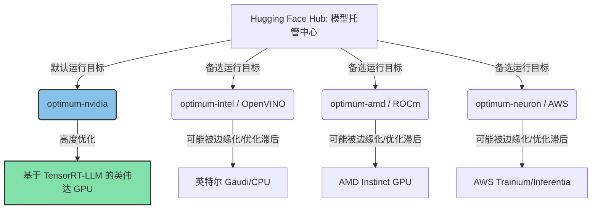

# **129亿美元的终极防线：英伟达强娶Hugging Face，开源AI生态的“制空权”之争**

2026年8月26日深夜，科技媒体《The Information》披露的一则重磅消息引爆了整个科技界：英伟达（NVIDIA）已同意以129亿美元的巨资，收购被誉为“AI界GitHub”的开源模型社区与核心托管平台——Hugging Face。

这笔交易的估值对应Hugging Face约1.5亿美元的年化经常性收入（ARR），溢价倍数达到了令人咋舌的86倍。这堪称现代科技史上最激进的战略并购之一。就在2025年底，Hugging Face还曾高调拒绝了英伟达一笔5亿美元、估值达70亿美元的投资意向。彼时，Hugging Face联合创始人兼CEO Clément Delangue曾极力捍卫公司的中立地位，并留下了那句名言：“权力过度集中是AI面临的最大风险。”

如今，随着这家硬件垄断巨头即将吞下开源权重的大本营，AI开发者社区正迎来一场生存危机。这究竟意味着硬件中立的开源AI时代宣告终结，还是英伟达面对自研芯片浪潮筑起的终极防御壁垒？

---

### 战略逻辑：垂直卡脖子与自研芯片的逆袭

要理解为什么英伟达愿意为一个营收规模极小的初创公司支付近130亿美元，就必须审视当前AI硬件市场正在发生微妙裂变的权力格局。

长期以来，英伟达的霸主地位依赖于两道宽阔的护城河：行业标配的GPU硬件（如H100、B200以及Rubin架构）以及无可替代的CUDA软件生态。然而，这两道护城河正面临来自两大维度的剧烈冲击：

1. **云巨头与竞争对手自研芯片的崛起**：几乎所有的云巨头都在积极构建自研ASIC芯片，以期摆脱高昂的“英伟达税”：谷歌有TPU v5p/v6，亚马逊有Trainium 2/Inferentia 2，微软推出了Maia 100，Meta则在大力迭代其MTIA。与此同时，硬件竞争对手如AMD（Instinct MI325X）和英特尔（Gaudi 3）也在激进出货，在算力和显存带宽等核心指标上展现出了极强的竞争力。
2. **闭源垄断与开源权重的博弈**：以OpenAI和Anthropic为代表的闭源巨头越来越倾向于垂直整合。OpenAI甚至已被曝出与台积电、博通深度谈判，计划打造专属于自己的AI芯片。

在此背景下，收购Hugging Face是英伟达防止硬件生态碎片化的一手关键防御性战略棋子。正如硅谷风投巨头a16z合伙人Martin Casado所指出的，我们已经进入了一个物理基础设施（芯片、电力、数据中心）成为核心瓶颈的“机器时代”（Machine Age）。为了绕过闭源API高昂的代币（Token）成本，绝大多数AI初创公司正在压倒性地倒向Llama 3、Mistral和Qwen等开源权重模型。

通过将Hugging Face收入囊中，英伟达成功掌控了这些开源权重最核心的分发管道。如果所有开发者下载模型、分词器（Tokenizers）和数据集的第一站都是英伟达旗下的平台，那么英伟达就能以极低的阻力，确保这些模型的默认运行路径直指CUDA。



---

### 软件栈深剖：CUDA、TensorRT-LLM与Optimum悖论

Hugging Face对开发者的核心价值在于其“硬件无关”（hardware-agnostic）的设计。通过其核心的`optimum`库，Hugging Face长期保持中立立场，与所有主流芯片厂商深度合作，以确保Transformer架构能在不同的硬件后端上高效运行。

这种中立性主要通过以下专用子库实现：
* **`optimum-nvidia`**：深度对接英伟达的**TensorRT-LLM**和CUDA软件栈。它能将模型编译为优化后的引擎，充分释放Hopper和Ada Lovelace架构上的FP8精度潜力，带来高达28倍的吞吐量提升。
* **`optimum-intel`**：面向英特尔架构，将模型编译为**OpenVINO**中间表示（IR），并配合神经网络压缩框架（NNCF）进行加速。
* **`optimum-amd`**：集成AMD用于Instinct GPU的**ROCm**软件栈，以及针对客户端NPU（XDNA架构）的**Ryzen AI**。
* **`optimum-neuron`**：集成亚马逊AWS的Neuron SDK，为Trainium和Inferentia加速器提供原生支持。

然而，一旦英伟达控制了Hugging Face，这种微妙的中立天平将被彻底打破。技术界最大的担忧在于**“优化漂移”（Optimization Drift）**。虽然英伟达为了规避反垄断诉讼，不太可能直接砍掉`optimum-intel`或`optimum-amd`等竞争对手的子库，但他们完全可以在核心库`transformers`发布重大更新时，采取消极手段——对非英伟达平台的技术栈缩减资金支持、降低开发优先级，甚至默许兼容性报错的发生。

例如，当未来的Llama 4发布时，完美适配TensorRT-LLM和FP8量化的`optimum-nvidia`版本在发布首日即可丝滑上线。与此同时，ROCm或OpenVINO的适配版本则可能因为各种依赖库报错，在GitHub上被搁置数周无人问津。Hugging Face Spaces上的默认运行配置也会经过精心调整，以实现在英伟达GPU上的无缝体验，而在其他硬件上则仅以未优化的降级模式勉强运行。

此外，这次收购还让开源许可协议的前景蒙上阴影。此前，Hugging Face开发了用于生产级推理的高性能容器**TGI (Text Generation Inference)**。但为了防止竞争对手直接将其包装为云托管服务变现，Hugging Face后来将TGI的许可协议变更为“Hugging Face社区许可证”（Community License）。这一限制导致诸如**vLLM**（采用更宽松的Apache 2.0协议）等第三方推理框架在开源社区迅速崛起并超越了TGI。如今英伟达入主，社区普遍担忧更多关键的中间件工具可能会走向闭源，或者修改协议以偏袒英伟达自家的软件生态。

---

### 社区大分裂：对商业收割的集体恐慌

在Reddit的`r/LocalLLaMA`社区和Hacker News上，开发者的反应交织着恐慌与无奈。多年来，开源权重生态之所以能够蓬勃发展，正是因为Hugging Face扮演了“瑞士”的角色——一个能让开发者、初创公司和学术界研究人员无需担心厂商锁定、自由协作的避风港。

Meta首席AI科学家Yann LeCun曾多次指出，开源AI是防止闭源寡头垄断人类知识的唯一途径。如今在英伟达的治下，开源社区担心，“开源”的定义将被悄然篡改：“只要你运行在CUDA上，它就是开放的。”

Hacker News上一位资深开发者的发言一针见血地道出了普遍心声：
> “Hugging Face曾经是我们的瑞士。但如果英伟达买下了它，利益驱动机制立刻就变了。以后的每一次默认配置推荐、每一个管道教程、每一份Spaces演示，都会被用来向你推销为什么你需要一张H100或B200。AMD的ROCm和英特尔的OpenVINO将沦为二等公民。”

Clément Delangue此前关于权力集中的警告，如今看来成了莫大的讽刺。a16z近期募集11亿美元设立的**“机器时代基金”（Machine Age Fund）**也表明，风投界正在为物理算力资源被高度管控的未来做准备。英伟达买下模型分发枢纽，只会让本就高企的算力瓶颈变得更加难以逾越。

---

### 反垄断风暴：全球监管机构划下红线

鉴于英伟达目前在AI数据中心GPU市场上拥有的90%以上绝对份额，这笔收购案在全球反垄断审查中必将面临前所未有的阻力。

由Lina Khan领导的美国联邦贸易委员会（FTC）、司法部（DOJ）、欧盟委员会以及英国竞争与市场管理局（CMA），已经在对英伟达的商业行为进行深入调查。不久前，司法部已向英伟达发出传票，指控其存在搭售、对采购AMD或英特尔芯片的客户进行价格报复等反竞争行为，同时对其收购集群管理软件初创公司Run:AI展开了全面审查。

监管机构极有可能将这笔交易视作**“垂直封锁”（Vertical Foreclosure）**的典型案例。通过买下AI模型的下游分发枢纽，英伟达完全有能力阻止上游硬件竞争对手（AMD、英特尔、谷歌等）平等地接触开发者生态。这一案件的性质与英伟达在2022年宣告流产的400亿美元Arm收购案高度相似——当时监管机构正是认定该收购将严重削弱移动芯片市场的竞争，从而叫停了交易。

```
英伟达面临的反垄断压力节点（2026年）：
├── 司法部传票：指控GPU捆绑销售与报复性定价行为
├── 收购Run:AI案：正接受监管部门的严密合规调查
└── 129亿美元Hugging Face并购案：极高的垂直垄断与生态封锁风险
```

---

### 对手的围剿：构建“后中立时代”的新世界

即便这笔交易能最终落地，或是在漫长的监管扯皮中悬而未决，AI行业的其他玩家也绝不会坐以待毙。AMD、英特尔、谷歌、Meta以及各大云厂商，已经开始筹谋防御和反制性措施：

1. **扶持中立的替代托管平台**：阿里巴巴的**魔搭社区（ModelScope）**已经在亚洲市场取得了长足进展。竞争对手们可能会联合出资，扶持魔搭或类似的平台，将其打造为全球化的中立替代方案。
2. **去中心化模型注册表**：Reddit上的技术社区已经开始讨论基于IPFS或BitTorrent分发开源权重模型的去中心化网络，以期彻底绕过中心化的托管巨头。
3. **本地工具链与Ollama的崛起**：像**Ollama**这样专注于本地运行、支持多种硬件后端（包括Apple Silicon和ROCm）的工具，可能会进一步拓展其模型注册中心，直接叫板Hugging Face。
4. **PyTorch或Linux基金会接管核心库**：各大科技巨头联盟可能会合力游说，推动将核心的`transformers`库和模型托管规范，转移到PyTorch基金会或Linux基金会等中立机构进行托管，从而在制度上保障开源的长期中立。

英伟达这笔价值129亿美元的豪赌，向外界释放了一个极其清晰的信号：AI未来的胜负手不仅在于谁能做出跑得最快的芯片，更在于谁能牢牢掌控源源不断为其输送养分的软件生态管道。

---

3. 社盟推广摘要（Highlight）

3.1 核心问题
1. 英伟达接管Hugging Face后，是否会通过限制或淡化对AMD ROCm、英特尔OpenVINO等竞争对手底层架构的优化，来强化CUDA的统治地位？
2. 全球反垄断监管机构（如FTC、DOJ、欧盟等）是否会以“垂直封锁”为由，像当年阻击英伟达收购Arm那样，强行叫停这笔129亿美元的并购案？
3. 面对核心开源生态被硬件垄断巨头收编的风险，AI开发者社区及Meta、谷歌等竞争对手将如何重建一个硬件中立的替代平台？

3.2 摘要正文
英伟达被曝将以129亿美元豪掷收购AI界GitHub之称的Hugging Face。这笔交易估值达其ARR的86倍，堪称英伟达面对谷歌TPU、AMD Instinct芯片及云巨头自研ASIC崛起的终极防御。社区普遍担忧，随着核心分发渠道归入英伟达，非CUDA技术栈如AMD ROCm、英特尔OpenVINO将被边缘化，导致开源中立性终结。交易已拉响FTC和司法部的反垄断警报。若交易因垂直封锁受阻，行业或加速分裂，催生去中心化模型分发及ModelScope等替代中立平台。

3.3 关键词标签
#英伟达 #HuggingFace #开源AI
