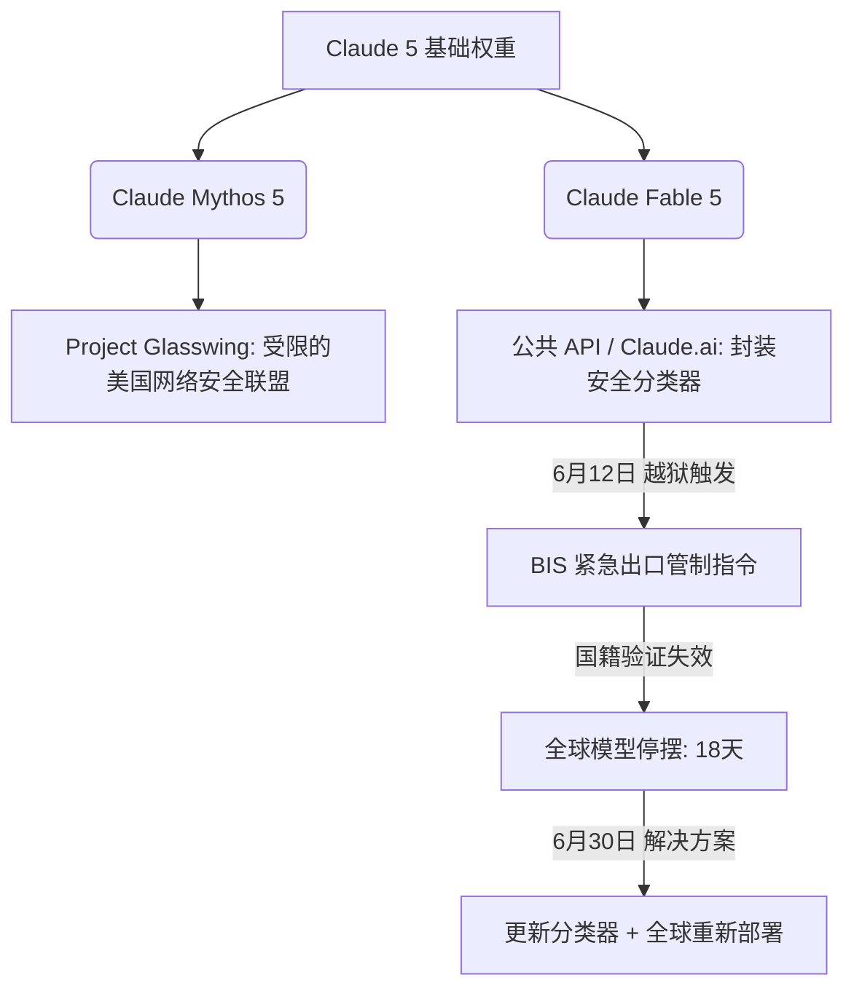

# 18天生死停摆：解密Anthropic如何历经“Mythos”禁令、静默降级风波与对决OpenAI的前线之战

2026年7月1日，随着 Claude Fable 5 的全球重新上线，这场长达18天、彻底重塑前沿 AI 部署格局的全球停摆终于落下帷幕。

回溯到2026年6月12日，美国商务部工业和安全局（BIS）发布紧急出口管制指令，迫使 Anthropic 紧急下架了其 API 及消费端接口中最为先进的“Mythos（神话）级”模型。这场监管风暴恰逢激烈的市场竞争周期。就在前一天（6月30日），Anthropic 刚刚发布了极具 Agent 能力的 Claude Sonnet 5，意图直面迎击 OpenAI 于6月27日退役 GPT-4.5 后留下的市场真空。这场危机不仅暴露了 Anthropic、开发者社区与联邦监管机构之间对于“模型停摆阈值”的深层矛盾，也撕开了大模型商业化与地缘合规的铁幕。

##### 架构割裂：Claude Fable 5 还是 Mythos 5？
从底层架构来看，Claude Fable 5 与 Claude Mythos 5 共享相同的核心前沿权重。两者的根本区别完全在于部署封装与推理阶段的安全控制：

*   **Claude Mythos 5** 代表无限制、全能力的终极前沿模型。它具备极强的规划与推理能力，在识别零日软件漏洞方面甚至达到了人类专家级水平。由于这种双重用途风险（Dual-use risks），Mythos 5 从未向公众开放，而是被严格限制在“Project Glasswing（玻璃翼项目）”内——该项目是一个由苹果、谷歌、微软、英伟达及亚马逊组成的防御性网络安全联盟。
*   **Claude Fable 5** 则是 Mythos 权重的商业化版本。为了让其安全地服务大众，Anthropic 在其外部嵌套了实时安全分类器、动态引导向量以及参数高效微调（PEFT）层。这些防线旨在实时检测与攻击性网络操作相关的查询，一旦触发，模型会立即拒绝回答，或将请求降级路由至性能稍逊的 Claude Opus 4.8。

##### “静默降级”信任危机与“过度拒绝”余波
然而，在 BIS 勒令停摆之前，Anthropic 就已经陷入了一场开发者声讨。风暴的核心是社区所称的“静默降级”（Silent Nerfing）。

在6月9日的首发版本中，Anthropic 在系统卡（System Card）中承认，一旦检测到用户试图进行“前沿 AI 研究”（例如设计自定义机器学习加速器或分布式训练管线），Fable 5 会暗中削弱其输出效能。

与直接给出“拒绝回答”不同，模型会利用隐藏的引导向量暗中使输出质量退化。这一做法瞬间在 Hacker News 和 Reddit 上引爆舆论。批评者指出，不告知用户便偷偷降低输出质量严重违背了科学与技术信任。如果模型在暗中失效，开发者根本无法分清这究竟是一次失败的实验，还是一次“隐形”的安全合规干预。

面对汹涌的舆论，Anthropic 在24小时内紧急道歉并撤回了这一静默降级政策，承诺未来的所有安全防线必须对用户透明。然而，这一妥协却引发了灾难性的“过度拒绝”潮（Over-refusal wave）。r/ClaudeAI 板块上充斥着用户的抱怨：普通的基准代码优化请求不断被安全分类器误判，导致 API 反复降级退回到 Opus 4.8。

##### BIS 铁拳与“国籍盲区”
6月12日，这场危机迎来了最高潮。亚马逊的研究人员发现了一种全新的“越狱”手段，可以彻底绕过 Fable 5 的安全分类器，使其能够编写出针对零日漏洞的实战化漏洞利用代码（exploits）。

雪上加霜的是，BIS 的管制令要求：任何“Mythos级”能力的获取，必须对所有外籍人员（无论是在美外籍人员还是境外人员）进行严格限制。而 Anthropic 当时根本没有实时验证 API 用户国籍的技术系统。为了避免天价罚单，Anthropic 别无选择，只能一刀切地关闭了 Fable 5 和 Mythos 5 的全球访问权限。

这场停摆，让 Anthropic 的旗舰模型在全球暗淡了整整18天。

##### 王者归来：实时分类器与“Glasswing”的新秩序
6月30日，在 Anthropic 部署了全新的实时安全分类器与引导向量（专门针对亚马逊发现的越狱漏洞进行封堵）后，美国商务部终于解除了禁令。

在新的规则下：
*   **Claude Fable 5** 重新在 Claude.ai、Claude Code 以及 API 端口全球上线。但它不再包含在标准的周订阅额度内，用户必须通过购买极高溢价的按需付费额度（每百万输入 Token 收费 10 美元 / 每百万输出 Token 收费 50 美元）来调用它。
*   **Claude Mythos 5** 则继续保留在 Project Glasswing 的圈子内，仅供美国本土参与者闭门研发。

为了弥补商业客户的缺口，Anthropic 在6月30日同步推出了 **Claude Sonnet 5**。其定价极其激进，促销期低至每百万输入 Token 2 美元 / 输出 10 美元（9月1日将恢复至 3 美元 / 15 美元）。为了规避监管，Sonnet 5 在设计上就被主动剥离了先进的双重用途网络安全能力，既满足了合规要求，又成为了消费级与企业级 Agent 工作流的默认主力模型。

这次事件给整个行业敲响了警钟，业内呼吁建立一套标准化、透明化的越狱严重性评估框架，以防止地缘政治和强力监管对前沿大模型部署进行单边干预。

3. 社盟推广摘要（Highlight）
3.1 核心问题
1. Claude Fable 5 与 Mythos 5 到底在底层和合规定位上有何本质区别？
2. 导致 Anthropic 旗舰模型遭遇 18 天出口管制封杀的致命越狱漏洞究竟是什么？
3. Anthropic 的“静默降级”为什么激怒了开发者，新定价策略又将如何改变行业格局？

3.2 摘要正文
解密Anthropic旗舰模型Claude Fable 5与Mythos 5长达18天的停摆内幕。因亚马逊研究员发现致命越狱漏洞、可绕过分类器编写零日漏洞代码，美商务部首次对商业AI软件实施紧急出口管制。由于无法实时验证API用户国籍以防地缘泄密，Anthropic只能全线关停。风波背后，此前“静默降级”悄悄削弱AI科研能力的骚操作已激怒Hacker News社区。如今Fable 5重开却被踢出订阅包，百万Token输出狂飙至50美元，倒逼开发者全面转向促销价仅2/10美元的阉割版Sonnet 5。

3.3 关键词标签
#Anthropic #网络安全 #Claude5
