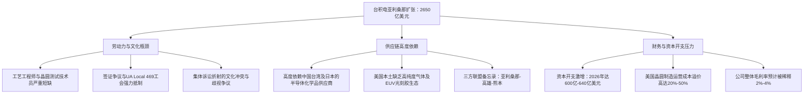

# **2650亿美元的“纸面堡垒”：台积电亚利桑那建厂的真实技术与财务困局**

2026年中，台积电的一项声明在全球半导体行业激起千层浪。在当年第二季度的财报电话会议上，这家台湾芯片巨头宣布追加1000亿美元投资，将其在美国亚利桑那州菲尼克斯的版图再度扩张。至此，台积电在美总投资额已达到惊人的2650亿美元，创下美国历史上最大规模的外商直接投资（FDI）纪录。根据调整后的宏伟蓝图，该亚利桑那超级基地将扩建至13座设施：包括10座晶圆厂（Fabs）、2座先进封装厂以及1座专用研发中心。

作为美国实现“技术主权”的王冠明珠，该项目将焦点锁定了2纳米及以下、采用环绕栅极（GAA）纳米片晶体管的先进制程。台积电CEO魏哲家表示，AI驱动的行业需求“异常强劲”，这迫使公司将2026年的资本开支（CapEx）指引调高至创纪录的600亿至640亿美元。然而，在铺天盖地的公关通稿与“高良率”喜报背后，一条由结构性冲突交织而成的暗流正在涌动。要剖析台积电这场亚利桑那豪赌的最终胜算，我们必须直面三大核心瓶颈：人才危机、供应链幻象，以及华尔街对利润率的冷酷清算。

#### 人才天花板：签证、工会与“文化战争”的集体诉讼

对菲尼克斯超级基地而言，眼下最紧迫的威胁并非光刻技术的物理极限，而是人。先进半导体制造需要一支由高度专业化的工艺工程师、良率诊断专家和晶圆测试技术员组成的技术铁军。然而，亚利桑那州根本无法在短时间内本土化培养出如此庞大的专业人才队伍。为了填补这一硬性缺口，台积电曾试图为数以百计的台湾工程师申请签证快速通道，这立刻引燃了当地工会的怒火。代表管道工、管线工和焊工利益的 Local 469 工会发起了一轮又一轮的猛烈攻势阻止这些签证下放，指责台积电以“专业技能短缺”为借口，实质上是为了引入价格更低廉、服从度更高的境外劳动力。

然而，这种摩擦绝非仅停留在签证文件的纠纷上，而是两种企业哲学的根本冲撞。台积电在台湾创下的“良率神话”，很大程度上建立在一种近乎军事化的勤勉文化之上。台积电创始人张忠谋曾留下一句名言：在台湾，如果机器在凌晨两点坏掉，三点就能修好，因为工程师在睡梦中接到电话就会立刻赶往工厂，而他们的家人会翻个身继续睡。张忠谋直言：“而在美国，他们会等到第二天早上。”

在 Reddit 和 X 等社交平台上，大批美国本土工程师将台积电亚利桑那厂的管理风格斥为“粗暴”、“专制”且“毫无妥协余地”。这种深层次的文化鸿沟最终延烧到了法庭。美国员工发起的一项轰动业界的集体诉讼，控告台积电存在系统性的“反美歧视”，声称台湾主管对美籍员工采取双重标准、在晋升中偏袒中文使用者，并刻意营造出充满敌意的工作环境。此外，2026年4月提起的一起名为 *Yeh v. TSMC* 的性别歧视诉讼更是火上浇油，原告指控该公司存在系统性偏见及不当职场行为。

#### 材料的幻象：锚定在东亚的“跨太平洋供应链”

政客们热衷于将菲尼克斯的扩张吹捧为美国“本土制造业韧性”的伟大胜利。但供应链分析师警告称，把晶圆厂搬到美国并不等于把供应链也搬到美国。半导体晶圆厂是一个极其脆弱敏感的生态系统，需要不间断地输入无尘室耗材、硅晶圆以及超高纯度的特种化学品。

目前，美国本土根本不具备运行2纳米以下先进制程所需的化学品生态体系。台积电亚利桑那厂在结构上仍旧重度依赖东亚供应商，尤其是以下关键材料：
* **EUV 光刻胶**：这一高度专利化的化学配方几乎被日本巨头（如东京应化工业 TOK、JSR 以及信越化学）绝对垄断。
* **特种湿化学品**：运行制程所需的高纯度溶剂、蚀刻液和显影液，主要源自长春石油化学、李长荣化工等台湾化工龙头。
* **高规格晶圆**：先进的300mm硅外延片，依然高度依赖信越半导体（Shin-Etsu Handotai）和胜高（SUMCO）的供给。

尽管2026年3月亚利桑那州、台湾高雄与日本熊本三方签署了备忘录（MOU），试图打造一个“半导体战略三角”来简化这些物流环节，但它也昭示了一个清醒的现实：菲尼克斯绝无可能闭门造车。一旦地缘政治风暴切断了横跨太平洋的航线，亚利桑那的晶圆厂将在数周内因断供原材料而“停摆”，届时这座斥资2650亿美元堆砌起来的“本土堡垒”将形同虚设。

#### 华尔街的算盘：稀释的利润率与虚无的“AI溢价”

当台积电在2026年第二季度将资本开支指引上调至600亿至640亿美元时，华尔街的第一反应是质疑，这直接引发了台积电股价的短期抛售。投资者对资本效率的下滑和利润率的侵蚀感到深切担忧。

在美国建厂并维持运转的昂贵程度人尽皆知。受制于繁琐的监管审批以及“邻避效应”（NIMBYism），亚利桑那厂的建设成本预估高达台湾本土的四倍。分析师测算，在美国生产晶圆将带来**20%至50%的额外运营成本溢价**。虽然这一本地经常性开支极其沉重，但台积电预测，随着海外晶圆厂规模的扩大，这将导致其全球整体毛利率被**稀释2%至4%**。

台积电计划通过向苹果、英伟达（NVIDIA）、超威（AMD）等客户收取“美制芯片溢价”来转嫁部分成本，但资本效率的结构性拖累依然是绝对的隐忧。正如知名研究机构 *SemiAnalysis* 的 Dylan Patel 所指出，美国工厂较低的产能利用率和高昂的折旧费用，短期内甚至可能将美制晶圆的实际成本推向更高。核心问题依然悬而未决：当底层的原材料供应链依然牢牢绑定在太平洋彼岸时，科技巨头们真的愿意长期为这枚带有美国标记的芯片支付高昂的“安全税”吗？
