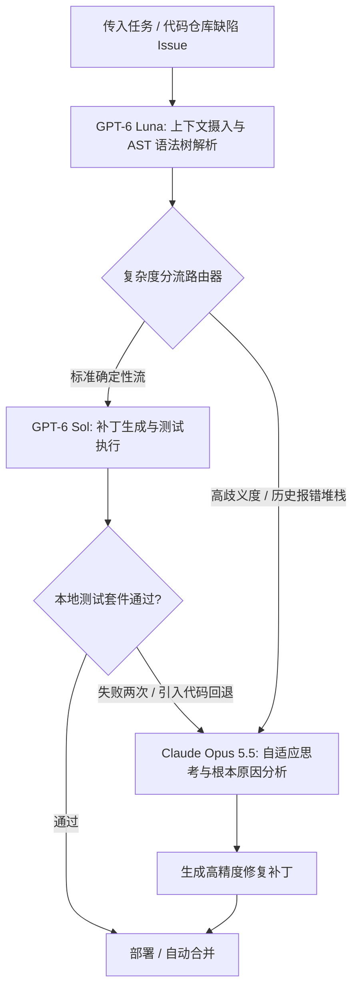

# 4美元前沿撞车：拆解 Opus 5.5 自适应思考、GPT-6 Sol“抢跑”推理与企业级 AI 的新算账逻辑

2026年9月22日，人工智能行业迎来了迄今为止烈度最高、节奏最紧密的一场前沿架构正面对撞。在短短90分钟内，Anthropic 与 OpenAI 相继发布了各自的下一代模型架构。这场几乎同步发生的突袭，彻底颠覆了企业级 AI 系统的价格锚点、时延预期与工程拓扑设计。

Anthropic 率先打响发令枪，宣布 Claude Opus 5.5 正式全面上线（GA），同步覆盖 Claude API、Amazon Bedrock、Google Cloud Vertex AI 以及 Microsoft Foundry。该模型旨在匹敌 Anthropic 研究级检查点 Claude Fable 5.1 的推理保真度，同时将生产环境的推理成本较 Opus 5 压缩了约 40%：输入每百万 Token（1M）基准定价 4.00 美元，输出每百万 Token 20.00 美元，并匹配了激进的 0.20 美元/百万 Token 的 Prompt 缓存读取费率。在架构层面上，Opus 5.5 的生成速率提升了 30%，强化了提示词注入防御，并首次原生实装了全天候启用的“自适应思考”（adaptive thinking）——一个能根据提示词复杂度动态调整思维链深度的元推理闭环。

OpenAI 的反击精准而致命。其打出“以 Sol 构建，以 Luna 规模化”（Build with Sol, scale with Luna）的双模型旗号。OpenAI 并没有在同等价格段内与 Anthropic 缠斗，而是直接击穿了底线：定位于代码主力与核心推理引擎的 GPT-6 Sol，输入与输出定价分别为 2.00 美元/百万 Token 与 10.00 美元/百万 Token，较此前的 GPT-5.6 价格腰斩 50%。作为补充，OpenAI 推出了微型吞吐模型 GPT-6 Luna，以输入 0.10 美元、输出 0.50 美元的超低价，全面收割海量数据摄入、结构化解析与持续遥测管道市场。

然而，在断崖式降价的公关狂欢背后，隐藏着一场更深刻的工程架构危机。随着工程界在 Terminal-Bench 4.0 与 GDPval 上的第三方独立评测数据陆续出炉，两个极端的生产隐患迅速浮出水面：Claude Opus 5.5 在递归自主 Agent 循环中极易陷入失控的 Token 吞噬黑洞；而 GPT-6 Sol 则由于激进的“早停”（early-exit）剪枝启发式策略，频频交出轻率、浅薄的“抢跑”答案。

```
前沿 AI 定价与经济学矩阵（2026年9月22日发布）
┌──────────────────┬──────────────┬──────────────┬──────────────────┬────────────────────────┐
│ 模型             │ 输入 / 1M    │ 输出 / 1M    │ 缓存读取 / 1M    │ 核心价值维度           │
├──────────────────┼──────────────┼──────────────┼──────────────────┼────────────────────────┤
│ Claude Opus 5.5  │ $4.00        │ $20.00       │ $0.20            │ 深度推演、TB4领先      │
│ GPT-6 Sol        │ $2.00        │ $10.00       │ 标准费率 (50%)   │ 极速代码生成、极致性价比│
│ GPT-6 Luna       │ $0.10        │ $0.50        │ 标准费率 (50%)   │ 高吞吐吞吐路由、日志解析│
└──────────────────┴──────────────┴──────────────┴──────────────────┴────────────────────────┘
```

### 架构分野：自调节算力 vs 提前剪枝启发式

Opus 5.5 与 GPT-6 Sol 的核心分歧，本质上是两种完全对立的评估期算力（Test-time Compute）分配哲学。

Anthropic 的“自适应思考”彻底取消了由开发者手动配置推理预算的旧模式。Opus 5.5 放弃了静态的“推理工作量”（reasoning effort）参数，转而在模型内部执行动态自我评估：它会审视输入提示词的语义复杂度与结构歧义度，自动在隐藏层中伸缩思维链 Token 数量。该机制亦与其加固的提示注入防御深度绑定——在执行任何工具调用之前，模型必须借助推演步骤将不受信任的第三方数据与系统初始指令完全剥离。

然而，一旦将 Opus 5.5 放入 SWE-agent、Devin 或企业自建的 Claude Code 递归 Agent 循环中，这种机制便会产生严重的工程摩擦。在专用于评估自主终端命令编排、代码仓库级调试与系统运维能力的 Terminal-Bench 4.0 评测中，Opus 5.5 斩获了创纪录的 54.8% 任务解决率。但只要运行环境抛出非确定性的终端输出、stderr 警告或周期性测试失败，自适应思考机制便往往会将每个细微异常误判为全新的“概念级系统危机”。

模型内部的推理链随之呈指数级膨胀，在执行一条简单的 Shell 命令之前，往往已在隐藏思考中挥霍了数万个每百万 20 美元的输出 Token。

Datasette 创始人、开源 AI 工具先驱 Simon Willison 在 X 上指出了这一残酷的财务现实：
> “在交互式 CLI 环境中，Opus 5.5 是我用过最聪明的模型；但一旦被丢进自主死循环，它就毫无财务自制力可言。当编译器报出一个晦涩的动态链接器 Flag 错误时，自适应思考足足消耗了 14,000 个隐藏推理 Token 去剖析 GCC 动态链接的前世今生，最后敲出来的命令居然只是 `make clean`。在每百万输出 20 美元的账单速率下，一个缺乏约束的递归循环能赶在你喝完早咖啡之前就把你的 API 余额吸干。”

相比之下，OpenAI 打造 GPT-6 Sol 的核心导向就是经过严密成本优化的推理吞吐速率。为了在超低的首字延迟（TTFT）下维持 10.00 美元/百万 Token 的输出价位，OpenAI 对 Sol 的内部推理分支施加了极其激进的动态剪枝策略。

在衡量真实商业经济任务（如财务报表审计、供应链合同校验及法律尽调）的综合基准 GDPval 上，GPT-6 Sol 虽然跑出了极高的吞吐效率，但在面对细微隐蔽的边界摩擦时迅速崩溃。在 Reddit 与 X 的工程社区中，开发者们迅速将其定性为“抢跑式推理”（rushed reasoning）。

知名人工智能学者 Andrej Karpathy 在 X 上剖析了这一缺陷模式：
> “我们在 GPT-6 Sol 身上观察到的，是测试期算力过早退出优化（early-exit optimization）带来的典型反噬。Sol 的强化学习策略经过了过拟合式的激进调优，目标是快速收敛出答案，以此最大化 Token 生成效率。在生成从零开始的样板代码或常规脚手架时，它表现得极为惊艳。但在 GDPval 这类多重约束嵌套的复杂场景中，Sol 往往过早地宣布了胜利。它在尚未校验边界不变量之前就直接掐断了推理链跟踪。Opus 5.5 思考过载，而 Sol 则是只要发现一条看似可行的路径，就立马停止了思考。”

```
运行剖析：50步自主代码仓调试任务
┌─────────────────────────────────────────────────────────────┐
│ Claude Opus 5.5：深度推演与失控的 Token 消耗                │
│ [推理: 16.4k tokens] ──> [工具: bash] ──> [继续深度推理]     │
│ 累计任务成本: $3.84 | 任务状态: PASS (通过)                 │
├─────────────────────────────────────────────────────────────┤
│ GPT-6 Sol：快速收敛与过早剪枝                               │
│ [推理: 1.2k tokens] ──> [工具: bash] ──> [提前退出推理]      │
│ 累计任务成本: $0.46 | 任务状态: FAIL (代码回退破损)         │
└─────────────────────────────────────────────────────────────┘
```

### 基准诊断：Terminal-Bench 4.0 与 GDPval 的数据真相

第三方独立评测全方位印证了两款模型在严苛测试集中的结构化极化特征：

* **Terminal-Bench 4.0：** Opus 5.5 以 54.8% 的解决率力压 GPT-6 Sol 的 49.2%。但代价是，Opus 5.5 在每个成功轨迹中消耗的推理 Token 平均是 Sol 的 4.6 倍。定位为高吞吐轻量模型的 GPT-6 Luna 仅录得 18.4%，印证了 OpenAI 官方的告诫：切勿将 Luna 作为独立的 Coding Agent 使用。
* **GDPval（企业级综合测试）：** Opus 5.5 取得了 91.4 分，显著领先于 Sol 的 86.7 分。在涉及跨司法管辖区税务合规审查、网络安全漏洞利用溯源等幻觉容忍度为零的分项测试中，Opus 5.5 对极端边界用例的韧性留存率高达 94.1%，而 Sol 骤降至 78.3%。
* **安全与提示注入：** 得益于严格的前置审查推演，Opus 5.5 对克隆代码仓和外部网页输入中潜藏的间接提示词注入攻击实现了 99.4% 的拦截率；GPT-6 Sol 与 GPT-6 Luna 的拦截率则分别为 94.2% 与 88.5%。

### 非对称架构的崛起：告别单一模型神话

这起双雄对撞事件，以极快速度终结了企业级架构对单一模型供应商的路径依赖。面对 Anthropic 的昂贵深度推演与 OpenAI 的低价极速吞吐，头部企业工程团队不再二选一，而是迅速通过胶水层将两者缝合为非对称的多模型执行流水线。



LangChain 首席执行官 Harrison Chase 披露了新架构发布 24 小时内企业拓扑形态的重构：
> “我们的企业客户几乎瞬间达成了分流共识：你绝不能以每百万 20 美元的价格把原始终端日志直接喂给 Opus 5.5；但你也绝不能毫无防备地让 GPT-6 Sol 去自主重构核心财务账本。现在的标准打法是：先派 0.10/0.50 美元的 Luna 去总结 Git Diff 和过滤 Stdout 标准输出；接着由 Sol 撰写补丁并运行本地测试；一旦编译连续失败两次或触碰安全检查红线，上下文立即逃逸升级，交由 Opus 5.5 动用自适应思考定位深层死锁。这种混合闭环将基线 Token 支出削减了近 70%，同时完全保留了顶级水准的准确率。”

著名投资人兼技术思想家 Elad Gil 同样对此发表了定调：
> “2026年9月22日将被记录为‘单一大模型通吃天下’神话正式破灭的一天。OpenAI 借由 Sol 和 Luna 确立了大宗模型推理的底线成本，将中端模型挤压得毫无生存空间；Anthropic 则把 Opus 5.5 稳固在了高可靠性认知防火墙的位置上。未来企业工程的核心套利空间，全部留在了路由逻辑层。”

### 掌门人交锋：Amodei 对决 Altman

面对架构哲学的冲突，两家前沿实验室的最高决策者在公开场合展开了直接交锋。

Anthropic 联合创始人兼 CEO Dario Amodei 在投资者电话会中为“自适应思考”的资源消耗进行了有力辩护：
> “失去校验机制的自主性，本质上是一笔高昂的隐形负债。如果一个模型只是跑得飞快、替你节省了 60% 的 Token，结果却在数据迁移脚本中产生致命幻觉，或因第三方包依赖导致了间接注入攻破，那么企业后续的修复与公关成本将是天文数字。Opus 5.5 从底层被设计为捍卫认知严谨性、深思熟虑的对齐与原生安全。我们造它是为了彻底解决最硬核的技术悬案，而不是去参与无节制截断 Token 的向下比烂比赛。”

OpenAI CEO Sam Altman 则在 X 上直接反唇相讥，重申规模化下的效能优先法则：
> “要实现真正的大规模实用化，必须对算力效率保持冷酷的追求。绝大多数生产级代码构建、日常工单流转与数据清洗任务，根本不需要动辄数分钟的形而上学式思维链纠缠。GPT-6 Sol 压到了 2/10 美元，Luna 更是廉价如自来水，这能让开发者在不打爆基础设施预算的前提下，拥有实时不间断的智能。如果你真的需要无边界的沉思，你完全可以在编排层手动配置它，而不是让模型自作主张地去透支你的信用卡。”

### 结语

2026年9月22日的这场正面对撞，标志着前沿 AI 产业完成了关键的范式切换。Anthropic 的 Claude Opus 5.5 依靠原生的“自适应思考”，再次拔高了机器自主破题与对抗防御的智力天花板，但也对工程编排提出了严苛的约束要求，以防 Token 在死循环中失控燃烧；与此同时，OpenAI 的 GPT-6 Sol 与 Luna 彻底将常规逻辑推理和高吞吐转化降维为基础公用设施，尽管其提前退出的轻率启发式正遭受社区的严苛审视。

企业在 AI 时代的竞争壁垒，早已不再取决于执念于哪一家模型的单点突破，而在于系统架构师们能否将 Luna 的速度、Sol 的成本与 Opus 5.5 的心智深度，精准编织进一套自我纠错的非对称运转机器之中。

---
