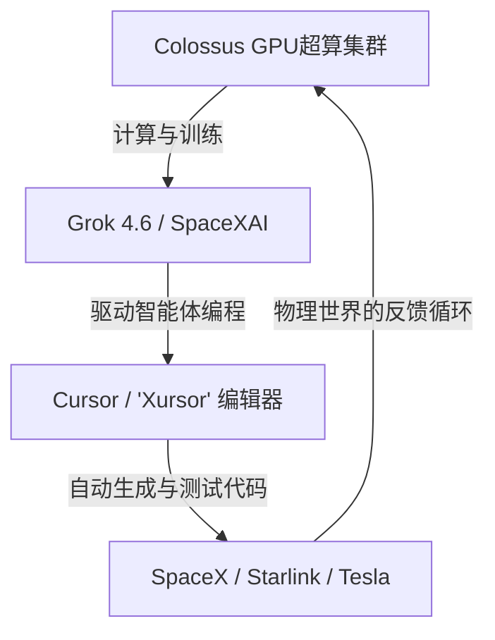

# 600 亿美元的“Vibe Check”：SpaceX 史诗级收购 Cursor，与程序员生态护城河的终极争夺战

2026年8月14日，全球科技界见证了有史以来规模最大的一笔针对风投支持初创公司的收购案。SpaceX 正式宣布完成了对 Anysphere 的收购——这家初创公司正是 AI 原生代码编辑器 Cursor 的幕后推手。这笔全股票交易的总估值达到了令人咂舌的 600 亿美元。

纵向对比来看：埃隆·马斯克（Elon Musk）在2022年收购推特（现X）的花费是440亿美元。而就在两个月前的2026年6月12日，SpaceX 刚刚以“SPCX”为股票代码在纳斯达克挂牌上市。如今，这家新晋上市公司决定掷出 600 亿美元砸向一款代码编辑器，这揭示了其战略重心的剧烈转向。这绝非单纯为了帮程序员更快地生成样板代码，而是一场旨在掌控软件工程最前端入口的深谋远虑。

#### 交易结构：股权稀释、RSU 转换与“再锁定期”
此次收购完全以全股票方式进行，将 Anysphere 团队的利益与 SPCX 在公开市场的表现深度绑定。根据监管披露文件，交易的财务细节如下：
*   **普通股与优先股：** Anysphere 的已发行股份被转化为获得总计 **389,289,254 股** SpaceX Class A 普通股的权利。兑换比例根据8月14日收盘前最后7个交易日的成交量加权平均价（VWAP）计算得出。
*   **已归属的 RSU：** 员工已归属的 Cursor RSU 被转化为获得 **1,752,426 股** SpaceX Class A 普通股的权利。
*   **未归属权益与期权：** SpaceX 承接了 Cursor 员工未归属的股权并延续既定的归属时间表，将其转化为 **29,128,326 股 SpaceX RSU** 和 **44,365,047 份** SpaceX Class A 普通股的股票期权。
*   **人才留存“再锁定期”（Revesting）：** 为防止核心人才流失，创始团队及核心工程师签署了限制性的“再锁定协议”（Revest Agreements），将他们转换后的部分股权与在 SpaceX 的多年服务里程碑重新挂钩。

交易完成后，Anysphere 将作为 SpaceX 的全资子公司独立运营，并入新成立的 **SpaceXAI** 部门（该部门成立于2026年7月6日，由 SpaceX 吸收并重塑马斯克旗下的 xAI 后组建而成）。

#### 依托 Colossus 超算，打破算力与规模的死墙
在被收购之前，Cursor 正面临着严峻的技术瓶颈。随着其智能体工作流（如 Cursor Composer）升级至支持多文件跨度编辑，这款开发者工具的后端频繁受到第三方 API（主要是 Anthropic 的 Claude 3.5 Sonnet 和 OpenAI 的 GPT-4o）高昂成本与调用频次限制（Rate Limits）的掣肘。

交易交割后不久，Cursor 团队在 X 平台上发表官方声明称，这笔交易让他们获得了“整整一个数量级的算力提升”。并入 SpaceXAI 后，Cursor 彻底绕过了零售 API 的中间商加价，获得了直接访问位于田纳西州孟菲斯的超级计算机集群 **Colossus** 的裸金属（Bare-metal）权限。Colossus 部署了数十万张英伟达 GPU，是 Grok 4.5 和 Grok 4.6 的训练基地。通过在 Colossus 上直接运行经过微调的本地化 Grok 模型，SpaceXAI 能够将智能体循环的延迟缩减至极致，并以极低的成本承载原本昂贵得无法商用的超长上下文窗口。

#### “用户在环”护城河与智能体工程学（Agentic Engineering）
这场收购的核心战略动因，在于开发者工作流数据集。想要构建能够编写复杂、多文件生产级系统的 AI 模型，AI 公司不能仅仅依赖像 GitHub 这样的静态代码仓库。他们迫切需要行为学数据：开发者如何写 Prompt、如何拒绝或接受 Diff（代码差异化对比）、如何修复编译/格式错误（Lint Errors），以及他们如何在代码库的复杂架构中穿梭寻找线索。

2025年初，前特斯拉 AI 总监安德烈·卡帕西（Andrej Karpathy）曾创造了“Vibe Coding”（氛围感编程）一词，用来描述仅靠向 Cursor 这类 IDE 下达指令来编程的全新状态：
> “有一种我称之为‘Vibe Coding’的新编程方式。你只需要完全顺应这种氛围，拥抱指数级增长，甚至忘记代码本身的存在……我总是直接‘接受全部’（Accept All），甚至不再读 diff 了。”

然而，随着技术在2026年演进，卡帕西和其他研究人员注意到，行业正从盲目的“氛围感编程”过渡到更为严谨的**“智能体工程学（Agentic Engineering）”**。拥有 Cursor 后，SpaceXAI 得以独占数百万程序员在进行智能体工程学交互时产生的遥测反馈闭环。这种活跃的主动反馈循环，成为了训练下一代前沿代码模型无可替代的强化学习（RLHF）黄金数据集。

#### 开发者阵营的割裂：“Xursor”恐慌与 Claude Code 逃难潮
尽管金融市场对这笔 600 亿美元的估值充满好奇，但 Hacker News、X 以及 Reddit 的 r/cursor 社群上却早已吵成一片。许多人质疑，一个本质上是“套壳 VS Code”的编辑器，凭什么值 600 亿美元？

更让程序员群体焦虑的是平台锁定与改名风波。关于 Cursor 即将更名为 **“Xursor”** 或 **“CurXor”** 的传言在网络上引发了无数调侃与不安。开发者对数据隐私表现出强烈的担忧，担心自己的商业私有代码库会被喂给 Grok 进行模型训练，或者企业内部的工作流遭到监控。

这种信任危机直接催化了用户向其他工具流失。其中，Anthropic 在2026年初推出的终端命令行（CLI）编程助手 **Claude Code** 成为了最大的避难所。与基于定制版 VS Code 分支构建的 Cursor 不同，Claude Code 直接在终端运行，提供了一种极其轻量化且不绑定特定 IDE 的智能体编程体验。在 Hacker News 上，一位开发者直言不讳地写道：
> “SpaceX 交易交割的当天，我就取消了 Cursor 的订阅。我可不想让我的代码进入埃隆·马斯克的模型训练循环。而且，在终端里直接用 Claude Code 显然更干净、更高效。”

#### SpaceX 的极致垂直整合：从灵感到轨道
将开发者界面纳入麾下，完美契合了马斯克一贯的极致垂直整合打法：

对于 SpaceX、Starlink 以及特斯拉而言，限制其实体工程规模化扩张的最大瓶颈之一就是软件。星舰（Starship）极其依赖数百万行对安全要求极高的 C++ 飞行控制代码；星链（Starlink）庞大的卫星星座需要极为复杂的网状路由算法；而特斯拉的 FSD（全自动驾驶）与 Optimus 机器人部门，则高度依赖源源不断的仿真与训练管线代码。

通过在芯片层（Colossus）、模型层（Grok）、开发入口层（Cursor）以及最终执行系统（星舰/Optimus/FSD）进行垂直整合，SpaceXAI 正在构建一个完全闭环的系统。在这个系统里，AI 智能体可以直接编写、编译、测试软件，并直接将其部署到自动化的硬件实体上。

#### 地缘政治博弈的深远余波
这桩交易的意义早已超出了硅谷科技巨头之间的商业棋局，更涉及国家安全层面。随着微软掌控 GitHub Copilot、谷歌力挺 Project IDX，以及 OpenAI 全力推进其智能体计划，SpaceXAI 正在构筑一条专属的开发者数据护城河。将 AI 代码生成管线置于美国核心国防承包商（SpaceX）的安全架构之内，意味着美国自主系统软件的国内供应链将免受外部数据遥测的窥探，从而在全球 AI 竞赛中确立了一个强大的国家级技术堡垒。
