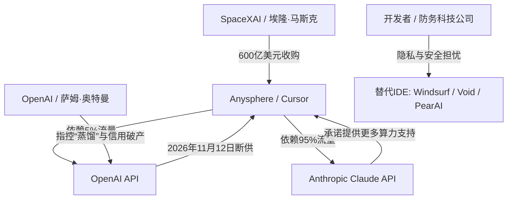

# 600亿美元的“代码圣战”：SpaceX闪电吞并Anysphere，OpenAI祭出“核级断供”斩断Cursor生态

2026年8月14日，SpaceX以历史性的600亿美元全股票交易，正式完成了对AI代码编辑器Cursor开发商Anysphere的收购。这笔交易将Cursor并入新组建的“SpaceXAI”部门（与xAI并列），创下了风投支持的初创公司历史最大退出纪录。然而，这场巨头合并旋即触发了一场技术与商业的全面战争。昨日，OpenAI宣布将于2026年11月12日正式终止Cursor的API访问权限，理由是马斯克旗下实体长期存在“模型蒸馏”等侵犯信任的行为。

本文将深度拆解这场断供风波背后的技术与法理博弈：从Cursor的底层分流架构、Anthropic Claude系列作为替代方案的真实成色，到SpaceXAI如何借此构建其闭环的开发者生态链。

### 解构Cursor分流层：这神秘的“5%”到底有多致命？
要理解OpenAI断供对Cursor的真实杀伤力，必须先剥开Cursor的底层技术架构。Cursor并非直连各大大语言模型（LLM），而是依赖一个名为**Cursor Router（分流路由器）**的智能分类器层。这个分流层基于超过60万条真实的生产环境开发者交互数据训练而成。在“Auto（自动）”模式下，它会动态评估请求的复杂度、上下文深度（结合向量嵌入与基于图谱的代码库索引）以及特定领域的开发需求，从而将查询分发给性价比最高的模型。

Cursor首席执行官Michael Truell证实，OpenAI的模型仅占Cursor总流量的**5%左右**，其余95%的流量均被Anthropic的Claude 3.5 Sonnet以及最新发布的Claude Sonnet 5牢牢占据。

然而，这5%的“失血”对Cursor而言，却是一次致命的精准打击。因为被路由至OpenAI的这5%流量，承载的全部是极高推理难度的核心任务。Cursor在以下关键场景中极度依赖OpenAI的GPT-5.5 Pro和GPT-5.6 Sol：
1. **Composer多文件编排**：GPT-5.6 Sol在逻辑一致性上表现极佳，在涉及跨多个文件重构的Composer模式中，复杂的、多层次的代码修改需要极高的执行精度。
2. **高可靠性容灾备用**：当Anthropic的API遭遇限流或宕机时，OpenAI是首选的备用基础设施。
3. **企业级合规路由控制**：出于合规限制，许多企业开发团队只被允许使用特定的模型供应商。失去OpenAI意味着Cursor直接被那些排斥Anthropic或Google模型的企业级开发者拒之门外。

尽管用户可以通过配置个人OpenAI API Key来绕过这一断供限制，但这将使Cursor独家的路由优化算法失效，开发者不仅要承担昂贵的原始Token费用，还会失去自动分类器带来的高效率。

---

### 法理暗战：模型蒸馏与“控制权变更”的紧箍咒
OpenAI切断Cursor API的法理依据，深植于马斯克与奥特曼之间积怨已久的个人与商业对抗。OpenAI激活了其开发者协议中的“控制权变更（change-of-control）”条款，指控SpaceX对Anysphere的收购破坏了企业级API许可所必需的互信基础。

而这起纠纷的核心直指AI行业最敏感的红线——**模型蒸馏（Model Distillation）**。在“马斯克起诉奥特曼”的庭审中，马斯克在宣誓后承认，xAI（现已并入SpaceXAI）曾“部分”蒸馏了OpenAI的模型来训练其Grok系列，并坦言：“一般来说，AI公司都在互相蒸馏。”

OpenAI的法律顾问指出，允许一家SpaceX控股的子公司获取底层模型访问权，将带来不可承受的知识产权窃取风险。他们坚称，SpaceXAI会利用Cursor的遥测数据和OpenAI的API响应，来蒸馏训练其自研的Grok-Coder模型，以追赶GPT-5.6 Sol和Terra。

马斯克随后在X.com上猛烈开火：
> “奥特曼和他的董事会完全不值得信任。他们为了商业贪婪背叛了非营利初衷，现在又因为害怕Grok在Colossus超算集群上跑得太快，试图通过掐断Cursor来搞破坏。我们根本不在乎他们那点API。Grok终将成为地表最强的编程模型。”

---

### Anthropic乘虚而入：Claude Sonnet 5 vs. OpenAI Astra 的代理人
1. 大标题
600亿美元的“代码圣战”：SpaceX闪电吞并Anysphere，OpenAI祭出“核级断供”斩断Cursor生态

2. 正文
2026年8月14日，SpaceX正式完成了对AI代码编辑器Cursor开发商Anysphere的收购，交易金额为历史性的600亿美元全股票交易。此举将Cursor并入新组建的“SpaceXAI”部门（与xAI并列），创下了风投支持初创公司历史最大退出纪录。然而，这场巨头合并旋即触发了一场技术与商业的全面战争。昨日，OpenAI宣布将于2026年11月12日正式终止Cursor的API访问权限，理由是马斯克旗下实体长期存在“模型蒸馏”等侵犯信任的行为。

本文将深度拆解这场断供风波背后的技术与法理博弈：从Cursor的底层分流架构、Anthropic Claude系列作为替代方案的真实成色，到SpaceXAI如何借此构建其闭环的开发者生态链。

### 解密Cursor Router：那神秘且关键的“5%”
要理解OpenAI断供对Cursor的真实杀伤力，必须先剥开Cursor的底层技术架构。Cursor并非直连大语言模型，而是依赖其核心的**Cursor Router（智能分流路由器）**——这是一个基于超过60万条真实的生产环境开发者交互数据训练而成的智能分类器层。在“Auto（自动）”模式下，该路由器会动态评估请求的复杂度、上下文深度（结合向量嵌入与基于图谱的代码库索引）以及特定领域的开发需求，从而将查询路由分发至性价比最高的模型。

Cursor首席执行官Michael Truell证实，OpenAI的模型仅占Cursor总流量的**5%左右**，其余95%的流量均被Anthropic的Claude 3.5 Sonnet以及最新发布的Claude Sonnet 5牢牢占据。

然而，这5%的“失血”对Cursor而言，却是一次致命的精准打击。因为被路由至OpenAI的这5%流量，承载的全部是极高推理难度的核心任务。Cursor在以下关键场景中极度依赖OpenAI的GPT-5.5 Pro和GPT-5.6 Sol：
1. **Composer多文件编排**：GPT-5.6 Sol在逻辑一致性上表现极佳，在涉及跨多个文件重构的Composer模式中，复杂的、多层次的代码修改需要极高的执行精度。
2. **高可靠性容灾备用**：当Anthropic的API遭遇限流或宕机时，OpenAI是首选的备用基础设施。
3. **企业级合规路由控制**：出于合规限制，许多企业开发团队只被允许使用特定的模型供应商。失去OpenAI意味着Cursor直接被那些排斥Anthropic或Google模型的企业级开发者拒之门外。

尽管用户可以通过配置个人OpenAI API Key来绕过这一断供限制，但这将使Cursor独家的路由优化算法失效，开发者不仅要承担昂贵的原始Token费用，还会失去自动分类器带来的效率红利。

---

### 法理暗战：模型蒸馏与“控制权变更”条款的绞杀
OpenAI切断Cursor API的法理依据，深植于马斯克与奥特曼之间积怨已久的对抗。OpenAI激活了其开发者协议中的“控制权变更（change-of-control）”条款，指控SpaceX对Anysphere的收购破坏了企业级API许可所必需的互信基础。

双方博弈的核心直指行业最敏感的红线——**模型蒸馏（Model Distillation）**，即使用前沿“教师”模型的输出去训练更小的“学生”模型。在“马斯克起诉奥特曼”的诉讼审理中，马斯克在宣誓后承认，xAI（现已并入SpaceXAI）曾“部分”蒸馏了OpenAI的模型来训练其Grok系列，并坦言“普遍来说，AI公司都在互相蒸馏”。

OpenAI的法律顾问指出，允许一家SpaceX控股的子公司获取底层模型访问权，将带来不可承受的知识产权窃取风险。他们坚称，SpaceXAI会利用Cursor的遥测数据和OpenAI的API响应，来蒸馏训练其自研的Grok-Coder模型，以追赶GPT-5.6 Sol/Terra。

马斯克随后在X.com上猛烈开火：
> “奥特曼和他的董事会完全不值得信任。他们为了商业贪婪背叛了非营利初衷，现在又因为害怕Grok在Colossus超算集群上跑得太快，试图通过掐断Cursor来搞破坏。我们根本不在乎他们那点API。Grok终将成为地表最强的编程模型。”

---

### Anthropic的上位机会：Claude Sonnet 5 对决 OpenAI Astra
在OpenAI退场之际，Anthropic迅速出手抢占市场，承诺为Cursor平台上的Claude模型调配更多算力资源。这也拉开了Anthropic前沿模型与OpenAI即将推出的智能体（Agentic）套件之间的技术对决：

- **Claude Sonnet 5**（2026年6月30日发布，训练数据截至2026年1月）默认开启“自适应思考（adaptive thinking）”。它在实时、上下文感知的代码自动补全方面表现优异，拥有极佳的延迟表现和直观的UI生成能力。
- **Claude Fable 5**（2026年6月9日发布）是Anthropic的重型推理武器。然而，它内置了极其严格的安全分类器，在编写底层网络代码或安全脚本时，频繁触发机制退回（Fallback）到旧版的Claude Opus 4.8。
- **OpenAI Astra**（即将推出）则是一款面向长生命周期任务的智能体模型，被设计为可将子任务分发给16个以上子智能体的“根智能体（root agent）”。在评估测试中，Astra成功解决了10个尚未解决的数学和计算机科学理论难题，并生成了机器可验证的Lean证明。

失去Astra和GPT-5.6 Sol的支持，意味着Cursor开发者将无缘体验OpenAI的前沿多智能体调试（multi-agent debugging）能力。

---

### SpaceXAI的垂直整合工具链
SpaceX以600亿美元重金收购Anysphere，是马斯克构建垂直一体化AI与工程技术栈的核心落子。SpaceX需要极高可靠性的代码生成能力来支撑其核心业务：
- **Starship（星舰）飞行软件**：复杂的控制循环与实时遥测系统。
- **Optimus（擎天柱）人形机器人**：用C++和Python编写的深度学习视觉模型与物理控制循环。
- **特斯拉Autopilot/FSD（完全自动驾驶）**：神经网络集成与仿真测试代码。

通过将Cursor的前端交互界面与马斯克位于孟菲斯的xAI“Colossus（巨无霸）”超算集群（部署了海量的H100、H200及B200 GPU）相结合，SpaceXAI计划直接利用Cursor累积的开发者遥测数据来训练定制化的Grok-Coder模型，从而彻底摆脱对第三方API的依赖。

Eureka Labs首席执行官Andrej Karpathy对这一战略整合评价道：
> “Cursor曾是‘氛围编程（vibe coding）’的乐园。但随着我们向智能体工程（agentic engineering）时代跨越，开发者工具链已然演变成一种地缘政治级别的武器。如果你无法同时掌控底层基座模型和IDE，你就无法掌控自己的工程迭代速度。”

---

### 市场震荡：遥测焦虑与独立替代方案的崛起
军工巨头吞下如此关键的软件开发工具，在行业内引发了强烈的信任危机。像Palantir、Anduril等防务科技巨头，以及众多企业级SaaS服务商，开始极度担忧自身的私有代码库和开发者的日常查询数据会被SpaceXAI无情吞噬，用于训练其Grok模型或监控自身的开发管线。

这种安全焦虑正迫使大批开发者出逃，转而拥抱独立和开源的替代方案：
1. **Windsurf (Codeium)**：凭借其独创的“Cascade”系统迅速蚕食市场——该智能体界面能自主读取目录上下文、编写代码并直接在终端执行命令。
2. **Void**：一个开源且支持自托管的VS Code分支，允许开发者接入本地模型（如DeepSeek-Coder-V2）或使用直接的API密钥，确保绝对的数据隐私。
3. **PearAI**：一个主打“AI优先”集成工作流的开源后起之秀。

尽管Cursor目前仍是AI编程的行业标杆，但SpaceX的收购以及随后OpenAI的“断供绞杀”，已将整个开发者生态撕裂。工程师们正面临分水岭：是选择委身于科技巨头的羽翼之下，还是坚守独立工具链所带来的隐私与自由。
