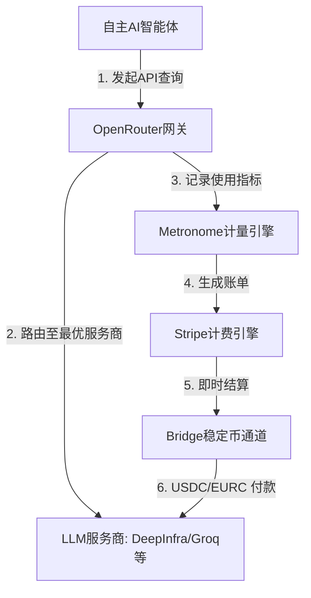

# **70亿美元的“AI收费站”：Stripe闪击OpenRouter，智能体商业版图最后的拼图**

硅谷的权力天平正在加速向新的引力中心倾斜。据彭博社和TechCrunch报道，支付巨头Stripe已敲定对中立AI模型路由分发平台OpenRouter的收购协议，估值超过70亿美元（知情人士透露最终交易金额在70亿至80亿美元之间）。

对于OpenRouter而言，这是一次令人瞠目的估值跃升。仅仅在三个月前的2026年5月，该公司才刚完成由谷歌母公司Alphabet旗下成长基金CapitalG领投的1.13亿美元B轮融资，当时估值仅为13亿美元。而对于Stripe，这笔收购则是其为“机器对机器（M2M）经济”默默铺设全栈金融与运营轨道的关键落子。

为什么一家金融科技巨头愿意为一家常被质疑为“API套壳聚合商”的公司砸下超70亿美元？这需要我们深度剖析OpenRouter路由引擎的技术底层，并复盘它与Stripe近期几笔重磅收购——用量计费平台[Metronome](https://stripe.com/newsroom/news/stripe-to-acquire-metronome)（2026年1月以约10亿美元收购）以及稳定币网络[Bridge](https://stripe.com/newsroom/news/stripe-acquires-bridge)（2025年2月以11亿美元收购）之间的强力协同效应。

#### 路由引擎的技术架构：如何做大流量的“分流器”？
在最底层，OpenRouter是一个双向网关，它将单一的API端点（`https://openrouter.ai/api/v1/chat/completions`）直接映射到OpenAI的聊天补全（Chat Completions）格式。但在这一简单表象的背后，是一个运行在边缘网络上、经过极致优化的双层流量调度器，旨在将路由引入的延迟开销降到最低：

1. **模型路由（Model Routing）**：OpenRouter实现了目标LLM与物理基础设施的解耦。当开发者调用某个模型（例如 `meta-llama/llama-3.1-405b-instruct`）时，OpenRouter基于全球分布的Cloudflare Workers架构构建的路由层（仅带来微乎其微的15–25毫秒延迟）会瞬间解析出，在其70多家上游合作伙伴（如 Together AI、DeepInfra、Fireworks 或 Groq）中，目前有谁正在托管该模型。
2. **服务商路由与负载均衡（Provider Routing & Load Balancing）**：OpenRouter采用动态路由策略，在不同服务商之间自动进行请求的负载均衡。默认情况下，它根据**价格的倒数平方**（$1/\text{price}^2$）对请求进行加权，从而将流量倾斜向最具性价比的服务商。与此同时，系统维护着一个实时健康账本（Health Ledger）。如果某个服务商返回了HTTP 429（限流）或HTTP 5xx错误，亦或是其p90延迟出现飙升，路由引擎会在一个30秒的滚动窗口内降低该服务商的优先级。

开发者可以直接在请求体中注入自定义的路由偏好，例如通过 `provider.order` 和 `allow_fallbacks` 参数进行精细化控制：
```json
{
  "model": "meta-llama/llama-3.1-405b-instruct",
  "messages": [{"role": "user", "content": "Hello World"}],
  "provider": {
    "order": ["DeepInfra", "Together"],
    "allow_fallbacks": true,
    "sort": "latency"
  }
}
```
通过在程序中自动解决服务商宕机、网络拥堵以及瞬息万变的算力现货价格（Spot Pricing），OpenRouter彻底解决了生产级AI工程中的三大核心痛点：供应商锁定（Vendor Lock-in）、API单点故障以及成本不可预测性。

#### 智能体资金栈（AI Money Stack）：Bridge、Metronome与OpenRouter的合流
为什么Stripe愿意溢价收购这个流量入口？答案在于其CEO帕特里克·科里森（Patrick Collison）勾勒的“智能体商业”（Agentic Commerce）愿景——在未来的数字世界中，自主运行的软件智能体（AI Agents）将独立执行任务、消耗算力，并在无需人类干预的情况下完成与其他机器的商业交易。

为了构建这个机器对机器（M2M）经济的底层架构，Stripe在过去18个月里密锣紧鼓地打造了一套**智能体资金栈（AI Money Stack）**：
* **清算结算通道（Bridge，2025年2月收）**：Stripe对Bridge的收购，为其提供了基于ERC-20稳定币（USDC和EURC）进行即时、低成本跨境支付的底层通道，彻底绕过了传统银行系统长达数天的结算延迟和高昂的手续费。
* **计量引擎（Metronome，2026年1月收）**：Metronome提供了一个高吞吐量、多维度的计量引擎，每秒可吞吐数百万条事件，用以对基于使用量的消耗（如输入/输出Token数量、上下文窗口大小、缓存命中等）进行精准计费。
* **交易执行层（OpenRouter，2026年8月收）**：OpenRouter则充当了交易执行的票据交换所（Clearinghouse）。

通过将这三个平台融为一体，Stripe构建了一个完美的商业闭环：当AI智能体执行某项工作流时，它通过OpenRouter调用模型；OpenRouter自动优化路由以确保延迟最低、成本最划算；Metronome实时计量具体的Token消耗；最后，Bridge通过稳定币微付款（Micropayments）进行即时清算。Stripe实际上是在为AI智能体经济建造一家中央银行和清算所。



#### 估值大辩论：坚固护城河还是高估值蜃楼？
估值在短短三个月内从5月的13亿美元狂飙至8月的70亿到80亿美元，这在Reddit的 `r/StableDiffusion` 和 `r/ArtificialInteligence` 社区引发了激烈论战。质疑者认为，OpenRouter的路由层本质上只是一种商品化服务，技术壁垒极低。
> “OpenRouter不过是一个API套壳包，”一位开发者在Hacker News上直言不讳地指出，“任何工程团队都可以在AWS上拉起像 [LiteLLM](https://github.com/BerriAI/litellm) 这样的开源网关，加上容灾备用逻辑，配置自己的API Key就行了。这在技术上早就是被解决的问题。”

然而，反方观点则认为，OpenRouter的真正价值在于其**双边市场网络效应（Two-sided Market Network Effects）**和**遥测数据（Telemetry Data）**。OpenRouter由OpenSea前联合创始人兼CTO亚历克斯·阿塔拉（Alex Atallah）与路易斯·维希（Louis Vichy）于2023年初创立，历经三年积累了庞大的开发者心智。对于初创公司而言，与70多家不同的模型服务商逐一维护账单和API Key是一场运营灾难，而OpenRouter将其简化为统一的账单关系。更重要的是，OpenRouter坐拥行业内最真实、中立的模型运行遥测数据——实时记录着全行业各大模型的实际性能、报错率和真实的性价比表现。

#### 合规 vs. 中立：开发者对NSFW“净化”的焦虑
除了商业逻辑的博弈，开发者社群中还蔓延着深切的焦虑。Stripe作为一家受严格监管的金融实体，必须执行极高标准的合规政策。Stripe的[限制业务政策](https://stripe.com/legal/restricted-businesses)严厉禁止与“成人内容及服务”以及高风险内容相关的资金往来。

相比之下，OpenRouter一直将“技术中立”奉为圭臬。该平台支持路由到未经过滤的开源权重模型，并已成为众多NSFW（非工作安全）应用、创意写作项目以及互动角色扮演平台（通常通过SillyTavern等前端接入）的底层基础设施。
> “一旦Stripe的法务团队开始清查通过OpenRouter流转的内容，审查就将无可避免地降临，”Reddit上 `r/SillyTavernAI` 板块的一位开发者警告称，“Stripe承担不起为NSFW模型提供底层通道所带来的声誉或监管风险。那些未过滤的开源权重模型迟早会被限制或清洗。”

如果Stripe为了迎合自身的支付合规条款而对OpenRouter的模型目录进行大肆净化，它极有可能摧毁该平台赖以成功的开发者信任根基。

#### 去中心化替代方案的崛起与Stripe的下一步
对金融科技巨头实施“守门人”式审查的担忧，已经在加速开发者对替代方案的关注。越来越多的开发者转向自托管的LiteLLM以保持对API Key的绝对控制，或者投向去中心化、抗审查的推理网络，如Venice.ai、Akash Network以及Petals（一个点对点网络，通过将模型层分拆到消费级GPU上来协同运行Llama 405B等超大型开源模型）。

为了安抚开源社区，Stripe需要明确保证OpenRouter将保持独立且中立的底层工具属性。如果科里森兄弟（Collison Brothers）能够在将OpenRouter接入Metronome和Bridge计费与支付轨道的同时，坚定地捍卫其中立性政策，Stripe将毫无悬念地锁定AI时代无可争议的金融脊梁地位。

***
