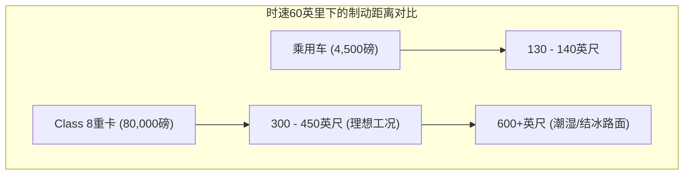
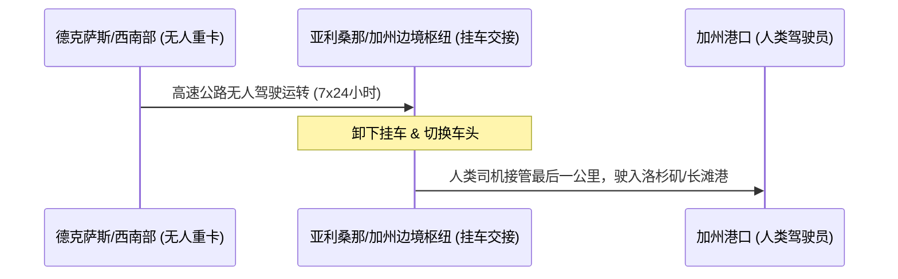

# 8万磅的“边缘案例”：加州重卡自动驾驶破冰，与卡车工会决战阿勒米达法庭

2026年4月28日，加州车辆管理局（DMV）正式通过了一项打破十年监管禁令的决议：取消了该州对测试整车额定总重（GVWR）在10,001磅（约4.5吨）及以上自动驾驶车辆的禁令。到了2026年8月，这一纸监管框架终于落地，DMV首次向 **Aurora Innovation** 和 **Kodiak AI** 发放了重型无人驾驶卡车的测试许可证。

Kodiak随即在其山景城总部附近的测试路线上部署了数辆测试卡车。在第一阶段规则的严格约束下，这些车辆必须配备人类安全员，禁止在限速25英里/小时（约40公里/小时）及以下的街道上行驶（除非是从仓库直接驶向高速公路的路径），且必须配合加州公路巡警（CHP）的称重站检查。

然而，当这些重载达8万磅（约36吨）的“钢铁巨兽”开始并入硅谷的高速公路网时，它们也迎头撞上了一堵法律与政治构筑的坚墙。2026年8月5日，加州卡车司机工会（Teamsters California）向阿勒米达县高等法院提起诉讼，诉求简单而决绝：彻底推翻DMV的新规。

本文将深度拆解这场地标性对决背后的技术瓶颈、安全实证以及宏观经济博弈。

---

### 第一部分：高速自动驾驶的物理学法则

要理解这场技术争论的核心，必须先回到最基础的牛顿力学。一辆标准的乘用Robotaxi（例如Cruise或Waymo的捷豹I-Pace）重约4500磅（约2吨）。在时速65英里（约105公里）时，其动能（$E_k = \frac{1}{2} mv^2$）约为5.6 × 10⁵焦耳。而一辆满载的Class 8重型半挂卡车，总重可达8万磅（约36.3吨）。在同样的时速下，其动能超过1.12 × 10⁷焦耳——几乎是乘用车的**20倍**。

这种量级上的质量差异，彻底重构了刹车距离的物理限制：
*   **乘用车：** 在干燥柏油路面上，从时速60英里紧急制动，刹车距离约为130-140英尺（约40-43米）。
*   **Class 8重卡：** 在理想工况下，这一距离也需要300-450英尺（约91-137米）。一旦遭遇潮湿、结冰或强侧风等恶劣天气，刹车距离会轻松翻倍。

由于Class 8重卡刹车需要滑行近一个半足球场的距离，其感知系统（Perception Horizon）的视界必须远远超越城市Robotaxi常见的100-150米。系统必须在**300至450米**开外，极其稳定地检测、分类并预测路面碎屑、抛锚车辆以及施工区域的动态与轨迹。

#### Aurora的解法：调频连续波（FMCW）激光雷达
为了突破300米的感知瓶颈，Aurora Innovation押注于其自研的 **FirstLight LiDAR**——这是一种工作在1550纳米波段的FMCW（调频连续波）激光雷达。与测量离散光脉冲往返时间的传统ToF（飞行时间）激光雷达不同，FMCW发射的是连续且经过频率调制的激光束。通过测量反射光波的频率变化（即多普勒效应），Aurora的系统能在单点数据上同步计算出目标物的**距离**和**瞬时速度**。

在X（原推特）上，硬件工程师们频繁指出，FMCW雷达天生免疫太阳光干扰和传感器之间的串扰，而这恰恰是ToF系统在强光高速公路场景下的两大硬伤。这种瞬时速度矢量化的测量能力，免去了通过多帧图像计算速度的延迟，在应对突发切车（Cut-in）时能为系统决策省下宝贵的毫秒。

#### Kodiak的解法：模块化冗余与执行控制系统
Kodiak AI则从硬件模块化与系统级冗余切入。Kodiak没有选择定制整车底盘，而是将传感器套件集成在 **SensorPods**（传感器舱）内。这些安装在卡车后视镜位置的模块集成了激光雷达、毫米波雷达和摄像头，在野外环境下，技术人员可以在10分钟内完成单个舱体的快速更换，无需复杂的重新标定。

在控制层面，Kodiak开发了 **Kodiak执行控制系统（Actuation Control System, ACS）**。这是一个定制的、对安全等级要求极高的主控电脑，扮演着冗余备份的角色。一旦主计算单元发生软件卡死或硬件故障，ACS将瞬时接管车辆，控制转向、制动和油门，引导卡车安全、平稳地靠边停在高速路肩上。

---

### 第二部分：劳资对决，工作岗位 vs. 资本效率

工会在阿勒米达县提起的诉讼，绝不仅仅是一次简单的安全申诉，更是对加州DMV行政审批流程的一次系统性挑战。

#### 被指控的“行政捷径”
根据加州的《行政程序法案》（APA），任何预估经济影响达到或超过5000万美元的“重大法规”（Major Regulation），必须经过严格的“标准化监管影响评估”（SRIA）。工会指控DMV规避了这一硬性要求，转而使用了一种本用于微调行政政策的“简易通道”程序。工会声称，授权无司机监管的重卡上路将直接冲击加州20多万名商业卡车司机的饭碗，这背后所代表的产业与财务版图震荡，其经济影响早已远远突破了5000万美元的评估门槛。

卡车工会（Teamsters）全国总会长肖恩·奥布莱恩（Sean M. O'Brien）对此态度强硬：
> “允许不受约束、无监管的自动驾驶卡车上路，以机器人彻底取代人类司机，是对我们道路安全的公然挑衅，更是对卡车行业优质工作岗位的毁灭性打击。”

#### 行业的反向账本
然而，从物流运营的角度看，Aurora和Kodiak交出的商业账本同样具有诱惑力：
*   **燃油经济性与碳减排：** 两家公司的数据均表现出极佳的环保增益。Aurora的数据表明，自动驾驶算法通过优化油门响应并维持在最经济的时速（如65英里/小时），能将燃油效率提升高达 **32%**。Kodiak的数据则显示其能减少达 **25%** 的燃油消耗及碳排放。
*   **资产利用率的跃升：** 受联邦服务时间（HOS）限制，人类卡车司机每天的驾驶上限为11小时。而理论上，一台自动驾驶重型卡车可以 **7×24小时** 无休运转，仅需在加油、维保和例行安检时停靠。这使得整卡资产利用率飙升至三倍，物流在途时间大幅缩短（例如，从达拉斯至洛杉矶的运输时间由原先的2.5天缩短至24小时以内）。

---

### 第三部分：高速Level 4自动驾驶的“准入期”之争

X.com和Reddit（尤其是像 `r/SelfDrivingCars` 和 `r/AuroraInnovation` 这样的社区）上的激烈交锋，映射出公众对自动驾驶技术的普遍焦虑。这股焦虑很大程度上被近期城市乘用Robotaxi行业的风波所放大。

科技评论家们经常提及Cruise在2023年10月于旧金山发生的行人拖拽惨剧。该事件直接导致加州DMV暂停了其全无人路测许可，并引发了面临50万美元罚款的联邦刑事调查、被NHTSA处以150万美元民事罚款，甚至直接导致了其联合创始人Kyle Vogt黯然离职。批评者们还指出了2026年1月美国NTSB和NHTSA对Waymo展开调查的事件，原因是在学校区域发生碰撞及违规超越校车。

Reddit上怀疑论者的核心逻辑非常朴素：*如果一辆重约4500磅的轿车连城市街道都跑不明白，动辄拖拽行人、堵塞应急通道，我们又怎敢将一辆重达8万磅的半挂重卡，放手交给AI在时速超百公里的高速公路上纵横驰骋？*

正如工会主席肖恩·奥布莱恩所言：
> “如果全球规模最大的无人驾驶汽车巨头连小型乘用车都无法安全落地，那么毫无疑问，在没有任何经过专业培训的人类司机在车内的情况下，自动驾驶半挂重卡绝不应该驶入公共路网。”

而在X平台上，科技精英们的观点发生了分化。不少知名创始人和风投家（VC）认为，高速公路场景实际上比城市路况更为简单，因为这里没有行人、自行车以及复杂的交叉路口。然而，Box首席执行官Aaron Levie在2026年6月的一条推文中强调了验证复杂具身智能系统的重重困难，他指出：
> “几乎所有AI模型和智能体（Agent）的演进，其实都是评估框架（evals）的下游产物。”

对跑在高速公路上的Level 4级无人重卡进行评测与验证极其困难。因为高速公路上的“边缘案例”（如轮胎爆胎、强侧风、前车货物掉落）发生概率极低，却往往伴随着高初速。与城市Robotaxi在遇到异常时可以“安全失效”（fail-safe）——直接靠边甚至在马路中间双闪刹停不同，一辆几十吨重的巨型重卡如果在繁忙的州际公路车道上突然停摆，将瞬间引发灾难性的连环大追尾。

自动驾驶技术的铁粉埃隆·马斯克（Elon Musk）在2026年4月的帖子中为AI驾驶的安全度辩护，他写道：
> “特斯拉自动驾驶挽救了大量生命——统计数据是不容置疑的。”

但卡车工会和独立安全研究人员反驳称，宏观的安全数据往往掩盖了极端工况的不可预测性，将小规模测试车队的运行数据直接与庞大的人类驾驶大盘进行横向对比，本身就是一种“关公战秦琼”的伪命题。

---

### 第四部分：宏观经济博弈与监管碎片化的隐忧

如果工会的诉讼最终成功推翻了加州DMV的新规，这可能会加速一个正在重塑美国物流版图的现象：监管碎片化（Regulatory Fragmentation）。

当加州陷入行政和法律拉锯战的同时，德克萨斯、亚利桑那和佛罗里达等州早已张开双臂拥抱自动驾驶重卡，出台立法允许无安全员测试及商业化部署。例如，Aurora目前正集中测试其在德克萨斯州（特别是达拉斯至休斯顿路段）的首批商业化路线。

一旦加州因法律阻碍继续对无人重卡亮起红灯，全美物流市场大概率将分裂为割裂的“两套制式”。货运商们可能不得不采取“枢纽到枢纽”（hub-to-hub）的折中模式：自动驾驶卡车在中南部和西南部的高速公路上畅行无阻，但必须在加州边境（例如亚利桑那州的埃伦伯格或内华达州的拉斯维加斯）卸下挂车。在这些边境枢纽，挂车交接给人类司机，完成进入洛杉矶港、长滩港和奥克兰港等加州核心港口的“最后一公里”。

虽然这一妥协方案保住了加州工会司机的饭碗，但它引入了高昂的系统摩擦力。边境转运站的建设、车头更换、以及繁琐的交接与运营开支将推高整体物流成本，甚至可能迫使货主将运力分流至墨西哥湾沿岸等对自动驾驶更为友好的港口，从而分流原本属于加州港口的货源。

Kodiak创始人兼首席执行官唐·伯内特（Don Burnette）在拿到首批许可时对加州的破冰举措给予了高度评价：
> “加州全面详尽的自动驾驶车辆法规，是货运技术创新的一次重大释放。这一许可能让我们开启将自动驾驶货运网络向全国推进的第一阶段，同时也确保了加州监管机构能够提供适当的安全监督。我们感谢纽森州长的领导力，这让像Kodiak这样土生土长的加州‘物理AI’（Physical AI）创新者，得以将我们的技术真正带回故乡的高速公路上……”

加州DMV向Aurora和Kodiak发放的这一纸许可证，虽然是行业的一座里程碑，但前路布满迷雾。加州的这场博弈早已超越了纯粹的工程与技术层面，它已经演变成一场关乎劳动力、资本效率与监管自主权的硬核利益决战。

---
