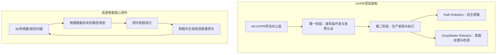

# 9亿美元的具身智能豪赌：直击造船巨头HII如何将“认知机器人”推上美军航母船坞

硅谷在过去三年里几乎将所有精力都倾注在了大语言模型（LLM）、GPU集群和云端推理上。然而，正当风险投资家们将数以十亿计的美元砸向虚拟聊天机器人时，一场无声的国家安全危机正在弗吉尼亚州和密西西比州的干船坞中悄然蔓延。美国海军造船业正面临历史性的产能瓶颈。为了维持全球威慑力，美军每年需要交付一艘航空母舰、两艘“弗吉尼亚”级（Virginia-class）攻击型核潜艇和一艘“哥伦比亚”级（Columbia-class）弹道导弹核潜艇。但现实是，由于严重的工业劳动力短缺，国防工业基础的交付进度已严重滞后。

为了打破这一僵局，全美最大的军用造船商亨廷顿·英格尔斯工业（Huntington Ingalls Industries, HII）宣布签署一项基于绩效的巨额生产协议，在未来七年内总价值高达9亿美元。根据其最新启动的“高产出生产机器人”（High-Yield Production Robotics, HYPR）项目，HII已与美国两家顶尖的具身智能（Physical AI）初创公司达成合作：**Path Robotics** 与 **GrayMatter Robotics**。

这绝非传统的国防采购合同，而是一份基于里程碑考核的生产性协议。合作分为两个阶段：首先是“海军级开发与资质认证阶段”，旨在对技术进行验证和准入筛选；随后是“生产交付与执行阶段”，这些自动化系统将正式投入生产级制造。其中，Path Robotics将负责部署自主焊接技术，而GrayMatter Robotics则专注于表面处理、涂装以及制程中的质量检测。

### “多品种、小批量”的困境：为什么汽车厂机器人无法直接搬进船厂？
如果你走进一家现代化的汽车制造厂，会看到数以百计的机械臂正在以近乎完美的重复精度执行点焊任务。那么，HII为什么不能直接从传统商用渠道购买现成的工业机器人呢？

答案藏在造船业独特的工程物理属性中：**多品种、小批量（High-Mix, Low-Volume, HMLV）制造模式。**

在汽车装配中，零部件被冲压至亚毫米级的超高公差，并固定在昂贵且刚性的夹具中。机器人只需机械地执行由静态CAD文件预先定义的轨迹。但在造船厂，加工对象是重达数吨的巨型钢板。由于热胀冷缩、人工切割误差以及运输过程中的形变，船厂中实际接缝的装配状态几乎永远无法与理论上的CAD模型精准对齐。

“在复杂的海军舰艇制造中，我们已经把传统的自动化技术压榨到了极限，”HII负责海洋系统与企业战略的执行副总裁埃里克·丘宁（Eric Chewning）解释道，“目前的船厂自动化仍被局限在高度可重复的操作上。但造船业真正需要的是一台具有‘认知’能力的机器。”

在焊接厚重的钢板时，焊接产生的高温会实时导致钢材发生热形变。如果机器人只是机械地遵循死板的CAD轨迹，焊枪就会偏离焊缝，从而导致灾难性的结构缺陷，根本无法通过海军严苛的军标认证。这也是为什么造船厂历史上一直高度依赖极少数且日渐流失的精英焊工。

### Path Robotics：“认知焊接”与 Obsidian™ 物理引擎
为了攻克这些不可预测的焊缝难题，Path Robotics彻底摒弃了人工编程。他们的核心技术——**Obsidian™（黑曜石）**，是一个在虚拟“焊接世界模型”中，通过数千万英寸真实焊接数据训练而成的物理赋能强化学习模型。

Path Robotics的焊接工作站没有采用预先编程的套路，而是贯彻了“视、懂、焊”（See, Understand, Weld）的闭环逻辑：
1. **感知（Perception）**：工作站利用高密度3D蓝光扫描仪构建接缝处高精度的三维空间图像。
2. **自主路径生成（Autonomous Path Generation）**：Obsidian引擎精确定位焊缝，并自主决定焊枪角度、行进速度、电压及送丝速度。
3. **多道自适应填充（Multi-Pass Adaptive Fill）**：厚重的海军舱壁需要几十道焊接工序才能填满一个接缝。Obsidian能够根据实时接缝间隙的变化，现场计算并调整每一道焊缝的排布。
4. **热变形补偿（Thermal Compensation）**：系统持续监测熔池状态，动态调整工艺参数以补偿热形变。

为了适应航母和潜艇双层船体内部极度狭窄的空间，固定式焊接站无能为力。为此，Path推出了**Rove™**——这是一款集成了Obsidian引擎的移动式爬行机器人，能够攀爬在金属船体上，在无结构化的复杂环境中进行自主焊接。

正如Path Robotics首席执行官安德鲁·隆斯伯里（Andrew Lonsberry）所言：“要想解决制造业的自动化，你就必须解决那些并不完美的零部件加工问题。现实中的金属充满了翘曲、缝隙和错位。只有具身智能，才能赋予机器如同金牌工匠般的判断力。”

### GrayMatter Robotics：125Hz触觉闭环与Scan&Inspect™
如果说焊接构成了造船的“骨骼”，那么表面处理就是它的“皮肤”。在军用钢材被涂上防腐涂料以抵御海水侵蚀之前，必须经过研磨、砂光和喷砂等繁重工序。这是一项极其艰苦且危险的工作，工人不仅要吸入有毒粉尘，还面临高频震动带来的职业伤害。

GrayMatter Robotics正通过其**GMR-AI™平台**推动这一工序的自动化。与Path类似，GrayMatter同样不依赖CAD编程。其**Scan&Sand™（扫描与研磨）**系统能对复杂的弯曲船体结构进行三维扫描，在数分钟内规划出打磨路径并立即投入作业。

这里的核心技术挑战在于力反馈控制。如果机器人打磨力度过大，会导致军用钢板厚度低于公差标准；力度过轻，又会导致防腐涂层无法牢固附着。GrayMatter的GMR-AI运行着一套超低延迟的闭环力觉（触觉）控制系统，响应延迟低于8毫秒（即125 Hz高频反馈环路）。通过力矩传感器与声学传感器，机器人可以实时、动态地调节刀具压力和接触角度，完美贴合因焊接热影响而发生起伏的钢板表面。

此外，他们还集成了**Scan&Inspect™（扫描与检测）**系统，在打磨过程中运行实时计算机视觉。AI能实时识别表面缺陷（如点蚀、微裂纹、焊渣残留），使机器人能够在制程中直接进行修复，而无需像过去那样等待打磨结束后再由无损检测（NDT）质检员进行排查。

### 风投博弈：重塑“民主兵工厂”
HII的这一天价协议在风险投资界激起了千层浪，也进一步佐证了由Andreessen Horowitz (a16z) 和 Lux Capital等头部机构所倡导的“美国活力”（American Dynamism）投资逻辑。

“我们正从纯软件AI时代，迈向一个由具身智能重建我们工业基础的新世界，”硅谷知名风险投资人马克·安德里森（Marc Andreessen）近日指出。a16z普通合伙人凯瑟琳·博伊尔（Katherine Boyle）长期以来一直呼吁硅谷必须将意图投向“重建实体世界”，她警告称，几十年的外包和过度向纯软件倾斜的投资，已经导致美国的国防工业基础严重萎缩。

Palantir联合创始人、8VC合伙人乔·朗斯代尔（Joe Lonsdale）在社交平台X上直言这一地缘政治现实：“我们的造船产能只有中国的九牛一毛。我们无法通过堆砌人力来加快造船速度——因为根本没有那么多工人。我们必须走向自动化。HII与Path、GrayMatter的交易是第一个重大证据，证明具身智能已经做好了挑起大梁的准备。”

然而，硬件的落地转型注定充满险阻。Lux Capital的乔什·沃尔夫（Josh Wolfe）警示了实验室演示与真实船厂环境之间的“落地鸿沟”：“在实验室里让机器人打磨一块崭新平整的汽车引擎盖轻而易举。但要让机器人走入弗吉尼亚州或帕斯卡古拉潮湿、弥漫着盐雾和焊接粉尘的船厂，在不断震动且生锈的巨型船体上完成打磨，这是一场极其残酷的工程硬仗。最终胜出的创业者，必定是那些愿意把靴子踩进船厂泥泞地板里的人。”
