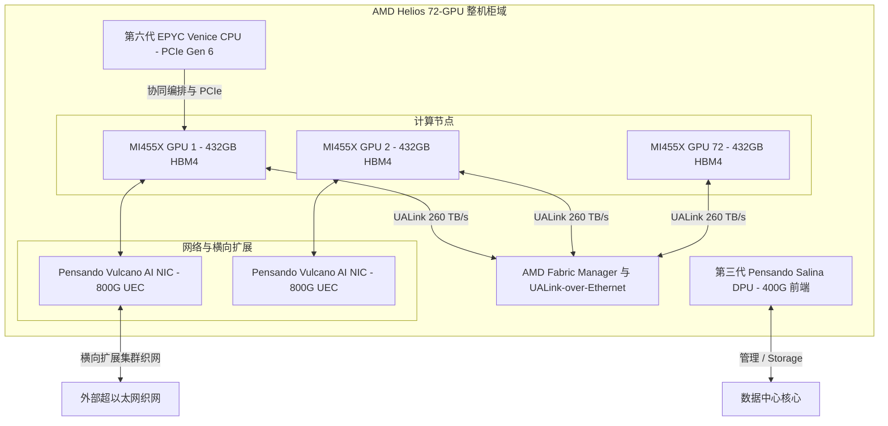

# AMD的“赫利俄斯之局”：拆解72卡开源液冷整机柜，直击英伟达闭环生态垄断

在旧金山举办的 AMD “Advancing AI 2026” 峰会上，CEO 苏姿丰博士（Dr. Lisa Su）展示了公司迄今为止在数据中心领域最激进的动作：AMD Helios（赫利俄斯）——一款全集成、液冷、符合开放计算项目（OCP）标准的整机柜平台。Helios 机柜集成了 72 颗 Instinct MI455X GPU、Venice（威尼斯）架构 EPYC 处理器以及 Pensando 网络芯片，代表了 AMD 试图将机柜级 AI 基础设施“平民化”（商品化），并打破英伟达在企业级 AI 数据中心领域暴利垄断的野心。

然而，在发布会宏大的宣发叙事背后，真正决定成败的却是一场交织着超高密度散热工程、先进芯片封装以及软件编译生态的硬核暗战。

#### 架构规格：CDNA 5、Venice 与 Pensando 技术栈
Helios 机柜采用 Open Rack Wide 平台架构，完全依照 OCP 标准协同设计。其计算密度的绝对核心是基于全新 **CDNA 5 架构** 的 **AMD Instinct MI455X GPU**。面对台积电（TSMC）先进封装的产能死穴，AMD 此次选择以多芯片（Multi-Chiplet）设计进行“极限闪避”：通过将台积电最前沿的 **2nm (N2)** 与 **3nm (N3P)** 工艺节点相混搭，硬生生塞下了高达 3200 亿个晶体管。

*   **HBM4 显存容量与带宽**：每颗 MI455X GPU 配备了高达 **432 GB 的 HBM4 显存**，分布在 12 个物理堆栈中。AMD 为单颗 GPU 提供了高达 **23.3 TB/s 的峰值显存带宽**。在机柜级别，Helios 聚合了高达 **31 TB 的 HBM4 显存**，总吞吐量达 1.6 PB/s。
*   **算力与计算效率**：在 OCP MXFP4 数据格式下，单台 Helios 机柜可提供高达 **2.9 exaFLOPS（百亿亿次）** 的峰值矩阵算力；在 **MXFP8 格式下则可提供 1.4 exaFLOPS** 的算力。单颗 MI455X GPU 的 FP4 算力额定值高达 40 PFLOPS。
*   **EPYC "Venice" 调度中枢**：负责协调这一庞大计算集群的是 AMD 第六代 EPYC “Venice（威尼斯）”服务器处理器。该 CPU 基于 Zen 6 微架构，拥有最高 256 个核心，支持 16 通道 DDR5 内存以及 PCIe Gen 6 通道，源源不断地为 GPU 输送数据。
*   **网络吞吐与安全栈**：在横向扩展（Scale-Out）集群方面，Helios 集成了 AMD Pensando **Vulcano 800G AI 网卡（NIC）**，支持超以太网联盟（UEC）传输协议，为每颗 GPU 提供 2.4 Tbps 的网络带宽。而前端管理、存储和安全工作则卸载给运行在 400G 速率下的第三代 Pensando **Salina DPU**。

#### 互联之战：UALink 刚正面 NVLink
Helios 最具决定性的差异化特征，在于 AMD 对私有协议横向扩展（Scale-Up）织网的决绝否定。英伟达的 NVL72 极度依赖其闭源的 NVLink 交换机网络，这为其带来了高昂的溢价护城河。相反，AMD 的 Helios 则是围绕开放的 **Ultra Accelerator Link (UALink)** 标准构建。

通过开放的 AMD Fabric Manager，Helios 实现了基于以太网的 UALink（**UALink-over-Ethernet, UALoE**）。该系统建立了一个统一的 72-GPU 显存共享域，机柜内部的聚合带宽达到了惊人的 **260 TB/s**。通过复用普适的以太网物理层，超大规模云厂商得以彻底摆脱英伟达高价绑定的定制光器件与私有光收发模块，这在财务账本上意味着总体拥有成本（TCO）的断崖式下跌。

#### 三代机柜对决：Helios vs. Blackwell vs. Rubin NVL72
AMD 直接将 Helios 定位为英伟达下一代 **Vera Rubin NVL72** 平台的直接竞争对手，在多项关键指标上甚至直接“跃代”超越了当前的 Blackwell NVL72。

| 指标 | 英伟达 Blackwell NVL72 | 英伟达 Rubin NVL72 (Vera) | AMD Helios (MI455X) |
| :--- | :--- | :--- | :--- |
| **GPU 显存类型** | HBM3e | HBM4 | HBM4 |
| **单 GPU 显存容量** | 192 GB | 288 GB | 432 GB |
| **显存峰值带宽** | 8.0 TB/s | 22.0 TB/s | 23.3 TB/s |
| **峰值 FP4 / MXFP4 算力** | 1.4 ExaFLOPS | 约 2.5 ExaFLOPS (估算) | 2.9 ExaFLOPS |
| **互联技术** | NVLink 5 (私有) | NVLink 6 (私有) | UALink (开放 OCP) |

通过在每颗 GPU 上配备 432 GB 的 HBM4 显存，AMD Helios 的显存容量比英伟达未来的 Rubin (Vera) NVL72（288 GB）**高出 50%**，更是 Blackwell 容量的两倍以上。对于运行千亿级参数前沿大模型的开发者而言，超大容量意味着整个模型或更长的上下文窗口能够直接常驻于高速活动显存中，从而彻底消除跨芯片读取的延迟瓶颈。

#### 黄金盟友：Anthropic、Azure 与 Cerebras 的三足鼎立
与这套强悍硬件一同落地的，是数个含金量极高的软件与云服务巨额协议：
1.  **Anthropic 的 2GW 豪赌**：作为对 AMD 最强有力的背书，大模型独角兽 Anthropic 宣布将部署高达 **2吉瓦（GW）** 由 Helios 机柜驱动的算力中心。其中第一阶段的 1GW 计划于 2027 年上半年上线。为了促成这次联姻，AMD 还向 Anthropic 注入了高达 **50 亿美元** 的战略股权投资。
2.  **微软 Azure 的规模化部署**：微软宣布将在其 Azure 云基础设施中大规模部署 Helios 平台，用以运行其智能体（Agentic）AI 工作负载的高吞吐量推理，此举显著降低了其对英伟达单一路线的依赖。
3.  **与 Cerebras 的非对称分布式推理架构**：AMD 与 Cerebras 达成合作，共同构建一种新型的分布式解耦计算系统。在该架构中，AMD Helios 机柜负责超大规模 Prompt（提示词）处理和超长上下文检索，而 Cerebras 的晶圆级引擎（WSE）则专精于超快速、极低延迟的 Token 生成。

#### 跨越软件天堑：ROCm 7 强拆 CUDA 护城河
尽管 Helios 的硬件参数无比亮眼，但英伟达真正的“降维打击”武器始终是 **CUDA** 软件生态。过去数年里，在 AMD 平台上跑模型几乎是所有开发者的噩梦，生态的割裂让他们不得不将大量精力耗费在痛苦的算子重写和代码转译上。tiny corp 创始人 George Hotz 曾在 2023 年发表著名的吐槽：“*AMD 的内核永远不适合机器学习……驱动依然极其不稳定，一旦崩溃或卡死，我们根本无法调试。*”

AMD 给出的底牌是 **ROCm 7** 以及最新发布的 **ROCm.ai** 平台。这一次，AMD 不再强求开发者去手动重写 CUDA 代码，而是将重兵部署在编译层上游——例如 **OpenAI Triton** 和 **PyTorch**。由于当今主流的 AI 工作负载大多基于 PyTorch、JAX 或 Python 级的 Triton 构建，底层硬件的指令集已经被有效抽象并剥离。ROCm 7 引入了 **AOTriton**（Ahead-of-Time Triton，提前编译器），能够针对 Attention（注意力机制）等核心算力需求，自动编译出极致优化的底层 Kernel（算子）。

更重要的是，Anthropic 的工程团队正与 AMD 展开为期数年的深度合作。Anthropic 将直接利用其 Claude 模型自动协同优化 ROCm 底层的软硬件资源。对于 AMD 而言，这相当于为自己雇佣了一个不眠不休的“AI 编译器调优天团”。

#### 业界回响：开源阵营的狂欢与华尔街的冷眼
对于这次发布，技术社群与资本市场呈现出了极其经典的“冰火两重天”：
*   **开源阵营的乐观狂欢**：在 Reddit 和 X.com 上，大批开发者弹盆相庆。开放整机柜标准意味着企业终于可以摆脱英伟达专有的交换机、专有线缆和光模块的绑定销售，不再接受强买强卖。
*   **资本市场的冷眼与审慎**：华尔街的态度则微妙得多。2026 年初，知名研究机构 *SemiAnalysis* 的分析师 Dylan Patel 曾发出警告称，受制于 HBM4 的封装良率，MI455X 可能会遭遇严重的量产推迟，甚至预测第一批商用机柜可能要拖到 2027 年第二季度才能跑通第一行代码。尽管苏姿丰博士直接回击该报告“纯属扯淡”（BS），并重申 Helios 将按计划在 2026 年下半年出货，但资本市场对任何哪怕一丝的产能难产迹象都极度敏感。如果 AMD 无法在 2026 年底前实现大规模量产交付，英伟达的先发优势将被拉得更长。
