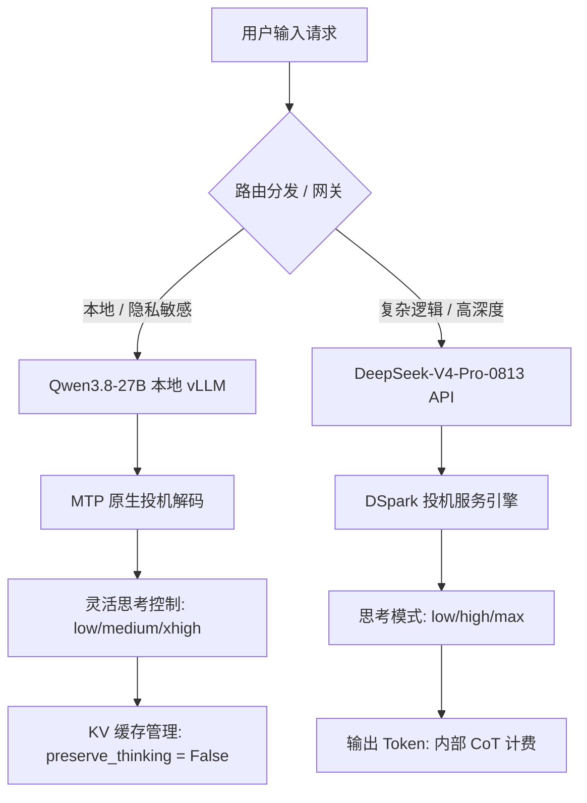

# **API 套利时代的终结：DeepSeek 拥堵定价、Qwen3.8-27B 本地投机缩放与 Agent 技术栈的硬经济学**

2026年8月16日，构建 AI Agent（智能体）的单位经济学（Unit Economics）在一夜之间发生了根本性改变。作为极致廉价前沿 API 的行业标杆，DeepSeek 正式将其 API 计费模式切换为区分高峰/低谷期的“拥堵定价模式”。几乎在同一时间，阿里巴巴开源的密集模型 Qwen3.8-27B 正式上线 Hugging Face 社区，将硬件原生的投机解码（Speculative Decoding）与可调节的思考控制（Thinking Control）直接带到了消费级本地 GPU 上。

在过去的一年里，全球开发者们享受着廉价 API 套利带来的“黄金时代”——仅需极低成本，就能串联起长上下文的推理循环。然而，随着 DeepSeek 的算力集群在全球海量需求下不堪重负，其在 8 月 6 日发布的调价警告最终演变为一场残酷的计费结构重组：缓存命中成本飙升了高达 1114%。

我们正在见证 AI 基础设施栈的一次结构性重组。现在的核心问题不再仅仅是“哪款模型更聪明”，而是“为了让你的 Agent 保持在线，你愿意在延迟、数据隐私和利润率上做出多少妥协？”

---

### 本地硬件原生野兽：深度解构 Qwen3.8-27B

阿里巴巴的 Qwen3.8-27B 绝非又一次常规的开源模型迭代。它是一款拥有 270 亿参数的密集型视觉-语言大模型（VLM），专为本地长上下文的 Agent 任务量身定制。

#### 架构与本地扩展
与传统的 Transformer 架构不同，Qwen3.8-27B 采用了 64 层的混合架构，将 Gated DeltaNet 线性注意力块与周期性的门控注意力（Gated Attention）层交错编织。这种混合设计使得该模型在压缩长上下文状态时的效率远超标准的线性注意力模型，能够维持 **262k token** 的原生上下文窗口，并且可以通过 YaRN 缩放技术扩展至 100 万 token。

更关键的是，Qwen 团队直接在基座模型权重中集成了一个原生的**多 Token 预测（MTP）草稿头（Draft Head）**。在此之前，本地开发者运行投机解码时，必须在后台并行运行两个独立的模型（一个小型的草稿模型和一个大型的目标模型），这在消费级硬件上造成了严重的显存带宽瓶颈。而得益于 Qwen3.8-27B 内置的 MTP 头，诸如 vLLM 和 TokenSpeed 等本地推理引擎可以开箱即用地执行原生投机解码，在 NVIDIA RTX 4090/5090 以及 Apple Silicon MacBooks (M3/M4 Max) 等消费级 GPU 上带来 **1.8 倍至 2.5 倍的吞吐量提升**。

#### 灵活的思考控制
深度的思维链（CoT）推理是一把双刃剑。针对这一点，Qwen3.8-27B 引入了单次请求级别的推理控制。当开发者通过本地 API 调用该模型时（如在 [`call_qwen_local`](file:///Users/vzl/.gemini/antigravity-cli/brain/220a2d53-d472-4ba8-9a0b-8a7aeecd39e5/scratch/client_setup.py#L24) 中所实现的），可以在推理负载中配置特定参数：
*   **`reasoning_effort`**：设置为 `xhigh`（默认值）以获得最大的分析深度，或者设置为 `medium` 和 `low` 来截断内部搜索树，从而牺牲推理深度以换取极速输出。
*   **`preserve_thinking`**：一个布尔标记，用于指示推理引擎在历史对话轮次中保留还是丢弃思考块。在长上下文的 Agent 运行中，丢弃这些思考块对于控制本地 KV 缓存（KV Cache）的占用至关重要。

在 Reddit 的 r/LocalLLaMA 板块上，早期的开发者反馈非常积极，尽管也有人指出默认的 `xhigh` 模式可能会触发严重的“过度思考”死循环。正如一位工程师所评价的：
> *“如果你让 Qwen3.8-27B 在 `xhigh` 模式下写一段简单的正则表达式，它会消耗掉 2000 个隐藏的推理 token 去争论正则表达式的哲学，然后才慢吞吞地输出代码。对于简单的路由分发任务，把 effort 设置为 `low` 或 `medium` 是必须的。”*

---

### 稀疏巨人：DeepSeek-V4-Pro-0813

在天平的另一端，是 DeepSeek-V4-Pro-0813，这是 DeepSeek 旗舰级混合专家（MoE）系列的官方生产级版本。该模型总参数量高达惊人的 **1.6 万亿**（每个 token 激活的参数量为 **490 亿**），代表了云端 API 驱动的 Agent 推理的最前沿。

#### MoE 效率与投机服务
DeepSeek-V4-Pro-0813 的效率主要得益于以下三项技术：
1.  **混合注意力机制（Hybrid Attention）**：将压缩稀疏注意力（CSA）与重度压缩注意力（HCA）交替使用，大幅降低长上下文运行时的 KV 缓存占用。
2.  **流形约束超连接（Manifold-Constrained Hyper-Connections, mHC）**：优化层与层之间的梯度流，并使用自研的 **Muon 优化器**，使得 1.6 万亿参数的超大规模训练得以稳定进行。
3.  **DSpark 投机解码**：与 Qwen 硬件级别的 MTP 头不同，DeepSeek 采用了 **DSpark** —— 一种开源的、在服务运行期工作的投机解码模块。DSpark 作为部署在推理集群之上的轻量级调度器，会预先推测出 Token 序列，再由 1.6T 的大模型进行并行验证。这种服务级的优化在生产环境中将延迟缩减了 60% 至 85%。

#### 思考模式下的 API 计费真相
DeepSeek-V4-Pro-0813 提供了三种不同的 API 推理模式：`low`、`high`（默认值）和 `max`（亦可通过设置 `"thinking": {"type": "disabled"}` 或传入 `reasoning_effort: "none"` 来彻底禁用思考过程，如 [`call_deepseek_v4_pro`](file:///Users/vzl/.gemini/antigravity-cli/brain/220a2d53-d472-4ba8-9a0b-8a7aeecd39e5/scratch/client_setup.py#L3) 所示）。

然而，这种思考模式隐藏着一个高昂的经济学陷阱：**模型思维链（CoT）中生成的每一个内部推理 token，都会按照完整的输出 token 费率进行计费。** 尽管这些推理 token 在最终返回的 API 响应体中会被剥离（即你的应用不会向最终用户展示这些思考过程），但它们依然会一字不漏地出现在你的账单上。

如果在面对复杂的编程任务时，你将模型配置为 `max` 努力度，DeepSeek-V4-Pro 可能会为了生成一个 500 token 的代码块，在内部疯狂燃烧 8000 个推理 token。在过去单一低费率的时代，这或许无伤大雅；但在新的拥堵计费模式下，账单金额累积的速度会非常惊人。

---

### 账单冲击：8月16日拥堵定价风暴

几个月来，DeepSeek 极其低廉的 API 定价（Flash 版输入 $0.14/百万 token，输出 $0.28/百万 token；Pro 版输入 $0.55/百万 token，输出 $0.87/百万 token）一直被业内视为抢占市场份额的不计成本之举。直到 2026 年 8 月 6 日，随着 DeepSeek 正在筹备新一轮巨额融资的传闻四起，官方终于发布了调价预警。十天后的 8 月 16 日，靴子落地。

DeepSeek 引入了**高峰/低谷差异化计费模型**，根据全球 API 的负载情况，将每天划分为不同的拥堵时段：
*   **高峰时段（每日）**：UTC 时间 01:00–04:00 以及 06:00–10:00。
*   **价格冲击**：高峰期费率直接在低谷期基础上翻倍，涨幅极其惊人：
    *   **V4-Flash 输出费率**：暴涨至 **$0.66/百万 token（低谷）** 和 **$1.32/百万 token（高峰）**（此前仅为 $0.28/百万）。
    *   **V4-Pro 输出费率**：暴涨至 **$1.98/百万 token（低谷）** 和 **$3.96/百万 token（高峰）**（此前仅为 $0.87/百万）。
    *   **缓存命中（前缀缓存 Prefix Caching）**：绝对涨幅更为夸张。在部分开发者档位中，缓存命中定价的**涨幅甚至超过了 1100%**。这对于需要在连续运行中维持庞大 Prompt 模板的 Agent 开发者而言，堪称重创。

Abacus AI 首席执行官 Bindu Reddy 在 X 上评论道：
> *“DeepSeek 新推出的高峰/低谷定价，是‘大模型成本必将归零’这一假说破灭的第一个真实裂痕。在大规模场景下运行 MoE 的成本极为高昂。算力瓶颈是真切存在的，除非开发者转向混合架构，否则他们的利润空间将被榨干。”*

---

### 开发者大辩论：本地 Agent 循环 vs. 云端高强度推理 API

DeepSeek 的价格暴涨与 Qwen 本地推理能力的跃升交织在一起，在 X 和 Reddit 上点燃了激烈的技术路线之争。开发者生态正迅速分化为两大阵营：**本地优先的资本支出（CapEx）派**与**云端优先的运营支出（OpEx）派**。

#### 拥护本地 Agent 工作流的理由
对于开发自主编码 Agent 或本地文件编辑器的工程师来说，云端延迟和 token 成本是难以逾越的结构性障碍。一个运行工具链循环的 Agent（例如执行终端命令、静态检查和代码编辑）为了完成单项任务，可能需要连续调用 50 到 100 次大模型。

1.  **零网络延迟**：切换至运行在 MacBook Pro M4 Max（128GB 统一内存）上的本地 Qwen3.8-27B，彻底消除了每次往返云端所产生的“延迟税”（通常为 500 毫秒至 2 秒）。
2.  **零边际成本（CapEx）**：本地运行意味着完全没有 token 费用。一旦硬件采购完成，运行一个包含 1000 轮交互的 Agent 循环的边际成本为零。
3.  **绝对的数据主权**：医疗、法律和金融领域的企业级开发者，绝不可能将包含私有代码库或敏感客户数据的流数据发送到外部 API。Qwen3.8-27B 提供了完全物理隔离、合规的本地推理引擎。

正如一位资深工程师在 Hacker News 上的发帖：
> *“我把我们的数据库迁移 Agent 从 DeepSeek-V4 API 迁移到了本地 Qwen3.8-27B 架构上，在 SGLang 上运行 MTP-GGUF。这不仅让我们避开了繁琐的数据隐私合规审查，而且由于没有了 API 的网络开销，Agent 循环的执行速度提升了 3 倍。在超高频的工具调用场景下，本地化路线完胜。”*

#### 坚守云端推理 API 的理由
相反，云端优先的开发者坚称，本地模型在处理极高复杂度的工程设计时，仍然缺乏足够的语义深度。

一个 27B 的密集模型，即使拉满 `xhigh` 推理努力度，其结构化规划能力也无法与将推理努力度设为 `max` 的 1.6T MoE 模型（如 DeepSeek-V4-Pro-0813）相提并论。在面对多文件重构、解决复杂的类型错误或进行软件架构设计等重度逻辑任务时，开发者宁愿支付高峰期的高额溢价。

---

### 瓦解闭源巨头的垄断地位

本地密集模型和开源 MoE 的强势崛起，是否足以打破 OpenAI 和 Anthropic 等闭源巨头对开发者的锁定？

在过去，闭源大模型厂商主要依靠自定义 API、工具生态系统（如 Assistants API）以及绝对的性能优势来锁定开发者。然而，当前的开源生态在工具兼容性上已经实现了平替。正如 [`client_setup.py`](file:///Users/vzl/.gemini/antigravity-cli/brain/220a2d53-d472-4ba8-9a0b-8a7aeecd39e5/scratch/client_setup.py) 中所示，开发者仅需修改一行代码，就可以将原本指向 OpenAI 的端点无缝替换为运行着 Qwen3.8-27B 的本地 vLLM 端点。

Hugging Face 首席执行官 Clement Delangue 总结了这一权力格局的转移：
> *“本地硬件优化的演进速度正在超越集中式 API 的经济可行性。开发者需要对模型权重、缓存以及预算拥有绝对的控制权。未来属于本地化、开源化和高度专业化的模型。”*

此外，英伟达（NVIDIA）也在积极绕过闭源云厂商的封锁。通过提供针对 Blackwell 硬件极致优化、且可免费接入的 **NVIDIA NIM API** 来分发 DeepSeek-V4-Pro-0813，英伟达正将自己重塑为终极的硬件与软件分发层，直接将模型层“商品化”（Commoditize）。

#### 长期经济学展望
这场技术转型对商业模式和基础设施布局有着深远的影响：
1.  **混合编排（Hybrid Orchestration）的兴起**：开发者将越来越多地部署分层路由模型。由成本极低的本地模型（如开启 `low` 推理级别的 Qwen3.8-27B）处理常规路由、基础语法检查和简单的工具调用；而一旦 Agent 遇到复杂的逻辑瓶颈，则将该子问题路由至 DeepSeek-V4-Pro（`max` 模式）或 Claude。
2.  **主权基础设施取代 API 依赖**：8 月 16 日的价格剧震证明，开发者无法在依靠风险投资补贴的 API 定价上建立起稳固的商业利润。未来的主导权属于那些拥有自己基础设施的开发者——无论是通过本地硬件，还是在独立云实例上运行开源权重模型。

归根结底，Qwen3.8-27B 与 DeepSeek-V4-Pro-0813 的发布，标志着 AI 应用层真正走向了成熟。廉价、包月式 API 套利的蜜月期已经结束，一个高度复杂的、本地优先的混合架构时代已正式拉开帷幕。

---
