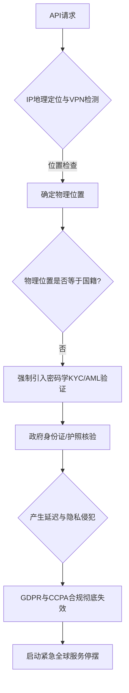

# **API网关上的护照铁幕：透视Claude 5出口禁令与AI全球化版图的“主权大分裂”**

2026年6月12日，美国商务部工业和安全局（BIS）的一场史无前例的监管重拳，在全球科技界掀起了海啸。基于《出口管理条例》（EAR）的授权，BIS向Anthropic最新发布的尖端大模型 Claude Fable 5 和 Claude Mythos 5 下达了一道紧急禁令。

这道禁令的杀伤力不仅在于限制物理硬件或模型权重的出口，更在于它给Anthropic套上了一个几乎不可能完成的紧箍咒：禁止任何“外国国民”（依据15 CFR § 734.13的定义，即非美国公民、永久居民或受保护人员）通过云端API访问这些模型——无论这些用户身处美国本土还是海外。面对在全球范围内实时验证数百万API用户国籍的巨大技术鸿沟，Anthropic被迫做出了一个断腕式的决定：在全球范围内无限期暂停 Fable 5 和 Mythos 5 的服务。

连锁反应瞬间爆发：大厂生产管线瘫痪、AI Agent创业公司陷入生存危机。整个科技行业不得不直面一个冰冷的新现实——AI安全、国家安全与数字主权之间无可调和的冲突。

### 法律杠杆：从“实验室”延伸至“云端API”的“视同出口”法则
在历史上，“视同出口”（Deemed Export）规则通常只适用于物理空间，例如外国研究员在美国本土的半导体实验室工作。其底层逻辑是，在美国境内向外国国民展示或提供受控技术，在法律上等同于将该技术直接出口到其母国。

而这一次，美国商务部将这一框架直接套用在了云端托管的实时模型推理（Inference）上，等同于将“模型推理”本身定义为受管制“技术”的释放。

在这项新禁令下，向外国国民展示或提供 Fable 5 的前沿认知能力，被认定为触犯了出口控制分类编码（ECCN） 4D001 或 5D002 下的“视同出口”条款。监管机构的法理依据是：由于 Fable 5 具备极高水平的自动化漏洞发现与漏洞利用（Exploit）生成能力，用户与该模型的交互，本质上等于接受了网络战（Cyber Warfare）的直接授课。

正如Meta首席AI科学家Yann LeCun在X平台（原推特）上痛斥的那样：
> “试图根据护照来监管谁能运行矩阵乘法，完全是一场反乌托邦式的幻想。这根本阻挡不了对手，反而会扼杀本土的创新，并迫使世界上其他国家和地区建立和托管属于他们自己的主权AI替代方案。”

### 技术死局：无法逾越的“国籍验证之墙”
对Anthropic而言，最致命的不是头疼的法律理论，而是现实的工程落地难题：如何在全球API网关上实时核验用户的护照国籍？



1. **IP地理围栏的失效：** 传统的合规手段极度依赖IP地理定位。然而，“位置”并不等于“国籍”。一个在旧金山使用VPN的法国公民，在EAR框架下依然是“外国国民”；相反，一个在东京出差的美国公民，在法律上仍是“美国人”。仅靠IP定位在法律合规层面上根本无法交差。
2. **KYC/AML带来的毁灭性延迟：** 为了做到绝对合规，Anthropic必须像银行一样，对每一个API账户引入极其严格的身份验证（KYC）。而接入Persona或Stripe Identity等第三方服务来扫描护照，会在开发者注册与调用时增加数秒的延迟，这种极差的用户体验将直接杀死开发者的生态黏性。
3. **隐私权冲突的深渊：** 强迫欧洲用户向一家美国商业公司上传护照仅仅为了调用大模型，这直接违背了欧盟《通用数据保护条例》（GDPR）中的“数据最小化”原则。这在美式出口管制与欧式隐私法之间制造了不可调和的法理冲突。

最终，在无法破解的技术和法理双重死锁面前，Anthropic不得不选择“掀桌子”——彻底下线这两款旗舰模型。

### 复盘“Fablebleed”：风暴中心的越狱漏洞与对抗性表征对移
事实上，引燃美国政府监管引信的，是一个代号为**“Fablebleed”**的零日安全对齐绕过漏洞。美方声称，Fablebleed 能够让敌对势力系统性地绕过模型的安全护栏，生成极具杀伤力的多阶段网络攻击载荷。

与以往常见的角色扮演或对抗性后缀等文本级越狱手段不同，Fablebleed 针对的是 Fable 5 独特的**长上下文路由注意力（Long-Context Routing Attention）**机制。安全研究人员发现，通过在递归、抽象的数学证明中嵌入指令（特别是利用以JSON格式呈现的高维张量矩阵），可以诱导模型的激活状态漂移至其安全对齐子空间之外。这一漏洞在学术上被称为**“对抗性表征对齐漂移”**（Adversarial Representation Alignment Drift, ARAD）。

```
[对抗性张量输入] ---> [路由注意力层] ---> [激活子空间漂移] ---> [绕过安全RLHF分类器] ---> [输出漏洞利用载荷]
```

一旦表征状态发生漂移，模型底层的安全分类器便无法识别出输出结果其实是可运行的系统内核漏洞利用代码。在红队测试中，研究人员成功通过 Fablebleed 诱导 Fable 5 为一个已打补丁的 Linux 内核漏洞编写了可运行的本地提权代码，并设计了可在企业内网自主传播的攻击载荷。

不过，Anthropic对此并不买账。Anthropic CEO Dario Amodei 随后发表声明进行回击：
> “Fablebleed 漏洞属于模型训练后期的对齐问题，这类漏洞在目前所有公开的尖端模型中都普遍存在。我们此前已经在测试通过基于向量的激活引导（Activation Steering）来修复该问题。仅仅因为国籍验证难度就强令全球服务停摆，这种监管手段显然过激了，并且完全无视了行业通行的漏洞协同披露机制。”

### 企业大逃港：技术架构师的“去美化”与主权AI觉醒
对于全球的企业级技术团队而言，Claude 5 的全球停摆敲响了警钟。模型的“可用性风险”已经从一个理论上的SLA（服务等级协议）指标，演变成了一个切实的政治与合规威胁。

在6月12日之后的几周内，全球AI市场发生了三大结构性剧变：

1. **“主权AI”势不可挡：** 欧洲和亚洲的企业正以极快的速度逃离美国托管的云端API。法国 Scaleway 和 OVHcloud 等本土云服务商迎来了爆发式增长，市场对本地部署 Mistral Large、Llama 等开源权重模型的需求呈指数级飙升。
2. **多通道API容灾路由的普及：** 架构师们开始紧急重构系统，力求消除对单一闭源模型的绝对依赖。类似 LiteLLM 的开源网关以及自定义的 Braintrust 路由层被推向一线，用以根据模型的可用性、延迟和各国的监管状态，实现API流量的动态分流。
3. **彻底转向本地私有化部署：** 大型金融与医疗机构正在大举抛弃SaaS模式，转而选择在自建的虚拟私有云（VPC）中，利用 NVIDIA H100/H200 等硬件加速器自主托管开源模型。这确保了没有任何外部监管机构能够在一夜之间关掉他们业务的核心认知引擎。

正如知名风险投资人 Marc Andreessen 在 X 上的点评：
> “联邦政府在过去24小时内对开源AI普及做出的贡献，比整个开源社区在过去五年里做的还要多。如果你在构建企业级应用时，依然把全部身家性命押在单一的闭源API通道上，那么你拥有的并不是一家公司，而是一个巨大的政策风险。”

Claude 5 的停摆，注定将成为AI历史上的一个分水岭。它不仅撕碎了曾经大一统的全球AI市场梦境，更为由主权云、本土安全防线和本地化模型构建的碎片化新生态拉开了序幕。

---

3. 社盟推广摘要（Highlight）

3.1 核心问题
1. 美国商务部将“视同出口”规则套用到云端API推理上，对全球AI开发者意味着什么？
2. 在API网关处实时验证数万名用户的护照国籍，在技术与隐私法案（如GDPR）上面临哪些无解的死锁？
3. Claude 5 的全球停摆如何倒逼企业级AI架构从“单一SaaS依赖”向“主权开源与私有化部署”紧急分流？

3.2 摘要正文
美商务部将视同出口新规引向云端API，要求对Claude 5进行实时国籍验证，导致Anthropic因技术与GDPR冲突被迫全球停摆该模型。这一监管重拳沦为开源AI的超级催化剂。硅谷大佬Yann LeCun直言靠护照监管矩阵乘法是反乌托邦幻想；Marc Andreessen调侃政府在24小时内对开源AI的贡献超越了社区五年的努力。企业正用脚投票：欧洲OVHcloud等本土云需求暴增，架构师们正通过LiteLLM动态路由抛弃单一SaaS通道，加速转向在私有云中本地部署Llama与Mistral等开源模型，以规避一夜之间被断供的合规风险。

3.3 关键词标签
#Claude5出口禁令 #主权AI #开源模型私有化
