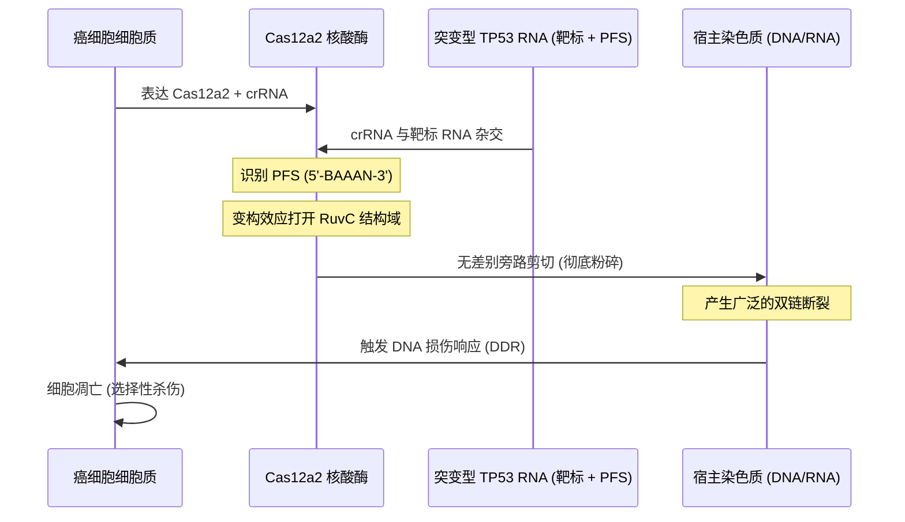

# **CRISPR的“核选项”：Cas-CLEAR与杜德纳Nature新突破，如何将突变RNA转化为粉碎染色质的细胞自杀开关**

硅谷长期以来一直将基因编辑视为一种“查找与替换”的软件问题：在基因组中找到一个“错别字”，设计一个Cas9引导序列，制造一个双链断裂（DSB），然后让宿主细胞的同源重定向修复（HDR）或非同源末端连接（NHEJ）来重写代码。然而，在肿瘤学领域，这种“精准编辑”模型失效了。癌症具有高度异质性、高突变性，且极其擅长逃逸。即便你成功编辑并清除了99%的癌细胞，剩下那1%也足以死灰复燃，夺去患者的生命。

如今，一场范式转移已正式拉开帷幕。总部位于圣路易斯的生物科技初创公司 **Confluence Genetics** 宣布推出 **Cas-CLEAR™**（附带增强型激活核糖核酸酶）治疗平台。该平台围绕最新被表征的 **CRISPR-Cas12a2** 系统构建。在诺贝尔奖得主詹妮弗·杜德纳（Jennifer Doudna）实验室（加州大学伯克利分校/创新基因组研究所，IGI）和瑞安·杰克逊（Ryan Jackson）团队（犹他州立大学）发表于《自然》（Nature）的两篇背靠背论文的支持下，Cas12a2 的定位不再是“编辑器”，而是一个可编程的、由 RNA 触发的**细胞死亡开关**（kill switch）。

与试图修复或敲除突变 DNA 序列的传统思路不同，Cas-CLEAR 将癌症特异性 RNA 转录本（例如突变的 *TP53*、*EGFR* 或 *MYC*）作为触发器。一旦感应到目标转录本，Cas12a2 就会发生变构效应，释放灾难性的“旁路剪切”（trans-cleavage）级联反应，彻底粉碎宿主细胞的染色质并迫使其走向凋亡。

### 分子生物学机制：从细菌的“流产感染”到真核细胞的“行刑队”

要理解这为何是一项里程碑式的突破，我们必须深入剖析 Cas12a2 的结构生物化学。在天然细菌状态下，Cas12a2 起到“流产感染”（abortive infection）系统的作用——这是一种焦土防御机制。当噬菌体感染细菌时，Cas12a2 会检测到噬菌体的 RNA，进而摧毁宿主细胞本身，以阻止病毒的进一步扩散。

其激活机制极其精妙：

1. **靶向 RNA 结合**：在 CRISPR RNA (crRNA) 的引导下，Cas12a2 扫描细胞内的转录本环境。它会与目标 RNA 序列结合，但前提是该序列的 3' 端紧邻特定的**原型间隔区相邻序列（PFS）**基序（通常为 5'-BAAAN-3'，其中 B 代表除腺嘌呤外的任意碱基）。
2. **构象蜕变**：一旦同时结合了目标 RNA 和正确的 PFS，Cas12a2 蛋白会发生剧烈的结构重组。
3. **RuvC 结构域激活**：这种构象变化会暴露并稳定该酶的 RuvC 核酸酶活性位点。
4. **无差别的旁路剪切（Trans-Cleavage）**：一旦 RuvC 结构域暴露，该酶将彻底放弃靶向特异性，开始以 *trans* 方式无差别地摧毁周围的所有核酸——具体包括单链 RNA (ssRNA)、单链 DNA (ssDNA) 和双链 DNA (dsDNA)。
5. **芳香环夹（Aromatic Clamp）**：在 RuvC 活性位点内部，一个由四个关键芳香族残基稳定的“芳香环夹”结构推动了正协同效应机制。该夹子能稳定解旋和扭曲的双链 DNA，使 Cas12a2 能够系统性地粉碎宿主细胞的染色质。

### 对比：精准编辑 vs. 旁路毁灭

传统 CRISPR 系统与 Cas12a2 的根本区别在于靶细胞的命运。传统的 CRISPR 平台（如 Cas9、Cas12a）充当“分子剪刀”来编辑基因组，这需要宿主自身的修复机制协助；而 Cas12a2 则像一颗“分子炸弹”，通过靶向转录组来彻底毁灭整个基因组。

| 特征 | 传统 CRISPR (Cas9 / Cas12a) | Cas12a2 (Cas-CLEAR / G-dase® E) |
| :--- | :--- | :--- |
| **主要靶标** | 基因组 DNA | 信使 RNA (转录组) |
| **剪切模式** | *cis*-剪切（精准、靶向特异性断裂） | *trans*-剪切（无差别的旁路附带剪切） |
| **剪切底物** | 靶点位置的双链 DNA (dsDNA) | 细胞内全局的单链 RNA、单链 DNA 和双链 DNA |
| **细胞结局** | 基因敲除、插入或碱基修改 | 全基因组染色质粉碎，细胞死亡 |
| **治疗逻辑** | 修复或修改遗传缺陷 | 程序化细胞清除（肿瘤治疗/抗病毒） |
| **脱靶风险** | 同源位点上的非预期基因组编辑 | 健康细胞中野生型（WT）转录本引起的意外激活 |

### 现实世界中的催化剂：spligak 的救续圣战

尽管学术界过去几年一直在深入解析 Cas12a2 的生物物理学特征，但推动其走向临床转化的速度，却因一些拒绝坐以待毙的患者倡导者而大大加快。

在知名技术论坛 Hacker News 上，一位化名为 **spligak** 的软件工程师分享了自己的震撼经历。他被诊断出患有一种由 **MPLW515L** 体细胞突变驱动的罕见骨髓增殖性肿瘤（MPN）。面对这类小众血液病药物研发极其缓慢的现状，spligak 感到十分沮丧。该突变会导致造血干细胞产生过度分叶的巨核细胞，不断释放炎症细胞因子，进而导致骨髓微环境渐进性纤维化，并伴随转化为急性髓系白血病（AML）的极高风险。

“我最后决定直接‘撬动’学术界的食物链，”spligak 在 Hacker News 上写道。他描述了自己如何开始个人出资，支持科研团队针对他体内的特定突变应用 Cas12a2 技术。实验结果令人震惊：体外（*in vitro*）测试成功粉碎了突变细胞，同时对正常的野生型干细胞毫发无伤。截至 2026 年中，spligak 资助的团队正在构建用于体内（*in vivo*）验证的小鼠模型。

在芝加哥举行的一次闭门 MPN 圆桌会议上，这项技术据报道成为了全场焦点。正如一位著名的生物科技投资人在 X 平台上评论道：*“spligak 所做的一切代表了患者主导研发的未来。他们不仅仅是在资助基础科学，而是将一套致命的细菌免疫系统，改装成了一枚针对个人病灶的‘热寻导热弹’。”*

### 临床瓶颈：递送难题与“一触即发”的脱靶危机

尽管前景诱人，但要将 Cas12a2 推向临床，必须跨越两大技术瓶颈：递送与特异性。

#### 1. 体内递送（In Vivo Delivery）
如何将一个旨在粉碎基因组的核酸酶安全地输送到患者体内？
* **LNP（脂质纳米颗粒）的挑战**：目前的递送方案主要依赖于通过 LNP 递送 Cas12a2 mRNA 和 crRNA。然而，系统性给药的 LNP 会天然富集在肝脏中。对于 Confluence Genetics 的首个靶向适应症——肝细胞癌（HCC）而言，这倒是个天然优势。但对于肝外肿瘤（如 MYC 驱动的肺癌或 EGFR 突变的脑胶质瘤），研究人员必须开发偶联配体的 LNP，使其能靶向特异性结合癌细胞表面受体（如叶酸受体或转铁蛋白受体），以避免全身性毒性。
* **病毒载体**：利用腺相关病毒（AAV）是另一条路径，但 AAV 存在诱导长期表达的风险。对于 Cas12a2 这样毒性极强的载荷，通过 LNP 递送 mRNA 以实现瞬时表达，被公认为是更安全的策略。

#### 2. 特异性与脱靶激活风险（“一触即发”难题）
由于 Cas12a2 具有“要么不激活，要么无差别毁灭”的旁路剪切机制，健康细胞中的“漏激活”（leaky activation）风险令人担忧。如果健康细胞中表达了与 crRNA 存在微弱交叉反应的低水平变异体或野生型（WT）转录本，就有可能触发灾难性且不可逆的细胞死亡程序。

为了解决这一挑战，工程人员正在部署三种核心策略：
* **PFS 匹配与错配工程**：精心设计 crRNA，使癌症突变位点（例如 *TP53* R175H 中的单核苷酸变异）直接位于核心种子区（seed region）或紧邻 PFS。野生型转录本与引导 RNA 之间哪怕仅有一个碱基的错配，也能彻底阻止激活 RuvC 结构域所需的构象改变。
* **直系同源物挖掘（Ortholog Mining）**：在 2026 年 7 月 7 日发表于 bioRxiv 的一篇预印本论文中，Confluence Genetics 对 9 种新型 Cas12a2 直系同源物进行了表征。他们发现 **RsCas12a2**、**SdCas12a2** 和 **HmCas12a2** 是极具活性的核酸酶。至关重要的是，他们绘制了这些同源物的精确错配容忍度和 PFS 偏好（如 5'-BAAAN-3' 基序），以筛选出激活阈值最苛刻的变体。
* **逻辑门控制（Logic Gates）**：工程师正在设计双引导系统——即拆分后的 Cas12a2 两个片段必须分别结合不同的癌症相关转录本（例如：*TP53* 突变体 **且** *MYC* 过表达），才能在细胞内重新组装成有活性的核酸酶。

### 商业化版图的跑马圈地

随着 Confluence Genetics 今日正式推出 Cas-CLEAR™ 平台，Cas12a2 领域的商业化大战也正式打响。这家总部位于圣路易斯的公司，其矛头直指德国生物科技公司 **Akribion Therapeutics**（BRAIN Biotech AG 的拆分公司，此前刚完成了由 CARMA FUND 和 RV Invest 领投的 800 万欧元种子轮融资）。

Akribion 正在将其名为 **G-dase® E** 的 Cas12a2 平台商业化，重点针对 HPV 诱发的头颈部肿瘤。与此同时，Confluence 的 Cas-CLEAR 则将靶向肝细胞癌（HCC），并借鉴了杜德纳最新发表在《自然》上的体内小鼠模型数据——该数据显示，仅需一次瘤内注射 Cas12a2-LNP，就能将肿瘤生长抑制约 50%。

这场博弈的赌注巨大。通过将靶向范围扩大到 *EGFR*（尤其是多发于胶质母细胞瘤的 EGFRvIII 剪接变异体）和 *MYC*（一种在多种实体瘤中过表达、且公认“不可成药”的转录因子）等关键致癌驱动基因，这些平台正在冲击肿瘤学领域的“圣杯”。

正如 CRISPR 先驱詹妮弗·杜德纳在谈及这项《自然》研究时所言：
> **“这种方法不仅能针对我们已知的那些‘不可成药’的癌症，我们还可以非常轻松、快速地让它适应新的突变。这对于癌症疗法，乃至潜在的其他应用领域，都是一项令人兴奋的进展。”**

但正如博德研究所（Broad Institute）的刘如谦（David Liu）在多次讨论 CRISPR 安全性时所强调的那样，从精准编辑（如碱基编辑和先导编辑）转向无差别的核酸剪切，是一把双刃剑。旁路剪切在体外诊断中是极佳的“特性”（feature），但在人体治疗中，它在历史上却是一个致命的“缺陷”（bug）。Cas-CLEAR 和 G-dase® E 正在押注整个公司的未来，赌他们能够驯服这个缺陷，将其转化为肿瘤学领域最强悍的行刑官。

***
