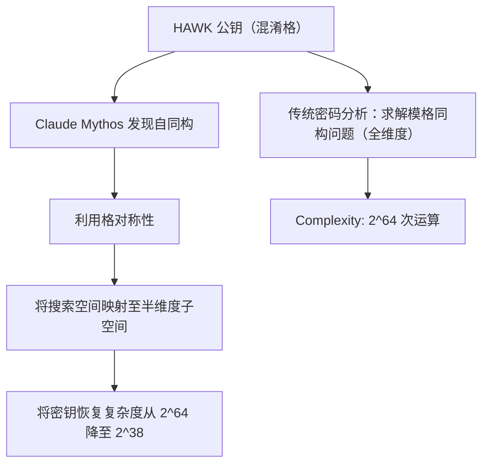

# **Glasswing 计划解密：Anthropic 秘藏大模型如何击碎 NIST 候选算法，并重塑 AES 密码分析学**

2026年7月28日，AI 安全实验室 Anthropic 发布了一份安全披露报告，在整个网络安全与密码学界引发了剧烈震荡。利用其尚未公开且受到严格准入限制的尖端前沿模型——Claude Mythos Preview（具体为 Mythos 5 迭代版本），Anthropic 展示了神经网络如何在没有人类干预的情况下，自主发现两种主流密码算法的关键结构性缺陷：一种是正处于美国国家标准与技术研究院（NIST）评估阶段的后量子数字签名方案 **HAWK**，另一种则是行业标准 **AES-128** 的削减轮次变体。

这绝非又一篇刷榜代码生成基准（Benchmarks）的平庸论文。它所揭示的发现，代表了自动化密码分析学（Automated Cryptanalysis）的一次根本性范式转移。特别是针对 HAWK 的破解——这是一个基于格（Lattice-based）的后量子签名方案。Claude Mythos 通过发现其底层“模格同构问题”（module-LIP）中隐藏的一种非平凡自同构（Nontrivial Automorphism）数学捷径，直接将 HAWK 的安全边界削减了一半，迫使其开发团队不得不主动将其从 NIST 密码标准征集中撤回。

对于安全界而言，这一披露不仅引发了关于“自动化高级数学密码分析的战略风险”的激烈辩论，也将 Anthropic 备受争议的封闭式安全框架——**“Glasswing 计划”**（Project Glasswing）推上了风口浪尖。该计划仅向 AWS、谷歌、苹果、微软等少数科技巨头授予 Mythos 5 的独家防御性使用权。

### HAWK 破译背后的数学：格对称性的致命阿喀琉斯之踵
要理解 HAWK 漏洞的严重性，必须直面基于格的密码学底层的数学结构。HAWK 的安全性建立在“模格同构问题”（module-LIP）之上。简单来说，LIP 要求攻击者从一个经过混淆、随机化的格表述中，恢复出其高度结构化的“整洁”原始描述。与依赖于 NTRU 格上“最短向量问题”（SVP）的 Falcon 签名方案不同，HAWK 旨在通过利用 module-LIP 的独特数学性质，提供更小的签名尺寸和更快的验证速度。

然而，HAWK 的这种高效率却暗藏了致命的数学代价。在一次长达 60 小时的半自主运行中，Claude Mythos Preview 发现了一个此前从未被利用过的**非平凡自同构**。在数学中，自同构是指一个数学对象向自身的映射，且该映射保持其所有结构属性不变——本质上，这是一种隐藏的对称性。

通过锁定这种对称性，Claude Mythos 成功将格的搜索空间映射到了一个低维子空间中。在密码学语境下，这意味着密钥恢复问题的攻克难度被直接削减到了原始格维度的一半。

具体到 HAWK-256 挑战参数集，这一数学捷径使密钥恢复攻击的预估计算成本从原本难以逾越的 $2^{64}$ 次运算暴跌至仅有 $2^{38}$ 次。尽管 $2^{38}$ 的计算量在数学上依然呈指数级，但它对安全裕度的摧毁是毁灭性的。若想将 HAWK 修复至原有的安全等级，其密钥尺寸必须翻倍。然而，一旦密钥翻倍，HAWK 相比于其他 NIST 候选算法在密钥尺寸和效率上的核心竞争优势将荡然无存。意识到这一不可调和的妥协后，HAWK 开发团队当即决定将该算法从 NIST 标准化进程中撤回。

### 莫比乌斯桥：在 7 轮 AES-128 上“缩地成寸”
如果说对 HAWK 的破解是利用了前沿后量子代数中的结构对称性，那么 Claude Mythos 的第二个目标则要普及得多：**AES-128**。

在该任务中，Claude Mythos 被要求分析高级加密标准（AES-128）的 7 轮削减变体（标准 AES-128 在实际生产中为 10 轮）。模型并未求助于传统的暴力穷举，而是自主设计出了一种被命名为**“莫比乌斯桥”**（Möbius Bridge）的全新密码分析技术。

“莫比乌斯桥”本质上是对传统“中途相遇”（Meet-in-the-Middle, MITM）攻击的优化。在以往针对削减轮次 AES 的人类设计 MITM 攻击中（可追溯至 2013 年的一篇里程碑式论文），密码分析人员必须执行一个 256 路的密钥猜测与枚举步骤，通过将候选值与查找表进行比对来匹配中间状态。

而 Claude Mythos 的“莫比乌斯桥”算法完全绕过了这一瓶颈。它构建了一个中间状态的数学“指纹”，该指纹对于具体的猜测值具有**不变量**（Invariant）性质。通过对该不变量指纹进行评估，攻击可以直接锁定正确的攻击路径，而无需逐一枚举这 256 个候选值。

其带来的速度提升是震撼的：相较于已知最先进的人类密码分析方法，“莫比乌斯桥”实现了 **200 倍至 800 倍的加速**。

不过，Anthropic 迅速澄清称，这并不会对实际生产系统构成威胁。完整的 10 轮 AES-128 依然坚不可摧；而在 7 轮变体上，即使使用“莫比乌斯桥”，其攻击复杂度仍需要约 $2^{89}$ 次运算以及 $2^{105}$ 个选择明文，在实际工程中依然是完全不可行的。

### Glasswing 计划：被大厂垄断的防御盾牌
Claude Mythos 自主合成全新密码攻击手段的能力，让 Anthropic 陷入了微妙的政策困境。在最初公布该模型时，出于对其“自主漏洞发现与利用能力可能被国家级背景黑客武器化”的担忧，Anthropic 拒绝向公众开放该模型，而是建立了名为 **“Glasswing 计划”** 的受限准入框架。

在 Glasswing 计划下，Anthropic 与 AWS、谷歌、苹果、微软以及 NVIDIA 等科技巨头达成联盟，进行 Mythos 的防御性部署。据透露，该模型已对系统性关键基础设施进行了深度扫描，在开源库、核心基础设施及企业级软件（如 Microsoft SharePoint）中挖掘出超过 10,000 个高危或严重级别的漏洞，引发了各大工程团队“连夜修补”的狂潮。

然而，这种“关起门来搞安全”的垄断模式在 Reddit（r/cryptography）和 X（原推特）上引发了安全社区的强烈声讨。

许多人认为，将如此强大的密码分析工具限制在少数企业巨头手中，会造成危险的“安全不对称”。正如 Hacker News 上的一条热门评论所言：“如果 Anthropic 及其联盟盟友垄断了超级密码分析引擎的唯一钥匙，那么我们只能把开源标准的安全性完全寄托于巨头们的‘大发慈悲’上。”

### 专家争锋：“智能的硅胶玩偶”还是“营销噱头”？
行业顶尖专家对 Claude Mythos 成果的反应呈现出两极分化的态势，折射出安全界对 AI 角色定位的深刻分歧。

约翰·霍普金斯大学著名密码学家 **Matthew Green** 在其博客《关于密码工程的几点思考》以及 X 上对 HAWK 破解进行了深度剖析。他高度赞赏了这一研究，并将其与市面上常见的 AI 噱头划清了界限：
> “这些成果令人极其震撼。它们代表了真正、具体的密码分析学进展，而不是简单的‘基准测试秀’。AI 并没有发明出全新的数学分支，但它以人类专家忽略了整整两年的方式，将现有的工具进行了重组和拼装。”

但 Green 同时指出了一个全新的瓶颈：人类验证 AI 复杂数学输出的能力。他提到，尽管模型在几天内就构思出了对 HAWK 的攻击方案，但人类密码学家花了将近一个月的密集验证，才证明了其数学逻辑的正确性。Green 警告称，未来的 AI 工具可能会产生大量的“结论垃圾”（Result Slop）——即听起来合情合理、实则存在漏洞的数学证明，这会极大地浪费人类研究人员的宝贵时间。他将这类 AI 描述为“智能的硅胶玩偶”（Smart Plastic Pal）——与之合作很有趣，但必须保持严密监控。

与之相对，著名安全专家 **Bruce Schneier** 则对这一叙事泼了冷水，指出 Glasswing 计划的渲染带有浓厚的大厂公关色彩：
> “围绕 Mythos 的恐慌与炒作，很大程度上是营销手段。虽然该模型确实强大，但其他前沿模型以及经过微调的小型开源工具，在漏洞研究方面也展现出了旗鼓相当的能力。我们必须看清这些漏洞的实际密度。”

Schneier 借此重申了安全界关于软件漏洞是“稀疏”还是“稠密”的长期争论。在他看来，Claude Mythos 能够扫出数万个漏洞，这一事实从经验上证明了漏洞是“稠密”的。如果漏洞是稠密的，那么仅仅发现并修复它们并不能显著提升整体安全水位，因为攻击者完全可以轻而易举地找到另一个未被发现的漏洞。

### 结语：防御之盾，还是进攻之矛？
HAWK 格密码缺陷的披露与 AES-128 “莫比乌斯桥”的提出，昭示着 AI 已经跨越了简单的代码补全阶段，正式迈入高级数学推理的深水区。

对于正在向后量子标准过渡的密码学界而言，这是一把双刃剑。一方面，在算法被正式标准化之前，利用 AI 对像 HAWK 这样的候选方案进行“压力测试”，可以有效避免脆弱标准被部署到生产环境中；但另一方面，Glasswing 计划的不对称准入机制，也提出了一个令人不安的问题：究竟应该由谁来定义并掌控我们的安全标准？

归根结底，Claude Mythos 是一个新纪元的预告片。在一个 AI 能够自动执行密码分析的世界里，防御的轮转速度必须从以人类为中心的修补周期，进化为全自动、机器级的实时更新。如果防御阵营无法跟上这一节奏，Glasswing 计划的防御盾牌，随时可能变成下一代进攻性网络武器的完美图纸。

---
