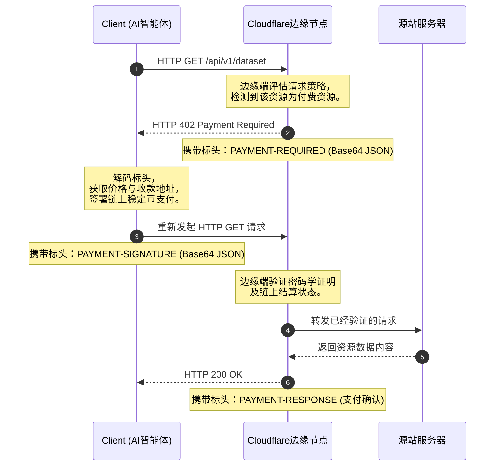

# HTTP 402 重生：Cloudflare、Coinbase 与智能体互联网的边缘付费墙

互联网正在经历一场悄无声息的构造性巨变。三十多年来，万维网的底层逻辑一直是以人类为中心的——通过展示广告、联盟链接和月度订阅等笨拙的折中方案来实现商业化。但如今，绝大多数 API 调用和数据查询已不再由人类的眼球驱动，而是源自自主运行的 AI 智能体（AI agents）、网络爬虫以及 [Model Context Protocol (MCP)](https://modelcontextprotocol.io/) 客户端。这些机器以编程化的方式消费着庞大的数据集、评估工具并抓取资源，彻底绕过了传统商业化所依赖的视觉界面。

作为应对，Cloudflare 与 Coinbase 联合开发了一套颠覆性的标准，重新唤醒了万维网最古老、最著名的休眠机制之一：**HTTP 402 (Payment Required，需付款)**。

随着 **Cloudflare 货币化网关（Cloudflare Monetization Gateway）** 在 2026 年 7 月 1 日正式上线，以及开源的 [x402 协议](https://github.com/x402-foundation/x402)（现由 Linux 基金会托管）发布，智能体经济（agentic economy）的基石正在网络边缘默默铺就。这篇深度调查将拆解 x402 挑战-响应流的底层技术架构，评估基于 L2 网络微支付的经济可行性，并剖析 Hacker News 与 X.com 上开发者们正处于白热化状态的辩论。

---

### 智能体互联网的崛起与 HTTP 402 的“死而复生”

HTTP 402 状态码早在 1997 年的 RFC 2068 中就已被定义，当时只留下了一句简单的占位符：*“此代码保留供未来使用。”* 在随后的近 30 年里，它就像一座互联网的“赛博鬼城”。

核心症结在于基础设施。在 20 世纪 90 年代末，互联网缺乏一种能够处理微支付的、原生的、低摩擦的全球结算层。传统的信用卡网络（Visa、Mastercard、Stripe）是为人类的结账页面设计的，每笔交易包含高昂的手续费（通常为 0.3 美元 + 2.9%），这使得针对单次 API 查询或单篇文章阅读收取厘角级（少于一分钱）的费用在经济上完全不可行。

然而，大语言模型（LLM）智能体的崛起彻底改变了这笔账。由 LangChain、AutoGPT 或 Anthropic 的 Claude Desktop 等工具驱动的自主智能体，每分钟都会向网络资源发起数千次请求。它们不看广告，也不会主动订阅信用卡套餐。

正如 Coinbase 首席执行官 **Brian Armstrong** 所言：
> “AI 智能体无法开设银行账户，因为它们无法满足传统金融的‘反洗钱与客户身份识别’（KYC）要求。加密钱包和稳定币是这些自主实体独立持有资金、签署交易并为服务付费的唯一原生方式。”

通过将 Cloudflare 的边缘网络与 Coinbase 的二层（L2）网络 Base 的低成本稳定币通道相结合，x402 协议终于让机器间的程序化网络支付成为现实。

---

### 解构 x402 握手：底层技术工作流

从本质上讲，x402 是一个与网络无关的开放式协商层。它依赖三个核心 HTTP 标头来执行加密的“挑战-响应”交易：`PAYMENT-REQUIRED`（需要付款）、`PAYMENT-SIGNATURE`（付款签名）和 `PAYMENT-RESPONSE`（付款响应）。

以下是受 x402 保护的请求的完整生命周期：



#### 步骤一：初始挑战（HTTP 402）
当 AI 智能体请求受保护的 API 终点时，Cloudflare 货币化网关会在边缘节点拦截该请求。由于请求中没有携带有效的支付令牌，网关会挂起该请求，并返回 **HTTP 402 Payment Required** 状态码。

响应的数据载荷中包含 `PAYMENT-REQUIRED` 标头，它携带了一个经过 Base64 编码的 JSON 对象，详细说明了价格、目标网络、代币资产以及商家的钱包地址：

```json
{
  "x402Version": 2,
  "error": "Payment Required",
  "paymentRequirements": [
    {
      "scheme": "ethereum",
      "network": "base",
      "asset": "USDC",
      "amount": "0.0005",
      "payTo": "0x742d35Cc6634C0532925a3b844Bc9e7595f0bEb",
      "resource": "api/v1/dataset-abc",
      "nonce": "c8a49ff2-3b90-4555-b37b-e9ff56db1946"
    }
  ]
}
```

#### 步骤二：密码学响应（`PAYMENT-SIGNATURE`）
客户端智能体解码这些付费要求后，会根据其内部预算评估成本，并使用其嵌入的 Web3 钱包授权该笔交易。随后，客户端重新尝试发起 HTTP 请求，并在标头中追加 `PAYMENT-SIGNATURE`。该标头包含了交易哈希（Transaction Hash）和一段证明该笔付款已被广播至区块链的密码学签名：

```json
{
  "transactionHash": "0xa4b19c8f85f39642fb5917822b3e8ee79ef1c71285223e7284f55a1d7c35f29a",
  "signature": "0x8d5c412f84a441e8c75dfb3e41b238a8df0b5b1a3d2e1c9f7a6b5c4d3e2f1a0b...",
  "paymentId": "pay_cf_9812739"
}
```

#### 步骤三：边缘端验证与响应交付
为了避免源站服务器频繁进行高负载的区块链查询（这会迅速压垮其数据库），验证工作被完全卸载到了网络边缘的 Cloudflare Workers 上。Cloudflare 的边缘验证节点会核对交易签名是否与随机数（nonce）相匹配，并确认所需数量的 USDC 已在 Base 链上完成结算。验证通过后，网关会将请求代理转发给源站服务器，源站服务器返回资源内容，并附带一个 `PAYMENT-RESPONSE` 确认标头。

---

### 经济可行性探讨：为什么必须是 L2 上的稳定币？

微支付标准能否落地的关键，在于其底层交易成本。在以太坊主网上为一次仅值 0.0005 美元的 API 查询付账，在数学上是极其荒谬的，因为主网的 Gas 费动辄就需要几美元。

为了攻克这一瓶颈，由 Linux 基金会托管、并获得 Coinbase、Cloudflare、Visa、AWS、Google 和 Stripe 等巨头支持的 x402 基金会，决定主要采用 **Base 网络上的 USDC** 进行结算。得益于以太坊 Dencun 升级以及 Base 链的高吞吐量，其交易手续费几乎可以忽略不计（通常低于 0.001 美元）。

Base 的创始人 Jesse Pollak 将该协议描述为一种结构性的释放：
> “x402 为万维网构建了一个开放、无摩擦的收费系统。通过将稳定币交易路由至 L2 网络，我们能够瞬间完成以分甚至厘为单位的结算。这就是 AI 智能体大规模自主运行所需的金融路由层。”

此外，通过在网络边缘执行验证，货币化网关还能充当防范恶意爬虫流量的盾牌。如果高频抓取工具（如 OpenAI 的 GPTBot 或 Anthropic 的 ClaudeBot）未能在边缘完成付款结算，Cloudflare 会在第一时间对其予以拦截，从而保护源站的基础设施免受类似 DDoS 的资源耗尽攻击，并避免因爬虫疯狂抓取导致数据库负载骤增。

---

### 社区激辩：万维网的救赎，还是集中化的新卡特尔？

随着货币化网关的逐步铺开，一场激烈的意识形态之争正在 Hacker News 和 X.com 上上演。

#### 支持者：内容创作者的终极救星
独立出版商和创作者将 x402 视为对抗大模型无偿抓取的一柄利刃。多年来，各大 AI 实验室一直在免费抓取公开网页来训练数万亿美元估值的模型，却剥夺了原创作者的流量与收益。

Hacker News 上一条获得高赞的评论总结道：
> “一刀切的 robots.txt 拦截根本不起作用，而起诉 OpenAI 又要耗费数年时间。x402 给我们提供了一个精准控制的拨盘。如果 Perplexity 想要解析我的博客来填充他们的搜索摘要，他们就得为每次页面浏览支付 0.0002 美元。不付钱，就在边缘直接吃 402。我们终于拿回了主动权。”

#### 反对者：高延迟、创新壁垒与赛博陷阱
相反，网络纯粹主义者和开发者警告称，x402 的广泛采用可能会扼杀开放的互联网，并阻碍初创企业的创新：

1. **API 延迟开销**：批评者指出，“挑战-响应”工作流引入了显著的延迟。一次标准的 API 调用需要两次完整的往返时间（RTT）——一次用于接收 402 挑战，另一次用于提交支付签名——此外还要加上智能体钱包签署数据载荷以及边缘端查询链上状态的时间。在对时间敏感的智能体执行闭环中，这种延迟开销是难以忍受的。
2. **“焦油坑”钱包枯竭**：一个重大的安全隐患是可能存在恶意的重定向循环。如果一个智能体误入“焦油坑”（tarpit）——即专门设计的网页链条，通过无尽的 HTTP 402 网关循环跳转——它可能会在几秒钟内被榨干整个稳定币钱包。
3. **初创企业被拒之门外**：白手起家的开发者认为，按量付费的微型付费墙将使多智能体系统在经济上难以为继。一个智能体在执行任务时，若需要调用多个子智能体，就可能会产生呈指数级叠加且不可预测的微型账单，从而将那些无力为智能体钱包持续注资的早期初创公司挡在门外。
4. **联盟性“过路税”**：部分开发者谴责 x402 基金会实际上在扮演一个中心化的“新卡特尔”。通过将自己定位为默认的赛博看门人，Cloudflare、Coinbase、Stripe 和 Visa 最终可能会对所有的机器对机器（M2M）商业活动征收网络级别的“过路税”。

---

### 结语

Cloudflare 货币化网关与 x402 协议的推出，代表了万维网演进史上的一个重要里程碑。通过将理论上的 HTTP 402 状态码转化为切实可行的、在边缘端执行的行业标准，他们正在为机器对机器的经济体打下根基。

x402 究竟是会沦为少数优质数据集的专属协议，还是会成为智能体互联网上无处不在的通用收费站，取决于整个行业如何解决其底层痛点：即在保障内容版权与维持开放互联网之间取得平衡，在交易安全与降低网络延迟之间找到最优解。但有一点是毋庸置疑的——免费、无偿的爬虫时代，正在走向终结。

正如 Cloudflare 首席执行官 **Matthew Prince** 所说：
> “互联网的核心协议一直以来都是由独立治理所推动的，这也是为什么我们非常荣幸能与 Coinbase 合作，确保 x402 走向相同的开放治理道路。因为它极有可能成为智能体商业时代的核心底层协议。”

---

3. 社盟推广摘要（Highlight）

3.1 核心问题
- x402 协议如何利用休眠的 HTTP 402 状态码和自定义标头，在网络边缘建立起自动化的机器支付通道？
- 依托以太坊 L2（如 Base）和稳定币的微支付机制，在落地上面临哪些关于成本与网络延迟的权衡？
- 边缘硬化付费墙在抵御高频爬虫、保护源站的同时，可能会对初创企业及开放网络生态带来哪些负面冲击？

3.2 摘要正文
Cloudflare联合Coinbase推出Monetization Gateway并开源x402协议，正式激活闲置近30年的HTTP 402状态码。该方案在网络边缘部署USDC微支付验证，单次API请求低至0.0005美元，旨在解决大模型免费抓取网页的顽疾。虽然创作者视其为抗击AI白嫖的终极武器，但开发者社区已吵翻天：双向RTT及链上验证将带来严重的API延迟，恶意重定向可能沦为榨干智能体钱包的“焦油坑”陷阱，而累加的微支付账单更可能将无力注资的初创企业彻底清退。

3.3 关键词标签
#AI经济 #L2网络 #微支付
