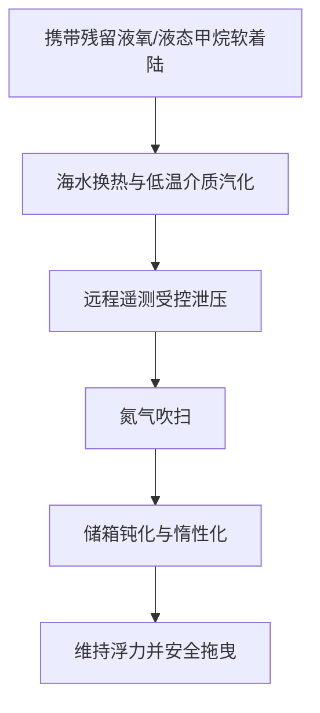

# “星舟”行动：直击SpaceX Ship 40万海里大搜救，与星舰V3再入物理学的工程极限

2026年7月24日协调世界时（UTC）22:51，SpaceX的第13次星舰试飞（Flight 13）从德克萨斯州博卡奇卡的星基地（Starbase）2号发射工位腾空而起。本次任务搭载了Booster 20超重型助推器与Ship 40第二级飞船。对于全球航天界而言，这绝非一次例行的测试飞行，而是经过深度改进的“星舰版本3”（Starship V3）架构的第二次升空，更是首次执行下一代商用星链（Starlink V3）卫星部署的实战任务。然而，真正的焦点却转移到了遥远的印度洋深处。在成功完成轨道注入、一系列空间测试及严酷的再入大气层考验后，Ship 40在海面上演了一场精准的垂直软着陆，且整机完好无损。这一高达171英尺（约52米）的不锈钢海上巨兽被外界冠以“星舟”（Starboat）之名。随后，一场前所未有、历时一个月的海上搜救与维稳拉力赛正式拉开帷幕，并于2026年8月27日迎来高潮——Ship 40被成功吊装至一艘半潜式重吊船上。

这不仅是一次海上物流的奇迹，更是一场关于材料科学、流体力学与热力学极限的现场实验。本文将深度剖析Ship 40回收背后的工程里程碑、海洋物流极限、着陆后技术取证，以及围绕SpaceX“快速迭代”研发哲学的业界交锋。

---

### 任务剖析：亚轨道布轨的精妙逻辑与着陆的“半喜半忧”

Flight 13充分展现了星舰V3配置的狂暴动力。其动力源自高度简化且性能跃升的“猛禽3”（Raptor 3）发动机。猛禽3海平面推力达250吨力（tf），真空推力达275吨力。通过极致的系统集成，猛禽3彻底取消了外部管道、隔热罩和灭火系统，从而大幅削减了箭体干质量（dry mass）。

此次发射成功验证了下一代星链V3卫星的“零空间碎片”布轨策略。Ship 40并未将这20颗卫星直接送入常规的近地轨道（LEO），而是将其精准投放至高度约200公里（124英里）的亚轨道弹道。在这短短20分钟的短暂飞行中，卫星迅速展开太阳翼，建立无线电与激光通信，并回传了Ship 40外部的关键视像。随后，这批卫星与飞船二级共同重返大气层烧毁，从而确保轨道空间内“零碎片残留”。

然而，与飞船二级的完美表现不同，超重型助推器Booster 20的命运则显得有些惨烈。在成功完成回推点火（boostback burn）后，其在墨西哥湾的着陆点火（landing burn）阶段发生故障。在13台用于减速的中心猛禽发动机中，仅有10台成功点火，导致助推器猛烈撞击海面，结构彻底解体。

---

### “星舟”行动：波涛汹涌中的海上拖曳与维稳硬仗

Ship 40在海面撞击中奇迹般地生还，让SpaceX大喜过望，当即发起了一场史无前例的搜救行动。然而，印度洋的狂风巨浪给救援队带来了极大挑战。在长达24天的时间里，搜救队伍在14英尺（约4.3米）高的涌浪和强风中艰难前行，试图将这具高达52米的不锈钢箭体拖往圣诞岛。

SpaceX为此调集了一支庞大的专属海上编队，包括多用途海洋工程船 *Normand Ranger*、*GO Australis* 以及 *Skimmer Tide*。救援的核心痛点在于：如何在高海况下稳定一个处于高压状态、且形似风帆的庞然大物。这枚高171英尺、自重达数十吨的“空心不锈钢罐体”在海面上犹如一面巨大的风帆，极易随风起舞，甚至倾覆。

8月7日，恶劣的海况险些将箭体撕裂。伊隆·马斯克（Elon Musk）在社交媒体X上发布了一条充满悲观情绪的动态：
> “很遗憾，飞船的回收情况目前看起来不容乐观。现场风浪极大，涌浪很高。不过，我们已经获取了防热罩和发动机关键区域的近景照片，这为后续的升级提供了宝贵数据。”

即便如此，海上作业团队并未放弃。8月18日，编队终于护送着Ship 40驶入了澳大利亚海外领地圣诞岛的避风港——飞鱼湾（Flying Fish Cove）。在风平浪静的港湾里，工程师们得以开展水下探伤，并亲手拆卸并回收了部分防热瓦（TPS）样本。

---

### 热力学噩梦：低温推进剂残留的去活化攻坚

拖曳一枚刚从太空归来的火箭，无异于拖着一个化学易燃易爆品。Ship 40着陆时，其头部储箱内依然残留着过冷态液态甲烷（LCH4）和液态氧（LOX）。在环境海温的持续加热下，这些低温液体迅速沸腾汽化，转化为极易挥发的气态甲烷和氧气。

如果推进剂储箱保持完全密封，积聚的内压将迅速超出304L不锈钢机身的承压极限，从而引发灾难性的超压爆炸。相反，如果内压排得过低，这枚依靠内部气压维持结构刚度的“气球火箭”就会在海浪的冲击下发生局部屈曲（buckling）甚至折断。

为了在这一“冰与火”的平衡中求生，SpaceX工程师利用飞船的遥测链路，在数千英里外的星基地远程操控排气阀门。他们指挥气态甲烷和氧气进行有节奏的受控泄压。待绝大部分低温介质沸腾汽化并排空后，系统引入气态氮（N2）对储箱进行深度吹扫，排挤掉残留的易燃混合气体，彻底实现了系统去活化（钝化）。在整个操作过程中，回收船队还派出了配备气体探测器的无人机，对箭体周围的爆炸下限（LEL）进行实时监测，直至确认安全后，潜水员才上前挂接拖缆。



---

### 合龙装船：Boskalis *Forte*号的托举与好望角万里远征

2026年8月23日，博斯卡利斯（Boskalis）旗下的半潜式重载运输船 *Forte* 号抵达圣诞岛。8月27日，整场搜救迎来了高光时刻。*Forte* 号通过向压载舱注水，将甲板降至水面以下。拖船缓缓将漂浮的Ship 40引导至甲板上方，并对准量身定制的钢结构支架。定位完成后，*Forte* 号启动强力水泵排出压载水，甲板随之徐徐升起，将这枚庞然大物完整地托出了海面。

```
       [ Ship 40 ]                      [ Ship 40 ]
     ~~~~~~~~~~~~~~~                  ==============   <- 抬升后的甲板
     |   淹没状态  |                  |            |
  ===|  重载货甲板 |===               |  重载甲板  |
  ~~~~~~~~~~~~~~~~~~~~~               ~~~~~~~~~~~~~~~~
    （注水压载阶段）                    （运输航行阶段）
```

目前，*Forte* 号正载着Ship 40，踏上长达13,000海里的返航之旅。SpaceX放弃了巴拿马运河路线（因厄尔尼诺干旱导致的吃水深度限制）以及红海-苏伊士运河路线（出于对地区安全局势的担忧），毅然选择绕道非洲南端的好望角。这场跨洋运输预计将耗时数周，Ship 40预计将于2026年10月8日左右运抵德克萨斯州星基地。

---

### 再入结构与物理取证：无价的工程金矿

对于运载火箭研制而言，成功收回一枚经历过真实太空飞行的二级飞船，无异于捧得了行业“圣杯”。在星基地，工程师们将对这具箭体进行外科手术式的拆解与物理取证：
1. **钢制机身完整性**：深入评估304L不锈钢在极端的再入气动热剪切力以及撞击海面时的瞬态冲击下，微观组织和宏观结构的响应。
2. **防热瓦受损取证**：对箭体表面约18,000块六角形陶瓷防热瓦进行逐一排查。工程师需要重点寻找等离子体在缝隙间渗透的痕迹，并评估尾翼上首次采用的“载荷感应防热瓦”的实际表现。
3. **猛禽3发动机耐盐雾测试**：在海水里浸泡了一个月的猛禽3发动机采用了再生冷却设计，其材料如何抵御海水的强腐蚀，将是发动机复检的重头戏。

知名太空科普作者斯科特·曼利（Scott Manley）在社交媒体X上指出：
> “虽然SpaceX拥有海量的传感器遥测数据，但没有任何东西能取代实物冶金学分析。能够对经历过再入等离子体洗礼的机身进行实际疲劳与应力测试，将为Flight 14及后续飞船的研制提供极其宝贵的安全裕度。”

---

### 海上打捞 vs. 发射塔捕获：发射频次的经济学算盘

尽管Ship 40的打捞是一场胜利，但也清晰地暴露了海上回收在经济与物流上的瓶颈。

| 指标 | 海上溅落（“瓶中船”模式） | 机械臂捕获（“航空客机”模式） |
| :--- | :--- | :--- |
| **翻新成本** | 极高（电偶腐蚀严重，需彻底除盐、更换发动机） | 极低（直接检测与加注） |
| **周转时间** | 数月（13,000海里航程 + 拆解清洗） | 数小时至数天 |
| **物流资产** | 半潜船、拖船、工程支援船、专业潜水团队 | 发射塔机械臂（Mechazilla） |
| **运营频次** | 周期漫长、单次调度难度极大 | 高频次、闭环快速循环 |

海水对航空级合金具有强烈的腐蚀性。氯化钠的存在会在金属接触面迅速引发电化学/电偶腐蚀。从海里打捞上来的火箭需要进行脱胎换骨式的拆解清洗，根本无法实现快速重复使用。

SpaceX的终极目标依旧是利用发射塔机械臂（Mechazilla）在陆地直接捕获飞船。然而，马斯克此前曾明确表示，在星基地尝试捕获飞船之前，SpaceX必须连续展示至少两次极其精准的海面软着陆。Flight 13正是这一前置条件的首次成功验证。

---

### 迭代之争：“小步快跑，边做边碎”的生存法则

Ship 40的成功回收再次点燃了关于SpaceX“敏捷开发”理念的论战。传统老牌航天巨头经常抨击该项目的高调失败，并将Booster 20在海面解体视为仓促上马的证据。

然而，风投机构与科技初创公司的创始人则坚定地站在快速迭代模型这一边。在Reddit的r/SpaceXLounge社区中，一条高赞评论一针见血地指出：
> “如果SpaceX遵循传统的、类似于SLS（太空发射系统）那种纯纸面审查模式，他们到现在还在为星舰V1储箱的焊接厚度吵得不可开交。而事实是，他们刚刚从大洋深处捞回了一枚经历过轨道再入的V3级飞船。从Ship 40身上剥离出来的物理数据，其价值超过了十年的计算机模拟。”

Flight 13用实实在在的数据证明，V3架构具备挺过轨道再入极端物理环境的韧性。一旦SpaceX成功过渡到使用Mechazilla机械臂直接捕获飞船的阶段，人类构建完全可重复使用行星际运输系统的周期，将直接从“几十年”缩短为“几年”。
