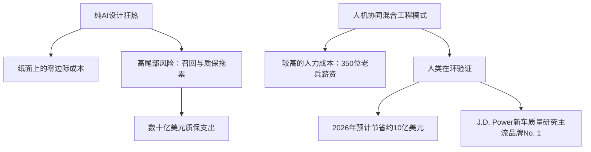

# **“灰胡子”的复仇：福特10亿美元大翻盘与“纯AI”汽车设计的技术溃败**

在2020年代中期，硅谷曾向世界描绘了这样一个蓝图：生成式设计算法和自动化质量管线将彻底终结传统工程学。在“零边际成本扩张”这一宏大叙事的诱惑下，汽车行业的高管们纷纷买单。福特汽车（Ford Motor Company）也不例外，他们大刀阔斧地引入自动化设计管线与人工智能，试图简化车辆开发流程，并渴望借此砍掉数十亿美元的“臃肿”工程师薪酬开支。

然而，到了2026年初，这场宏大实验的成绩单出炉了，结果却堪称灾难。福特陷入了无休止的召回深渊，软件故障频发，装配线屡屡停摆，高昂的质保索赔让公司损失惨重。而这一切的罪魁祸首，正是对AI自动化设计工具的过度依赖——这些工具严重缺乏人类领域专家那种难以言传的、对物理世界的直觉。

面对如此困境，福特并没有像其他企业那样在AI泡沫中一条路走到黑，而是做出了一个惊人的决定：重新启用人类。

在过去三年中，福特悄无声息地聘用、晋升或重新召回了约350名资深工程师。在公司内部，他们被亲切地称为“灰胡子”（gray beards）。这群拥有数十年实战经验的老兵被委以重任：主持设计评审、重建断裂的学徒传承体系，并去重新训练那些原本要取代他们的AI模型。

这一转变的效果立竿见影且成效斐然。2026年6月，福特在J.D. Power美国新车质量研究（IQS）中斩获主流品牌第一名——这是其16年来首次登顶。更重要的是，福特预计仅在2026年，这一策略调整就将为公司节省约10亿美元的质保和召回成本。

随着整个工业界对这场大戏屏息以待，福特的这次华丽转身，已然成为研究机器学习局限性、企业失去组织记忆的惨痛代价，以及“人机协同”（Human-in-the-Loop）新型工程范式崛起的里程碑式案例。

### 物理法则的毒打：为什么AI会在CAD与装配环节“掉链子”
要理解福特自动化设计管线为何折戟，就必须剖析虚拟的CAD模型与混乱、随机的真实物理工厂车间之间的脱节。

福特的自动化设计工具——旨在优化重量、结构刚度和布线的生成式算法——完全运行在标称CAD几何体之上。它们默认一切都是完美的：钢板绝对平整、塑料材质均匀、装配角度严丝合缝。然而，真实的物理制造本质上是一场对抗公差和随机偏差的博弈。

这种“纯自动化”路径导致了几个致命的失效模式：

1. **公差累积与材料变异性：**
   当来自7家不同供应商的7个不同零件被螺栓固定在一起时，它们微米级的尺寸偏差会产生叠加效应——这在工程上被称为“公差累积”。经验丰富的人类工程师会进行极其严苛的公差累积审计，因为他们从供应商的历史表现中知道哪些零件容易偏“大”或偏“小”。而福特的生成式AI只盯着标称的CAD数值，在模拟中输出了完美无瑕的设计，但在实际生产线上却导致了面板摩擦、干涉或部件挤压。此外，AI模型完全无法预测诸如钣金回弹（冲压钢板部分恢复原状）和注塑件翘曲等复杂的物理现象。

2. **“盲插”与人机工程学盲区：**
   AI线束路径模型以“最短路径”和“最轻重量”为唯一目标，经常将关键的电气接插件规划在结构支架后方。在CAD屏幕上，2毫米的安全间隙完全合规。但在实际的物理装配线上，这意味着工厂工人必须依靠触觉进行“盲插”——在完全看不见的情况下插入高压线束。由于没有视线引导，工人经常无法将插头完全锁止，从而导致端子松动、水分渗入，进而引发模块失效。最典型的例子是福特召回25.5万辆SUV（包括2025款探险者），其原因正是后视摄像头模块因接插件未插紧而过载失效。

3. **振动与热膨胀磨损：**
   AI设计工具将线束和液压管路布置在锋利的金属边缘附近，因为标称CAD数据显示两者的静态间隙为1毫米。但在现实中，汽车是动态运作的。在实际的发动机振动和热膨胀下，这1毫米的间隙瞬间化为乌有。随着时间推移，金属支架摩擦线束绝缘层，引发短路、仪表盘失效以及代价高昂的召回。

正如福特汽车硬件工程副总裁Charles Poon坦言：*“人工智能是一个极好的工具，但它的上限取决于你用来训练它的数据。”* 福特曾天真地以为，只要把设计指标输入AI就能得到高品质的产品，却完全忽视了物理世界中的细微变数——而这些变数，只有经历过多个产品生命周期洗礼的工程师才能预判。

### 代码化危机：企业“组织记忆”的流失
福特AI设计工具的技术性失败，背后折射出更深层次的组织内伤：组织记忆的流失。随着资深工程师在企业裁员和退休潮中相继离去，他们所拥有的默会知识（Tacit Knowledge）也随之烟消云散。

AI模型依赖历史数据进行训练，但最宝贵的工程经验——即所谓的“工程直觉”——却极少被记录在册。它作为一种经验法则存在于“灰胡子”们的脑海中。比如：*“无论热力学模拟器怎么说，永远不要在距离排气歧管5英寸以内布置线束”*，或者*“给这个支架多留0.5毫米的间隙，因为供应商X的冲压模具已经用了十年，尺寸经常漂移”*。

缺少了这些默会知识，福特的AI设计管线陷入了典型的“垃圾进，垃圾出”（GIGO）恶性循环。AI生成了符合所有硬性规范的轻量化、优化结构，却公然违反了关于耐用性和装配便利性的非正式、未成文的底层法则。而被留下的年轻、缺乏经验的工程师根本得不到导师的指点，无法在电脑屏幕上识破这些隐蔽的缺陷。长此以往，企业的人才学徒链条彻底断裂。

### 驯服算法：“灰胡子”如何将默会知识结构化
重新聘请这350名老车夫，绝不仅仅是为了退回画板时代重新画图，而是为了重新训练AI。这群“灰胡子”被派往一线，扮演人类员工与硅基系统双重导师及验证专家的角色。

为了弥合人类直觉与机器学习之间的鸿沟，福特推行了以下核心方法论：

*   **设计约束的代码化：** 资深工程师将脑海中的避坑清单转化为了结构化的、基于规则的“代码检查工具”（linters），并嵌入到生成式AI工具中。一旦AI在线束规划中靠近振动源，或设计了需要“盲插”的接插件，规则引擎就会在设计进入开模阶段前立即发出警告。
*   **监督式数据标注：** “灰胡子”们花费数千小时审查历史失效案例，并对CAD设计进行人工标注。他们不仅标注出了“哪里失效了”，更详细解释了“为什么失效”，从而提供了高保真、带标签的训练数据。这使得福特的预测性质量模型能够真正区分“CAD模型上的成功”与“物理世界中的失败”。
*   **校准边缘AI视觉系统：** 在装配线上，福特部署了诸如 **MAIVS**（移动AI视觉系统，使用运行IBM Maximo Visual Inspection的iOS边缘设备）和 **AiTriz**（以工程师Beatriz Garcia Collado命名的视频对齐AI）等视觉检测工具。虽然这些工具能捕捉毫米级的装配偏差，但起初它们的误报率极高，甚至会将无害的表面反光误判为缺陷。资深质检员与计算机视觉工程师并肩工作，共同校准这些模型，教会AI忽略无害的表面反光，聚焦于真正的装配缺陷。

### 成本效益算盘：“人机协同”的惊人回报率
多年来，科技狂热分子一直宣称人力是生产力瓶颈。然而福特的财务数据证明，在复杂的物理工程领域，纯自动化是一场高风险、低回报的赌博。

在账面上，砍掉350个资深工程师职位每年能省下数千万美元的薪水。但在现实中，由此导致的设计失效却让召回和质保成本飙升至数十亿美元。迎回这350位“灰胡子”虽然让研发开支略有上升，却在数字原型阶段就掐灭了设计缺陷——远在它们进入模具制造或引发线下召回之前。这一举措为福特锁定了2026年预计高达10亿美元的成本节省。

### 硅谷的反思：当AI炒作周期撞上物理世界
在X.com和Reddit等社交平台上，福特的这一战略转向引发了关于AI自动化局限性的激烈辩论。

知名科技评论家、*Better Offline* 播客主持人 Ed Zitron 直言不讳地指出，这给那些迷信AI的企业高管泼了一盆冷水：
> *“福特的遭遇给MBA精英们敲响了警钟。你不可能指望用一个在二维CAD文件上训练出来的神经网络，去抹平几十年的物理工程智慧。当你为了砍掉短期成本而用纯自动化取代人类专业知识时，你并没有消灭成本——你只是把它们推迟到了召回潮爆发的那一天。”*

在 Hacker News 上，有用户将其与经典的工业寓言相类比：
> *“这就是AI时代的‘斯坦梅茨画线’故事。AI知道怎么生成CAD文件，但只有‘灰胡子’工程师才知道在哪里留出公差间隙。如果你把那个知道‘在哪里敲击机器’的人开除了，你那把自动化铁锤就毫无用处。”*

科技风投界也开始反思，普遍认为硬件领域“纯软件自动化”的时代正在终结。行业的共识正向混合模式转变：由AI承担高频、低阶的自动化验证（福特目前每天运行超10万项自动检查），而人类专家则专注于系统性设计评审与边缘失效案例的解决。

福特首席运营官 Kumar Galhotra 总结道：*“我们迎回了技术专家，让他们在零件进入工厂车间之前去猎杀潜在的失效点。此前我们过度依赖那些无法兑现承诺的自动化质量系统。”*

福特的教训清晰明了：AI是强力的加速器，但它绝不是自动驾驶仪。对于那些试图自动化复杂任务的工业制造部门而言，通往高质量的道路，绝非消灭人类专业经验，而是去赋能并强化它。

---
