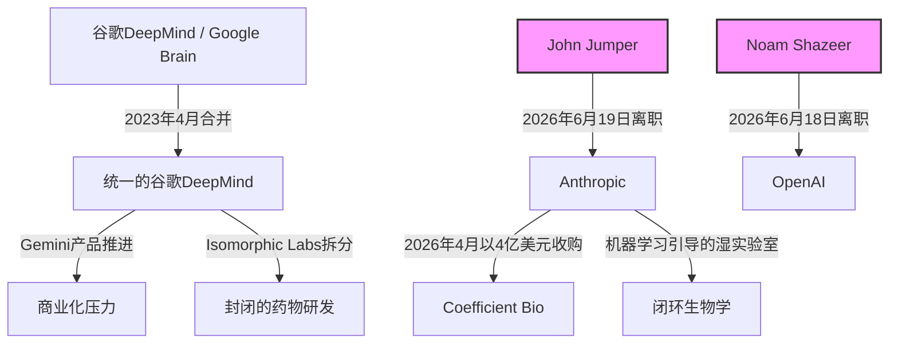

# “解码者”大出逃：John Jumper 与 Noam Shazeer 如何粉碎谷歌的 AI 人才垄断

2026年6月下旬，在短短48小时之内，全球人工智能（AI）人才版图发生了一场足以在未来十年引发余震的剧烈板块漂移。

6月18日，Gemini联合负责人、Transformer奠基人之一、传奇人物 Noam Shazeer 宣布离开谷歌，投奔 OpenAI。要知道，为了迎回这位天才，谷歌在不到两年前的2024年8月，刚刚开出了高达27亿美元的天价授权费。

紧接着，6月19日，诺贝尔化学奖得主、AlphaFold的核心架构师 John Jumper 宣布离开效力了9年的谷歌 DeepMind（GDM），加盟其强劲对手 Anthropic。

这绝不仅仅是普通的高管离职，而是谷歌长期以来在前沿AI研究领域的“人才垄断”发生了结构性破裂。这场“双重叛逃”不仅戳破了科技巨头的垄断神话，更将老牌科技帝国的商业变现压力与高估值、使命驱动型 AI 实验室所倡导的科研自由之间的底层意识形态及战略分歧，彻底推向了风口浪尖。

**从学界新星到诺奖得主：John Jumper 的辉煌与出走**

[John Jumper](file:///Users/vzl/.gemini/antigravity-cli/brain/f70663ce-c675-47c4-ae2c-a0aaaee79829/analysis_results.md)在谷歌 DeepMind 的崛起之路，堪称计算生物学界的传奇。2017年在芝加哥大学 Tobin Sosnick 门下取得化学博士学位后，Jumper 以研究科学家的身份加入 DeepMind。仅仅六个月后，CEO Demis Hassabis 就完成了一次豪赌：任命刚毕业不久的 Jumper 担任 AlphaFold 团队的负责人。

在 Jumper 的带领下，该团队彻底颠覆了结构生物学。AlphaFold 的演进轨迹印证了一条极为陡峭的算法创新曲线：
*   **AlphaFold 1 (2018)：** 利用深层卷积神经网络（CNN）来预测氨基酸对之间的距离分布和二面角，再将这些预测融合成势能函数，并通过经典的梯度下降法进行优化。尽管这是巨大的跨越，但它依然严重依赖传统的结构预测流水线。
*   **AlphaFold 2 (2020)：** 这是一次彻头彻尾的重构。Jumper 放弃了 CNN 路线，转而采用端到端的注意力机制架构。他引入了“Evoformer”——一种专门的神经网络模块，能够在多序列比对（MSA）表示与氨基酸对表示之间进行持续的信息交换。随后，“结构模块（Structure Module）”将蛋白质骨架视为“漂浮刚体气泡”，并利用“不变点注意力（Invariant Point Attention, IPA）”机制将它们投影到三维空间中。这一突破终结了困扰人类半个世纪的“蛋白质折叠”难题。
*   **AlphaFold 3 (2024)：** 其边界跨越了蛋白质本身，能够预测 DNA、RNA、化学修饰以及小分子配体之间的复杂相互作用。关键在于，AlphaFold 3 用生成式“扩散模块（Diffusion Module）”取代了此前复杂的 Evoformer 和结构模块组合。它从随机的三维原子坐标开始，经过200步的迭代去噪，在化学空间中实现了前所未有的泛化能力，摆脱了前代架构中刚性坐标的束缚。

这一系列史诗级的研究，让 Jumper 斩获了2024年诺贝尔化学奖（与 Demis Hassabis 及 David Baker 共享）。

然而，繁华背后，裂痕早已暗中滋生。2024年5月，AlphaFold 3 首次在《自然》（Nature）杂志发表时，因未同步开源源码和模型权重而引发了学术界的强烈声讨。DeepMind 将该模型锁在了权限受限的专属网页服务器后，引来学术界大范围的声讨，批评者认为其商业诉求已经压倒了开放科学的原则。尽管 DeepMind 最终妥协，在2024年11月以 Apache 2.0 协议开源了代码和模型参数，但这一事件彻底暴露了科研理想与商业利益之间的深层文化鸿沟。

在 X 平台上的离职声明中，Jumper 的发言依然体面外交：
> “在经历近9年时光后，我决定离开谷歌 DeepMind 并加盟 Anthropic……在我博士毕业仅6个月时，@demishassabis 就力排众议让我领导 AlphaFold 团队，这绝对是一次冒险；而整个 GDM 团队在如何开展伟大的科学研究方面，也让我获益匪浅。”

Hassabis 也温和地送上祝福：
> “感谢 John 过去9年里无与伦比的伙伴关系与精彩合作！我们凭借 AlphaFold 所取得的成就改变了世界，并向世人昭示了 AI 在科学与医药领域的无限可能……”

然而，无论言语上多么温和，Jumper 的离去都让谷歌 DeepMind 的前沿科学部门瞬间陷入了巨大的执行力真空。

**27亿美元的溃败：Noam Shazeer 闪盟 OpenAI**

如果说 Jumper 的离开是谷歌科学声誉的重大流失，那么 [Noam Shazeer](file:///Users/vzl/.gemini/antigravity-cli/brain/f70663ce-c675-47c4-ae2c-a0aaaee79829/analysis_results.md) 的出走，则是一记沉重的财务与战略双重暴击。作为 2017 年奠基性论文《Attention Is All You Need》的共同作者，Shazeer 曾于 2021 年离开谷歌，共同创立了 Character.AI——此前谷歌拒绝上线他研发的聊天机器人 Meena。2024 年 8 月，为了挽救 Gemini 的被动局面，谷歌斥资 27 亿美元天价向 Character.AI 购买技术授权，其核心目的就是为了将这位传奇极客带回山景城，担任工程副总裁以及 Gemini 的联合负责人。

然而，短短不到两年后，Shazeer 就在 2026 年 6 月 18 日直接跳槽到了谷歌的死敌 OpenAI。这无疑成为了硅谷历史上最昂贵、也最令人瞠目结舌的人才流失惨案。

Shazeer 在 X 上表示：
> “非常高兴地向大家分享，我将加入 OpenAI，并期待与那里杰出的团队并肩作战。做出离开的决定并不容易。”

OpenAI 首席执行官 Sam Altman 随即转推，展现出了典型的硅谷狂傲之气：
> “自 OpenAI 创立之初起，Noam 就是我最想共事的人之一。这一等就是 10 年，但我相信，所有的等待都是值得的！”

**Anthropic 的降维打击：大模型与生命科学的融合**

John Jumper 投奔 Anthropic 并非一次随性的跳槽，它是 Anthropic 战略转型的核心落子——这家公司正试图从“通用大语言模型开发商”跃升为“生物大模型（Biological Foundation Models）”的拓荒者。

Anthropic 首席执行官 Dario Amodei 长期以来一直对 AI 驱动的科学发现怀有宏大愿景。在其著名长文《Machines of Loving Grace》中，Amodei 曾描绘 AI 如何将几十年的生物学研究压缩至几年。这一执念带有极其强烈的个人色彩：他在普林斯顿读研期间，因父亲罹患罕见病去世，毅然决定将研究方向从理论物理转向生物物理学。

在他的掌舵下，Anthropic 近年来已为这场生物学革命做足了铺垫：
1.  **Claude for Life Sciences（2025 年底）：** 深度集成了 PubMed、Benchling 和 BioRender 等数据源，使 Claude 能够协助科研人员进行文献综述、实验设计及临床合规写作。
2.  **收购 Coefficient Bio（2026 年 4 月）：** Anthropic 以价值 4 亿美元的全股票交易收购了由前基因泰克（Genentech）科学家创立的初创公司 Coefficient Bio，将靶点优化、分子分析工具和药物研发管线直接纳入麾下。
3.  **自建物理湿实验室（Wet Labs）：** Anthropic 正在构建一个“干湿闭环”系统——AI 模型生成生物学假设，自动化的物理湿实验室进行实验验证，产生的“高纯度”实验数据再反哺并训练模型。

Jumper 的加盟正是这块版图上最关键的拼图。大语言模型固然擅长整合文献，却缺乏对结构生物学内在物理规律的深度直觉。Jumper 在扩展结构预测端到端机器学习架构方面的无双经验，将帮助 Anthropic 构建真正意义上的“生物基座大模型”。这些模型不再满足于静态的蛋白质折叠预测，而是可以模拟蛋白质与配体结合的动态过程、细胞通路交互作用，以及化学合成的反向路径。

将 Claude 的认知推理能力与 Jumper 的结构预测架构相融合，Anthropic 的终极目标是攻克数字生物学领域最后的高山：
*   **动态构象建模（Dynamic Conformational State Modeling）：** 预测蛋白质如何摆动并在不同状态间转换（这对于靶向柔性药物受体至关重要）。
*   **绝对结合亲和力预测（Absolute Binding Affinity Prediction, $\Delta G$）：** 摆脱简单的几何对接，直接预测热力学稳定性和反应动力学。
*   **从头分子设计（De Novo Molecule Generation）：** 自动设计自然界不存在但易于合成的全新靶向药物分子。

**路线之争：功利商业化 vs. 纯粹科研探索**

促成这一系列“出逃”的底层驱动力，是两家公司截然不同的组织文化。自 2023 年 4 月 Google Brain 与 DeepMind 被迫合并以迎战 OpenAI 以来，合并后的新部门一直处于极度的“交货焦虑”之中——被要求源源不断地输出消费级功能、搜索插件以及企业级 API。那些最初为了探索宇宙终极奥秘而加入 DeepMind 的顶尖科学家，逐渐发现自己正在被边缘化，被迫卷入优化 Gemini 的上下文窗口长度、或者降低聊天对话延迟等枯燥的商业化泥潭。

正如一位知名机器学习工程师在 Hacker News 上的热评所言：
> “在某种程度上，如果你是一位世界级的科学家，你绝不会希望将自己的大好生命浪费在优化广告点击率（CTR），或是微调一个对话机器人以确保它不说脏话上。你真正渴望的是解码宇宙。”

此外，谷歌在生物领域的商业野心主要通过 Isomorphic Labs 来实现。这家商业分拆公司目前已与礼来（Eli Lilly）和诺华（Novartis）签署了价值数十亿美元的药物发现协议。然而，对于学术情怀深厚的科研人员而言，这种结构无疑是一堵高墙——他们的突破性成果会立即在密室里被打包变现，而不是作为开放科学成果回馈给全球学术界。

相比之下，Anthropic 的定位极具吸引力。作为一家公益性质公司（Public Benefit Corporation, PBC），Anthropic 在章程中规定必须在股东利益与公众福祉、技术安全之间取得平衡。尽管 Anthropic 同样在积极推进商业化，但其对安全对齐框架以及宪法 AI（Constitutional AI）的坚守，完美契合了那些对“生物技术双重用途风险”（例如生物武器的意外合成）深感忧虑的科学家的价值观。这种对底层安全和基础科学的纯粹坚持，为 Jumper 这样的精英学者提供了一个理念完全契合的理想庇护所。

**谷歌的防御与反击**

当然，谷歌 DeepMind 绝不会坐以待毙。Demis Hassabis 麾下依然掌控着全球最庞大的 AI 算力集群和无可比拟的人才储备。

为了捍卫其在数字生物学领域的王座，谷歌接下来的防守反击预计将聚焦于三大支柱：
1.  **加速 Isomorphic Labs 的管线落地：** 谷歌将全力推进与礼来和诺华的合作里程碑，向外界证明其工业级算力流水线有能力将计算层面的预测转化为临床阶段的成功。
2.  **扩张物理数据管线：** 谷歌可能会成倍追加对高通量生物数据生成的投资，建立规模庞大的自建湿实验室，以阻击 Anthropic 的新动作。
3.  **研发次世代物理引擎：** 为了超越现有的 AlphaFold 3，谷歌正尝试将深度学习与量子化学模拟相融合，在原子层面模拟分子动力学，企图让竞争对手的静态预测方案直接过时。

**结语**

John Jumper 投身 Anthropic 以及 Noam Shazeer 闪盟 OpenAI，标志着谷歌对 AI 精英人才的绝对统治时代宣告终结。在算力已逐步走向商品化、资本不再稀缺的全新纪元里，前沿竞争的终极战场已经演变成了“组织文化”与“使命契合度”。

当 Anthropic 正在有条不紊地铺设其生物湿实验室、OpenAI 疯狂吸收 Transformer 的缔造者之时，谷歌必须迅速找到一种方法，让其体内的科学家们能够心无旁骛地从事纯粹的科学探索——否则，它只能眼睁睁看着人工智能的未来，在别的温床上生根发芽。
