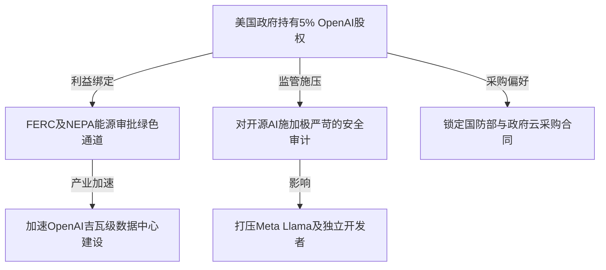

# 主权模型：拆解山姆·奥特曼426亿美元“科技投名状”——OpenAI计划向美国政府出让5%股权幕后

OpenAI正加速从“受限利润”实体向传统营利性C类公司的架构转型。在这场商业重组的深水区，CEO山姆·奥特曼（Sam Altman）抛出了一手地缘政治层面的绝妙博弈：向美国政府无偿赠予5%的股权。

以OpenAI在2026年3月31日新一轮历史性融资（由亚马逊、英伟达、软银及微软领投，规模达1220亿美元）后确立的8520亿美元估值计算，这5%的股权价值高达426亿美元。在直接呈递给总统唐纳德·特朗普、商务部长霍华德·卢特尼克和财政部长斯科特·贝森特的提案中，奥特曼将其包装为向全体美国公民发放“AI红利”的社会福利机制，并明确以阿拉斯加永久基金（Alaska Permanent Fund）为蓝本。

然而，在“全民共享科技财富”的宏大叙事背后，隐藏着极其精密的商业计算：这是一次试图锁定监管豁免权、换取超常规能源基础设施支持，并将OpenAI确立为美国国家级AI“国家队（National Champion）”的终极合谋。在OpenAI全力冲击1万亿美元公开上市市值的关键节点，国家权力与私人AI巨擘的深度绑定，正在引出前所未有的技术、运营与公平竞争层面的剧烈冲突。

#### 财务工程学障眼法：“AI红利”与现金流脱节的残酷现实

将该提案与阿拉斯加永久基金或挪威政府养老基金进行类比，在公司金融逻辑上存在根本性的错配。阿拉斯加永久基金的底层资产是高流动性、源源不断产生现金的石油开采特许权使用费，其分红建立在真实世界的商品收益之上。

相比之下，OpenAI是一家高成长、强算力依赖的初创企业，伴随着惊人的资本支出（CapEx）消耗率。2026年3月注入的1220亿美元现金，已被迅速投入到英伟达GPU的采购、专用光纤网络硬件的租赁以及吉瓦级电力资源的锁定期限中。一家不派发红利的C类公司，其5%的非上市股权根本无法产生现金红利。

| 阿拉斯加永久基金模式 | 提案中的AI主权财富基金 |
| :--- | :--- |
| • 底层资产为高流动性的石油特许权使用费 | • 持有流动性极差的初创公司股权 |
| • 产生可预测的自由现金流（FCF） | • 资本支出极高，零股息派发 |
| • 基金运作独立于底层资产的具体运营 | • 导致政府与企业监管职能产生直接冲突 |

如果要将这笔股权变现为公众手中的“红利”，联邦政府只能诉诸以下三种流动性方案：
1. **二级市场减持：** 将股份转售给私人买家，但这极易打压OpenAI的二级市场估值；
2. **股份回购计划：** 强制OpenAI抽调本用于训练前沿大模型的宝贵现金，来回购政府持有的股份——这无异于在与谷歌、Meta等对手的军备竞赛中自缚双手；
3. **首次公开募股（IPO）：** 寄望于公司以1万亿美元估值上市，随后政府在公开市场逐步套现。

此外，奥特曼甚至向谷歌、Meta和Anthropic发出邀请，呼吁同行也向该基金“自愿”捐赠5%的股份。这一举动在行业内引发了极大的质疑。Reddit的r/MachineLearning板块上，一条高赞评论一针见写地指出：“税收才是国家合法的财富再分配手段。直接向政府上贡股权，本质上是企业为了实现‘监管套头（Regulatory Capture）’而交纳的保护费。”

#### 能源基建交易：用股权换取“吉瓦级”绿通车

目前扼杀奥特曼宏图的瓶颈已不再是资金，而是物理层面的算力基建。训练下一代前沿大模型需要吉瓦（GW）级别的超大型数据中心。奥特曼此前一直在游说白宫，希望获得联邦政府支持，以建设总容量达5吉瓦的数据中心集群——这相当于5座核反应堆的发电总量。

然而，在美国，如此规模的工程正被电网容量不足、联邦能源监管委员会（FERC）的并网排队流程，以及国家环境政策法（NEPA）动辄数年的环境评估所拖垮。通过向美国政府出让价值426亿美元的利益绑定，OpenAI巧妙地将政府的财政私利与自身的物理扩张锁在了一起：
* **电网接入绿色通道：** 能源部（DOE）和联邦能源监管委员会（FERC）将面临巨大的政治压力，被迫优先解决OpenAI设施的电网接入。
* **免除环境评估：** 总统行政令可以以“国家安全最高优先级”为由，豁免或加速NEPA的繁琐审查。
* **核能专供通道：** 退役或获得联邦补贴的核电站所产生的电力，可能会被直接引向OpenAI的算力集群。

对于特朗普政府的鹰派阁员而言，这同样是一笔极具诱惑力的筹码。在此框架下，OpenAI的核心模型权重（包括GPT-5、草莓和猎户座等架构谱系）将被视为关键国家基础设施。在技术落地层面，这意味着“国家主权计算云”的诞生——由联邦政府牵头，在完全隔离的GovCloud上部署专属集群，而核心算法科学家和系统工程师则必须通过安全审查。

#### 竞品强烈反弹与开源AI的灭顶之灾

一旦美国政府成为OpenAI的持股方，将给科技监管带来无法调和的利益冲突。联邦贸易委员会（FTC）、司法部（DOJ）和证券交易委员会（SEC）在面对一个政府自身拥有数百亿美元核心利益的行业时，将彻底丧失其作为“客观裁判”的公信力。

竞争对手对此感到极度震惊与警惕。据知情人士透露，Anthropic已明确拒绝参与此类讨论。谷歌和Meta则直接将该提案视为OpenAI企图构筑无法逾越的“监管护城河”。硅谷知名风险投资人马克·安德森（Marc Andreessen）长期以来一直在警告那些扼杀创新的“红头文件怪兽”。在X.com上，科技创始人之间的讨论将这种威胁剖析得淋漓尽致：

> “如果政府成为OpenAI的股东，那么Meta或独立开发者发布的开源大模型，都将被扣上‘危害国家安全’或‘侵蚀公众红利基金估值’的帽子。这本质上是在用国家力量扶持垄断。”

Meta首席AI科学家杨立昆（Yann LeCun）也多次公开论证，少数闭源巨头对AI的垄断是对数字主权的系统性威胁。如果国家意志为OpenAI背书，为了维持政府手中这笔426亿美元资产的估值，监管机构可能会人为抬高开源替代方案（如Llama系列）的合规准入门槛。

#### 宪政悬崖与合规泥潭

然而，要在法律层面执行如此巨额的股权转让，无异于在雷区跳舞。根据美国《反不足法案》（Anti-Deficiency Act）和标准的联邦采购法规，行政分支（总统及内阁部门）无权单方面接受或持有私有公司的股权。任何此类资产归属的变更，都必须获得国会的明确授权。

从历史上看，美国政府只有在极其严重的系统性危机中才会对私营企业进行股权接管：
* **2008年金融危机（TARP计划）：** 财政部通过认股权证和优先股注资金融机构及汽车巨头（通用、克莱斯勒），以防止金融系统崩溃，且被要求在局势稳定后必须立即退现退出。
* **1970年代铁路危机：** 催生了美铁（Amtrak）和康铁（Conrail）。

在没有行业危机的背景下，让政府参股一家极具投机性、估值泡沫巨大的前沿AI实验室，在历史上是毫无先例的。这也与立法层面的激烈方案形成了鲜明对比，比如参议员伯尼·桑德斯（Bernie Sanders）提出的《美国AI主权财富基金法案》。该法案主张通过对AI巨头征收一次性巨额股票税，从而实现50%的公有制持股——硅谷风投界普遍警告，这种激进提案将直接导致资本向海外司法管辖区大逃亡。

因此，奥特曼抛出的5%方案更像是一次防御性的妥协：用温和的“股权纳贡”来主动消解潜在的惩罚性税收与监管分化，同时完成OpenAI作为美国“国家实验室”的永久卡位。
