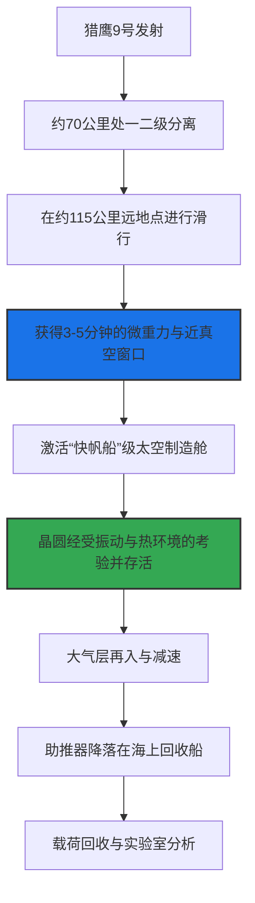

# 亚轨道“炼丹炉”：Besxar 意图将猎鹰 9 号助推器改造为太空芯片厂的野心与现实

2026年7月5日东部时间清晨6:50，SpaceX 的猎鹰9号（Falcon 9）B1090号助推器从卡纳维拉尔角40号航天发射工位（SLC-40）腾空而起。虽然这次名为 Starlink 10-50 的主任务只是平淡无奇地将29颗星链卫星送入近地轨道，但在火箭第一级助推器外侧，一项真正具有划时代意义的技术试验正在悄然进行——在助推器未承压的辅助设备舱内，螺栓固定着两个微波炉大小的自主制造舱，这便是总部位于华盛顿特区的初创公司 Besxar Space Industries 研发的“快帆船”级（Clipper-class）太空制造舱（Fabships）。

这家由 OpenAI 前技术总监（兼 CTO 早期助理）Ashley Pilipiszyn 于2023年创立的公司，正在开拓一条颠覆传统太空制造（ISM）的全新路径：将轨道级可回收火箭的第一级，直接用作亚轨道的芯片制造平台。这次飞行完成了人类首次在亚轨道空间进行半导体硬件的实际测试，也在硅谷的工程师圈子以及 Reddit 的 r/space 和 r/hardware 等论坛上，引爆了一场关于在大气层边缘制造芯片的物理、物流与经济可行性的激烈辩论。



##### 分子物理学：为什么重力是半导体的死敌？
要理解 Besxar 为什么要费尽心机将硬件送上火箭助推器，就必须审视在地球上生长半导体晶体的物理局限性。高纯度化合物半导体衬底——如砷化镓（GaAs）和磷化铟（InP）——的制备，在地球上严重受到重力驱动现象的制约，具体表现为浮力驱动对流和重力沉降。

在陆地晶体生长过程中（例如使用传统的直拉法或布里奇曼法），熔体内部的温度梯度会引起密度差。决定浮力驱动对流发生的无量纲雷利数（Rayleigh number, $Ra$）可以表示为：

$$Ra = \frac{g \beta \Delta T L^3}{\nu \alpha}$$

其中，$g$ 为重力加速度，$\beta$ 为热膨胀系数，$\Delta T$ 为熔体两端的温差，$L$ 为坩埚的特征长度，$\nu$ 为运动粘度，$\alpha$ 为热扩散率。

在地球表面（$g \approx 9.81 \text{ m/s}^2$），雷利数很容易超过发生湍流的临界值。这种浮力驱动的对流会在固液生长界面造成混乱的温度波动。其后果是掺杂剂分布极不均匀，产生微米级的“生长条纹”（striations），并导致晶体结构中的位错密度高达 $10^4$ 至 $10^6 \text{ cm}^{-2}$。这些晶格缺陷会成为载流子陷阱，大幅降低电子迁移率并增加漏电流——这对于高性能量子比特、单片微波集成电路（MMIC）等高频射频通信器件以及高功率 AI 加速器来说，几乎是致命的缺陷。

而在太空中（微重力环境通常达到 $g \approx 10^{-5}$ 至 $10^{-6} \text{ g}$），雷利数几近归零（$Ra \to 0$）。浮力驱动的对流被彻底抑制，热量与质量的传递完全由扩散主导。固液生长界面在热力学上保持极度稳定，晶体能够以均匀的掺杂分布生长，位错密度降至 $10^2 \text{ cm}^{-2}$ 以下。此外，没有了重力沉降，不同密度的组分材料不会发生相分离，这使得合成高度均匀的化合物合金成为可能。

##### 工程挑战：如何挺过“终极鸡蛋落地试验”？
Besxar 研制的“快帆船”级制造舱是一个自主且自给自足的真空腔体，其核心任务是保护娇贵的半导体设备，在火箭助推器飞行期间极度恶劣的机械环境中存活下来。

```
+-------------------------------------------------------------+
|           “快帆船”级太空制造舱 Clipper-class Fabship         |
|                                                             |
|   +-----------------------+     +------------------------+  |
|   | 主动隔振系统           |     | 相变材料散热片          |  |
|   | (Vibration Isolation) |     | (Thermal Heat Sink)    |  |
|   +-----------+-----------+     +-----------+------------+  |
|               |                             |               |
|               v                             v               |
|   +------------------------------------------------------+  |
|   |                 密封晶体生长室 (Chamber)               |  |
|   |  - 晶圆衬底承载台                                      |  |
|   |  - 微型沉积加热元件                                    |  |
|   +---------------------------+--------------------------+  |
|                               |                             |
|                               v                             |
|                  +--------------------------+               |
|                  | 高速排气阀门 (Venting)    |               |
|                  +------------+-------------+               |
|                               |                             |
+-------------------------------|-----------------------------+
                                v 通往太空真空环境
```

为了验证硬件的实用性，Besxar 的工程团队必须攻克三大技术难关：
1. **机械隔离：** 发射、分离以及助推器着陆期间伴随高达 140 分贝的剧烈声学噪声和峰值达 6G 的结构振动。制造舱必须充当精密晶圆和沉积设备的防震盾牌。CEO Pilipiszyn 形象地将这一设计过程描述为“终极版的鸡蛋落地挑战”。
2. **热动力学管理：** 猎鹰9号助推器在再入大气层时，表面温度可飙升至接近 1000°C。制造舱采用了真空绝热双层壁和相变材料，确保内部生长区（需要维持高达 1000°C 的精准工艺温度）既不受外部再入摩擦热的影响，也不受太空极寒真空的侵袭。
3. **自动排气阀门：** 舱体配备了高速排气阀，在助推器到达远地点时开启，将生长室直接暴露于太空的自然真空环境中，并在助推器重返稠密大气层之前完成气密闭合。

##### 亚轨道飞行剖面：短暂而“肮脏”的制造窗口
围绕 Besxar 技术路线的核心争议，在于其极度受限的飞行剖面。猎鹰9号助推器从发射到降落海上回收船的整个过程仅持续 8分19秒。而在卡门线（100公里）以上的滑行阶段，只能提供约 3 至 5 分钟的微重力与真空窗口。

在 Reddit 的 r/hardware 论坛上，半导体工程师们对如此短的飞行时间能带来的产能产出表示了强烈质疑：

> “使用金属有机化学气相沉积（MOCVD）进行外延生长，其典型速率仅为每小时 1 到 5 微米。在 3 分钟的亚轨道窗口内，你最多只能生长 80 到 250 纳米的材料。你根本不可能在这点时间里制造出一片商用晶圆。说得好听点，这最多是一次硬件生存测试或前驱体成核试验。”

此外，返回的助推器周围并非纯净的真空。在滑行过程中，助推器自身会不断释放未完全燃烧的煤油烟尘、气化的液压油以及冷气氮气姿控推力器喷出的羽流。这会在助推器周围制造一个局部的、瞬态的“脏真空”尾流，局部气压甚至会飙升至 $10^{-3}$ Torr。为了防止污染，Besxar 的制造舱在发动机点火和推力器喷射期间必须保持关闭，这导致本就短暂的有效生长窗口被进一步压缩。

##### 经济性大考：太空芯片厂 vs. 地面晶圆厂

将亚轨道制造的经济可行性与先进的地面超净室以及轨道竞争对手进行对比，可以清晰看出其优劣势：

| 指标参数 | Besxar（亚轨道助推器） | Varda Space / Space Forge（轨道飞船） | 先进制程陆地晶圆厂（台积电 / 英特尔） |
| :--- | :--- | :--- | :--- |
| **微重力持续时间** | 3 – 5 分钟 | 数周至数月 | 无（受重力驱动对流干扰） |
| **真空品质** | 瞬态、肮脏（$10^{-3}$ 至 $10^{-5}$ Torr） | 纯净的低轨真空（$10^{-9}$ 至 $10^{-10}$ Torr） | 人工超高真空（$10^{-7}$ 至 $10^{-9}$ Torr） |
| **发射与回收成本** | 极低（搭载于可回收助推器） | 极高（需专用重返舱与防热盾） | 无 |
| **监管合规门槛** | 低（助推器回收已是常态化例行操作） | 高（需要通过FAA/AST极为严苛的再入许可） | 标准工业环保及安全合规 |
| **产量与可扩展性** | 极低（试验台规模） | 较低（受限于返回舱载荷容积） | 极高（每天生产数千片300mm晶圆） |

Founders Fund 合伙人、Varda Space 联合创始人 Delian Asparouhov 曾对太空材料合成的经济逻辑发表过尖锐的观点。他在 X 平台上指出：

> “微重力的物理效应确实存在，但材料合成是时间的函数。要生长出高价值的单晶晶锭，你必须保证足够的晶体生长时间。亚轨道飞行对于测试你的执行器和阀门密封性非常棒，但要让每公斤价值10万美元的材料在经济上成立，你必须留在轨道上。”

然而，Varda 路线的软肋在于需要昂贵且专用的重返舱，而且每次发射回收都面临着美国联邦航空管理局（FAA）再入许可的漫长审批。相比之下，Besxar 几乎完全避开了这一合规泥潭，因为猎鹰9号第一级的例行回收早已获得常态化批准。

此外，Besxar 的终极商业图景并不是要在太空里完整地制造出一整片晶圆。相反，他们的目标是利用这 240 秒左右的亚轨道极速滑行，生长出超高纯度的“种子源”晶体（Seed crystals）。这些在太空中成核的无缺陷结晶种子被带回地球后，可以被放入地面的直拉单晶炉中，以极低的成本成规模地拉制出大尺寸、低位错密度的单晶锭。

这种“太空育种、地面生长”的杂交模式，试图将太空的物理纯度与陆地代工厂的高吞吐量完美结合。

在 SpaceX 的顺风车效应、英伟达（Nvidia）Inception 初创计划的背书，以及美国海军最新签署的合同支持下，Besxar 已经锁定了另外 11 次猎鹰 9 号的发射席位，用以持续迭代其“快帆船”平台。他们究竟能否在短短 240 秒内培育出完美无瑕的晶体种子仍充满未知，但可以确定的是，围绕“太空代工厂”这块新大陆的商业竞速，大幕已经拉开。

---
