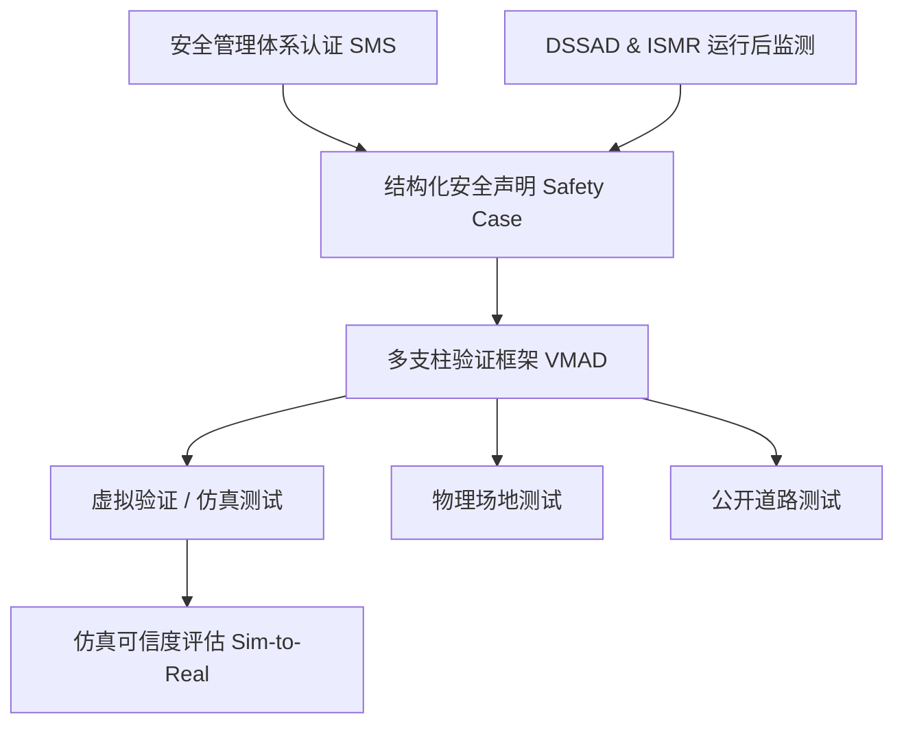

# 全球自动驾驶的“大一统”法典：深度拆解联合国WP.29首个ADS GTR与实体刹车踏板的消亡

2026年6月24日至25日，在日内瓦万国宫举行的联合国世界车辆法规协调论坛（WP.29）第199次会议上，一项历史性的里程碑诞生了：论坛正式通过了全球首个《自动驾驶系统全球技术法规》（ADS GTR）。这一由欧盟、美国、中国、日本、加拿大和英国联合牵头起草的统一框架，为全无人驾驶Level 4和Level 5系统的落地部署奠定了技术与组织维度的“世界标准”。

对于全球Robotaxi（自动驾驶出租车）和自动驾驶卡车行业而言，这无异于一场自动驾驶领域的“威斯特伐利亚和约”。在此之前，各个国家碎片化的测试指南和技术门槛构成了极高的准入壁垒；而ADS GTR的通过，用一套大一统的全球准入验证框架取代了各自为战的混乱局面。这意味着，一家自动驾驶研发商只要按照该标准设计并验证其安全架构，就能在多国司法管辖区内直接横向扩张，免去了因适配地方法规而被迫重构整车安全架构的巨大成本。

### ADS GTR 的五大核心支柱

ADS GTR的发布，标志着自动驾驶安全合规模式从过去死板的“物理指标审查”，彻底转向贯穿全生命周期的“整体安全保障”。该法规主要依托于以下五大核心支柱：

#### 1. 认证安全管理体系（SMS）
在汽车制造商将车辆提交类型批准（Type Approval）之前，必须先获得SMS（Safety Management System）体系认证。这是一套组织层面的安全治理系统，其核心要求包括：
*   **全生命周期可追溯性：** 研发商必须展示清晰的流程，将安全需求从最初的危害分析（基于ISO 26262功能安全和ISO 21448预期功能安全/SOTIF）一路映射到物理代码提交（Code Commits）和硬件测试验证。
*   **安全文化审计：** 由独立第三方对研发商的内部安全报告通道进行审计，确保底层工程师可以自由上报安全关键性的软件退化风险，而无需担心遭到企业管理层的打击报复。

#### 2. 结构化的“安全声明”（Safety Case）
ADS GTR的基石是结构化的“安全声明”（Safety Case）。这是一种由严密证据链支撑的系统性论证，旨在证明自动驾驶车辆在其定义的运行设计域（ODD）内“不存在不合理风险”。与传统罗列驾驶动作的合规清单不同，安全声明将高维度的安全主张（例如“车辆在低能见度的城市环境中不会碰撞行人”）与实证数据（如仿真覆盖率、封闭场地测试结果和形式安全证明）进行强绑定。这与评估自动驾驶产品的北美ANSI/UL 4600标准架构高度契合。

#### 3. 多支柱验证框架（VMAD）
由自动驾驶验证方法（VMAD）工作组开发的多支柱验证框架，采用了多重互补的测试方法论：
*   **虚拟验证（仿真测试）：** 法规明确承认，仅仅依靠物理路测，根本无法跑完验证ADS安全性所需的数十亿英里里程。因此，利用虚拟仿真覆盖极端边缘场景（Edge Cases）被确立为强制性要求。
*   **仿真可信度评估：** 仿真质量取决于其底层模型的真实度。为此，GTR引入了严格的可信度评估，要求开发商通过相关性指标，在数学上证明其仿真器与物理场地测试之间的吻合度（即Sim-to-Real虚拟到现实验证）。
*   **场地与实际道路测试：** 物理场地测试用于验证车辆在极限操控状态下的避障与安全应对能力，而公开道路测试则侧重评估车辆在常规驾驶状态下的行为逻辑以及人机交互。

#### 4. 自动驾驶数据记录系统（DSSAD）
DSSAD在车内扮演了自动驾驶“黑匣子”的角色。法规强制要求其记录以下关键数据：
*   系统运行状态（激活/未激活，ODD转换过程）。
*   人机交互界面（HMI）状态（接管请求、驾驶员在位检测）。
*   安全关键事件（碰撞、险情/Near-misses、紧急避险动作）。
*   数据必须以单次写入、防篡改的格式存储，以便为后续的事故重建和责任判定提供不可否认的证据。

#### 5. 运行中监测与报告（ISMR）
自动驾驶认证并非“一劳永逸”。GTR强制要求进行上市后常态化监管。运营商必须持续监控其商业运营车队，并定期向安全监管机构提交报告，内容涵盖系统意外脱离、关键安全异常，以及改变车辆动态驾驶行为的软件更新等。

### 技术争鸣：“优于胜任且谨慎的人类驾驶员”

在整个GTR规范中，最具争议、并在X.com（原推特）和Reddit上引发工程师群体激烈论战的，当属其性能基准定义。GTR规定，自动驾驶系统在其运行设计域（ODD）内的表现，必须“至少与胜任且谨慎的人类驾驶员一样安全”。

在X.com上，安全倡导者与科技高管围绕这一量化与质性标准的审计方式展开了交锋。

卡内基梅隆大学教授、自动驾驶安全领域的权威专家 **菲利普·库普曼（Dr. Philip Koopman）** 对简单的统计指标表达了强烈质疑：
> “行业极度偏爱使用‘净安全’（Net Safety）概念——即声称自己的车辆因为总体碰撞率低于人类平均水平，所以就更安全。然而，这里定义的‘胜任且谨慎的人类驾驶员’，绝对不是那些分心或醉酒的平均驾驶员。自动驾驶车辆绝不能犯下任何清醒且胜任的人类永远不会犯的荒唐错误，比如在光天化日之下，仅仅因为行人手里拿了件奇怪的物品，就无法识别对方。”

前美国国家公路交通安全管理局（NHTSA）安全顾问 **玛丽·“米西”·卡明斯（Dr. Mary "Missy" Cummings）** 也在X上发表了相似的观点：
> “仿真系统在重复简单的场景时确实表现出色，但它们无法模拟出人类建筑工人或应急救援人员那种混乱、无序的行为模式。定义‘谨慎’要求系统必须能够处理极端的语义不确定性，而这正是当前AI架构在泛化能力上依然面临的致命短板。”

为了填补这一理论与工程之间的鸿沟，部分厂商主张引入数学参考模型。Mobileye首席执行官 **阿姆农·沙舒亚（Amnon Shashua）** 一直极力推动将**责任敏感安全模型（RSS）**写入规范，用数学约束将“胜任且谨慎”的概念具象化：
> “你无法通过编程让自动驾驶汽车实现绝对零事故，因为其他道路使用者不可避免地会制造碰撞。但你可以通过编程确保车辆‘绝不主动引发’事故。只要维持数学公式定义的空间安全距离，并在数学上证明车辆的每一次操控都不会将其他车辆逼入避无可避的灾难境地即可。”

而在Reddit的r/selfdrivingcars板块，工程师们则将焦点对准了VMAD中“仿真可信度评估”的工程可行性。一位通过身份认证的自动驾驶工程师发帖称：
> “真正的工程瓶颈不在于软件代码，而在于物理引擎。当你在仿真中验证潮湿柏油路面上处于附着力极限的轮胎侧滑动力学时，虚拟轮胎模型与真实物理轮胎之间极细微的误差，就决定了系统究竟是成功避撞，还是发生致命失控。GTR的可信度评估把底牌亮得很清楚：如果你无法证明自己的仿真在极窄的统计区间内与场地测试对齐，那么你刷出的虚拟里程就毫无价值。”

### 落地本土：NHTSA与实体刹车踏板的终结

尽管WP.29 GTR确立了全球规则，但要真正产生效力，还需要各国将其转化为本土法律。根据联合国欧洲经济委员会（UNECE）《1998年协定书》的规定，各缔约国在通过全球技术法规后，有义务启动国内立法程序将其纳入国家法律体系。

在美国，这一合规进程正引爆一场前所未有的法规重构。**2026年6月25日**，美国国家公路交通安全管理局（NHTSA）正式启动了修改**联邦汽车安全标准第135号（FMVSS No. 135，轻型车辆制动系统）**的立法程序。

在此之前，FMVSS No. 135一直是阻碍量产无制动踏板车型的刚性制度壁垒。该标准极其僵硬地规定，车辆必须配备由手或脚物理操作的制动踏板。为了部署像Zoox这样没有刹车踏板的Robotaxi或定制无驾驶舱穿梭巴士，制造商以往必须依据联邦法规第49卷第555部分（49 CFR Part 555）申请临时豁免。而这种豁免上限极低——每家制造商每年最多只能部署2500辆，使商业化规模量产成为了空谈。

NHTSA此次提出的修正案彻底扭转了这一局面：
*   **控制装置豁免：** 针对完全由自动驾驶系统（ADS）操作、且不为人类驾驶员提供任何物理交互接口的车型，豁免其必须安装手动或脚踏式物理制动控制装置的要求。
*   **制动性能等效：** 车辆仍必须满足完全相同的制动距离和制动热衰退等性能指标。其合规性将通过替代性测试协议（如数字软件指令控制，或通过远程干预系统进行场地路测）来加以证明。

这一国内立法的松绑，与联合国WP.29 GTR形成了强大的合力。从此，汽车制造商可以只设计一套无踏板的通用整车底盘，就能在欧洲直接通过“类型批准”，并在美国进行“自我认证”，无需再为应对不同的地域法规而进行昂贵的机械重构。

### 法律与地方博弈：自动驾驶的新战场

随着联邦与国际监管标准的逐步落地，阻碍自动驾驶普及的阻力正加速向民事侵权、保险精算以及地方市政博弈等深水区转移。

#### 1. 责任主体的彻底转移
GTR框架的落地，从法律层面坐实了自动驾驶状态下责任主体的转移——事故责任从“人类驾驶员”彻底过渡到“ADS运营实体”（如汽车制造商或商业车队运营方）。如果一辆处于完全自动驾驶模式的车辆因软件缺陷引发碰撞，在侵权法层面它将被视作“产品责任纠纷”，而非传统的“驾驶员疏忽”。

#### 2. 精算模型的重构
对于保险巨头而言，传统的精算模型已经失效。保险公司不再评估驾驶员的个人人口统计学特征（如年龄、邮编、既往违章记录等），而是将评估维度切换为：
*   认证安全管理体系（SMS）的审计评级。
*   制造商“安全声明（Safety Case）”证据链的完整度。
*   DSSAD黑匣子记录的历史车队事故率。
现在的保费费率与车辆具体的软件版本（例如v5.4与v5.5的安全性差异）以及传感器配置方案深度绑定。汽车商业险实质上已演变为企业级产品责任险的一个分支。

#### 3. 地方自治权与联邦优先权的冲突
虽然NHTSA监管车辆的安全设计（这在法律上排除了各州自行设定不同汽车安全标准的空间，即联邦优先权），但具体到城市街道的日常管理，控制权依然牢牢掌握在地方市政手中。在旧金山、凤凰城、奥斯汀等自动驾驶核心测试区，城市行政部门与州/联邦监管机构的摩擦正日益加剧。

以旧金山交通局（SFMTA）为代表的市政机构一再强调，国家级的安全批准并不能解决局部都市的特有痛点，如自动驾驶车辆导致路口瘫痪、路边乘客上下车区域的安全隐患，以及对消防、救护等应急救援车辆的干扰。在全球框架出台后，各城市正积极游说以推行“市政地理围栏准入许可”。在这种模式下，城市在法律上有权根据本地的实时交通密度、施工日程和应急响应范围，对ADS的运行设计域（ODD）做出动态调整和限制。

联合国WP.29 GTR虽然在技术上解决了自动驾驶“如何验证安全”的全球标准，但Robotaxi在何时、何地能够驶上街头，依然是一场高度政治化、地方化的博弈。

---
