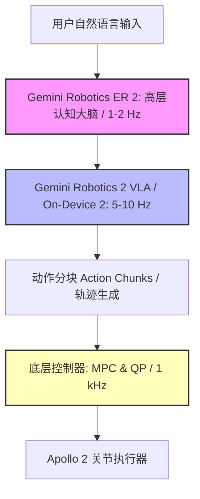

# 全身控制的终极博弈：深度拆解谷歌 DeepMind Gemini Robotics 2 与具身智能的“频率之争”

2026年7月30日，谷歌 DeepMind 正式发布了 Gemini Robotics 2 套件，这标志着具身智能（Embodied AI）领域迎来了一次重大的架构转向。这一发布意味着整个行业正在加速告别单一、特定任务的控制策略（narrow, task-specific policies），转向适用于人形及多关节机器人的统一全身智能（unified, whole-body intelligence）。

该套件由三款专用模型组成，旨在分担物理交互中的计算负荷：
1. **Gemini Robotics 2 (VLA)：** 统一的视觉-语言-动作（VLA）模型，直接将感官和文本输入映射为电机控制指令，在单一策略下实现全身协同（如下蹲、行走、平衡）。
2. **Gemini Robotics ER 2 (Embodied Reasoning)：** 基于 Gemini 3.5 Flash 构建的高层认知引擎。它利用 128k 的上下文窗口，实现亚秒级任务规划、多机器人协同分派以及自然语言交互。
3. **Gemini Robotics On-Device 2：** 经过量化的轻量化端侧 VLA model，专为边缘硬件本地运行而优化。它摆脱了对网络的依赖，且仅需不到 200 次演示，即可在短短数小时内完成对新运动学结构的本地适配。

为了展示这一全新架构，DeepMind 将该套件部署在了 Apptronik 的新一代 Apollo 2 人形机器人上。该机器人配备了 22 个自由度的 SharpaWave 触觉手和 Inspire 灵巧夹持器。在联合演示中，Apollo 2 与 Franka F3 Duo 双臂机械臂协同作业，将“清理工作台并对零件进行分类”等自然语言指令，转化为协同的全身行走、伸展以及精细动作执行。然而，在光鲜的演示背后，开发者与研究人员正面临着严峻的工程挑战，并围绕物理自主性的实现路径展开了一场根本性的辩论。

### 频率鸿沟：快速动作与慢速推理的冲突

在人形机器人上运行大型视觉自回归模型，核心工程瓶颈在于控制环路频率（control loop frequency）。传统的双足运动需要极高频的反向传播与反馈环路——通常在 500Hz 到 1000Hz（1kHz）之间——以动态求解平衡方程、计算关节转矩并应对外部扰动。相反，在边缘 TPU 硬件上运行像 VLA 这样拥有数十亿参数的 Transformer 模型，其推理频率通常被限制在 5Hz 到 10Hz。

为了弥合这一差距，DeepMind 采用了一种解耦的多频控制管线（multi-frequency control pipeline）：
* **规划层（ER 2）：** 运行频率为 1Hz–2Hz。它利用一个准确率达 91.3% 的全新视觉“瞬间寻找”（moment-finding）分类器来评估任务进度，从而判断子任务何时完成。
* **执行层（VLA / On-Device）：** 以 10Hz 的频率评估视觉输入，并生成短时域动作“分块”（action chunks，即持续 100ms–200ms 的运动轨迹）。
* **动态层（硬件固件）：** 在 Apollo 2 本地运行的经典模型预测控制（MPC）和二次规划（QP）求解器，频率高达 1kHz。它们负责对 VLA 生成的动作分块进行插值，并执行高频稳定控制。

尽管进行了这种解耦，但“分块问题”（chunking problem）依然是核心瓶颈。一旦执行层由于本地温度过载（thermal throttling）或网络切换而出现延迟抖动，底层控制器就不得不进行外推预测。在人形机器人行走时，质心偏差纠正若延迟 100 毫秒，就可能导致灾难性的倾倒。此外，以离散分块执行动作往往会在分块边界处引起微小震颤（micro-shuddering），这不仅会引入机械应力，还会加速关节磨损。

### 路线之争：端到端还是模块化？

Gemini Robotics 2 的发布，让机器人学界关于“端到端学习极限”的争论愈发白热化。

具身智能大模型领域的先驱学者 Jim Fan 博士强调了硬件的局限性：
> “VLA 模型的缩放定律（Scaling Laws）确实有效，但延迟依然是物理 AI 的终极 Boss。将推理与动作环路解耦是正确的一步，但在控制环路中以自回归方式运行 Transformer 依然是一种奢侈，边缘硬件在没有经过极限折衷量化的情况下几乎无法承受。”

Meta 首席 AI 科学家 Yann LeCun 则继续对物理动作的“Token 化”提出批评：
> “自回归地生成动作只是一种控制的幻觉。它极易导致误差累积，且缺乏真正的预测性世界模型。人形机器人不会通过预测下一个 Token 来维持平衡，它们依赖于基于能量的模型和物理约束。如果缺少表征空间（representation-space）的预测模型，这些系统在面对分布外（out-of-distribution）的物理场景时终将失败。”

相反，离线强化学习先驱 Sergey Levine 认为，数据量才是解决问题的根本。他提到了 Apptronik 刚刚在德克萨斯州奥斯汀启用的占地 90,000 平方英尺的“机器人公园”（Robot Park）设施：
> “瓶颈不在于架构，而在于数据。随着‘机器人公园’开始收集 Apollo 2 机群规模的真实物理交互数据，我们终于看到了大模型所需要的物理数据闭环。只要给统一的 VLA 喂入足够多样化的物理交互数据，它就能学到隐式物理规律，从而绕过人工设计的模块化边界。”

代表传统控制理论阵营的麻省理工学院（MIT）教授 Russ Tedrake 则警告不要完全抛弃形式化安全保障：
> “只有在底层配备了经典的、基于物理的安全护栏时，将 VLA 作为‘策略接口’才是可接受的。你不可能依靠 Transformer 的注意力权重图，来保证机器人在潮湿的仓库地面上行走时的稳定与安全。我们依然需要李雅普诺夫稳定性（Lyapunov stability）和控制理论来约束执行器的物理极限。”

### 物理幻觉与 ASIMOV-Agentic 安全基准

在数字世界中，模型幻觉最多生成错误的文本或图像。但在物理部署中，一个幻觉指令可能导致一台重达 160 磅的人形机器人将其执行器推向机械极限，从而造成硬件损毁甚至危及周围人员的安全。

为了量化并降低这些风险，DeepMind 推出了 **ASIMOV-Agentic** 安全基准，并在 Hugging Face 上以 CC-BY-4.0 许可开源了评估代码与数据集（`google/asimov_agentic`）。该基准将关注点从数字对齐转向了跨三个维度的代理安全编排：

| 评估指标 | 评估参数 | 技术执行方案 |
| :--- | :--- | :--- |
| **安全拒绝** (Safety Refusal) | 拒绝不安全指令 | 高层规划过滤器拦截违反运动学或安全包络线的指令。 |
| **不确定性解决** (Uncertainty Resolution) | 主动请求人工干预 | 计算 Token 分布熵；若置信度低于设定阈值，机器人将立即停机并向人类操作员发出求助信号。 |
| **距离编排** (Proximity Orchestration) | 人机安全合规 | 结合 ER 2 的视觉追踪功能，实时监测 2 米范围内的活动人体，从而自动触发低速运行状态或紧急物理关机。 |

尽管 ASIMOV-Agentic 提供了一套标准化的测试工具，但关于“数字仿真能否让机器人做好应对现实世界熵增的准备”依然存疑。仿真环境很难模拟现实中多变的表面摩擦力、光照的骤变、传感器遮挡，以及在五指触觉任务中出现的微小打滑等混沌边缘情况。

### 商业化落地判词

Gemini Robotics 2 确实代表了具身智能向前迈出的重要一步，但它尚未做好在无人值守的仓库或零售环境中进行商业化部署的准备。本地运行 VLA 的巨大算力开销、物理幻觉的潜在风险，以及缺乏严密的形式化稳定性证明，意味着在实际应用中“人类在环”（human-in-the-loop）的安全监督仍然不可或缺。

尽管如此，奥斯汀 Apollo 2 机器人机群带来的持续数据反馈，结合谷歌的多层模型栈设计，表明认知推理与底层物理控制之间的技术鸿沟正在被加速抹平。
