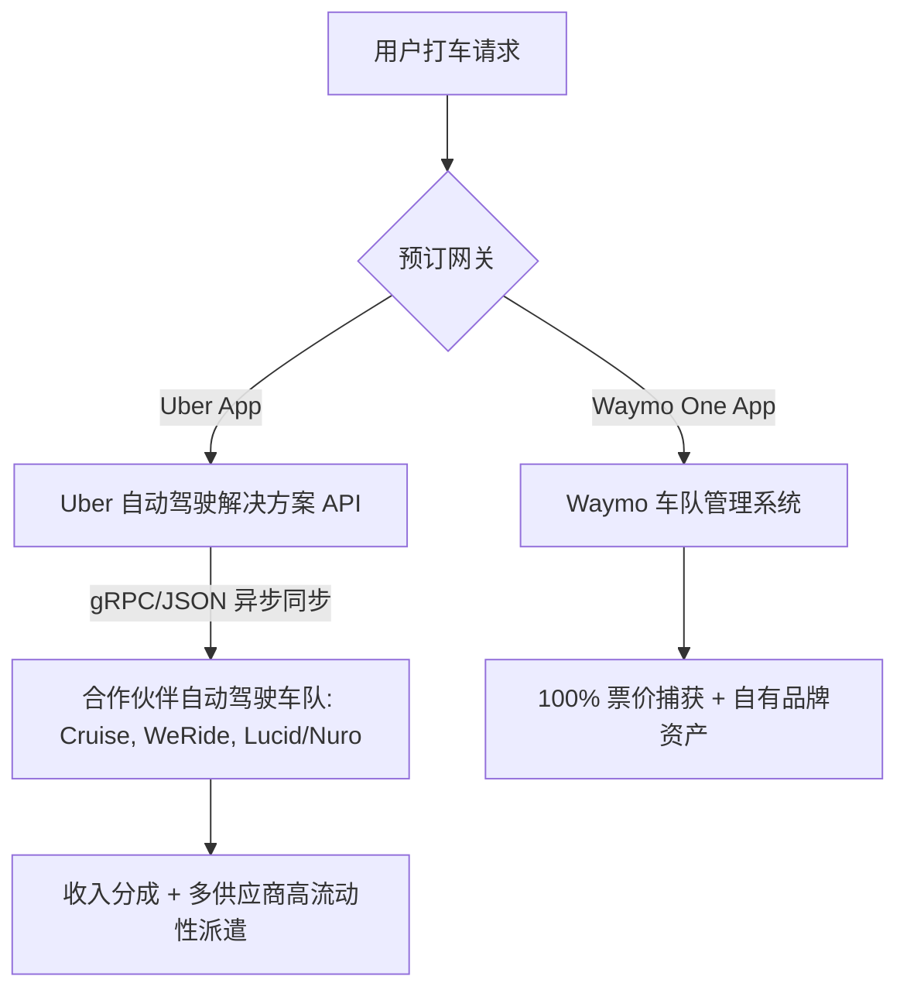

# **凤凰城“解耦”：Waymo的第一方闭环豪赌，与Uber的自动驾驶“中间件”生死速递**

2026年5月，Uber与Alphabet旗下Waymo在亚利桑那州凤凰城低调结束了其无人驾驶出租车（Robotaxi）试点项目。这一事件成为自动驾驶（AV）行业发展的分水岭。在过去三年中，凤凰城一直是多平台融合的“沙盒”——在这里，用户打开Uber App，就有可能呼叫到一辆完全无人驾驶的Waymo Jaguar I-PACE。

然而，双方均证实该试点项目已按合同约定到期。尽管两家公司在奥斯汀和亚特兰大依然维持着活跃的伙伴关系，但凤凰城的退出彻底暴露了自动驾驶出行经济学中底层的核心战略冲突：**究竟谁拥有用户，利润链条条条大路又该如何分羹？**



### 战略摩擦：毛利鲸吞 vs. 平台规模
这种紧张关系在结构上是必然的。Waymo在凤凰城积累了足够的运力密度和用户信任后，开始将战略重心向其自有的 **Waymo One** 客户端倾斜。在高密度市场中，如果消费者愿意为了打到无人车而专门下载一个独立App，那么向Uber这样的平台支付20%到30%的佣金（抽成）显然是不划算的。通过保留第一方入口，Waymo不仅能吃下100%的票价毛利，更能沉淀直接的品牌资产。

相反，Uber首席执行官达拉·科斯罗萨西（Dara Khosrowshahi）长期以来一直在鼓吹Uber作为不可或缺的“空中管制中心”和需求聚合器的价值。针对单一品牌车队的经济可行性，科斯罗萨西曾多次强调：
> “运力利用率才是这场游戏的生死线。如果你造了一辆无人车，但因为匹配池太小导致它有70%的时间在闲置，你根本无法覆盖硬件的折旧成本。而Uber提供的是全球化、高流动性的匹配网络，能让车轮不停地转下去。”

然而，资本市场正在用脚投票。Altimeter Capital创始人布拉德·格斯特纳（Brad Gerstner）在2024年底将其投资组合移出Uber，他指出，自动驾驶的竞争终局终究由“价格与便利性”决定。尽管他高度赞赏Waymo的产品体验，但他同时指出，独立运营商在历史上往往受限于“规模不足（subscale）”。这留下了一个关键悬念：Uber能否建立足够庞大的第三方运力联盟，来对抗一个垂直整合的闭环帝国？

与此同时，Uber前首席商业官埃米尔·迈克尔（Emil Michael）则对昔日的战略转型扼腕叹息，他认为2017年特拉维斯·卡兰尼克（Travis Kalanick）的离职让Uber彻底失去了全面垂直主导的机会：
> “当年我们［通过先进技术集团 ATG］仅落后Waymo半步。但投资者急于看到短期毛利，逼迫我们出局，从而失去了打造万亿级垂直整合帝国的机会。如今，Uber只能被迫成为一个中间件平台。”

---

### 算法割裂：孤立派单的隐性运营成本
当自动驾驶车队从统一的聚合平台（如Uber）中解耦，其对整个车队运营效率的打击是立竿见影的。

网约车经济学的核心指标是**车队利用率（$U_f$）**，定义为：

$$U_f = \frac{T_{\text{paying}}}{T_{\text{paying}} + T_{\text{deadhead}} + T_{\text{idle}}}$$

其中：
*   $T_{\text{paying}}$：运送付费乘客的时间。
*   $T_{\text{deadhead}}$：空驶前往接客点的时间（Deadheading）。
*   $T_{\text{idle}}$：车辆静止等待派单的时间。

在统一的调度市场中，Uber会在2到5秒的滚动时间窗口内运行**动态二分图匹配算法**（dynamic bipartite matching algorithm）。系统并不急于进行局部最优匹配，而是求解全局优化问题，以最小化人类司机和多个自动驾驶伙伴车队的空驶时间 $T_{\text{deadhead}}$：

$$\max \sum_{i \in I} \sum_{j \in J} w_{ij} x_{ij}$$

约束条件为：
$$\sum_{j \in J} x_{ij} \le 1 \quad \forall i \in I$$
$$\sum_{i \in I} x_{ij} \le 1 \quad \forall j \in J$$

其中 $I$ 代表乘客呼叫请求，$J$ 代表可用车辆，$x_{ij} \in \{0, 1\}$ 表示派单决策，而 $w_{ij}$ 是权重矩阵，代表预估到达时间（ETA）、车辆兼容性以及系统路由成本。

当Waymo完全转向第一方生态后，流量池被硬生生撕裂。一辆Waymo无人车和一辆Uber的第三方无人车可能会在同一条路上反向驶过，只为前往数英里外接走各自平台上的用户。这种低效的空驶（Deadheading）在Reddit的 r/selfdrivingcars 社区引发了热议。一位用户写道：
> “直接在Waymo One上叫车体验确实高档且一致。但在坦佩的晚高峰期，我必须在Waymo、Uber和Lyft之间来回切换，看看到底谁的车能在15分钟内赶到。这种应用生态的割裂完全是历史的倒退。”

---

### API工程：标准化“车端到云端”的自动驾驶接口
为了反击Waymo的垂直闭环，Uber推出了**Uber Autonomous Solutions**（Uber自动驾驶解决方案），这是一套标准化的API套件，旨在快速接入非自有的自动驾驶运力——其中最引人瞩目的是全新的**Lucid-Nuro联盟**，该联盟将Nuro的L4级“Nuro Driver”软件栈集成到了Lucid Gravity SUV中。

为了使这个多伙伴网络顺畅运转，Uber的平台必须以毫秒级的延迟，异步摄取车辆遥测数据并协调派单。

#### 1. 遥测数据摄取（gRPC流）
Uber使用gRPC遥测流来标准化状态摄取，允许合作伙伴以5–10 Hz的频率推送车辆状态更新。以下是代表遥测帧JSON序列化的示例载荷：

```json
{
  "vehicle_id": "lucid-gravity-nuro-778X",
  "timestamp": "2026-07-02T23:18:10.000Z",
  "location": {
    "latitude": 33.448376,
    "longitude": -112.074036,
    "bearing_degrees": 182.4,
    "speed_mps": 11.2
  },
  "state": "AVAILABLE",
  "diagnostics": {
    "battery_soc_pct": 82.5,
    "thermal_loop_celsius": 34.0,
    "sensor_status": "NOMINAL"
  }
}
```

#### 2. 订单生命周期状态机
Uber的中间件将乘车请求转化为标准化的gRPC调用，发送给合作伙伴的车队调度系统（如Nuro云端）。其状态机转换路径如下：

```
[AVAILABLE] ── DispatchOfferRequest ──> [OFFERED] ── Accept ──> [EN_ROUTE] 
                                                                    │
[COMPLETED] <── TripComplete <── [IN_PROGRESS] <── Arrived <────────┘
```

#### 3. 智能舱内体验（UX）状态同步
Uber伙伴关系模式面临的主要技术瓶颈之一，是在不直接拥有硬件所有权的情况下，如何保障统一的、品牌化的智能座舱体验。Uber通过一套基于WebSocket的同步协议，架起了用户端App、Uber后端以及车辆原生车机系统（Nuro/Lucid）之间的桥梁。

当乘客在Uber App中调节空调温度或切歌时，请求将通过Uber的自动驾驶网关进行路由：

```http
PUT /v1/av/vehicles/lucid-gravity-nuro-778X/cabin/control
Content-Type: application/json

{
  "target_temperature_celsius": 21.0,
  "media": {
    "playback_source": "SPOTIFY",
    "track_id": "spotify:track:4PTG3Z6ehRCoh3"
  },
  "haptic_halo_color": "#FF5500"
}
```

#### 4. 运行域外（OOD）降级与救援路径规划
当自动驾驶汽车遇到无法自行解决的运行设计域（OOD）事件（例如局部施工、临时警用路障或传感器被泥沙遮挡）时，车辆会进入安全停靠状态。

为了避免乘客被困在路边，Uber的API提供了一套标准的**救援路规划协议**（Rescue Routing Protocol）。当遭遇异常时，自动驾驶合作伙伴会立即发送一个Webhook异常通知：

```json
{
  "event_id": "err-9921-nuro",
  "vehicle_id": "lucid-gravity-nuro-778X",
  "error_code": "OOD_MINIMUM_RISK_MANEUVER",
  "passenger_present": true,
  "fallback_requested": "TRIGGER_HUMAN_RESCUE"
}
```

Uber的派单系统会瞬间处理该请求，自动终止当前的自动驾驶行程，并就近秒级派单给一位人类UberX司机赶往无人车的GPS坐标，实现目的地状态和计费结构的无缝迁移。

---

### 闭环生态与开放平台的终极博弈
Waymo能否依靠垂直护城河笑到最后？还是Uber的横向中间件生态将赢得终局？

| 评估维度 | 垂直闭环模式（Waymo One） | 开放平台模式（Uber Autonomous Solutions） |
| :--- | :--- | :--- |
| **核心优势** | 软硬件一体化程度更高；100%票价毛利留存。 | 拥有无可匹敌的需求流动性池；支持人类司机混合降级回退。 |
| **资本属性** | 重资产；需自行持有车辆或深度定制租赁。 | 轻资产；借力合作伙伴车队（如Lucid/Nuro、Cruise）。 |
| **体验一致性** | 极高；可实现对车辆和座舱的深度端到端控制。 | 参差不齐；高度依赖合作伙伴硬件API的开放度。 |
| **网络覆盖密度** | 低到中等；受制于L4高精地图的测绘扩展速度。 | 极高；依托混合派单网络实现无缝覆盖。 |

Waymo在凤凰城将运力收归第一方的决定是一次大胆的“独立宣言”。通过重组车队，Waymo正在进行一场豪赌：它相信自己的品牌溢价和产品体验，足以对抗用户在不同App间来回切换的烦恼。

然而，随着Uber开始大规模测试其基于gRPC驱动的API平台，并在旗下逐步整合Cruise、文远知行以及庞大的Lucid-Nuro车队，这种横向网络效应的雪球只会越滚越大。从长远来看，这场Robotaxi终局之战的赢家，或许并不属于那个编写出最强无人车司机的公司，而是属于那个扼住了最强派单调度API通道的巨头。

---
