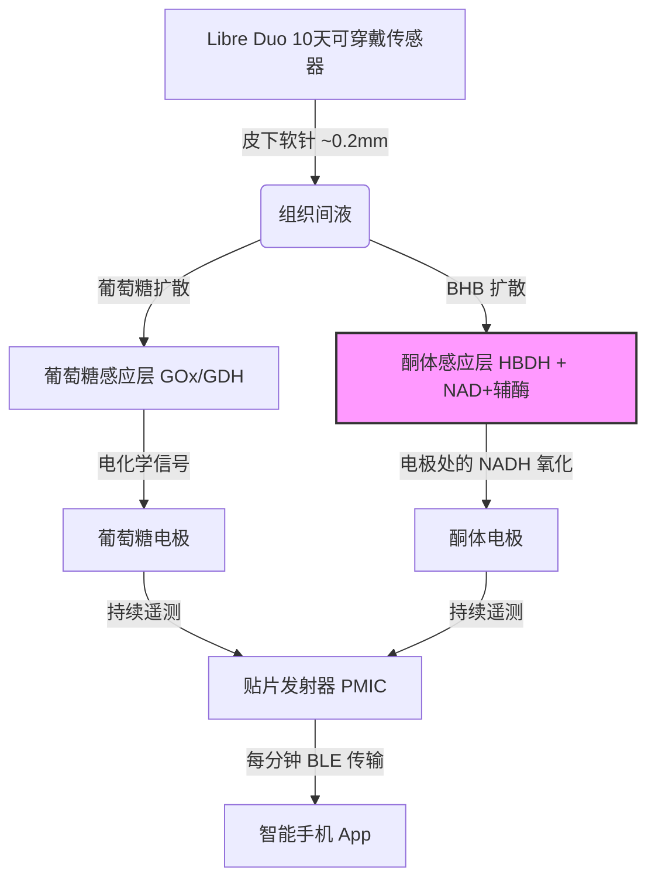

# 分子魔镜：拆解雅培 Libre Duo 获批背后的电化学攻坚与 iCGK 生物可穿戴新战局

硅谷对代谢追踪的痴迷早已不是新闻。多年来，创始人、风险投资人（VC）和“生物黑客”们像佩戴荣誉勋章一样佩戴着连续血糖监测仪（CGM），试图破解自己的胰岛素反应并优化日常精力。然而，血糖只是人体代谢宏大版图的半壁江山，另一半则是酮体——这是我们身体从碳水化合物代谢过渡到脂肪氧化时所产生的分子。

2026年8月25日，美国食品药品监督管理局（FDA）授予雅培（Abbott）旗下 Libre Duo 10天连续血糖酮体双监测系统 De Novo 许可（即首次注册审批），奠定了历史性的行业里程碑。作为美国首款获批的双传感器可穿戴设备，该系统能每分钟测量一次皮下组织间液中的血糖和酮体浓度，并将实时遥测数据无缝传输至用户的智能手机。

在官方新闻稿的冠冕之辞背后，其实交织着一场复杂的电化学工程攻坚战、一个全新的 FDA 监管路径，以及医疗刚需与生物黑客精英文化之间正悄然酝酿的冲突。



### 电化学攻坚：如何在体内锚定易溶的辅酶因子？
要理解雅培的这一突破，必须深入剖析其皮下软针（subcutaneous filament）上的分子级架构。该软针粗细仅约0.2毫米（与 Libre 3 相当），却必须在防止化学交叉干扰的前提下，同时承载两套截然不同的酶促电化学反应体系。

连续血糖监测（CGM）技术已相当成熟。它通常依赖于固定在工作电极上的葡萄糖氧化酶（$GOx$）或葡萄糖脱氢酶（$GDH$）。反应物自成一体且极为稳定，使得传感器能够轻松运转长达两周。

然而，测量 $\beta$-羟基丁酸（BHB）——这一与营养性生酮及糖尿病酮症酸中毒（DKA）最为相关的关键酮体——其技术难度呈几何级数上升。传感器必须使用 $\beta$-羟基丁酸脱氢酶（$HBDH$）来催化 BHB 氧化为乙酰乙酸。与无需外源辅酶的 $GOx$ 不同，$HBDH$ 的工作高度依赖于烟酰胺腺嘌呤二核苷酸（$NAD^+$）辅酶：
$$\text{BHB} + \text{NAD}^+ \xrightarrow{\text{HBDH}} \text{乙酰乙酸} + \text{NADH} + \text{H}^+$$
为了产生电信号，反应生成的 $NADH$ 必须在酮体工作电极表面发生氧化反应：
$$\text{NADH} \rightarrow \text{NAD}^+ + \text{H}^+ + 2e^-$$
这里的核心工程瓶颈在于：$NAD^+$ 和 $NADH$ 是极小、高水溶性且极易发生迁移的分子。在皮下组织间液的流动环境中，它们会迅速脱离电极并扩散（即“流失”）到患者的组织液中。这种流失不仅会在数小时内导致传感器灵敏度骤降、信号严重飘移，还可能引发体内毒性风险。

雅培在近期专利中披露的独家解决方案是采用一种多层水凝胶聚合物基质。他们将 $NAD^+$ 辅酶与 $HBDH$ 共同通过共价键锚定或封装在副工作电极表面的交联聚合物网络中。外层的保护性半透膜一方面能严密锁住这些活性反应组分防止其流失，另一方面又允许葡萄糖、酮体和氧气自由扩散通过。

此外，为了在仅靠一粒微型纽扣电池驱动的情况下，保障这两套电化学传感化学反应持续运作，并维持每分钟一次的低功耗蓝牙（BLE）数据传输，雅培对发射器的电源管理集成电路（PMIC）进行了深度的功耗优化，以确保设备能撑过其10天的完整临床寿命。

### 监管红利：iCGK 新通道的开辟
Libre Duo 获批带来的监管层面的深远影响同样不容小觑。由于此前美国市场上没有任何同类前置产品（predicate device），FDA 专门为此开辟了一个全新的监管分类：**集成式连续血糖与酮体监测（iCGK）**路径。

与现有的 iCGM（集成式连续血糖监测）标准平行，iCGK 分类设立了极为严苛的特殊控制指标。这些控制指标明确规定了平均绝对相对偏差（MARD）的准确度基准、产品标签规范以及临床试验方案。雅培为此项 De Novo 申请提交了涵盖6项临床研究、超过600名受试者的翔实数据。

不过，临床试验也暴露了双传感器在机械结构上的权衡：在成年人受试者中，传感器的10天完整存活率达到了 84.1%；而在儿童受试者中，这一比例降至 68.8%。这客观反映了如何让集成了双重化学体系的传感器在活泼多动的儿童身上贴牢10天的物理挑战。

通过确立 iCGK 路径，FDA 实际上为整个行业绘制了一张监管路线图。包括德康（Dexcom）在内的老牌对手或新兴代谢健康初创公司，今后在申请 510(k) 快速审批时，均可将 Libre Duo 10 Day 作为前置对比设备（predicate device），从而大幅缩短多指标可穿戴传感器的上市进程。

### 临床范式转移：从“被动救火”到“主动防御”DKA
对于 1 型糖尿病（T1D）患者而言，连续酮体监测（CKM）意味着他们的疾病管理模式将从“被动的应急响应”彻底转变为“主动的预防控制”。糖尿病酮症酸中毒（DKA）是一种危及生命的急性并发症，当体内严重缺乏胰岛素时，身体被迫加速分解脂肪，导致酮体毒性累积并酸化血液。

传统的酮体监测不仅频率低，而且存在严重的滞后性。患者通常要在身体已经出现不适，或者血糖仪读数突破 250 mg/dL 之后，才会通过指尖血酮仪或尿酮试纸进行零星检测。这种旧模式在两个致命场景下会完全失效：
1. **尿酮滞后效应**：尿液检测反映的是数小时前的血液化学状况，无法捕捉急剧的代谢崩溃。
2. **正常血糖性酮症酸中毒（Euglycemic DKA）**：随着 SGLT2 抑制剂（如恩格列净 Jardiance、达格列净 Farxiga）的普及，部分患者即便血糖处于正常水平，也可能发展出严重的 DKA。此时，传统的连续血糖仪（CGM）会给患者提供虚假的安全感。

```
Libre Duo 应用程序酮体预警逻辑：
[低于 0.6 mmol/L]   --> 正常代谢范围（屏幕优先显示血糖数值）
[0.6 - 3.0 mmol/L]  --> 酮体水平升高（提供趋势追踪与方向箭头指示）
[达到或高于 3.0 mmol/L] --> DKA 危险区（即刻触发高血酮紧急警报）
```

Libre Duo 则扮演了全天候自动早期预警系统的角色。它在后台悄无声息地持续监测酮体。一旦发现 BHB 水平在 0.6 至 3.0 mmol/L 之间攀升，系统便会显示趋势箭头；而一旦酮体跨过 3.0 mmol/L 的警戒线，手机 App 将立刻拉响紧急高警报。这得以为患者和医生争取到数小时的黄金干预窗口，以便在需要紧急住院之前及时补充体液和胰岛素。

### 市场博弈：医疗刚需与硅谷“生物黑客”的文化冲突
虽然临床医生将 Libre Duo 誉为糖尿病安全领域的里程碑式突破，但在大健康与生物黑客圈子里，这项技术同样激起了极其强烈的狂热——并伴随着不小的争议。追求抗衰老长寿的极客以及生酮饮食的拥趸们，正迫不及待地想要实时追踪自己的“营养性生酮”状态（通常在 0.5 至 1.5 mmol/L 之间），以期优化大脑认知表现、线粒体健康以及细胞的“代谢灵活性”。

正如斯坦福医学博士、代谢健康平台 Levels 联合创始人 Casey Means 在社交媒体 X 上所言：
> “连续血糖酮体双监测是我们代谢状态的终极镜子。通过跨越血糖，实时追踪酮体和乳酸，我们正在开启代谢灵活性的新时代。我们不再靠猜测自己是否在燃烧脂肪，而是真真切切地看到它。FDA 的这次批准是主动代谢健康管理的巨大胜利。”

然而，医疗界却对潜在的供应链压力和“警报疲劳”（alarm fatigue）提出了警告。如果身体健康的消费者纷纷通过非正规途径开取处方来购买 Libre Duo，势必会挤占本就紧张的产能，从而可能导致那些指望依靠该设备救命的 1 型糖尿病患者陷入无机可用的境地。

不仅如此，一条无形的社会经济鸿沟正悄然浮现。Libre Duo 10 Day 被归类为处方级（Rx）医疗器械。而雅培面向普通消费者的健康产品线 Lingo 目前仍仅局限于血糖追踪，且至今尚未公布任何支持酮体或乳酸监测的消费级版本发布计划。这意味着，一方面胰岛素依赖型患者还需在未来的医保与联邦医疗保险（Medicare）报销谈判中艰难拉锯，以期能用得起这款新器械；另一方面，财力雄厚的生物黑客们却早已准备自掏腰包，通过非官方处方抢先购入。

著名抗衰老医学专家 Peter Attia 博士在其播客中指出：
> “连续酮体监测必将成为 1 型糖尿病患者安全管理的游戏规则改变者，尤其是在 SGLT2 抑制剂被广泛使用的情况下。但对于普通大众来说，我们必须警惕警报疲劳。在健康人群中追踪 0.2 mmol/L 的酮体波动只是杂音，而非有效信号。我们不希望健康人因为正常的生理性酮体波动而陷入无谓的恐慌。”

雅培 Libre Duo 的问世，正式宣告了多指标可穿戴传感器时代的到来。这项技术究竟会作为糖尿病管理的临床重器被严密保护在围墙之内，还是会逐步下沉并引爆大众消费级健康市场？其背后的博弈将彻底重塑未来十年的代谢健康产业格局。
