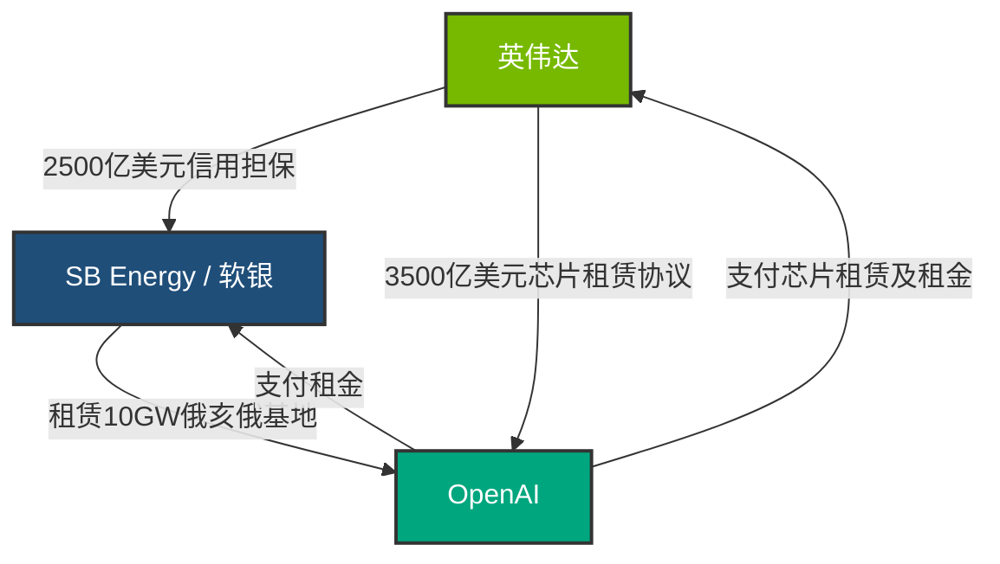

# **半万亿美元的致命循环：透视英伟达2500亿美金巨额兜底、OpenAI 10GW超级基地与AI产业的“朗讯阴影”**

AI 算力基础设施的军备竞赛已经正式跨越了拼夺单一算力集群的初期阶段，演变为一场简单粗暴的地缘政治圈地运动。在这场剧变的风暴中心，是一项规模空前的宏大交易：由软银旗下的 SB Energy 负责开发、位于俄亥俄州派克县派克顿（Piketon）的一座规划容量达 10 吉瓦（10GW）的超大型数据中心园区。其预定的核心租户是 OpenAI。而撬动这笔天文数字交易的金融催化剂，则是英伟达正在谈判中的一项高达 2500 亿美元的信用担保——用于为 OpenAI 的租赁合同进行债务兜底。

对于硅谷而言，该项目是山姆·奥特曼（Sam Altman）那页数万亿美元基建宏图的实体落地。但对于华尔街和资深科技分析师来说，这种交易结构却拉响了刺耳的警报，让人不禁回想起 2000 年代初期那场毁灭性的电信泡沫崩溃。通过为大客户的债务提供担保，使其有资金租用场地并反过来购买自家的芯片，英伟达正在采用一种极具争议的“卖方融资”（Vendor Financing）模式。

这究竟是一个解决系统性信用瓶颈的远见之举，还是一场可能拖垮整个半导体行业的致命金融循环？

---

### 金融炼金术：信用背书与自我循环

当前 AI 狂潮的核心金融瓶颈并非资金短缺，而是“信用不足”。OpenAI 是一家私有、架构极其复杂且目前仍处于亏损状态的实体。尽管其估值已飙升至 1500 亿美元以上，但它依然缺乏投资级信用评级。这导致它无法直接获取长达数十年、用于建设总投资达 5000 亿美元基础设施所需的巨额债务融资。

为了打破这一僵局，据知情人士透露，英伟达提议提供一项高达 2500 亿美元的财务担保。根据该协议，一旦 OpenAI 无法履行对 SB Energy 的租赁付款义务，英伟达将介入并代为偿付。这一担保实质上将信用风险从 OpenAI 那张未经市场周期检验的资产负债表，转移到了英伟达极其丰厚的流动资金储备上。

与此同时，两家公司还在同步谈判一项价值 3500 亿美元的芯片租赁协议，旨在用英伟达下一代加速器填满整个园区。

反对者指出，这是教科书式的“卖方融资”案例。在互联网泡沫时期，朗讯科技（Lucent Technologies）、思科（Cisco）和北电网络（Nortel）等电信巨头曾极具进攻性地为自己的买家（如当时涌现的竞争性地方交换运营商，即 CLEC）提供融资。然而，当这些初创公司无法从光纤网络中变现并产生现金流时，卖方融资随之爆雷，导致数十亿美元的资产减记，并引发了整个电信设备市场的总崩溃。

在 X.com 和 Reddit 上，相关争论已达到白热化。多位知名的科技评论家一针见血地指出了其中的系统性脆弱性：

> **@VC_Observer (X.com):** *“英伟达为 OpenAI 的租赁提供担保，好让后者回头来买英伟达自己的芯片，这是自朗讯时代以来我们见过的最典型的循环金融把戏。一旦 OpenAI 的模型商业化变现失速，整座纸牌屋都将轰然倒塌，最终砸回英伟达自己的资产负债表上。”*

相反，该交易的支持者坚称，将英伟达比作当年的朗讯是完全站不住脚的。在《BG2 Pod》播客中，主持人布拉德·格斯特纳（Brad Gerstner）和比尔·格利（Bill Gurley）对当前的资本支出（CapEx）扩张进行了深度剖析。格斯特纳指出，与 2001 年电信泡沫中那些无人问津的“幽灵光纤”不同，AI 算力是具备即时公用价值的高生产力资产。在最近的一期讨论中，他们探讨了英伟达如何实质上扮演了 AI 时代“投资银行”的角色：

> **布拉德·格斯特纳（Brad Gerstner，Altimeter Capital 创始人）：** *“传统银行根本不具备评估 GPU 集群价值或理解其折旧曲线的技术核保能力。而英伟达既有雄厚的资金，又有极高的行业能见度来承销这一风险。这使得物理基础设施能够以传统金融体系无法支撑的速度拔地而起。”*

英伟达首席执行官黄仁勋公开为这种创新金融结构进行了辩护，将其与传统重工业制造商的金融分支机构进行了类比：

> *“当约翰迪尔或福特为农民和车主提供贷款时，没有人会说这是‘自我循环’。我们建造的是 AI 工厂，这些工厂是能够长期产生现金流的资产。为基础设施注入种子资金，是对新一轮工业革命的战略性赋能。”*

---

### 地缘政治博弈：卢特尼克与派克县的电力话事权

建设一座 10GW 级别的园区不仅需要资本，更需要政治杠杆和庞大的能源供给。选定的厂址——俄亥俄州派克顿的波茨茅斯气体扩散厂（Portsmouth Gaseous Diffusion Plant）——是一处已退役的联邦浓缩铀工厂。由于这片土地属于联邦所有，其电力分配和场地重组受到美国能源部（DOE）的极严格监管。

美国商务部长霍华德·卢特尼克（Howard Lutnick）在此刻登场。作为联邦能源资产的核心“守门人”，卢特尼克直接决定了哪些科技巨头能够获得该基地的电力配额。尽管 OpenAI 目前处于领跑位置，但据报道，包括 Anthropic、谷歌和微软在内的其他 AI 巨头也已紧急与卢特尼克办公室接触，试图在这块 10GW 的电力蛋糕中分得一杯羹。

而让局势更加错综复杂的，是 2025 年底签署的价值 333 亿美元的《美日战略贸易与投资协定》。在这项双边框架下，日本财团和金融机构将直接在基地内出资建造一座 9.2GW 的天然气发电厂。鉴于 SB Energy 是日本软银集团的子公司，该交易呈现出一个高度协同的地缘政治联盟：日本资本出资发电，美国联邦土地承载基地，英伟达提供信用担保，而 OpenAI 则部署其智能大模型。

---

### 暴力工程学：10GW的残酷物理现实

为了让读者对 10 吉瓦（10GW）有更直观的认知：这相当于大约 10 座标准核反应堆的发电总量，或者大约 100 座典型超大规模数据中心的总和。在单一园区内管理如此庞大的负荷，带来了前所未有的工程与热力学挑战。

#### 1. 电网接入与变电站的极限挑战
当地电网运营商 AEP Ohio 无法直接从现有的区域电网引入 10GW 流量，否则将导致美国最大电网 PJM Interconnection 的系统性瘫痪。为避免这一灾难性后果，SB Energy 与 AEP Ohio 正共同投资 42 亿美元建设专用输电基础设施，包括全新的超高压变电站（运行电压达 765kV 或 345kV）以及与在建天然气发电厂的直接“表后接入”（Behind-the-Meter）连接。

#### 2. 液冷循环的工业级洪峰（以 Blackwell NVL72 为例）
由于英伟达 Blackwell 架构（如 NVL72）的极高功率密度（每个机架达 120kW 至 140kW），液冷方案已成为强制性要求。

对于一个部署了海量英伟达硬件的园区，其冷却循环需要极其恐怖的水力设计。假设园区的 10GW 总容量中，有 8GW 被纯粹用于算力计算（其余 2GW 留给照明、冷却配套及网络开销）：
* **算力功耗：** $8,000,000\text{ kW}$。
* **机架数量（按每个 NVL72 机架 120kW 计算）：** 约 66,667 个机架。
* **冷却液流速：** 现代冷量分配单元（CDU）需要为每千瓦（kW）功耗提供约 1.5 升/分钟的冷却液循环流量以维持硅片结温。
* **总体积流量计算：** 
  $$\text{流量} = 8,000,000 \text{ kW} \times 1.5 \text{ 升/分钟/kW} = 12,000,000 \text{ 升/分钟}$$
  这意味着，为了移动这股每分钟流量超过 317 万加仑的水-乙二醇混合物，园区需要庞大的工业级水泵和变频器（VFD）24小时不间断全功率运转。

#### 3. 无法逃避的“热力学之墙”与水资源消耗
如果该设施采用传统的开式蒸发冷却塔来排走 8GW 的废热，其水资源消耗量将达到天文数字。水的汽化潜热约为 2.26 MJ/kg。要通过蒸发散热带走 8GW 的热负荷：
* **蒸发速率：** 
  $$\dot{m} = \frac{8,000,000,000 \text{ W}}{2,260,000 \text{ J/kg}} \approx 3,540 \text{ kg/s (即升/秒)}$$
  这相当于每分钟需要蒸发掉 56,100 加仑（GPM）的水，折合每天消耗高达 8080 万加仑的水资源。

从派克县当地的地下水层或邻近的肖托河（Scioto River）抽取如此巨量的水，必然会激起极其强烈的环保阻力和监管限制。因此，工程设计必须妥协，全面采用闭式干冷塔（Dry Cooling Towers）。

然而，干冷技术随之撞上了物理学上的“热力学之墙”。当俄亥俄州南部夏季环境温度超过 35°C 时，干冷器很难将冷却液进口温度降回至芯片所需的 20°C - 25°C 区间。为了防止芯片因过热保护而降频（这可能导致 GPU 算力性能骤降 60%），园区必须强制启动大型工业冷水机组。这些冷水机组是耗电巨兽，会直接将数据中心的能效指标（PUE）从极高效的 1.15 暴拉至 1.45 以上。这部分额外的热管理负荷需要耗费多达 2.4GW 的电力，这极有可能瞬间撑爆园区本地的天然气发电极限。

---

### 挑战云巨头与新一代基建标准

派克顿项目代表了 AI 基础设施建设与融资模式的底层变革。在过去，AI 实验室只能依赖微软、亚马逊 AWS 和谷歌等超大规模云厂商来建造数据中心并租用算力。而如今，通过直接联手 SB Energy，并获得英伟达的巨额财务担保，OpenAI 试图彻底绕过微软等云巨头的垄断控制。

如果这一模式被验证成功，它将为未来定下“电力锚定、厂商兜底”的算力基建新范式。未来的开发商将不再是先建数据中心再去寻找电力，而是直接将数据中心捆绑建在发电厂身旁，并利用硬件设备商的资产负债表来承销债务。

然而，系统性的金融风险依然如影随形。一旦 OpenAI 的下一代大模型在商业变现上无法支撑起其数百亿美元的运营成本，英伟达就将面临可怕的清算：其资产负债表上将直接背负起这座位于俄亥俄州的庞大专用基地的租赁债务，同时手里还攥着数百亿贬值中的 GPU 闲置资产。

在这场生成式 AI 的豪赌中，半导体制造、房地产开发与国家主权贸易协定之间的界限已然消融。这座 10GW 的派克顿超级基地不再是一个单纯的算力中心——它已经成为了撬动半万亿美元金融实验的终极杠杆。

---
