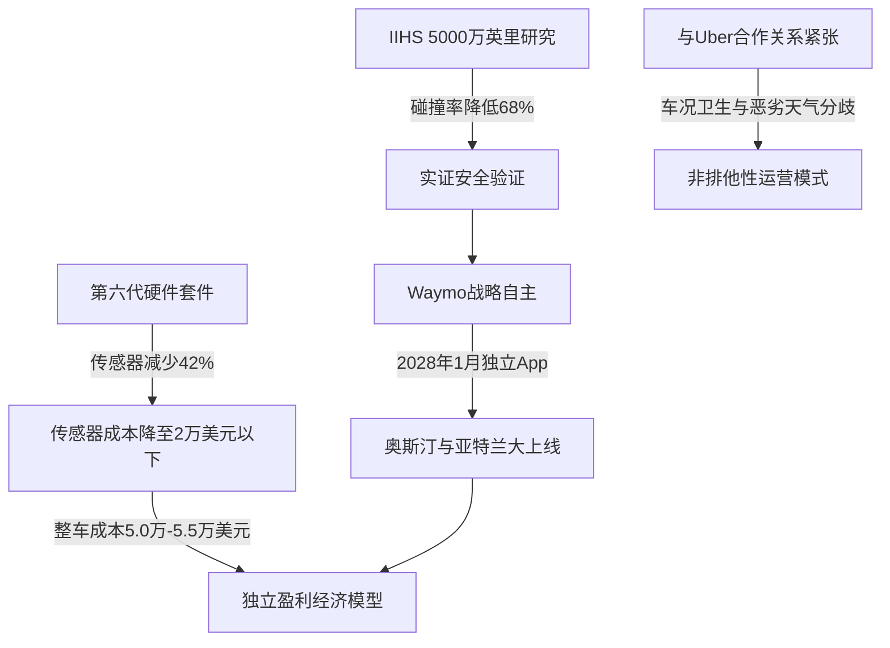

# 单飞的豪赌：Waymo 5000万英里安全大捷背后的商业裂变与Uber生死局

自动驾驶（AV）行业已迎来最关键的瞬态拐点。2026年7月，美国公路安全保险协会（IIHS）发布了一项具有里程碑意义的研究报告，题为《机器的崛起：高度自动驾驶车辆与人类司机的碰撞经历》（*Rise of the Machines: Crash Experiences of Highly Automated Vehicles and Human Drivers*）。研究人员分析了2021年至2024年间约5000万英里的无人类驾驶运营数据，并将其与菲尼克斯、洛杉矶、旧金山和奥斯汀四地累计达2220亿英里的人类驾驶数据进行了对比。得出的实证数据令人瞩目：与人类司机相比，Waymo的**警方可记录碰撞事故率降低了68%**。

对于硅谷的技术领袖而言，这一数据标志着人工智能正从空洞的AI概念走向坚实的物理现实。云存储巨头Box的首席执行官亚伦·莱维（Aaron Levie）近期评价道：“在旧金山坐上Waymo，会让你感觉自己真正置身于未来；而我手机里的一半AI应用，感觉都只是在苦苦寻找落地场景的过渡功能罢了。”

然而，这场安全技术的大胜，却伴随着一场激烈的战略决裂。Waymo已正式通知Uber，计划于2028年1月（即双方合同允许的最早日期）在奥斯汀和亚特兰大推出独立的打车软件，实际上提前宣告了排他性合作的终结。随着这两大出行巨头在单车经济学（Unit Economics）以及客户关系主导权上的矛盾日趋激化，行业不得不直面一个根本性问题：在失去Uber庞大的流量网络支持后，一个独立的Robotaxi服务能否建立起足够的运营密度与车辆利用率，从而实现自我盈利？



#### 还原IIHS的安全评估方法论
要客观看待IIHS的发现，必须理解该研究是如何进行数据对准的。长期以来，自动驾驶运营商的安全性对比一直存在“不平等条约”：由于联邦法规的强制要求，自动驾驶车辆必须上报每一桩极其微小的事故，甚至包括低速蹭到路沿石或轻微的保险杠碰擦；而人类司机在类似情况下几乎从不上报。

为了构建公平的“苹果对苹果”对比，IIHS过滤了原始数据，仅保留“警方可记录”的碰撞事故——即涉及人员伤亡、车辆损毁至需要拖车或造成重大财产损失的事故。在这种严苛的对比尺度下，Waymo的安全优势展现得淋漓尽致：
*   **整体碰撞率：** 比人类司机低 68%。
*   **单车事故率：** 降低了 85%，这极大证明了消除人类司机分心、疲劳驾驶及酒驾/药驾等负面因素后的显著效果。
*   **导致受伤的碰撞率：** 降低了 81%。

然而，细分到不同城市的数据则呈现出巨大差异。Waymo在**菲尼克斯实现了76%的碰撞率降幅**，在**洛杉矶降低了71%**，但在**旧金山仅降低了35%**。在**奥斯汀，Waymo的碰撞率甚至比人类司机高出了4%**（不过研究人员提醒称，奥斯汀的样本量极小，仅有55.5万英里）。

> [!NOTE]
> 旧金山碰撞率降幅较低（35%）揭示了当前自动驾驶架构的物理局限。旧金山连绵起伏的陡坡、多雾的沿海气候以及密集的行人和复杂路况，构成了层出不穷的边缘场景（Edge Cases），这对传感器融合算法与感知管道构成了持续的极限挑战。

#### 第六代系统的硬件降本账本
安全只是商业闭环的前半部分，后半部分则是资金使用效率。Waymo搭载于捷豹I-PACE上的第五代平台，其硬件与传感器套件的预估成本高达每辆车15万美元。在如此高昂的造价下，车队的大规模盈利根本无从谈起。

而Waymo第六代“Waymo Driver”自动驾驶系统通过自研芯片与传感器布局优化，将**总传感器数量削减了42%**，直击这一成本痛点：
*   **13个摄像头：** 升级为全新一代1700万像素图像传感器，具备更出色的动态范围，从而减少了实现360度无死角覆盖所需的摄像头总数。
*   **4个激光雷达（LiDAR）：** 相比上一代减少了1个，并针对厘米级城市追踪算法进行了专门优化。
*   **6个毫米波雷达与外部音频接收器（EARs）：** 提供全景雷达视野以及精准的紧急车辆（如警车、救护车笛声）声源定位。

重构后的硬件套件成本**降至2万美元以下**，传感器成本直接腰斩。当这些套件被集成到为Robotaxi量身定制的极氪车型（Zeekr "Ojai"）或现代IONIQ 5上时，一辆功能完备的Robotaxi整车成本将降至**5.0万至5.5万美元**。正是这一关键的成本跃迁，让Waymo有底气喊出要在**2026年底实现每周100万单付费出行**的宏伟目标。

#### 决裂Uber：抢夺终极客户关系主导权
随着硬件成本的断崖式下跌，自动驾驶下半场的战火迅速烧到了网络运营密度上。目前，Waymo在奥斯汀和亚特兰大的服务仅限通过Uber App进行呼叫。然而，Waymo执意于2028年1月上线其独立的独立打车应用（尽管非独家合作将持续至同年5月合同到期），充分暴露了其试图绕过中间商、自建护城河的野心。

据悉，两家巨头的合作关系在日常运营和财务博弈中已经逐渐恶化。Uber公开抱怨该协议带来的“不可持续的财务条款”，并指出在恶劣天气等关键时刻Waymo车辆经常性“下线”；而Waymo则反唇相讥，对Uber旗下车场管理的车辆调度合理性和车内清洁状况表达了强烈不满。

开启“单飞”模式后，Waymo旨在全权掌握用户入口，并卷走100%的打车费。然而，从零开始建立网约车供需匹配的“流动性”（Liquidity）极其艰难。一旦脱离了Uber庞大的乘客流量池，Waymo将面临车辆利用率飙升的噩梦，而“利用率低”正是导致重资产车队亏损的第一杀手。

为了分摊这一风险，Waymo正在积极测试备选路线。例如，它宣布与Lyft合作，于2026年在纳什维尔开展运营。在该模式下，Lyft旗下的车队运营子公司Flexdrive在纳什维尔国际机场附近运营着一个占地8万平方英尺的基地，专门为Waymo车队提供充电与维保服务。正如Altimeter Capital创始人布拉德·格斯特纳（Brad Gerstner）在《BG2》播客中所言：“自动驾驶的竞逐正在从软件开发过渡到车队运营，谁能率先在车辆利用率与维护成本之间找到平衡点，谁就将最终统治这个市场。”

#### 地方阻力与联邦事权之争
随着Waymo准备向圣迭戈和丹佛扩张，它正遭遇前所未有的地方政治阻力。在旧金山，市长丹尼尔·卢里（Daniel Lurie）在“7月4日瘫痪事件”后主导了市政层面的反弹——当时多辆Waymo车辆在拥堵的滨水区交通中集体宕机，堵死了多辆公共交通接驳车，最终不得不动用拖车清理现场。这给反自动驾驶激进组织“安全街道反叛者”（Safe Street Rebel）注入了新的声势，他们主张“行人优先”，通过在自动驾驶车辆的引擎盖上放置橙色交通锥来干扰传感器阵列，强行触发车辆的安全停滞保护。

作为回应，加州参议员戴夫·科尔特塞（Dave Cortese）提出了SB 1246法案，拟强制自动驾驶公司建立紧急规程以迅速移走抛锚车辆。但在本地科技界，Y Combinator首席执行官陈嘉兴（Garry Tan）对市政部门的一系列限制性政策大加鞭挞——例如旧金山国际机场（SFO）限制Waymo只能在租车中心接客，而不能进入主网约车停车场，他直斥这“纯粹是对既得利益者的地方保护主义”。

```
                             监管政策矩阵 (2026)
┌───────────────────────────┬─────────────────────────────────────────────────┐
│ 司法管辖区 / 法案             │ 核心条款及战略影响                              │
├───────────────────────────┼─────────────────────────────────────────────────┤
│ 华盛顿特区议会第 26-0684 号  │ 确立商业化监管路径；着重解决车辆“空驶”和         │
│ 提案                       │ 服务的地域公平性问题。                           │
├───────────────────────────┼─────────────────────────────────────────────────┤
│ 联邦 H.R. 7390 法案        │ 《自动驾驶法案》（SELF DRIVE Act）；推动安全标准 │
│                           │ 现代化，确立联邦对地方城市法规的“先占权”。       │
├───────────────────────────┼─────────────────────────────────────────────────┤
│ 联邦 S. 4429 法案          │ 《智能网联汽车安全法案》；禁止进口中国自动驾驶     │
│                           │ 软件和硬件。                                    │
└───────────────────────────┴─────────────────────────────────────────────────┘
```

目前，监管博弈的胜负仍未见分晓。诸如2026年联邦《自动驾驶法案》（H.R. 7390）等提案，旨在通过确立联邦法律的先占权（Preemption），来阻止地方城市随意阻挠自动驾驶项目的落地，但这些法案在国会依然面临着重重立法阻力。

这一轮监管政策的大辩论，也再次将自动驾驶技术路径的根本分歧推向风口浪尖。特斯拉首席执行官埃隆·马斯克（Elon Musk）长期以来一直公开唱衰Waymo对高精地图（HD Maps）的依赖，声称相比特斯拉的“纯视觉+端到端神经网络”战略，Waymo这种地理围栏限制的温室方案“根本毫无机会”。然而，正如IIHS研究所揭示的那样，恰恰是Waymo这种结构化、确定性的技术路线，为自动驾驶行业赢回了首份经受住实证检验的安全成绩单。随着技术的大规模铺开，Robotaxi终局之战的赢家不仅取决于谁拥有最顶尖的AI算法，更取决于谁能率先趟过地方政府阻力、硬件成本大关，以及独立车队运营这三座大山。
