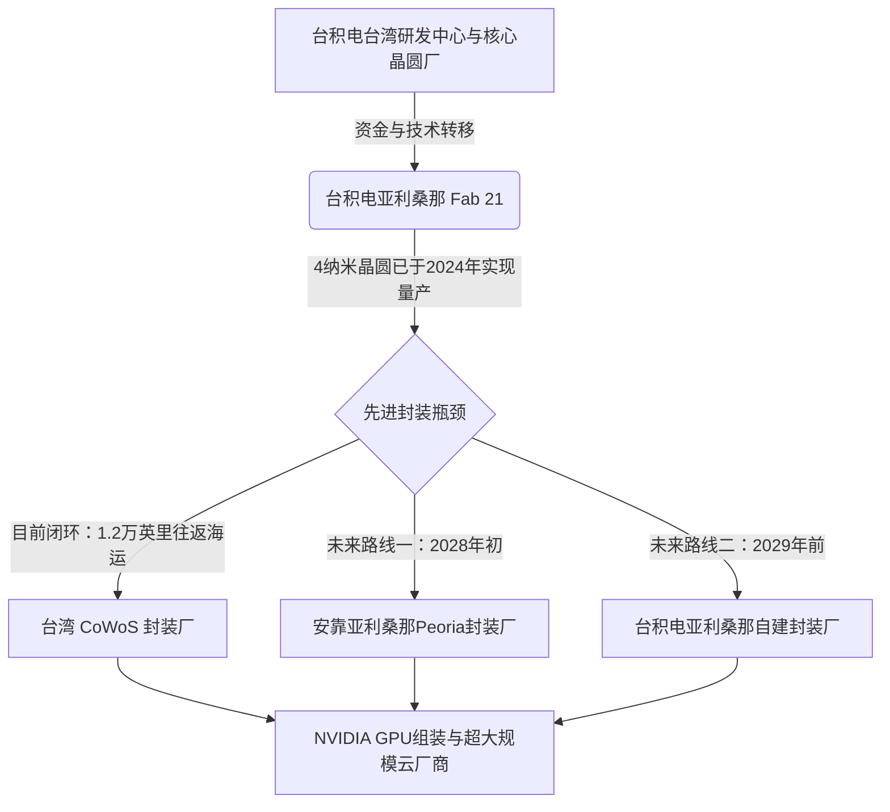

# 台积电的440亿美元亚利桑那豪赌：AI芯片“回美”背后的技术良率、文化断层与物流暗战

2026年7月2日，台湾地区经济部投资审议司正式批准了台积电向其全资子公司台积电亚利桑那（TSMC Arizona）增资200亿美元的申请。这是台湾监管机构第六次批准该项目的资金流出，使得台积电对亚利桑那项目的累计核准投资额达到了440亿美元。

这笔庞大的资金将直接用于推动台积电在菲尼克斯（Phoenix）打造的超大型晶圆厂集群（Gigafab Cluster）。该项目最初对外宣布为3座晶圆厂、投资额650亿美元的计划，但在2025年3月，台积电将该项目的预计总支出扩增至1650亿美元。根据最新规划，该集群将包含6座晶圆厂、2座先进封装厂以及1个研发中心。在《美国芯片与科学法案》提供的66亿美元直接赠款和最高达50亿美元贷款的加持下，菲尼克斯基地无疑成了现代半导体制造业历史上，规模最大、资金最密集的一场“将最前沿芯片产能移回美国”的超级豪赌。

然而，在政策大捷的耀眼光环背后，台积电不得不面对良率博弈、封装瓶颈以及根深蒂固的跨文化摩擦等多重严峻现实。

### 地缘政治的熔炉
推动芯片制造本土化的根本动因，源自于美国政界与科技界强烈的地缘政治焦虑。目前，全球90%以上的前沿逻辑芯片都诞生在台湾，尤其是台积电位于台南的晶圆18厂（Fab 18）。台海局势一旦出现封锁或冲突，全球科技经济将瞬间陷入瘫痪——微软、谷歌、Meta和亚马逊等科技巨头的超大规模数据中心将被断供，英伟达在AI领域的统治地位也将戛然而止。

为了消除这一致命的“单点故障”风险，美国政府向台积电施加了巨大的压力，其目标非常明确：在美国本土构建一个完全自给自足的、用于制造最关键计算引擎的半导体供应链。

### 前道良率：首战告捷，打破美工“手艺”质疑
起初，业界许多质疑者预测，由于美国本土缺乏经验丰富的半导体劳动力，台积电亚利桑那厂（Fab 21）将深陷低良率的泥潭。然而，实际的技术成果却有力地反驳了这些悲观预期。

2024年底，台积电美国区总裁凯西迪（Rick Cassidy）在一次行业研讨会上透露，Fab 21的良率比台湾同类晶圆厂高出约4个百分点。到了2025年10月，这一技术突破迎来了里程碑时刻：英伟达CEO黄仁勋亲自造访菲尼克斯厂区，并在首颗由美国本土制造的英伟达Blackwell芯片晶圆上签字。该芯片采用台积电定制的4NP工艺制程，这一成果向世人证明，Fab 21完全有能力生产全球最复杂的AI加速器。

展望未来，亚利桑那基地的技术路线图同样极具侵略性：
* **Fab 1**：目前正大批量生产4纳米（N4）晶圆。
* **Fab 2**：计划于2027年开始量产3纳米（N3）芯片。
* **后续晶圆厂**：随着厂区的持续扩张，台积电计划在此引入2纳米乃至革命性的A16（1.6纳米，采用背面供电技术）等更先进的工艺节点。

### 1.2万英里的运输后门：被卡脖子的先进封装
然而，制造出晶圆仅仅完成了长征的第一步。对于英伟达Blackwell和Rubin等架构的高性能AI加速器而言，其核心性能高度依赖台积电独家的**CoWoS（Chip-on-Wafer-on-Substrate）**先进封装技术。

CoWoS是一种2.5D封装技术，它将多个活性硅晶圆（如GPU计算核心）和高带宽内存（HBM）集成在硅中介层（Interposer）上。这个中介层通过微凸块（micro-bumps）和硅通孔（TSVs）连接，建立起高带宽、低延迟的通路。

目前，由于美国本土极度匮乏量产级的先进封装基础设施，在亚利桑那制造的晶圆必须漂洋过海，经历漫长的1.2万英里（约1.9万公里）往返运输回台湾进行CoWoS封装。为了打破这一关键物流瓶颈，台积电在2026年6月宣布与全球封测巨头安靠（Amkor Technology）达成十年战略合作。安靠正在亚利桑那州皮奥里亚（Peoria）建设封装厂，预计最快于2028年初投入运行，承接CoWoS和InFO（集成扇出）封装业务。此外，台积电也计划在2029年之前，将自建的CoWoS封装能力引入亚利桑那。

### 文化断层：东亚“爆肝”管理与美式“工作生活平衡”的剧烈摩擦
尽管技术层面的工程建设进展顺利，但生产管理和职场文化的碰撞却依然火药味十足。台积电在台湾的成功，在很大程度上建立在一种高强度、纪律严明且等级森严的企业文化之上。

台积电创始人张忠谋曾一针见血地指出过中美员工期望的巨大差异：在台湾，如果一台价值数千万美元的光刻机在凌晨2点发生故障，工程师接到电话后会毫不犹豫地赶回工厂就地解决；而在美国，员工更看重标准的工作与生活平衡，这意味着设备可能会一直闲置，直到早班人员来接手。

这种摩擦在Glassdoor和Reddit等社交平台上被无限放大。美国本土员工纷纷抱怨“军事化”的顶层向下管理、无休止的加班文化以及语言障碍（普通话与英语的沟通壁垒）。

这种运营的复杂性连台积电现任董事长兼CEO魏哲家都深有感触。他在一次大学演讲中坦言：
> “我们在亚利桑那建厂时，我甚至被逼得一边流泪一边参加各种沟通培训。起初我们认为美国土地广袤，盖个厂房能有多难？错了，在美国盖房子真的成了一件极其棘手的大事。”

### “美国溢价”与市场现实：谁在为本土化买单？
摆在整个半导体行业面前的终极问题是：究竟谁来为本土制造的巨额溢价买单？

早期，张忠谋曾预测，美国制造的芯片成本将比台湾高出50%到150%。麦格理银行（Macquarie Bank）此前也指出，由于必须在荒凉的沙漠中重建一整套用于特种化学品和原材料的本地化供应链，亚利桑那项目的运营成本可能比台湾高出30%。

然而，半导体研究机构TechInsights利用策略性成本模型给出的最新数据，却揭示了一个更出人意料的真相。据估算，在亚利桑那制造晶圆的实际加工溢价其实低于10%。这是因为现代半导体晶圆厂的自动化程度极高，直接清洁室人工成本在晶圆总成本中的占比不足2%。真正的成本大头来自于设备折旧（如ASML的EUV光刻系统），而这些设备的全球采购价格是完全一致的。

| 成本构成 | 台湾 Fab 18 | 亚利桑那 Fab 21 | 核心成本驱动因素 |
| :--- | :--- | :--- | :--- |
| **晶圆加工成本** | 基准 | 溢价 < 10% | 主要受全球统一的设备折旧成本主导 |
| **无尘室人工成本** | 基准 | 高额溢价 | 影响极小（得益于高度自动化，占晶圆总成本不足2%） |
| **运营间接开支** | 基准 | 溢价 20% - 30% | 受制于当地的化学品供应链与公用事业（水电）限制 |
| **先进封装 (CoWoS)** | 本土化完成 | 需外包（运回台湾） | 暂时的跨洋运输成本；安靠Peoria工厂将于2028年投产 |

尽管如此，英伟达等GPU供应商以及各大云服务厂商（Hyperscalers）仍不得不吞下这部分上涨的成本。尽管他们通过这一举措获得了地缘政治上的供应链韧性，但为了抢占美国本土产能而付出的高昂资本支出，注定将使AI硬件的定价在未来数年内持续维持在溢价区间。

### 生态大考：索诺兰沙漠中的“吞水巨兽”
在极度缺水的索诺兰沙漠（Sonoran Desert）中运行一座超大型晶圆厂集群，必然要面临严峻的生态考验。半导体制造是典型的“吞水”行业，每天都需要消耗数百万加仑的超纯水（UPW）来冲洗晶圆。

为了应对水资源短缺的危机，台积电在菲尼克斯厂区内部建设了一座工业废水回收处理厂。该设施利用先进的过滤和反渗透技术回收工业废水，目标是实现近乎零排放的液态水闭环循环。虽然这一举措符合了严格的环保法规，但这也为台积电亚利桑那厂平添了台湾晶圆厂无需负担的巨额环保资本支出。
