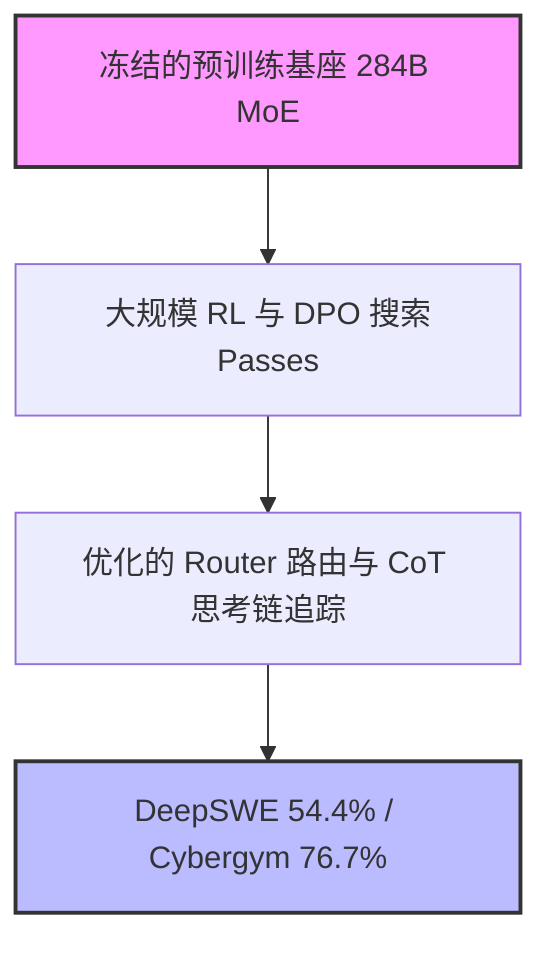

# 后训练的“幻觉”？拆解 DeepSeek-V4-Flash 的 600% 暴涨与百万 Token $0.0028 的残酷算账

2026年7月31日，全球人工智能行业迎来了一场无声却震撼的巨震。在没有改动任何参数拓扑和权重布局的前提下，DeepSeek 发布了全新版本 **DeepSeek-V4-Flash-0731**。这款混合专家（MoE）架构模型拥有 2840 亿总参数，每个 Token 的激活参数仅为 130 亿。然而，正是它在 DeepSWE 编程基准测试中实现了令人震惊的 600% 性能暴涨，并在 Cybergym 网络安全挑战赛中将得分几乎翻倍。

这次迭代在硅谷瞬间点燃了一场空前激烈的技术思辨：我们究竟是迎来了通过极限“再后训练”（re-post-training）实现算法优化质跃的曙光，还是已经无可挽回地堕入了一个针对 Benchmark 极度过拟合的“刷榜”时代？而在技术突破的背后，其极端的定价策略正在对那些依赖风险投资（VC）的开源大模型创业公司发起毁灭性的清算。在提示词缓存（Prompt Cache）命中时，其输入端每百万 Token 仅收 **0.0028 美元**。DeepSeek 划定的这条价格生死线，彻底抽干了传统 SaaS 赖以生存的利润空间。

### “再后训练”范式：是精调蒸馏，还是刷榜骗局？
长期以来，前沿 AI 实验室都有一个共识：要实现模型能力的跨越式提升，必须大幅增加预训练算力（Pre-training Compute）或进行复杂的架构重构。然而，DeepSeek-V4-Flash 的出现直接挑战了这一教条。DeepSeek 保持其预训练基座模型（Base Model）冻结不变，仅通过引入强化学习（RL）和多轮直接偏好优化（DPO）进行大规模、迭代性的“后训练”（Post-training），成功唤醒了这套 13B 激活参数子网络中沉睡的潜力。

数据说明了一切：
*   **DeepSWE 基准测试**：从预览版的平庸表现（**7.3%**）飙升至企业级应用标准的 **54.4%**（相对暴涨 645%）。
*   **Cybergym 安全挑战赛**：得分接近翻倍，从 **38.7%** 跃升至 **76.7%**。
*   **Terminal Bench 2.1**：从 **61.8** 上升至 **82.7**。

这在研究界引发了巨大分歧。著名 AI 科学家 Andrej Karpathy 在 X.com 上评论道：
> “我们严重低估了被冻结的基座表征（frozen base representations）所蕴含的容量。预训练构建的是原始的感觉皮层，而后训练强化学习则教会了模型如何聚焦、编写整洁的代码，以及如何调试自身错误。V4-Flash 表明，‘智能’其实早已存在，只是我们此前不知道如何去唤醒它。”

但质疑者则认为，这种跨越式的提升好得有些“不真实”，难以泛化到真实场景中。Reddit 的 r/machinelearning 板块上，不少怀疑论者指出，其再后训练的数据集极有可能混入了 Benchmark 的测试集。古德哈特定律（Goodhart's law）在这里体现得淋漓尽致——当一个度量指标变成训练目标时，它便不再是一个好指标。如果一个模型是用高度模仿 DeepSWE 和 Cybergym 环境的合成数据（synthetic rollouts）训练出来的，那么它其实是在死记硬背状态转移路径，而不是真正理解软件架构或安全漏洞。

### 真实多智能体场景：V4-Flash 互搏 GPT-4o
在实际生产环境中，多智能体框架（如 AutoGen 或基于 LangGraph 的定制化方案）为了解决一个开发工单，往往需要进行数百次迭代的 LLM 调用。这使得 API 延迟、上下文窗口完整性以及调用成本成为了最核心的现实约束。

为了应对这种 Agentic 循环，V4-Flash 推出了两项量身定制的技术特性：
1.  **DSpark 投机解码（Speculative Decoding）**：外挂一个硬件感知的投机解码模块，将推理吞吐量提升高达 85%。通过在 MoE 路由上运行“先草稿后验证”（draft-then-verify）的路由机制，DSpark 显著降低了首字延迟（TTFT），并维持了极高的 Token 生成速度。
2.  **粒度化的 `reasoning_effort` 调节**：API 允许开发者传入参数（`low`, `medium`, `high`, `max`），以精确控制分配给模型思维链（CoT）推理的内部 Token 预算。

在多智能体编程测试中，与 OpenAI 的 GPT-4o 相比，V4-Flash-0731 在常规终端自动化任务中展现出了极高的速度与性价比，在 Terminal Bench 2.1 上取得了 82.7 的高分。然而，当面对极其新颖、超出常规分布（out-of-distribution）的 Bug 调试任务时，GPT-4o 依然保持着代际优势——这类任务无法通过套路化的思维链解决。V4-Flash 高度依赖其缓存的、结构化的思维链痕迹，这导致在较低的 `reasoning_effort` 设置下，模型偶尔会陷入循环复读——这也是过度对齐（aggressively aligned）的开源模型常见的病态表现。

### 百万 Token 0.0028 美元的残酷经济学
在开发者为技术指标欢呼的同时，风险投资人和财务分析师却将目光死死盯在 DeepSeek 的定价上。其百万输入 Token 的标准价格（未命中缓存）为 0.14 美元，而缓存命中后的折扣价则低至惊人的 **0.0028 美元/百万 Token**。这意味着，对于命中缓存的 Prompt，DeepSeek 直接给出了 98% 的折扣。

对于一个频繁发送 100K Token 系统提示词和执行历史的多智能体应用而言，这一降价是颠覆性的。只要缓存命中率达到 95%，实际输入成本就会被压缩到几分钱甚至更低。

但这真的能算得过来账吗？

2026年6月，DeepSeek 刚刚完成了一笔高达 74 亿美元的巨额融资，其背后有国内 AI 产业基金的资金支持。然而，该公司真正的财务护城河是其母公司——量化对冲基金**幻方量化（High-Flyer）**。幻方量化运行着一个极具闭环特征的投资引擎：基金利用庞大的 GPU 集群训练自研的量化交易算法，创造数十亿利润；这些资金直接再投资于 DeepSeek 的算力基础设施。反过来，DeepSeek 在开源模型优化上的技术突破，又能直接提升幻方量化的交易系统表现。而面向公众开放的 API，更像是一个高吞吐、低毛利的基础设施压力测试平台，顺便将富余的算力变现。

一位硅谷知名风险投资人在 X 上直言不讳地指出：
> “硅谷的 AI 创业公司正以 100 倍的营收估值融资数亿，仅仅是为了向微软或 AWS 购买 GPU 算力。而 DeepSeek 背后站着一家能源源不断自我造血、且拥有自己物理服务器的对冲基金。传统的 VC 输血、包装 API 接口的模式彻底死亡了。你根本无法与一个资金成本几乎为零、硬件成本被量化交易全额补贴的对手竞争。”

| 特性 / 指标 | DeepSeek-V4-Flash-0731 | OpenAI GPT-4o |
| :--- | :--- | :--- |
| **总参数 / 激活参数** | 284B / 13B (MoE) | Dense / 定制 MoE (未公开) |
| **标准输入价格（每百万 Token）** | $0.14 | $2.50 |
| **缓存输入价格（每百万 Token）** | **$0.0028** | $1.25 |
| **Terminal Bench 2.1 评分** | 82.7 | 88.2 |
| **推理控制能力** | 细粒度调节 (`reasoning_effort`) | 无（固定延迟） |

### 硬件掣肘与地缘政治底色
审视 DeepSeek 这种极限定价的生命力，还必须结合硬件掣肘与地缘政治这层底色。由于贸易限制，DeepSeek 无法直接获取英伟达旗舰级的 H100 或 Blackwell 芯片，这迫使他们不得不将精力全部倾注在底层的算子优化上。

通过编写定制的 Triton 算子和汇编算子，DeepSeek 对 MoE 模型进行了极致的软硬件协同优化，使其能高效运行在国内的华为昇腾（Ascend）集群以及旧款英伟达硬件上，实现了极高吞吐。这种由“绝境”倒逼出的工程能力，反而让他们绕过了对西方昂贵硬件的依赖，把每一瓦电力的价值都压榨到了极致。

***
