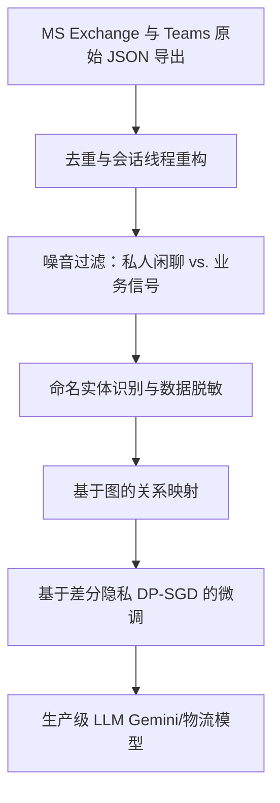

# 大模型开进“货舱”：谷歌1000万美元强买精神航空“数字残骸”，引爆AI时代打工人隐私首场终极对决

2026年5月2日，精神航空（Spirit Airlines）彻底关停了所有客运业务，为这家拥有34年历史的廉价航空巨头画上了终点符号。然而，当飞机租赁权、拉瓜迪亚机场起降舱位（被捷蓝航空以5850万美元竞得）等实体资产在聚光灯下被公开拍卖时，这家公司真正最具价值的资产，却在暗影中悄然易手。谷歌在破产法庭的拍卖中以1000万美元拔得头筹，而其竞拍的对象，是精神航空的“企业数据集”——一个横跨数十载、记录了庞大企业日常运转的数字档案馆。

然而，这笔交易却引爆了一场前所未有的法律与劳资风暴。代表5500名精神航空前员工的美国空乘人员协会（AFA-CWA）向纽约东区美国破产法庭正式提起诉讼。在工会国际主席萨拉·尼尔森（Sara Nelson）的率领下，此项诉求迫使首席法官肖恩·H·莱恩（Sean H. Lane）将最终的批准听证会推迟至2026年9月9日。与此同时，半路杀出的程咬金让战局更加扑朔迷离：总部位于旧金山的AI数据初创公司Micro1（由25岁CEO阿里·安萨里掌舵）在最后一刻开出了1250万美元的竞价，试图从山景城手中横刀夺爱。

在这场看似寻常的破产拍卖背后，隐藏着谷歌在清洗混乱对话数据时面临的技术瓶颈、破产法中关于隐私保护的法律漏洞，以及将已逝去员工的“数字尾气”用于AI训练所带来的巨大伦理风险。

---

### 数字尾气：精神航空遗留的“数据富矿”

谷歌拼死想要买下的“企业数据集”，是一个由非结构化企业通讯和运营记录构成的庞大数据库。其规格之高、维度之深令人咂舌：
* **1亿封内部邮件**：横跨数十年运营周期的历史通信。
* **5亿条Teams信息**：记录了实时调度、员工闲聊和日常运营调整的即时通讯记录。
* **17.5万份员工档案**：可追溯至1986年，包含税收文件、工资单、绩效评估和处分历史。
* **3000万行运营代码**：支配着排班、定价、路线优化及维护数据库的底层逻辑。
* **1700万个OneDrive文件和2000万个SharePoint项目**：包含大量的电子表格、政策文件和操作手册。

对于大模型公司而言，这一语料库简直是无价的黄金。谷歌意图用这些数据训练其大语言模型（LLM），使其深度理解企业物流和工作流；而初创公司同样对这块肥肉垂涎三尺。Micro1的CEO阿里·安萨里在谈及那笔12.5万美元的超额竞价时直言：
> “谷歌出价1000万美元买下这些数据，简直是捡了天大的便宜。现在，这种来自真实世界、庞大且混乱的企业级运营数据，就是AI训练的圣杯。它能教给LLM企业在面临现实危机、高压调度和物流分配时，究竟是如何运转和决策的。”

---

### 法律盲区：破产清算中，消费者与员工隐私的“双标”待遇

AFA-CWA工会的起诉书，无情地戳破了美国破产法在隐私监管上的残酷不对称：消费者数据与员工数据所受到的待遇截然不同。

根据美国《破产法》第363(b)(1)条，债务人可以在“免除所有索赔”的情况下出售资产。为了防止个人隐私泄露，美国国会于2005年通过了《预防破产滥用及消费者保护法》（BAPCPA），增设了第332条。该条款规定，如果债务人的隐私政策明文禁止将个人身份信息（PII）转让给第三方，法庭必须指定一名**消费者隐私监察员（CPO）**来介入审查。

然而，正如破产法专家所指出的，这把保护伞仅仅撑在**消费者**头顶。根据美国法典第11卷第101(41A)条，PII的定义被严格限定在“从债务人处获取产品或服务的消费者”这一范畴。

员工则完全被排除在保护范围之外。他们的日常聊天记录、绩效评估和工作日志，在法律上被归类为公司的“知识产权”或“运营账簿和记录”。因此，破产法庭不会为他们任命任何“员工隐私监察员”。员工辛勤工作数十年留下的数字痕迹，被直接视作清偿债务的待售商品。AFA-CWA国际主席萨拉·尼尔森愤怒地表示：
> “空乘人员和其他员工日常的个人沟通记录，竟然被当作商品一样被拍卖，这简直令人发指。这些数据属于创造它的打工人，而不是属于破产财产，更不该被拿去拍卖给出价最高的巨头。”

---

### 技术攻坚：如何清洗混乱的“对话泥潭”

从工程角度来看，谷歌接手的5亿条Teams私聊和1亿封邮件绝非拿来即用的“熟食”，而是一个极其庞杂的数据清洗灾难。为了提取出对大模型训练有用的运营特征，谷歌的工程师必须构建一条能过滤掉聊天噪音、同时保留语义价值的处理流水线。

#### 1. 线程重构与去重
企业通信往往极其碎片化。Teams的聊天记录导出后通常是杂乱无章的原始JSON数组，充斥着复杂的父子级回复链和点赞表情；邮件则多以PST或EML格式存储，嵌套着无数层转发和回复。

谷歌必须引入 MinHash 局部敏感哈希（LSH）或 SimHash 等文本匹配算法，剔除冗余的邮件正文，并拼凑出一条条逻辑连贯的对话线。这包括：
* 通过将消息 ID (`id`) 链接到父级 ID (`parentMessageId`)，重构 Teams 的会话树。
* 依靠时间戳锚点对对话序列进行时间线排序，还原最真实的上下文语境。
* 解决跨渠道通信的追踪问题（例如，某项业务决策在线上会议发起，随后转战邮件，最后在群聊中敲定）。

#### 2. 沙里淘金：分离“业务信号”与“闲聊噪音”
绝大多数Teams消息都是毫无训练价值的低噪信息（如“马上回”、“去买杯咖啡”、“生日快乐”）。谷歌计划训练专门的文本分类Transformer（例如微调后的BERT或RoBERTa架构）来为信息分流。

只有包含关键决策的对话（如签派员在强对流天气下紧急重新规划航线、排班员在法定执勤时间限制边缘调度机组）才会被打上“运营信号”的标签。而私人闲聊和自动回复邮件将被无情过滤，以防污染大模型的行为微调。

#### 3. 命名实体识别与上下文脱敏
为了遵守法庭关于去标识化的命令，谷歌必须剥离所有直接PII（姓名、邮箱、电话、员工工号）。这需要使用高精度的命名实体识别（NER）流水线。然而，传统的正则表达式和简单的词汇遮蔽，根本无法抵御下一个致命的挑战——“上下文隐私泄露”。

---

### 匿名化的神话：关系完整性与“结构关联”去匿名化风险

工会起诉书的核心论点指出：法庭所要求的“脱敏去标识化”在数学上纯属自欺欺人。

在任何复杂的关联数据集中，谷歌为了保证训练出的AI智能体可用，必须维持数据的“关系完整性”。这意味着，Teams聊天中的“用户A”必须能与邮件列表中的“用户A”对应起来。如果谷歌仅仅将姓名替换为随机的哈希值，虽然抹去了明文名字，但人际关系网的图结构依然完好。

这种关系链的保留，给**通过模式重构实施反向去匿名化**留下了巨大的漏洞，安全界称之为“结构关联”。

不妨设想以下场景：
1. **公开信息**：美国联邦航空局（FAA）公开记录显示，2025年10月14日14:32，精神航空412号航班在劳德代尔堡机场（FLL）降落时遭遇鸟击。
2. **数据集关联**：谷歌的数据集里，恰好有一段被脱敏的Teams聊天记录，发生在同一天的同一时刻，由 `Dispatcher_88` 与 `Pilot_34` 讨论一架A320客机在FLL降落时遭遇鸟击的紧急处置。
3. **身份锁定**：通过将公开的FAA飞行日志与这段脱敏对话横向比对，任何观察者都能瞬间锁定：`Pilot_34` 就是机长珍妮·杜，而 `Dispatcher_88` 是调度员约翰·史密斯。
4. **多米诺骨牌效应**：一旦 `Pilot_34` 的马甲被撕开，在这个包含6亿条消息的庞大数据库里，所有与 `Pilot_34` 相关的OneDrive文档、日常邮件、吐槽高管的Teams私聊，都将彻底对号入座，无处遁形。

为了规避这种风险，据传谷歌正尝试在模型训练阶段引入**差分隐私随机梯度下降（DP-SGD）**。DP-SGD通过在反向传播过程中向梯度添加数学噪声，确保模型仅学习到宏观的运营模式（如如何调度飞机），而无法“死记硬背”具体的训练样本（如某位机长与管理层扯皮的聊天细节）。然而，DP-SGD的引入往往会伴随着精度退化的代价，降低模型在特定物流任务上的表现。

---

### 运营金矿：大模型深度啃食企业工作流

谷歌为何宁可背负法律和舆论的骂名，也要强抢精神航空的聊天记录？答案在于公开互联网数据的枯竭。

目前大模型赖以训练的公开文本（如维基百科、Reddit、新闻报道）多为阐述性文本。它们无法教会AI如何在重重规则束缚和突发状况下，去协调复杂的真实世界任务。而精神航空的数据集，饱含了人类在34年间最真实、最混乱也最宝贵的协同经验：
* **危机公关与管理**：运营经理如何在极端天气、燃油短缺和机械故障交织的黑天鹅事件中进行实时博弈。
* **机组排班博弈**：排班人员为了在不违反FAA执勤时间上限的前提下，与空乘、飞行员进行的多方角力和极限拉扯。
* **维护日志**：机务人员在解决空客A320系列客机引擎和航电系统故障时，长达数百万条的专业技术对话。

一旦Gemini模型吞下这批数据，谷歌便能孵化出极其专业的自主智能体（Agent），去接管企业的供应链调度、智能客服以及物流分拨。正如一名机器学习工程师在论坛上的发言：
> “公开的文本数据已经被我们吃干抹净了，下一代大模型的突破口在企业内部的交互数据。谷歌买这笔数据可不是为了看八卦，他们买下的是一个价值数十亿的物流机器自我运转、自我协调的终极蓝图。”

---

### 危险判例与监控资本主义的反思

精神航空一案，在科技圈和打工人群体中激起了强烈的恐慌。在Reddit的科技板块上，许多知识工作者表达了深深的焦虑：
> “你的工作电脑其实是一个永久性的企业监控探头。即使你的东家倒闭了，他们也会把你的Slack日志和私人邮件打包卖给谷歌训练AI。我们毫无隐私可言。”

在传统时代，风雨飘摇的实体企业在倒闭时，首先被清算的是土地、设备和厂房。而今天，员工几十年的内部通讯记录成为了最抢手的香饽饽。如果首席法官莱恩在2026年9月9日最终批准了这笔交易，它将为未来的破产清算立下极具毁灭性的先例。那些在生死边缘挣扎的传统巨头（如沃尔格林、梅西百货），或者濒临倒闭的软件公司会突然发现，自己手里最值钱的遗产，竟然是员工留下的“数字尾气”。

在AI时代，打工人不仅在出卖劳动力，还在源源不断地产生将自己彻底淘汰的训练数据。而一旦公司走向破产，这些数据甚至会作为清算资产，被双手奉献给开价最高的科技巨头。

---
