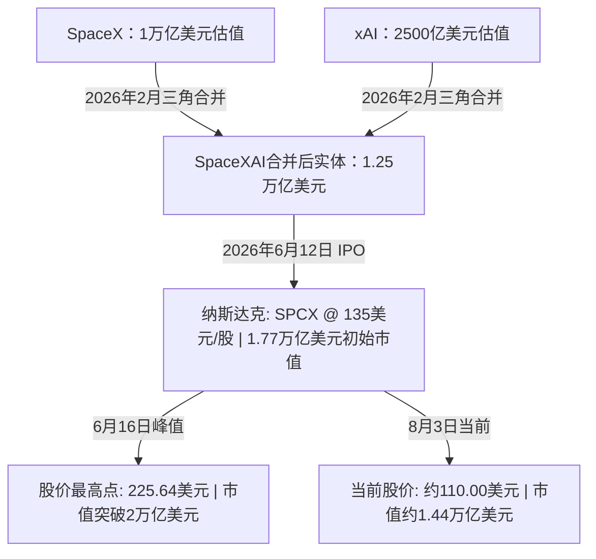

# **太空与算力的重力碰撞：解构SpaceX 1.77万亿美元估值之谜、9亿股解禁洪峰与轨道AI计算的热力学极限**

###

硅谷从未见证过如此激进的商业重组与资本大戏。美国时间2026年8月4日（周二），SpaceX（NASDAQ: SPCX）将公布其2026年第二季度财报。这不仅是该公司自今年6月12日完成历史性IPO以来的首份答卷，更是对其估值逻辑的第一次公开审视。然而，对于这家太空与AI巨无霸而言，真正的“重力测试”不在周二的财报，而是在两天后的8月6日——届时，SpaceX将迎来IPO后的首个大规模限售股解禁期，届时约9.115亿股将涌入市场，直接拷问公开市场的流动性极限。

##### 资本重组：xAI的三角缝合与估值过山车

要解构SpaceX如今引人瞩目的估值体系，必须回到2026年2月。彼时，SpaceX完成了一项股份对价的三角合并（stock-for-stock triangular merger），将马斯克旗下的AI独角兽xAI正式收归旗下，重组为子公司**SpaceXAI**。这次合并旨在将xAI的前沿大模型算法与SpaceX的重工业工程制造能力深度融合。在合并当时，该交易为新实体奠定了1.25万亿美元的估值底座——其中SpaceX估值1万亿美元，xAI估值2500亿美元。

伴随着全球对AI基础设施近乎狂热的追捧，SpaceX于6月12日正式登陆纳斯达克，发行价定为每股135美元，初始市值高达1.77万亿美元。上市之初的极度亢奋将股价在6月16日推至225.64美元的盘中历史高点，市值短暂跨过2万亿美元的里程碑。然而，公开市场的引力法则终究无法逃避。随后，股价一路震荡下行，目前已回落至每股110美元左右，不仅较发行价跌去了19%，较历史高点更是腰斩。



##### Q2财务账本：庞大的营收预期与更恐怖的CapEx吞金兽

华尔街分析师普遍预计，SpaceX第二季度将实现约68亿至69亿美元的营收，相比第一季度的46.9亿美元呈现出爆发式增长。这份收入账单生动诠释了SpaceX独特的双重面孔：
*   **Starlink（卫星通信）：** 预计季度收入贡献38亿美元。虽然全球订阅用户数预计将触及1200万大关，但分析师警告称，由于在国际市场推广低价套餐，Starlink的每用户平均收入（ARPU）正面临压缩。
*   **SpaceXAI（AI基础设施）：** 预计带来21亿至23亿美元的收入。其增长的核心引擎是第三方算力租赁业务。其中最瞩目的是与谷歌签订的一项巨额“桥接算力”合同：自2026年10月至2029年6月的32个月内，谷歌将每月向SpaceX支付9.2亿美元，租赁11万张英伟达GPU以支撑其Gemini Enterprise平台，合同总价值高达约300亿美元。此外，SpaceXAI还与Anthropic签署了类似的算力协议，将其位于田纳西州孟菲斯的Colossus 1数据中心的全部算力以每月12.5亿美元的价格租予后者。
*   **发射服务：** 尽管以Falcon 9、Falcon Heavy及Starship为核心的传统发射服务在全球市场形成了近乎垄断的统治力，但由于需要向尚在研发期的Starship项目源源不断地输送资源，该板块在结构上依然处于不盈利状态。

SpaceX资本逻辑中最核心的张力在于其令人咋舌的资本支出（CapEx）。今年第一季度，SpaceX的资本支出达到100亿美元（其中76%砸向了AI数据中心）；而在第二季度，这一数字预计将飙升至140亿美元。与此同时，Starship开发项目的累计研发（R&D）投入已突破150亿美元。如今，摆在马斯克面前的终极命题是：Starlink的高毛利通信网络与SpaceXAI的算力租赁，能否跑赢如此恐怖的烧钱速度？

##### 硬核工程：AI1轨道计算卫星与热力学挑战

在SpaceXAI的宏大叙事中，最前沿也最饱受争议的构想，莫过于将高度消耗资源的计算负载从地球“电网”转移到近地轨道（LEO）。今年6月8日，SpaceX正式揭开了**AI1计算卫星**的神秘面纱，试图在太空构建浮动的数据中心。

AI1卫星在德州巴斯特罗普（Bastrop）新建的“Gigasat Factory”量产，设计运行于太阳同步轨道（SSO），以获取近乎不间断的太阳能。该卫星搭载了模块化、兼容多种芯片的计算载荷，平均功耗达120 kW（峰值150 kW），这一指标已等同于地球上一台高性能英伟达GB300服务器机架的功耗。

```
       AI1 卫星架构设计（展开配置）
       
  |<------------------------- 70 米 ------------------------->|
  +------------------+     +------------------+     +------------+
  |    太阳能电池翼   |====#|    计算载荷舱    |#====|    太阳能  |
  |  （不间断太阳能）  |    |  (120-150 kW)   | |    |    电池翼  |
  |                  |    | +----------------+ |    |            |
  +------------------+    | | 110㎡ 液冷辐射板| |    +------------+
                          | +----------------+ |
                          +--------------------+
```

然而，在近乎绝对真空的太空环境中，传统的风扇对流散热彻底失效。为了防止这些高密度计算集群在宇宙中自我熔毁，AI1采用了**110平方米的可展开式液冷辐射板**，通过红外辐射将热量排入太空。完全展开后，AI1的翼展将达到惊人的70米，其巨大的结构几乎全部被太阳能电池翼和冷却管路占据。

##### 硅谷大辩论：数万亿美金的宏大远景 vs. 公开市场的骨感现实

SpaceX从一家纯粹的航天先驱重组为重资产的AI基础设施巨头，这在科技界和投资界引爆了极端的两极分化。

在著名的《All-In》播客中，Altimeter Capital的Brad Gerstner对这次上市推崇备至，称其为“教科书级别的成功”，证明了公开市场对划时代科技公司仍有海量胃口。Chamath Palihapitiya则认为，通过与xAI的合体，SpaceX撬开了“智能的无限潜在市场（TAM）”，且空间计算能够彻底规避地球本土面临的电力与能源危机。

然而，持怀疑态度的风险投资人与机构分析师不在少数。

> [!WARNING]
> 一位知名科技VC在X平台上直言：“xAI的并入让SpaceX的资本故事变得极其臃肿和混乱。你硬生生把一家有着极高国家安全壁垒、极重资产的火箭制造公司，与一个极具投机色彩、处于巨额烧钱阶段、且完全受英伟达硬件升级周期支配的AI算力公司缝合在了一起。其资金流失的速度极其令人担忧。”

在Reddit的r/SPCXInvestors板块上，散户们正在为8月6日的解禁日做最坏的打算。“这次解禁无异于一场终极的供给侧休克，”一位用户写道，“目前市场流通股比例仅为5%，筹码被刻意锁紧。本周四突然向市场抛出9.115亿股，无论明天的财报多么亮眼，股价都将承受极大的下行压力。唯一的安慰是，马斯克个人的持股要到2027年中才会解禁。”

与此同时，X平台上的热力学家们也在疯狂推演AI1计算卫星的可行性。

> [!NOTE]
> **近地轨道计算的热力学瓶颈：**
> 在真空中，热量耗散完全遵循斯蒂芬-玻尔兹曼定律（Stefan-Boltzmann law）：
> $$q = \epsilon \cdot \sigma \cdot A \cdot T^4$$
> 要在近地轨道消散150 kW的废热，即使涂装了极高发射率（$\epsilon$）的介质，也需要庞大的辐射表面积（$A$）。在没有大气层提供对流冷却的情况下，70米的巨大翼展绝非物理上的炫技，而是防止芯片在太空中“自我熔毁”所必须承受的物理底线。

明日财报公布，市场终将迎来对这家全球最富野心的科技财阀财务健康状况的首次大考。但在数据之外，这家公司如何平衡马斯克长远的“火星殖民”梦想与华尔街严苛的季度审视，才是本场大戏最耐人寻味的看点。

---

### 3. 社媒推广摘要（Highlight）

#### 3.1 核心问题
1. 星链与SpaceXAI的算力租赁收入能否跑赢Starship研发与AI基础设施每季度高达140亿美元的恐怖CapEx？
2. 纳斯达克将如何消化8月6日即将到来的9.115亿股限售股解禁潮？
3. SpaceX能否突破真空散热的热力学瓶颈，用70米翼展与110平米液冷辐射板在太空中冷却150 kW的算力节点？

#### 3.2 摘要正文
SpaceX明天将迎来上市后的首份财报，而紧随其后的8月6日将有9.11亿股限售股解禁，市场正迎来终极供求冲击。虽然靠着Starlink增长和谷歌300亿美元的GPU桥接算力合同，SpaceX第二季度营收预期冲高至68亿-69亿美元，但其单季CapEx已膨胀至140亿美元。目前X平台上正掀起热力学大辩论，太空散热全靠辐射，AI1卫星为了冷却150kW功耗的GB300级别算力不得不做出70米巨型翼展。Reddit散户正对解禁严阵以待，知名VC则炮轰马斯克将火箭护城河与高度依赖英伟达周期的AI业务强行缝合。这究竟是绕过地球能源危机的无限智能故事，还是被华尔街拖垮的火星梦？

#### 3.3 关键词标签
#SpaceX解禁 #太空计算 #AI算力基础设施
