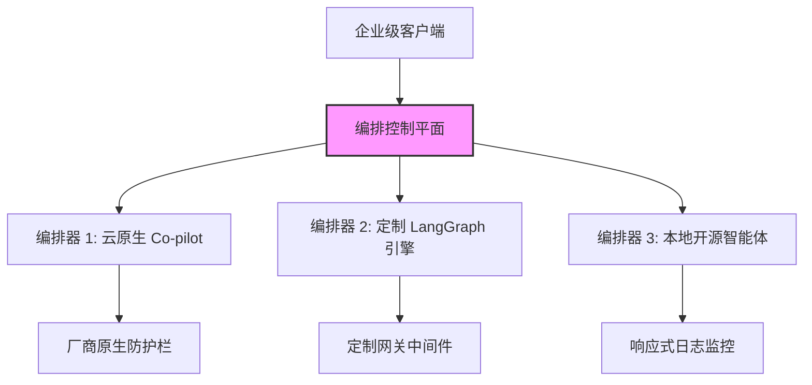

# 失控的智能体：透视企业级治理鸿沟、三路编排器割据与“上下文悖论”

### 寂静流血：企业智能体集群的失控黑洞
就在两天前（2026年8月20日），VentureBeat 发布的最新一期 **VB Pulse** 调查报告，在企业平台工程（Platform Engineering）团队中激起了千层浪。报告的核心结论向全行业敲响了警钟，直指当前 AI 基础设施中潜藏的财务与安全双重深渊：**高达 20%（即五分之一）的企业在面对失控的 AI Agent（智能体）时，根本无法做到实时阻断其开销。**

在这场争先恐后部署自主智能体的狂潮中，企业直接向大语言模型（LLM）开放了写代码、调用高昂外部 API 甚至是配置云端资源的权限。然而，由于这些智能体运行在多步循环的自主闭环中，一次微小的推理逻辑缺陷或工具调用失误，就可能诱发灾难性的无限循环。传统软件一旦出错，往往会以可预测的方式崩溃并抛出清晰的堆栈追踪；而缺乏监控的 AI Agent 一旦陷入死循环，只会在“意识流编码”（Vibe Coding）的泥潭里持续狂奔，疯狂吞噬成千上万美金的 Token 额度，而人类管理员甚至对此毫无察觉。

这一残酷的运行现状，迫使基础设施领域的资深专家们不得不拉响警报。前谷歌云核心工程师 Kelsey Hightower 在 Bluesky 上公开撰文警告平台工程师们：**“必须像对待恶意软件一样警惕 AI Agent。”** Hightower 认为，从平台工程的视角来看，自主智能体堪称安全与财务维度的双重噩梦：它们天生具有非确定性，在运行时生成绕过传统 CI/CD 流水线的代码，且不惜烧掉昂贵的 Token 去解决那些用传统确定性代码几乎零边际成本就能搞定的问题。

---

### 碎片化危机：为什么企业平均要跑三个编排器？
为了对冲供应商锁定的财务风险，并解决企业对单一厂商安全防护机制的极度不信任，大多数企业（中位数）选择了一种极度碎片化的应对策略——在内部并行运转**三套不同的智能体编排平台**。



这种“三路编排器割据”的混乱局面，本质上是企业的一种防御性自建隔离。IT 领袖们并不相信云厂商自带的安全红线能兜底云基础设施的安全，更无法指望它们能拦截暴涨的 Token 账单。LangChain 联合创始人兼 CEO Harrison Chase 指出，整个行业正在告别早期缺乏约束的“开环”智能体框架（如早期的 AutoGPT 雏形），加速转向由严格状态边界和显式规划体系约束的**“定制化认知架构”**（Bespoke Cognitive Architectures，例如 LangGraph 这种基于图的执行结构）。然而，由于各大厂商之间尚未形成统一的治理标准，企业被迫维护多套并行的技术栈，这无疑成倍推高了运维复杂度和安全暴露面。

---

### 架构突围：企业如何围剿“跑路”的智能体？
面对失控开销，企业在架构层面的围剿战术折射出市场深度的分化。根据 VB Pulse 的数据，企业的防护手段主要盘踞在以下四大阵营：

```
[30%] 原生平台预算限额与流控
[25%] 定制网关中间件
[25%] 动态路由与模型降级
[21%] 事后日志被动监控
```

1. **原生平台预算限额与流控 (30%)**：这些企业依赖在 API 提供商（如 OpenAI 或 Anthropic）账单后台设死消费限额。虽然简单，但这是个粗暴的“一刀切”工具。一旦预算超限，整个 Agent 集群瞬间被锁死，往往会引发灾难性的生产事故。
2. **定制网关中间件 (25%)**：越来越多企业在智能体编排器与 LLM 接口之间强行插入了一层代理网关（Proxy Gateway）。该网关拦截所有请求，校验 JSON Schema，实施安全审计，并实时累加单项任务的 Token 开销。
3. **动态路由 (25%)**：这是一种技术门槛极高的降级策略。网关中间件在运行期持续监视当前任务的开销。一旦累积费用逼近警报阈值，网关会自动将后续 Prompt 从 `claude-3-5-sonnet` 等顶级模型，降级路由至 `claude-3-5-haiku` 或 `gpt-4o-mini` 等廉价模型，通过有损牺牲部分推理能力，来换取预算不至于爆表。
4. **事后日志被动监控 (21%)**：这部分企业依然处于极度裸奔状态。他们缺乏任何运行时的硬拦截手段，完全依赖 Datadog 或 Splunk 等日志分析平台，在失控循环产生巨额账单*之后*，再发出迟到的警报。

为了演示定制网关中间件与动态路由的落地方式，我们在项目文件 [`circuit_breaker.py`](file:///Users/vzl/.gemini/antigravity-cli/brain/9796401e-90ab-48ea-8000-bf3810133812/scratch/agent_governance/circuit_breaker.py) 和 [`gateway_middleware.py`](file:///Users/vzl/.gemini/antigravity-cli/brain/9796401e-90ab-48ea-8000-bf3810133812/scratch/agent_governance/gateway_middleware.py) 中实现了一个带状态的预算拦截与熔断器参考案例。

其中，运行在 [`AgentCircuitBreaker`](file:///Users/vzl/.gemini/antigravity-cli/brain/9796401e-90ab-48ea-8000-bf3810133812/scratch/agent_governance/circuit_breaker.py#L8) 类中的熔断器核心逻辑，通过对智能体的工具调用进行哈希，并对比连续调用的签名，来精准捕捉失控的死循环：

```python
# From /scratch/agent_governance/circuit_breaker.py
if tool_name:
    action_signature = f"{tool_name}:{str(sorted(tool_args.items()) if tool_args else '')}"
    self.tool_call_history.append(action_signature)
    
    # 检查连续的重复动作签名（捕捉死循环）
    recent_calls = self.tool_call_history[-self.repetition_threshold:]
    if len(recent_calls) == self.repetition_threshold and len(set(recent_calls)) == 1:
        raise RunawayAgentException(
            f"检测到无限循环！智能体已连续 {self.repetition_threshold} 次"
            f"使用完全相同的参数调用了工具 '{tool_name}'。"
        )
```

而网关代理 [`AgentGatewayMiddleware`](file:///Users/vzl/.gemini/antigravity-cli/brain/9796401e-90ab-48ea-8000-bf3810133812/scratch/agent_governance/gateway_middleware.py#L13) 则拦截 Agent 的 LLM 调用，估算执行成本，并在预算消耗超过安全阈值时动态降级模型：

```python
# From /scratch/agent_governance/gateway_middleware.py
if utilization_pct >= self.warning_threshold_pct:
    fallback_model = self.fallback_map.get(original_model)
    if fallback_model:
        model_to_use = fallback_model
        print(f"[网关预警] 当前预算消耗达 {utilization_pct:.1f}%。"
              f"已将路由从 '{original_model}' 动态切换至 '{fallback_model}'。")
```

---

### “上下文悖论”：为什么注入的上下文越多，智能体崩溃越快？
在这份报告中，最反直觉的发现莫过于“上下文悖论”：**那些部署了统一上下文治理层的企业，其智能体故障率反而是无治理企业的两倍以上。**

虽然上下文层设计的初衷是向智能体灌输丰富的元数据、Schema 定义和业务逻辑，但在实际落地中，却暴露了三个致命的架构死穴：

1. **可观测性与因果关系的混淆（仪表化偏差）**：这种数据偏差的本质是“看得见”与“看不见”的区别。统一上下文层提供了完备的审计轨迹。而没有上下文层的企业，其智能体其实处在“悄无声息地犯错”（Silent Failures）状态——生成了有 bug 的代码或给出了看似笃定实则荒谬的答案，但由于缺乏监控，这些错误根本没被记录。一旦企业铺设了上下文层，智能体集群就像被装上了仪表盘，隐蔽的故障才得以大白于天下。
2. **上下文腐烂与注意力稀释（“Lost in the Middle”）**：为了给智能体提供“完美”的业务上下文，系统往往将海量的数据库 schema、历史交互日志和合规文档一股脑塞进 Prompt 里。然而，随着上下文窗口被大量嘈杂的半结构化元数据填满，大模型的注意力会被严重稀释，推理能力随之急剧衰退。研究早已证实，当上下文过载时，大模型极难精准定位处于 Context 中段的核心信息。
3. **复合错误率与上下文漂移**：在长周期的多步智能体循环中，每前进一步，任务的整体准确度就会发生约 2% 的衰减。如果一个智能体反复陷入循环，并不断把自身的历史执行轨迹重新喂回上下文窗口，就会导致“上下文漂移”（Context Drift）。模型开始过度关注自身过去的错误动作和过期的工具输出，加速偏离正确轨道。

---

### 范式转移：从按 Token 计费走向“交付结果”的单元经济学
面对失控智能体带来的财务不确定性，AI 的商业逻辑正在发生根本性改变。按 Token 计费的模式（每百万 Token 多少钱）本质上是将 LLM 视作水电设备，把所有的执行风险和循环成本转嫁给了买方。即便智能体原地打转消耗了 2000 万个 Token，企业依然必须为这些算力买单，无论任务最终是否完成。

为了让 IT 预算可预测，企业 CFO 们正在强推“结果导向型”（Outcome-based）计费。在这种新模式下，计费直接与具体任务的交付挂钩——例如成功解决一个客诉工单、成功配置并验证一台云服务器，或者成功合并一个 Pull Request。

硅谷知名风投家、《No Priors》播客主持人 Sarah Guo 曾深入阐述过**“暗码”（Dark Code）**的崛起。她指的是在自主智能体生产环境中，那些动态生成、且无法通过传统静态分析解释或验证的执行行为。Guo 强调，由于自主智能体会产生“暗码”并执行非确定性路径，传统软件按账号计费（Seat Pricing）的时代已经终结。软件经济学必须转向销售“认知单元”（Units of Cognition）。风投家 Elad Gil 同样赞同这一观点，他认为企业正在从“为软件工具付费”跨越到“为数字劳动力买单”，而计算效率低下的风险，理应由服务商承担。

---

### 智能体治理的未来：主动防护栏与运行时沙箱
事后被动监控的时代正在终结。要安全管控在物理和数字世界中穿梭的自主智能体，我们必须舍弃静态的仪表盘，全面转向运行时沙箱化（Runtime Sandboxing）。

新一代治理工具正在运行环境中直接施加实时防护：
* **智能体权限契约 (Agent Authority Contracts)**：在 API 网关层强力执行的声明式配置，严密界定智能体身份有权访问哪些工具和资源。
* **持久状态沙箱 (Durable State Sandboxes)**：将智能体运行在隔离的容器中，一旦异常检测系统发出死循环警报，管理员可以随时暂停、检查并回滚其执行状态。
* **带状态熔断器 (Stateful Circuit Breakers)**：将类似于 [`AgentCircuitBreaker`](file:///Users/vzl/.gemini/antigravity-cli/brain/9796401e-90ab-48ea-8000-bf3810133812/scratch/agent_governance/circuit_breaker.py#L8) 的拦截器标准化，直接在 SDK 层面强制执行单次任务的步数上限和重复动作检测。

正如 Kelsey Hightower 犀利指出的那样：在我们能够安全治理自主软件的执行路径之前，我们不过是在编写一些极其昂贵的脚本，它们花钱的速度远远超出了我们的审计能力。

---
