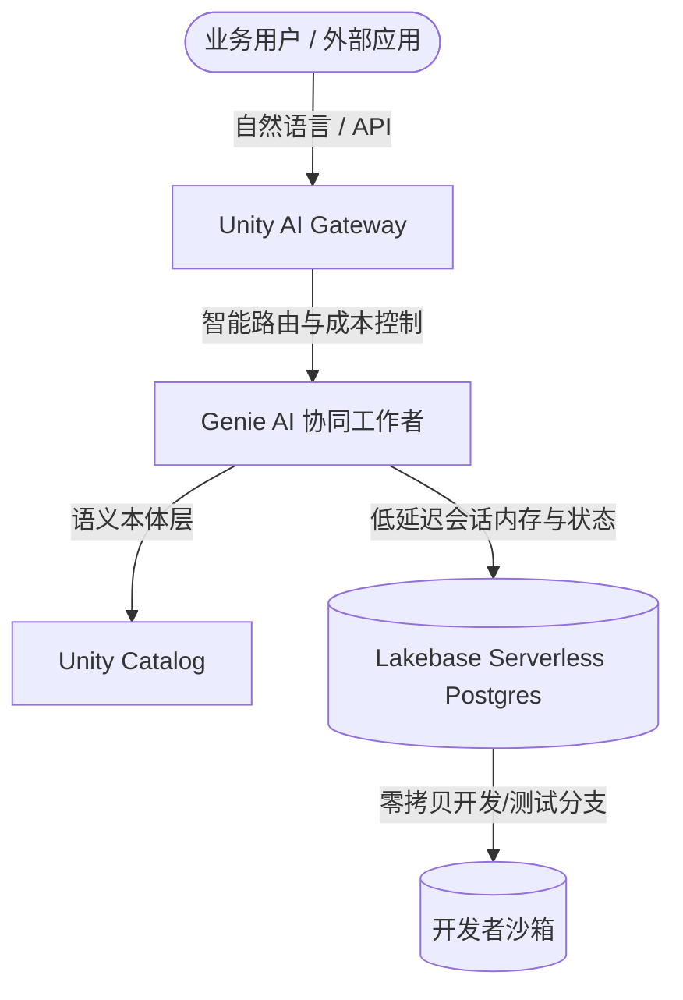
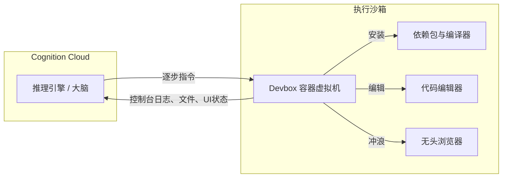

# 工作流租金的终结：解构 Databricks 1900 亿美元 Lakehouse Agent 栈与 Cognition AI 的 LaaS 套利

2026 年 8 月的最后几周，软件行业正在经历一场结构性的重新定价，其烈度远超当年从本地部署（On-Premise）向云计算的过渡。我们不再争论 AI 能够编写代码或查询表格，而是正在亲眼见证一个全新企业级操作系统的整合与确立。两起重磅财务事件为这一转型画下了明确的注脚：**Databricks 以 1900 亿美元的估值完成了高达 50 亿美元的战略融资**；同时有报道称，**Cognition AI 正在进行早期谈判，计划以超过 400 亿美元的估值融资逾 10 亿美元**。

为了直观理解这些数字的份量：Databricks 的估值相比仅半年前的 1340 亿美元实现了一次巨大飞跃，这背后是其高达 **70 亿美元的年化收入（Revenue Run-rate）以及 80% 的同比增速**。而自主软件 Agent "Devin" 的缔造者 Cognition AI，则正在以一种打破传统 SaaS 增长规律的速度狂飙，其年化收入已**逼近 10 亿美元**（而在 2026 年 5 月估值 260 亿美元的上一轮融资中，这一数字还仅为 4.92 亿美元）。

然而，在财务报表的数字背后，一场激烈的辩论正在 X.com 和沙丘路（Sand Hill Road）上空回荡：这究竟是风险投资 FOMO（错失恐惧）催生的不可持续的基建泡沫，还是由 **SaaS（软件即服务）向 LaaS（劳动力即服务）**转型所带来的必然估值重塑？

要回答这个问题，我们必须穿透公关新闻稿的迷雾，去解构支撑这些平台的实际运行架构（Runtime Architecture）、数据层以及工程约束。

---

### 基础设施层：Databricks 的多 Agent 数据引力
Databricks 首席执行官 Ali Ghodsi 长期以来一直坚称，在基础模型日趋商品化（Commoditized）的时代，“数据智能”（Data Intelligence）是唯一具有防守力的护城河。该公司最近获得的 1900 亿美元估值，本质上是一场豪赌：赌的是如果缺乏一个集成且低延迟的数据织物（Data Fabric），企业级 Agent 就根本无法运转。2026 年 8 月，Databricks 正在通过一套“三管齐下”的 Agent 级套件，野心勃勃地将这一理念产品化：**Lakebase**、**Genie** 以及 **Unity AI Gateway**。

#### 1. Lakebase：消除 Agent 状态的 ETL 税
从历史上看，AI Agent 一直饱受“脑裂”（Split-brain）问题的困扰。Agent 既需要一个分析型数据库（如 Lakehouse）来检索上下文，又需要一个事务型（OLTP）数据库来存储实时状态、会话历史和 Agent 内存。同步这两个世界需要复杂的变更数据捕获（CDC）流和 ETL 管道，这不仅带来了延迟，还引入了安全风险。

Databricks 推出 **Lakebase** 解决了这一痛点。这是一个完全托管的、无服务器（Serverless）PostgreSQL 数据库服务，直接内置于 Databricks 的数据智能平台中。Lakebase 实现了计算与存储的分离，在闲置时可自动缩容至零，并具备**“零拷贝”（Zero-copy）数据库分支**功能。类似于 Git 的操作，Agent 可以在几秒钟内拉出一个生产数据集的临时分支，执行一系列实验性的更新，然后将状态合并回去，而无需物理拷贝数 GB 的数据。

对于 AI Agent 而言，Lakebase 充当了低延迟的草稿纸。通过将事务性数据托管在 **Unity Catalog** 的安全边界之内，Databricks 消除了外部网络传输的开销。这一集成服务的年化收入已悄然突破 **1 亿美元**，证明了 Agent 内存是现代数据栈中一个极具变现能力的层级。

#### 2. Genie：通过语义本体落地业务
如果说 Lakebase 是内存，那么 **Genie** 就是业务执行引擎。Genie 家族包含 Genie One（企业协同工作者）、Genie Agents（特定领域的 Agent 系统）以及 Genie Code，允许用户使用自然语言查询复杂的数据系统。

这里的技术突破并不在于大模型的翻译层，而在于 **Genie 本体（Genie Ontology）**。大语言模型在猜测表关系或列的语义维度上是出了名的糟糕（例如，无法区分“收入”与“净预订额”）。Genie 本体作为一个实时的语义上下文层，将自然语言提示词映射到经过认证的企业指标。如果业务用户询问：“我们第二季度的客户留存率是多少？”Genie 并不会从头生成原始 SQL，而是将查询路由到本体中，执行预先批准、经过审计的计算公式，从而杜绝了指标幻觉。

#### 3. Unity AI Gateway：护栏与治理平面
随着企业部署数以千计的专用 Agent，他们不得不面对“影子 AI”（Shadow AI）以及失控的 Token 成本。于 2026 年 8 月 4 日正式商用的 **Unity AI Gateway** 充当了集中的运行时治理与控制平面。它介于模型、模型上下文协议（MCP）服务器和 Agent 之间，提供以下核心能力：
*   **细粒度成本分摊与消费限额：** 对 Agent 的 Token 消耗施加硬性限制。
*   **智能路由：** 根据性能要求、延迟和成本，在不同的模型（例如 Claude 3.5 Sonnet、GPT-4o 或本地化的 Llama 模型）之间动态切换提示词路由。
*   **PII（个人身份信息）过滤与防越狱：** 在运行时层面对 Agent 的输入和输出进行检测，阻断数据泄露和提示词注入攻击。

---

### 执行层：拆解 Cognition AI 的 Devin 架构
如果说 Databricks 正在打造的是企业级治理官，那么 Cognition AI 正在构建的则是终极数字劳动力。估值突破 400 亿美元的 Cognition 坚信，软件工程是第一个完全走向自主化的领域。他们的旗舰 Agent —— **Devin**，早已超越了简单的聊天界面，陆续斩获了梅赛德斯-奔驰、高盛、花旗、NASA 以及美国海军的商业合同。

Devin 的核心能力源自其独特的架构：将高阶推理与底层执行彻底解耦。

#### 1. 大脑（推理引擎）
“大脑”是托管在 Cognition 基础设施上的有状态云端推理服务，专门负责长程规划（Long-horizon Planning）。当接收到一个目标（例如“将此代码库从 React 17 迁移到 React 19”）时，“大脑”会生成一个多步骤的依赖图。它不直接执行代码，而是输出具体的工具调用和命令。

#### 2. Devbox（执行工作空间）
每次 Devin 会话都会启动一个安全、容器化的 Linux 虚拟机（通常是 Ubuntu），称为 **Devbox**。Devbox 包含：
*   一个完整的 Bash Shell；
*   一个自定义的代码编辑器；
*   一个无头（Headless）网页浏览器。

“大脑”将命令写入 Devbox 的 Shell 中，在容器内编辑文件，并使用浏览器阅读本地文档或测试 Web 应用。Devbox 则将标准输出/错误（stdout/stderr）日志、编译错误和视觉截图返回给“大脑”。这形成了一个闭环反馈系统。如果由于依赖冲突导致安装包失败，“大脑”会从 stdout 中检测到错误，利用无头浏览器寻找替代方案，调整其路线图，并尝试运行不同的安装命令。

#### SWE-bench：榜单饱和与真实世界的复杂性
2024 年初 Devin 首次亮相时，它在 SWE-bench 基准测试中以 **13.86% 的无辅助成功率**震撼了业界。到了 2026 年 8 月，据传 Devin 的内部迭代版本根据配置不同，任务解决率已达到 **65% 至 90%**。

然而，SWE-bench Verified 榜单已经高度饱和。像 Claude 5 Opus 和 GPT-5.6 Sol 这样的原生模型在标准化测试框架下已经实现了 **96% 以上的解决率**。这引发了一次重大转向：
*   **SWE-bench Pro：** 一个全新的、具备防污染能力的基准测试，引入了涉及多文件、多依赖的挑战，要求更复杂的逻辑跨越。
*   **脚手架 vs 裸模型：** X.com 上的批评者指出，榜单跑分对“脚手架”（外围循环和 Prompt 包装器）高度敏感。Cognition 的护城河并不一定是一个更优越的底层基础模型，而在于它精密的 Agent 环境——能够在没有人类干预的情况下管理状态、监控执行日志并进行自我纠错。

---

### 经济学大辩论：SaaS 向 LaaS 的范式转移
估值的暴涨将风险投资生态撕裂为两大阵营。批评者指出，在基础模型提供商正在迅速将原生编程智能“商品化”的背景下，基于 10 亿美元年化收入给出 400 亿美元估值（高达 40 倍的 PS 倍数）显得过于激进。

#### 悲观派：“脚手架泡沫”与“复利误差税”
怀疑论者认为，Agent 初创公司正在将天文数字的资金烧在 Token 的开销上。与毛利率通常在 80% 到 90% 之间的传统 SaaS 不同，自主 Agent 的计算成本极高。
*   **复利误差率：** 在长程任务中，Agent 的可靠性呈指数级衰减。如果 Agent 每一步的成功率为 95%，那么在经历 50 个步骤（安装依赖、修改 10 个文件、运行测试、解决代码规范问题）之后，整体成功的概率将骤降至 $(0.95)^{50} \approx 7.6\%$。
*   **延迟与计算成本：** 运行一个 Agent 花费 30 分钟去修复一个 Bug，其 API Token 和虚拟机计算成本可能高达 **50 到 100 美元**。如果 Agent 最终没能修复这个 Bug，这笔成本就彻底打水漂了。
*   **“认知退化”批判：** 谷歌 AI 研究员 François Chollet 一直警告说，大模型其实是一种认知上的“简易出口”（Off-ramp），依赖的是模式匹配和记忆，而非流体智能（Fluid Intelligence）。他指出，用复杂的软件脚手架包裹大模型，并不能解决它们在面对未知的、分布外（Out-of-distribution）Bug 时无法推理的本质缺陷（如 ARC-AGI 测试所展示的那样）。

#### 乐观派：数万亿美元的“薪酬套利”
而支持者（包括 Garry Tan 和 Brad Gerstner 等知名风投家）则反驳称，将 AI Agent 初创公司与传统 SaaS 进行对比，这本身就是一个根本性的“类别错误”。
*   **SaaS 的终结（SaaSpocalypse）：** 传统 SaaS 公司收取的是“工作流租金”（Workflow Rent）。它们出售的是供人类输入数据的交互界面。随着 Agent 越过用户界面直接调用 API 和数据库（通常使用 MCP 协议），仪表盘（Dashboard）的溢价正在蒸发，从而对传统软件按账号收费的模式产生巨大的下行压力。
*   **从“工具”到“劳动力”：** 在 SaaS 模式下，你买的是一把铲子；而在 LaaS 模式下，你雇佣的是一个挖土工。如果 Devin 能够自主解决 Jira 上的工单，Cognition 争夺的就不是每月 30 美元的 Copilot 软件预算，而是**每年 15 万美元的软件工程师薪酬预算**。即使因为计算开销导致毛利率降至 50%，只要能分食全球工程劳动力市场的冰山一角，其释放的产值就将比整个 SaaS 行业大上几个数量级。
*   **Agent 工程化（Agentic Engineering）：** 在其爆火的“氛围代码”（Vibe Coding）推文发布一周年之际，Andrej Karpathy 宣布停用该词，取而代之的是 **“Agent 工程化”（Agentic Engineering）**。Karpathy 指出，虽然“氛围代码”是一种随意、无结构的提示词原型开发方式，但企业级部署需要极其严谨的工程方法：编写明确的设计规范、建立严密的评估闭环，并构建严格的运行时边界。Databricks 和 Cognition 正是率先将这种“从随意的氛围代码到生产级 Agent 工程化”转型落地为产品的先驱。

---

### 展望：数据与行动的收敛
2026 年的财务叙事绝非泡沫破裂，而是 AI 执行能力的成熟。Databricks 正在利用其庞大的数据引力（70 亿美元年化收入、Unity Catalog），通过 Lakebase 为企业 Agent 提供治理、成本控制以及安全的事务性内存；而 Cognition AI 则在探索绝对自主性的边界，扩展 Devin 的沙箱环境以承接端到端的工程任务。

最终的赢家将不是那些构建最大基础模型的人，而是那些能够成功管控长程 Agent **“成本-可靠性比”（Cost-to-reliability ratio）** 的人。随着计算成本的下降以及执行沙箱与结构化企业数据的深度集成，SaaS 向 LaaS 的转变将不再是一个争论的话题——它将成为整个行业的默认底线。
