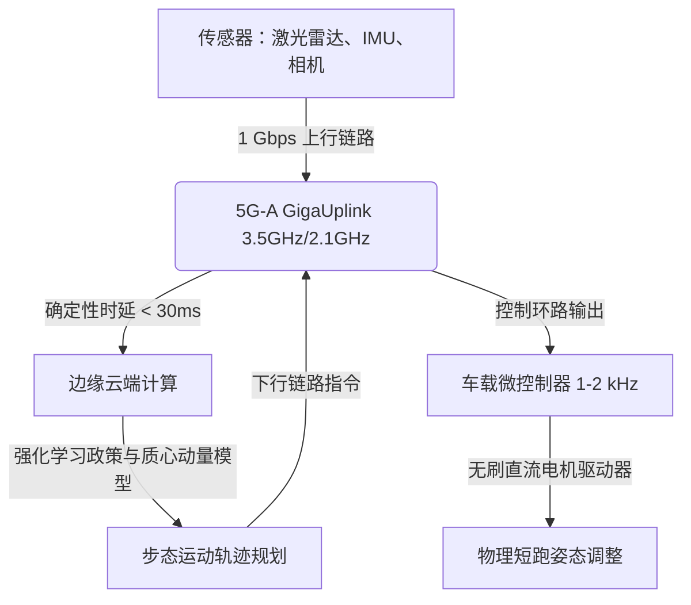

# 干翻博尔特！百米9.32秒极限狂飙背后，“天工Ultra”与“闪电”的硬核机械与5G-A边缘控制链

2026年8月，在北京国家速滑馆（“冰丝带”）的滚滚热浪中，人类对肉体速度的绝对垄断悄然宣告终结。在第二届世界人形机器人运动会上，双足机器完成了此前看似不可能的壮举：它们跑得比尤塞恩·博尔特（Usain Bolt）9.58秒的百米世界纪录还要快。

在预备测试中，荣耀（Honor）的原型人形机器人“闪电”（Lightning）跑出了9.32秒的非官方成绩，并在随后的决赛中以9.47秒的惊人速度冲线；而北京人形机器人创新中心研制的“天工Ultra”则以9.39秒的成绩夺得了该项目的官方金牌。与此同时，X-Humanoid的特制高跳版本机器人跃过了2.88米的立定跳高高度，一举打破了哈维尔·索托马约尔（Javier Sotomayor）在1993年创下的2.45米人类极限。

然而，在全场的欢呼声中，冲过终点线后的一幕却揭示了双足机器人技术残酷的现状：无论是“天工Ultra”还是“闪电”，在越过终点的瞬间均遭遇了灾难性的平衡失效，重重地撞向防护泡沫墙，最终不得不由技术支持团队抬离现场。

本文将深入拆解这场地标性事件背后的物理机械工程学、无线基础设施，以及在科技界引发的激烈思辨。

### 机械电子学：高速度与低惯量的硬核物理学

要在时速超过38.34公里（23.8英里/小时）的极限状态下奔跑，双足机器人必须克服极其严苛的双足动力学物理限制。“天工Ultra”和“闪电”的设计核心，主要聚焦于三大硬件维度：扭矩密度、传动机构与质量分布。

#### 1. 高扭矩密度无刷直流电机

以14.5米/秒的速度奔跑需要极具爆发力的机械功率。这些机器人的腿部关节采用了专为峰值扭矩密度（Nm/kg）优化的无刷直流（BLDC）电机。通过采用高槽满率的集中绕组、高矫顽力钕铁硼（NdFeB）永磁体以及先进的液冷或强迫风冷套件，这些执行器在重量不足4公斤的情况下，能输出高达300牛·米以上的扭矩。这使得机器人能够在奔跑的支撑相中，产生将自身质量向前推进所需的巨大地面反作用力（GRF）。

#### 2. 传动系统抉择：行星齿轮 vs 谐波减速器

机器人领域存在一个普遍的误区，即认为谐波减速器（应变波齿轮）是所有人形机器人关节的默认选择。虽然谐波减速器因其体积小、零背隙和高减速比而非常适合上肢，但它们在面对高冲击时异常脆弱。高速奔跑中足部着地的冲击力，极易导致谐波减速器中柔轮的疲劳断裂。

为了在短跑的剧烈冲击中幸存，“闪电”和“天工Ultra”的膝关节与髋关节采用了定制的行星齿轮箱或准直驱（QDD）方案。这些系统具有极高的反向驱动性，允许电机在受到外部冲击时充当机械弹簧来吸收撞击能量，从而避免减速器碎裂。谐波减速器则被边缘化，仅用于低冲击的躯干姿态调节关节，在这些部位利用其零背隙特性来稳定上半身。

#### 3. 碳纤维与远端惯量削减

在双足奔跑中，摆腿所消耗的能量由转动惯量公式 $I = m r^2$ 决定。为了将摆腿频率（步频）提升至5赫兹以上，工程师采用高模量碳纤维增强复合材料（CFRP）来制造肢体骨架。更重要的是，他们采用了“偏轴驱动”设计，将沉重的无刷直流电机向上移至骨盆和髋关节附近，通过轻量化的碳纤维推杆和连杆机构将动力向下传递至膝关节和踝关节。这种设计极大程度地降低了小腿和足部的远端质量，使执行器能以极低的能耗和闪电般的往复周期实现高速摆腿。

### 数字脊髓：5G-A千兆上行与边缘控制环路

要在每秒10米的速度下维持动态平衡，需要运行在千赫兹（kHz）级别的高实时性控制环路。然而，受限于散热和电池重量，机器人车载的计算单元无法独自处理高速稳定所需的大型神经网络和模型预测控制（MPC）算法。

为了解决这一算力瓶颈，中国联通与华为在场馆内搭建了定制的5G-Advanced（5G-A或5.5G）“千兆上行”（GigaUplink）网络。

通过多载波聚合技术（整合3.5 GHz和2.1 GHz频段），该5G-A网络提供了专属的1 Gbps上行通道。这使得机器人能够实时将未经压缩的传感器遥测数据、高清视频流以及激光雷达点云数据传输至边缘云服务器。

更关键的是，该网络实现了低于30毫秒的端到端确定性时延。通过专用网络切片技术（5QI 7）和信道隔离，机器人的控制数据包免受了现场数万名观众移动设备的网络干扰。

在这种“分层解耦式”控制架构中：
* **车载微控制器**负责处理高频关节扭矩和电流环路（1-2 kHz），以维持局部关节的柔顺控制。
* **边缘云服务器**接收遥测数据，运行复杂的强化学习（RL）策略和质心动量模型，实时计算全局平衡调整参数，并将轨迹修正指令即时回传给机器人。
* **北斗RTK（实时动态定位）集成**则提供分米级的定位数据，确保机器人能够精准地保持在各自跑道内，不发生偏航。

### 硅谷大辩论：体育奇迹还是资本泡沫？

这一突破性的短跑成绩在X和Reddit等社交媒体的技术社区引发了极其分裂的讨论。科技界正被划分为两派：一派将其视为机器人历史上的“登月时刻”，另一派则贬其为一场昂贵的公关噱头。

#### 拥护者：“机器人领域的F1方程式”

知名风投家与创业者们认为，机器人体育竞技是硬件测试的终极试炼场。Figure AI创始人布雷特·阿德科克（Brett Adcock）长期看好通用人形机器人的商业前景，他在X上发文指出：“通用人形机器人代表着一个数万亿美元的市场。在高速移动中不断推向硬件极限，能够倒逼并加速我们在工业场景中所急需的安全、控制和电机技术的发展。”

Reddit上的支持者也将该赛事与F1方程式赛车相类比。正像F1通过极限赛车技术反哺乘用车市场一样，人形机器人短跑迫使工程师优化扭矩密度、热管理和无线控制环路，这些技术沉淀最终将走向搜救、物流及特种工业应用。

#### 批评者：“一场昂贵的公关秀”

在硬币的另一面，资深机器人专家们则大泼冷水。麻省理工学院（MIT）荣誉教授、行业先驱罗德尼·布鲁克斯（Rodney Brooks）迅速对这一热潮进行了降温。在分析中他指出，机器人在一条平整、提前绘制好地图的跑道上跑得快，不过是一场“公关噱头”，并没有解决机器人的核心本质难题。

布鲁克斯认为，人形的外观给公众带来了一种虚假的安全感，暗含着“具有人类同等灵巧度”的潜台词，这具有误导性。“一个百米能跑出9.39秒但冲过终点线就立刻散架的机器人，恰恰暴露了单纯物理速度与真实协调控制之间的巨大鸿沟。”他强调了“灵巧度鸿沟”，指出这些机器至今仍然无法完成叠衣服等简单的家庭日常家务，更不用说在无结构、动态的人类环境中安全导航了。

在Reddit的r/technology板块上，批评者们更关注竞技体育的哲学本质。一条高赞评论写道：“体育的魅力在于生物极限的突破以及人类努力过程中的心理起伏。看着一台机器跑出9.32秒在技术上确实很震撼，但它没有灵魂。这不过是一场接了电池的物理模拟程序。”

### 结语：重新定义“超越”

无论将其视为跨时代的飞跃，还是精心编排的科技秀，第二届世界人形机器人运动会都以确凿的数据证明，机器已经跨越了人类的速度红线。接下来的挑战不在于如何让它们跑得更快，而在于如何让它们安全地停下来，并把这种原始的物理力量转化为真正服务于人类日常生活的实用生产力。
