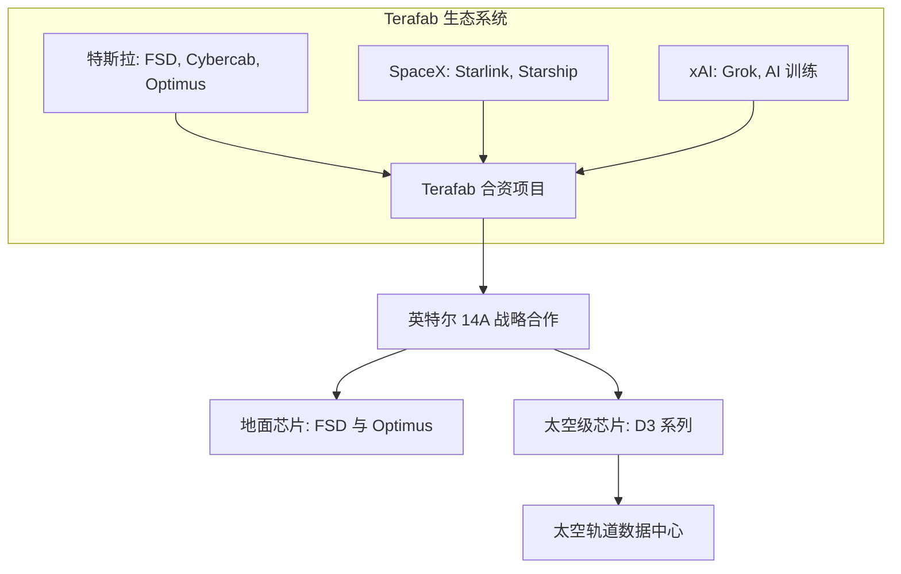

# 德州巨碑：起底埃隆·马斯克 1190 亿美元“Terafab”算力豪赌与太空 AI 边疆

2026年3月21日，埃隆·马斯克公布了一项令人瞩目的宏大计划——**Terafab**。作为特斯拉（Tesla）、SpaceX 和 xAI 的合资项目，该计划旨在德克萨斯州建立一个高度垂直整合的半导体制造生态系统。其终极目标非常明确，但也极其艰难：通过将芯片设计的全部生命周期——从架构设计、高数值孔径极紫外（High-NA EUV）光刻、晶圆制造，到内存整合与先进封装——彻底收归于单一企业版图之下，从而实现绝对的“算力主权”（Compute Sovereignty）。

目前，该联盟已在特斯拉位于奥斯汀的 Giga Texas 超级工厂内运行试点生产线，并计划在德州格莱姆斯县（Grimes County）吉本斯溪水库附近投建一座耗资高达 1190 亿美元的超大型晶圆制造综合体。其核心使命是实现年产 1 太瓦（TW）的算力产能，源源不断地向地面及太空输出数百亿颗定制的商用与航天级芯片。为了领衔这一冲锋，特斯拉挖来了在英特尔深耕 17 年的资深制造专家 Gary Jiang，他曾主导了英特尔亚利桑那州 Ocotillo 工厂 18A 工艺节点的落地部署。此外，Terafab 已经与英特尔达成战略联盟，获得其最先进的 **14A 工艺节点**授权，这无疑是对帕特·基辛格（Pat Gelsinger）治下英特尔代工（Intel Foundry）业务的一场关键大考。

### 技术栈：14A 前沿的垂直整合深水区
半导体行业的垂直整合难度之大，业内皆知。从历史上看，半导体产业一直在向高度专业化、去中心化的分工模式演进：苹果与英伟达专攻芯片设计，ASML 垄断光刻机制造，台积电负责物理晶圆代工，而 OSAT（外包封装测试商）则包揽封装。然而，马斯克的 Terafab 计划试图彻底颠覆这一传统范式。

基于英特尔的 14A 工艺节点，该项目将成为首个非英特尔系、原生针对高数值孔径（High-NA）EUV 光刻进行设计的半导体项目。14A 工艺采用了英特尔的 RibbonFET（全环绕栅极）架构与 PowerVia（背面供电技术）。后者通过将供电走线与信号走线进行物理分离，能有效提升时钟频率并大幅降低电压降。

不仅如此，Terafab 还试图将下一代高带宽内存（HBM4）的生产线也纳入囊中。与依赖微凸块（Microbumps）技术的 HBM3 不同，HBM4 迈向了 2048 位的超宽接口，这要求在逻辑芯片上直接进行铜-铜混合键合（Direct copper-to-copper hybrid bonding）。在同一屋檐下完成如此高难度的协同设计与极度复杂的先进封装，在半导体历史上尚无先例。

### Gary Jiang 掌舵与英特尔同盟
挖角 Gary Jiang 担任 Terafab 负责人，是该项目在人才争夺战中的一次重大胜利。作为在英特尔效力 17 年的功勋老将，Jiang 在管理亚利桑那州 Ocotillo 工厂向 18A 节点转型中积累的经验，对 Terafab 而言是无价之宝。他带来了跑通工具接入、特殊气体输送系统以及无尘室认证等一整套标准的晶圆厂运行“说明书”。

英特尔 CEO 帕特·基辛格对这一联盟表现出了极大的热情，将其视为英特尔代工服务（IFS）的超级“锚定客户”。基辛格在社交平台 X 上表示：
> “与埃隆及 Terafab 团队的合作，让我们得以在从未有人尝试过的尺度上，对芯片制造技术进行重构。通过将英特尔的 14A 光刻技术与 Terafab 的垂直封装能力相结合，我们正在突破算力的物理极限。”

### 业界冷眼：残酷的“良率艺术”
尽管挖来了行业大牛并与英特尔结盟，但主流半导体业界对此依然疑虑重重。晶圆制造从来不仅是资金游戏，更是极致的运营优化与工程物理落地问题。

英伟达 CEO 黄仁勋对非传统玩家从头构建晶圆厂的可行性深表怀疑：
> “建造一座领先的晶圆厂绝非买几台机器那么简单。这背后是数十年的良率优化、工艺微调以及化学工程积累。试图从头复制整个代工生态系统，几乎是不可能的。”

知名半导体研究机构 *SemiAnalysis* 的首席分析师 Dylan Patel 则一针见写地指出了巨大的财务与工程风险：
> “马斯克上马 Terafab，本质上是出于对长期 GPU 和 TPU 产能受限的极度焦虑。但要想达到年产 1 TW 算力的规模，其资本支出将高达数千亿美元。即使有英特尔的倾力相助，1.4 纳米级别工艺的良率爬坡曲线也极其残酷。一旦 Terafab 的良率掉到 50% 以下，单颗合格芯片的实际成本将呈天文数字般飙升，远远贵过直接向台积电下单。”

### 太空新边疆：轨道 AI 数据中心
然而，Terafab 宏大蓝图中最具科幻色彩且饱受争议的，莫过于将定制的太空级芯片（如 D3 系列）部署到由 Starship（星舰）发射的轨道太空数据中心。

支持者（包括 xAI 的研究人员）坚称，太空算力是解决地球能源、土地和水资源瓶颈的终极方案。在轨道上，太阳能辐射恒常稳定，且没有土地规划的限制。然而，Reddit 和 X 平台上的硬核工程师们指出了三大无法回避的物理瓶颈：

1. **真空环境下的散热死结**：在太空真空中，对流散热完全失效，热量只能通过热辐射进行传导，这受制于斯特藩-玻尔兹曼定律（$P = \epsilon \sigma A T^4$）。要排掉高性能 AI 芯片产生的兆瓦级热量，轨道数据中心必须配备极其庞大且脆弱的辐射散热板阵列。正如 Reddit 社区 r/SpaceXMasterrace 上一位热能工程师所算：*“哪怕只是冷却一个区区 10 兆瓦的微型太空算力集群，也需要超过 3 万平方米的散热板。这会在近地轨道（LEO）产生巨大的稀薄空气阻力，并给航天器结构带来毁灭性的脆弱性。”*
2. **宇宙辐射与单粒子翻转（SEU）**：高能宇宙射线、太阳质子事件以及范艾伦辐射带的常态化辐射是悬在芯片头上的达摩克利斯之剑。1.4 纳米工艺的逻辑栅极对单一粒子的撞击极度敏感，极易引发比特翻转（单粒子翻转）甚至锁死。传统的抗辐射加固技术通常需要使用更大、更冗余的晶体管，这与 AI 芯片追求极致性能和能效的目标直接冲突。
3. **发射经济学算账**：尽管星舰已将发射成本压低至 1500 美元/公斤以下，但根据 *SemiAnalysis* 推演的“AI 太空数据中心 TCO 模型”，太空算力若想在性价比上与地面数据中心打平，发射成本必须进一步压缩到 100 至 200 美元/公斤，或者太空太阳能捕获的能效比必须呈压倒性地超越地面电网。
