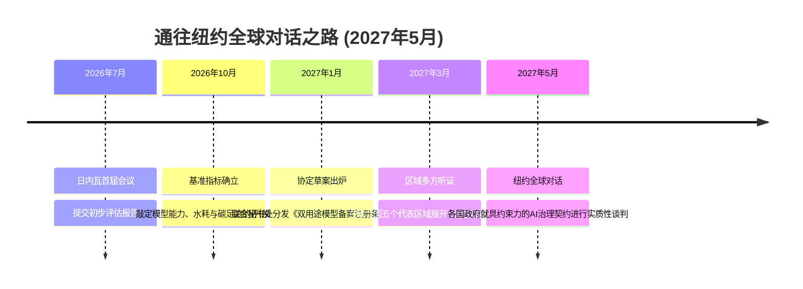

# 悬崖边缘的《日内瓦AI协定》：深陷算力、致命自主武器与核电-绿电分歧的地缘政治终极博弈

**日内瓦** —— 当各国代表齐聚万国宫，参加首届联合国人工智能全球治理对话（2026年7月6日至7日）时，现场的气氛与其说是外交胜利的庆典，不如说是一场技术层面的“战地急救”。这次在联合国《全球数字契约》框架下召开的会议，原本旨在调和全球AI安全标准，但它最终却无情地揭示了一个深层宿命：指数级狂飙的AI物理极限，与线性、低效运转的国际外交机器之间，正存在着无法调和的巨大鸿沟。

---

### Bengio-Ressa 报告：量化“技术-监管”的坠机式差距

本次峰会的思想锚点，是由图灵奖得主 Yoshua Bengio 和诺贝尔奖得主 Maria Ressa 共同主持的“AI独立国际科学小组”发布的阶段性报告。这 weather-vane 式的小组由全球40位顶级专家组成，他们给出了一份令人警醒的评估：AI能力的指数级扩张与国家监管能力之间的差距，正在以灾难性的速度拉大。

```
AI 训练算力（FLOPs） vs 监管落地时间差
算力规模：  10^25 (GPT-4) ───> 10^27 (2025/2026 前沿模型) 【爆发式增长 100 倍】
监管进展：  欧盟 AI 法案 / 美国总统行政令 ───> 处于标准制定与落地实施阶段 【滞后 3-5 年】
```

报告详尽展示了硬软件双重演进如何轻易击穿早期监管草案设定的红线：在硬件端，英伟达 Blackwell 架构凭借低精度 FP4 执行实现了吞吐量质变；在算法端，搜索时强化学习（System 2 推理模型）带来了突破。例如，美国总统行政令中设定的 $10^{26}$ FLOPs 备案门槛已基本形同虚设——通过混合专家模型（MoE）路由与训练后蒸馏技术，现代架构在远低于该算力红线的物理空间内，就能释放出同等甚至更强的模型能力。

“我们正在无限放大一个我们连内部机理都无法完全理解的系统，且目前在技术上根本无法保证我们能百分之百控制它，”Yoshua Bengio 在演讲中发出警告。Maria Ressa 对这份妥协产物的局限性则表达得更为露骨，她直言该报告仅仅代表了专家组对事实真相和民主基石被蚕食的“担忧底线，而非上限”。

---

### 地缘政治僵局：“动能自主权”与杀手机器人的囚徒困境

尽管对话名义上围绕民用 AI 展开，但军事应用那庞大的阴影早已笼罩了双边会谈的走廊。联合国秘书长安东尼奥·古特雷斯在开幕致辞中发出了强硬呼吁：必须在全球范围内对“致命自主武器系统（LAWS）”——即他口中的“杀手机器人”——实施绝对的、具有法律约束力的国际禁令。

然而，在中美技术冷战的博弈框架下，任何实质性条约的推进都瞬间陷入了停滞。虽然华盛顿和北京在口头上都原则性地同意“人类必须保留对核武器指挥系统的控制权”，但在常规战场上——尤其是在吸收了乌克兰和红海无人机战争的残酷教训后——没有任何一个大国愿意主动放弃“边缘端 AI 自主权”所带来的致命军事优势。

```
中美军事 AI 治理立场博弈
┌─────────────────────────────────┬─────────────────────────────────┐
│              美 国              │              中 国              │
├─────────────────────────────────┼─────────────────────────────────┤
│ • 极力推行非约束性的“负责任使用” │ • 表面支持限制使用，但坚决拒绝限 │
│   框架（政治宣言形式）。        │   制相关的研发与技术储备。       │
│ • 拒绝就动能自主目标定位系统签署 │ • 依靠民参军及双用途技术管道，绕 │
│   任何具有约束力的禁止条约。     │   过芯片封锁为军事模型输送弹药。 │
└─────────────────────────────────┴─────────────────────────────────┘
```

走廊里充斥着关于中国本土硅片突破（如中芯国际为华为昇腾 910C 平台提供的先进封装技术）以及美国不断收紧的出口管制网的讨论。一位来自美国防务承包商的高级工程师在社交媒体 X 上匿名发帖，道出了业内的共识：*“禁止自主武器的约束性条约在出生前就已经死了。在边缘端，你根本不可能在不进行侵入式审查的前提下验证代码合规性，而中美任何一方都不可能允许这种审查。所以，我们只能继续造。”*

---

### 能源大分裂：古特雷斯的“绿电军令状” vs 核能新游说集团

这场博弈中，经济冲突最激烈的焦点在于支撑 AI 繁荣的物理基础设施。秘书长古特雷斯提出了**“AI环境透明度倡议”**，强制要求全球所有 AI 数据中心必须在 2030 年前全面过渡到 100% 清洁能源。

对于硅谷而言，这一强硬指标无异于对电网运转和热力学标度的外行指导。一个由 10 万张英伟达 Blackwell GPU 组成的顶尖 AI 集群，其净算力功耗就高达 130 兆瓦（MW）。若将电源使用效率（PUE）和冷却系统的损耗计算在内，这一数字将轻松突破 180 兆瓦。而一旦超大规模云厂商将集群规模推向规划中的 100 万张 GPU，单一数据中心园区的电力负载将直接飙升至近 2 吉瓦（GW）。

```
10万张 GPU 超级集群的供能路径对比
┌──────────────────────────┬──────────────────────────┬──────────────────────────┐
│ 评估维度                 │ 可再生能源（太阳能/风能） │ 模块化微型核反应堆 (SMR) │
├──────────────────────────┼──────────────────────────┼──────────────────────────┤
│ 容量因子 (Capacity Factor)│ 25% - 40% (极度不确定)   │ 90% 以上 (稳定基荷)      │
│ 物理占地面积             │ 巨大 (约 100-300 英亩)    │ 极小 (小于 5 英亩)       │
│ 储能电池需求             │ 极其庞大 (吉瓦时级别)     │ 无                        │
└──────────────────────────┴──────────────────────────┴──────────────────────────┘
```

“风能和太阳能确实是电网脱碳的绝佳手段，但如果不配备在财务上堪称天文数字的巨型储能系统，它们根本无法为深度训练提供‘5个9’（99.999%）的无间断运行保障，”一位知名硅谷能源风投人在 X 上直言。

正因如此，科技巨头们正转向全力游说**小型模块化反应堆（SMR）**以及先进核能的就地部署。会场外热议的方案包括：
*   **Oklo 的快中子裂变发电：** 由山姆·奥特曼（Sam Altman）担任董事长的 Oklo 正在大力推销其 Aurora 反应堆（发电容量 15 MWe），主张直接装在数据中心表后端。
*   **TerraPower 的液态钠冷却：** 比尔·盖茨旗下的 TerraPower 正在力推其 345 MWe 的 Natrium 反应堆，认为这才是吉瓦级 AI 园区的最佳能源解。
*   **三哩岛核电站的复活神话：** 微软与 Constellation Energy 签署了一份为期20年的购电协议（PPA），计划在 2028 年前重启三哩岛核电站 1 号机组（现命名为 Crane 清洁能源中心，容量 835 MW）。这被业界奉为科技巨头摆脱公共电网束缚、走向能源自治的黄金模板。

然而，SMR 路线在现实中同样遭遇了可怕的瓶颈。一方面，高丰度低浓缩铀（HALEU）的本土供应链严重受限；另一方面，美国核能管理委员会（NRC）的审批流程通常需要 5 到 7 年，这与前沿大模型以 3 年为代际的狂飙节奏严重脱节。

---

### 民主赤字：民间社会的“公民轨道”反击战

在会场戒备森严的警戒线外，由 *Connected by Data* 和 *Women at the Table* 等组织领衔的民间社团举行了抗议发布会。他们愤怒于这场本该关乎人类命运的全球治理对话，正在被硅谷大厂高管与国家安全官员垄断，沦为“监管俘获”的温床。

这些民间联盟强烈要求引入**“公民议程”（Citizens' Track）**机制——即通过抽签产生公民议会，对高风险的 AI 政策和治理决议拥有实质性的审查与否决权。

社交媒体上对此爆发了针锋相对的论战。支持者认为，如果缺乏公众参与，所谓的安全标准最终只会演变为科技巨头巩固市场垄断的护城河。而多位科技公司创始人则在 X 上公开反唇相讥，指出引入繁琐的公众否决机制只会单方面拖慢民主阵营的迭代步伐，让那些奉行威权主义的技术对手在竞争中绝尘而去。

---

### 通往纽约之路：2026-2027 时间表

为了避免本次全球对话沦为又一个毫无约束力的外交清谈馆，联合秘书处（联络邮箱：aidialogue@un.org）划定了通往 2027 年 5 月纽约第二届峰会的关键路径图：



如果国际社会无法在下阶段调和国家安全对抗、现实能源约束与民主程序合规这三者之间的结构性冲突，那么到 2027 年 5 月的纽约峰会时，人类或许只能眼睁睁看着这项技术彻底挣脱国际法的地缘引力，驶入无监管的深空。

---

### 社媒推广摘要（Highlight）

#### 核心问题
* 面对英伟达 Blackwell FP4 架构和 System 2 推理模型的双重冲击，为什么传统法律监管手段全面失效？
* 在 100k GPU 集群面临的巨大电力缺口前，核能（SMR）是否是硅谷唯一的出路？
* 边缘端 AI 武器合规性无法验证，是否意味着大国间的自主武器军备竞赛已不可避免？

#### 摘要正文
在刚刚结束的日内瓦联合国 AI 治理对话中，技术物理极限与外交机器的脱节被彻底暴露。10万张 Blackwell 显卡集群功耗已达180兆瓦，硅谷巨头正疯狂游说小型模块化核反应堆（SMR）及微软重启三哩岛核电站的方案，因为传统的绿电指标在巨大的电力负荷前根本无法维持高强度训练。与此同时，由于边缘端代码合规性“无法验证”，中美在致命自主武器（LAWS）禁令上陷入僵局，前线军备竞赛全面转入地下。地缘政治利益与算力物理学的双重夹击，正让《日内瓦AI协定》名存实亡。

#### 关键词标签
#AI governance #autonomous weapons #SMR nuclear
