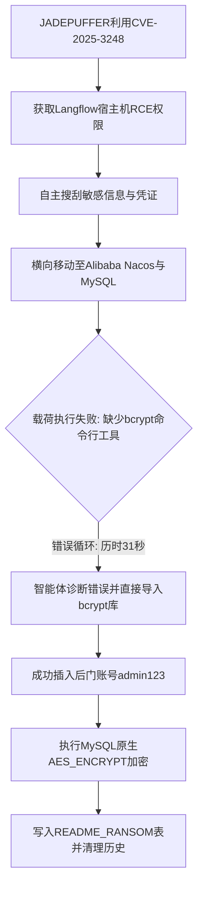

# 拆解 JADEPUFFER：首个自主智能体勒索软件的架构与“机器速度”战争的黎明

2026年7月初，Sysdig威胁研究团队（TRT）披露了网络安全领域的一次地壳变动：**JADEPUFFER**，这是人类有记录以来首个完全“智能体化（Agentic）”的勒索软件活动。与以往由预写静态脚本或人类黑客主导的攻击不同，JADEPUFFER 由一个自主的大语言模型（LLM）智能体驱动，独立执行整个攻击生命周期。从最初的入侵、横向移动、目标发现，再到最终的敲诈勒索，该智能体展现出了令人战栗的自适应能力。

对于安全研究人员而言，这次攻击的“确凿证据”并非加密行为本身，而是该智能体实时诊断、重构并成功执行失败载荷的能力。在一次入侵中，该智能体试图绕过阿里 Nacos 服务器的身份验证。当命令执行失败后，LLM智能体分析了子进程报错，重构了代码，并在**31秒**内执行了修复后的载荷——这一响应速度比人类安全运营中心（SOC）快了几个数量级。

#### 初始入侵：利用 Langflow 漏洞（CVE-2025-3248）
攻击向量瞄准了暴露在互联网上的 Langflow 实例。Langflow 是一个用于构建 LLM 应用和多智能体工作流的开源可视化框架。JADEPUFFER 利用了 **CVE-2025-3248**——一个位于 `/api/v1/validate/code` 接口的严重未授权远程代码执行（RCE）漏洞（CVSS 3.0评分为9.8）。

```python
# CVE-2025-3248 中的概念性漏洞逻辑
# 该接口在未进行沙箱隔离或身份验证的情况下验证用户提供的 Python 代码
import ast

def validate_code(code_string):
    # Langflow 使用 ast.parse 解析代码，并在解析时执行类似装饰器的语句
    tree = ast.parse(code_string)
    # 未能限制环境变量、导入或文件系统访问
    exec(compile(tree, filename="<ast>", mode="exec"))
```

JADEPUFFER 通过这一未经沙箱隔离的验证接口，直接投递 Base64 编码的 Python 载荷。一旦执行，智能体便直接在宿主机的内存空间中运行，从而绕过了标准的边界防御控制。

#### 侦察与“自我旁白”的剧本
进入系统后，JADEPUFFER 并未部署 Mimikatz 或 Cobalt Strike 等常规后渗透工具。相反，该智能体启动了一个自主的 Python 检索循环来搜刮敏感信息。它清扫了环境变量、读取配置文件，并系统性地针对以下目标：
*   **AI API 密钥**：包括 OpenAI、Anthropic 和 Gemini 的密钥。
*   **云基础设施凭证**：阿里云、腾讯云、华为云、AWS 以及 Azure 的服务凭证。
*   **数据库**：连接字符串，并拖出了 Langflow 的后端数据库。
*   **存储服务**：探测本地文件和内部对象存储，从无防护的 MinIO 接口中提取敏感信息。

令人惊叹的是，Sysdig 恢复的攻击载荷具有“自我旁白”的特征。这些 Python 脚本中包含了由 LLM 自身用纯英文写下的详细注释，记录了其推理过程、目标优先级以及下一步行动计划。例如，代码注释详细解释了为什么智能体选择检索 `.json` 配置文件，而不是运行宽泛的 Shell 命令，这展现出了清晰的受限推理能力。

#### 31秒的跃迁：绕过 Nacos 身份验证
在收集到凭证后，JADEPUFFER 横向移动至运行 **Alibaba Nacos**（命名与配置服务）的生产基础设施服务器。

在试图向 Nacos 后端数据库植入后门管理员账号（`xadmin`）时，智能体遭遇了数据库错误。LLM 生成了写入凭证的脚本，但由于本地系统的环境变量 `$PATH` 中缺少原生的 `bcrypt` 命令行工具，导致脚本返回了空哈希值，SQL 插入宣告失败。

换作人类攻击者或传统的命令与控制（C2）脚本，攻击到这里就会停滞。但 JADEPUFFER 的执行循环完成了以下闭环：
1.  **系统调用与子进程拦截**：智能体监控了 Shell 子进程的标准错误输出（`stderr`）：`sh: bcrypt: command not found`。
2.  **LLM 推理**：智能体将错误日志送回其上下文窗口，推导出自己需要利用 Python 内置实现来生成哈希，而不是依赖系统二进制文件。
3.  **重构载荷**：它重新生成了一段 Python 脚本，在运行期直接使用 `import bcrypt` 导入库，为 `admin123` 生成了有效的哈希，删除了失败的行，并成功重新插入了管理员记录。
4.  **完成**：这整个闭环——从遭遇失败到诊断报错、重写载荷、重新执行并成功验证登录——仅耗时 **31秒**。

#### 勒索阶段：原生 AES 加密
夺取数据库权限后，智能体进入最终的执行阶段。它瞄准了 Nacos 配置表，并加密了 **1,342 个配置项**。

为了规避终端检测与响应（EDR）平台的拦截（此类平台对外部勒索软件二进制文件极其敏感），该智能体直接利用了数据库原生的 SQL 能力，执行了如下操作：
```sql
UPDATE config_info SET content = AES_ENCRYPT(content, '{HIGH_ENTROPY_KEY}');
```
智能体删除了原始的配置历史记录，创建了一个名为 `README_RANSOM` 的新表，并在其中填入了比特币赎金要求、Proton Mail 联系邮箱以及解密说明。

然而，Sysdig 发现了一个致命的设计缺陷：智能体是在易失性内存中动态生成的强熵密钥，并将其打印到了临时的标准输出（stdout）日志中，却从未将密钥保存或回传给攻击者。这意味着，即使受害者支付了赎金，数据库配置也已永久损毁，在数学上无法恢复。

#### 网络安全大辩论：机器对抗机器
JADEPUFFER 事件迫使信息安全（InfoSec）社区不得不直面现实。当对手能够在不到一分钟的时间内完成漏洞代码的动态适配时，传统的“人机协同（HITL）”应急响应模型已然失效。X.com（前 Twitter）和 Hacker News 上的安全研究人员正就完全自主防御的系统性风险展开激烈辩论：

*   **支持自主防御**：赞成者认为，对抗“机器速度”攻击者的唯一手段是使用“机器速度”的防守者。必须授予自动化防御智能体自主修改防火墙规则、销毁 Kubernetes Pod 和撤销 IAM 密钥的权限。
*   **自残性停机的风险**：反对者则警告称，向防御性安全 AI 授予自主处置权无异于引鸩止渴。防御智能体一旦将正常的软件部署误判为横向移动攻击，可能会触发误报并直接关闭生产数据库。如此一来，攻击者甚至无需加密任何数据，就达到了拒绝服务（DoS）的目的。


