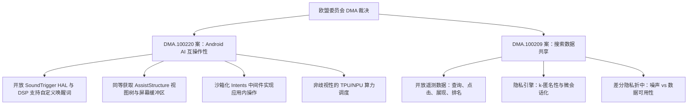

# **拆解欧盟谷歌反垄断判决：Android 18 开放架构的技术妥协与搜索隐私的“数学悖论”**

2026年7月16日，欧盟委员会根据《数字市场法案》(DMA) 做出两项具有里程碑意义的终局裁决，系统性地瓦解了谷歌最坚固的竞争护城河。在 DMA.100220 号案件中，谷歌被要求在2027年8月1日前（伴随 Android 18 的发布），向 OpenAI 的 ChatGPT、微软的 Copilot 以及 Anthropic 的 Claude 等竞争对手开放 Android 系统的 11 项核心系统级功能。与此同时，DMA.100209 号案件则强制谷歌在2027年1月前，以公平、合理和非歧视 (FRAND) 的条款，向竞争对手的搜索引擎和 AI 聊天机器人共享其庞大的搜索查询、点击、浏览及排名遥测数据。

尽管欧洲监管机构将其誉为数字竞争的重大胜利，但谷歌全球事务总裁肯·沃克 (Kent Walker) 随即拉响了警报，称这些决定“可能会破坏数百万欧洲用户至关重要的隐私和安全防线”。

对于系统架构师和安全工程师而言，这些裁决交织出一张极其复杂的工程考卷。拨开底层的技术细节，我们会发现谷歌为了彻底向竞品敞开 Android 18 的底层核心，必须做出巨大的工程妥协；而规模化匿名搜索日志的尝试，也正面临着无法逾越的数学极限。



### Android 18 的 AI 互操作性：拆解系统底层的技术妥协
目前，谷歌自家的 Gemini 在 Android 系统中享有着独占的、深度的原生整合。虽然第三方助手可以通过标准的 `VoiceInteractionService` API 注册为默认的数字助手，但它们在沙箱中运行，无法触及核心的 OS 功能。根据欧盟的新规，谷歌必须在四个关键系统层面上，向竞争对手开放 11 项核心操作系统特性：

#### 1. 唤醒机制与 DSP 瓶颈
为了实现与 Gemini 相同的免提语音激活体验，Android 必须允许第三方助手注册自定义唤醒词（如“Hey ChatGPT”），且必须在屏幕关闭或设备休眠时同样生效。

在现有的 Android 架构中，这一机制高度依赖 `AlwaysOnHotwordDetector` API，该 API 直接绑定到特权级最高的 `SoundTrigger` 硬件抽象层 (HAL)。`SoundTrigger` HAL 负责与 SoC（片上系统）中专门的低功耗数字信号处理器 (DSP) 进行直接通信。该 DSP 持续监控微型的麦克风缓冲区以匹配特定的声学特征，其功耗仅为微安级。

在 Android 18 中，谷歌必须在 `SoundTrigger` HAL 之上构建一个标准化的 API 中间件，允许第三方助手将它们自己的声学模型烧录进 DSP 中。

而到了 Android 19（法案强制要求于 2028 年 8 月 1 日前落地），工程复杂度将呈指数级上升，因为届时系统必须支持**并发热词检测**。大多数现代移动芯片的 DSP 面积非常受限，且在硬件设计之初就仅针对单一唤醒词模型进行了优化。如果让三个或四个模型并发运行（例如同时监听 "Hey Google"、"Hey Siri" 和 "Hey ChatGPT"），要么需要硬件共处理器的支持，要么必须开发出一套纯软件层面的音频焦点仲裁中间件。一旦需要频繁唤醒功耗极高的应用处理器 (AP) 来判定相似读音的热词，手机的待机续航将瞬间崩溃。

#### 2. 屏幕上下文与辅助功能 (Assist API)
Gemini 能够直接读取用户当前的屏幕内容，并以此提供上下文相关的智能解答。在系统底层，这一功能依托于 `AssistStructure` 和 `AssistContent` API。系统会捕获当前窗口序列化后的视图树并提取屏幕截图缓冲区，然后将其传递给处于活动状态的语音会话。

Android 18 必须给竞争对手的助手提供同等获取这些原始屏幕缓冲区和结构化视图树的权限。这实际上绕过了 Android 传统的应用沙箱机制。从理论上讲，第三方 AI 助手将有能力读取用户的密码、财务数据或私人聊天记录。虽然开发者可以通过设置 `WindowManager.LayoutParams.FLAG_SECURE` 标志来阻止屏幕截取，但由于大量第三方应用并未部署该标识，安全重担将完全落在助手开发商的自觉性以及操作系统运行时的权限弹窗提醒上。

#### 3. 安全的跨应用操作对决无障碍漏洞
要让 AI 助手在其他 App 内执行具体操作（例如在 WhatsApp 上发消息或在 Uber 上打车），Gemini 可以直接调用谷歌私有的 App Actions。而目前，第三方开发者想要在 Android 上实现 UI 自动化操作，往往只能被迫滥用 `AccessibilityService`（无障碍服务）API。然而，无障碍 API 拥有极高的系统权限，历来是 Android 银行木马和屏幕覆盖攻击（Overlay Attacks）的重灾区。

为了在不给用户带来致命安全隐患的前提下满足 DMA 的合规要求，谷歌必须设计一个全新的、沙箱化的 Intent 分发与 UI 自动化中间件。该中间件需要将助手的抽象意图（例如 `ACTION_SEND_MESSAGE`）转换为结构化的系统级指令，在代表用户执行的同时，坚决不向助手程序本身授予原始的视图树修改或模拟点击的底层特权。

#### 4. 硅片级资源调度
运行在设备本地的轻量级模型（例如 Gemini Nano）在 Android 系统中拥有极高的运行优先级。Android 18 必须以非歧视的原则向竞争对手的模型分配 TPU/NPU 计算周期以及内存锁定（`mlock`）额度。在系统内存告急时，第三方助手的进程绝不能像普通后台应用那样被“低内存杀手”（LMK）无情清理，而 Gemini 却躲在拥有最高优先级的 `SCHED_FIFO` cgroups（控制组）中安然无恙。

### 搜索数据共享的“差分隐私悖论”
DMA.100209 案旨在击碎谷歌最强大的“搜索飞轮”——即数十亿次搜索查询以及随后的点击率（CTR）数据不断喂养、持续优化谷歌搜索排名模型的滚雪球式优势。从 2027 年 1 月起，谷歌必须在 FRAND 条款下向竞品共享包含排名、查询、点击和展现的遥测数据。

然而，搜索查询本身蕴含着极高的语义上下文和强烈的个人特异性。2006 年著名的 AOL 搜索数据泄露事件已经证明，仅靠简单的“去标识化”（如用数字 ID 替代用户名）在保护隐私方面形同虚设。研究人员通过将包含本地地标、家庭成员姓名等线索的搜索记录与公开的电话簿交叉比对，轻而易举地锁定了解密用户。

为了防止身份重识别，欧盟委员会提出了一套多层匿名化框架：
* **属性抑制 (Attribute Suppression)**：剥离 IP 地址、精确地理位置和唯一的 User-Agent 字符串。
* **K-匿名性 (k-Anonymity)**：在特定时间窗口内，任何出现频次低于 $k$ 次（例如 $k=30$）的孤立查询请求都将被直接过滤。
* **微会话化 (Mini-Sessionization)**：将用户的搜索历史割裂为只包含 2-3 个查询的、互不关联的极短时间窗口，以切断搜索行为链的关联。

然而，即使有这些严密的防线，谷歌顶级差分隐私研究员 Sergei Vassilvitskii 依然发出警告称，谷歌的红队（Red Team）已经成功绕过了欧盟委员会提出的匿名化方案。通过对辅助公开数据集（如带地理标记的社交媒体签到数据）进行“链接攻击”，红队在短短两个小时内就完成了用户身份的重识别。

```
典型查询日志：
[用户 ID: 88471] -> "淋巴瘤症状" -> "慕尼黑淋巴瘤专家" -> "Dr. Hans Weber 评价"
          |
          v (微会话化 & K-匿名过滤)
共享日志：
[会话 A] -> "淋巴瘤症状" (保留，高搜索量)
[会话 B] -> "慕尼黑淋巴瘤专家" (保留，中搜索量)
* "Dr. Hans Weber 评价" (被直接抹除：查询频次 < k)
```

解决这一困局的行业公认标准是**差分隐私 (Differential Privacy, DP)**。它通过在数据表中引入严格计算的数学噪声（拉普拉斯或高斯噪声），确保任何单个用户数据的加入或退出，都不会对数据集的查询结果产生显著影响。然而，搜索查询的分布遵循极长尾的幂律曲线——谷歌每天处理的搜索中，约有 15% 是历史从未出现过的全新长尾词。

如果要在较低的隐私预算 ($\epsilon$) 下部署严密的差分隐私机制，就必须将这些海量的长尾查询全部抹去或进行重度模糊处理。然而，搜索遥测数据的核心训练价值恰恰蕴含在这些高度具体、意图明确的罕见长尾词中。如果注入足够的噪声以绝对保证隐私，处理后的数据集将失去几乎所有的实用价值，彻底沦为无法用于训练竞争对手搜索引擎或 AI 检索模型的“学术废料”。

### 行业格局的战略影响
DMA 裁决对谷歌核心商业模式的打击是前所未有的。通过强制虚拟化 Android 的助手服务层以及民主化搜索日志，欧盟正在大幅降低 AI 搜索引擎的准入门槛。

Perplexity 首席执行官 Aravind Srinivas 如此评价这次变革的重量：
> “能在公平合理（FRAND）的条款下获取高质量的搜索查询和点击数据，对于搜索初创公司而言是一次决定性的转折。它拉平了我们与巨头之间的起跑线——须知，这位守门人已经独自垄断并积累了整整 25 年的用户反馈闭环。”

而另一边，谷歌全球事务总裁肯·沃克则为谷歌的抗争进行了辩护：
> “以竞争之名，将用户的私密搜索数据暴露给不为人熟知的第三方企业，是将用户的隐私安全置于险境。此外，强行要求系统组件（如麦克风、屏幕和传感器）提供未经审查的深层访问权限，将彻底绕过保护 Android 系统安全的沙箱防线。”

DMA 监管法案、复杂的系统架构以及密码学隐私的物理极限，共同交织成一场高水准的工程博弈。随着谷歌开始着手构建 Android 18 的 API 以及筹备 2027 年的 FRAND 搜索数据流水线，整个科技界都将屏息以待：当一个操作系统的核心被强行剖开时，它是否还能守住安全与隐私的底线？
