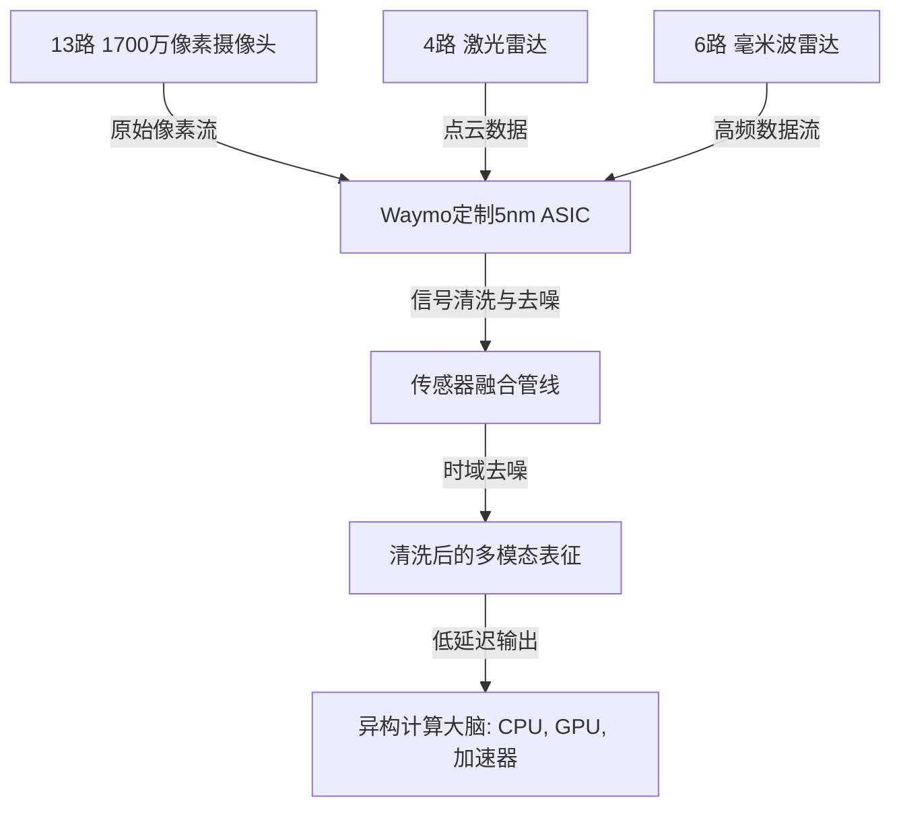

# **拉斯维加斯Robotaxi淘金热：内华达松绑万辆运力，Waymo亮出台积电5nm定制传感器ASIC**

自动驾驶（AV）的军备竞赛在内华达州南部陡然升级。在刚刚结束的一场马拉松式听证会上，内华达州交通管理局（NTA）一致投票通过，正式批准**特斯拉（Tesla Robotaxi, LLC）**、**Waymo（Waymo, LLC）**以及Uber全资子公司**Aviari Services（Aviari Services, LLC）**根据该州《内华达州修订条例》（NRS）第706B章的规定，获得商业化自动驾驶汽车网络公司（AVNC）的运营许可。

这一监管层面的破冰，意味着克拉克县（Clark County）境内——包括交通极其拥堵的拉斯维加斯大道（The Strip）及周边区域，将迎来前所未有的无人驾驶商业车队扩张。尽管许可的地理范围涵盖了哈里·里德国际机场（Harry Reid International Airport），但运营商在正式开展机场接送客业务前，仍需获得克拉克县航空局的单独专项授权。

此次获批的12个月期车队授权规模之大，令人瞩目：
* **特斯拉：** 获批上限高达5000辆。
* **Waymo：** 获批上限达1000辆。
* **Aviari (Uber)：** 获批上限达1000辆。
* **Zoox (亚马逊旗下)：** 目前在该地区持有100辆车的有效运营许可。

与商业版图扩张同步，Alphabet旗下的Waymo首次详细公开了其由台积电代工、自主设计的5nm专用集成电路（ASIC）。该定制芯片专为处理Waymo第六代自动驾驶系统（6th-generation Driver）的原始数据而生，这标志着自动驾驶端侧计算（Edge Compute）的优化迎来里程碑突破。

---

### 监管范式转变：NTA的准入底线与合规博弈

NTA此次的放行，与此前极其保守的监管态度形成了鲜明对比。早在2026年7月，NTA给特斯拉发放的临时许可证还充满苛刻限制：车队规模上限仅为10辆、只能在特定的拉斯维加斯大道走廊内运行、最高时速被限制在45英里/小时，且严禁进入机场。而新颁发的AVNC许可则彻底解除了这些限制，允许在全县范围内按照普通商业客运规则进行全速运行。

但NTA显然不会开出无条件的绿色通行证。在从获得许可走向正式商业运营的30天窗口期内，各家公司必须满足严苛的合规条款：
1. **首响应人员应急协议：** 运营商必须建立专用的24小时应急热线，并向一线救援人员共享车辆“死机”或宕机时的实车处置规程。
2. **算法与APP审计：** 运营方必须提交面向用户的打车APP架构、收费费率标准，并提供清晰的车辆安全检测报告以供监管审查。
3. **责任险额度大修：** 根据NRS第706B章，商业AVNC车队必须购买至少150万美元的商业责任险。

随着安全员从前排彻底消失，法律界普遍认为，事故的责任判定逻辑正发生根本性转向。正如社交平台Reddit的r/selfdrivingcars板块中一位法律学者所言：*“当一辆Robotaxi撞车时，这不再是传统意义上的驾驶员过失纠纷。它将演变成一起高度复杂的‘产品责任’诉讼。软件开发商、硬件制造商和车队运营商都将共同站在聚光灯下接受拷问。”*

---

### Waymo的芯片阳谋：解构台积电5nm定制ASIC

在特斯拉疯狂追求物理运力规模的同时，Waymo则将精力集中在端侧计算效率的极致压榨上。Waymo近日公布的5nm定制ASIC，正式宣告了此前在传感器处理管线中昂贵且耗能的英特尔现场可编程门阵列（FPGA）方案走向终结。



#### 数据摄取管线
Waymo第六代Driver系统搭载了一套成本经过深度优化的精简传感器套件：
* **13路高分辨率摄像头：** 采用1700万像素图像传感器，提供360度重叠视野覆盖。
* **4路激光雷达（Lidar）单元：** 提供高密度的三维点云。
* **6路毫米波雷达（Radar）单元：** 在各种极端恶劣天气下提供稳定的速度和距离追踪。

要实时处理如此庞大且多模态的数据流，需要极高的带宽和超低的延迟。Waymo的定制ASIC在系统架构中扮演了专职“前端处理器”的角色。它在物理接口层直接接入原始像素流、点云数据和雷达反射信号。

#### 该定制ASIC的核心能力：
* **超1,000 TOPS（系统级）：** 通过将多颗ASIC并联部署，该计算系统在前端数据预处理和机器学习模型推理上，能提供超1000万亿次操作每秒（TOPS）的AI算力。
* **时域去噪（Temporal Denoising）：** 该ASIC运行专用神经网络，用于实时滤除传感器信号随时间产生的噪点，这对于应对拉斯维加斯夜间 Strip 复杂的反光、霓虹灯干扰以及暗光环境至关重要。
* **前置融合（Sensor Fusion）：** ASIC在最前端对多源数据进行时空层面的对齐，在将数据送入车辆核心决策引擎之前，便完成了摄像头、激光雷达和雷达的数据融合。
* **原生冗余设计：** 为了满足严苛的汽车功能安全标准，整个计算架构采用双引擎并联工作模式。两颗ASIC同时处理所有的传感器负载，一旦主芯片发生过热或电气故障，备份芯片将无缝接管控制权。整个单元采用液冷散热，具备极强的抗震动能力，并已接入车辆的主冷却循环系统。

---

### 芯片遭遇战：定制ASIC与通用硬件的路线之争

Waymo自主研发传感器前端ASIC的决策，折射出自动驾驶芯片架构的两大阵营分化。通过自研定制芯片，Waymo实现了传感器硬件与感知算法的底层软硬协同，将系统延迟降到了极致。

然而，Waymo并未走向完全垂直的一体化计算硬件架构。它采用的是**“异构计算策略”**：定制ASIC作为“看门人”负责清洗和融合数据，而通用的决策、存储与高阶路径规划则交由AMD、NVIDIA、三星、美光、闪迪以及Socionext等第三方商用芯片完成。

以下是Waymo系统与主流及下一代计算平台的横向对比：

| 指标 / 特性 | Waymo 第六代计算平台 | NVIDIA Jetson Orin | NVIDIA Jetson Thor | 特斯拉 AI5 (HW5) |
| :--- | :--- | :--- | :--- | :--- |
| **峰值性能** | >1,000 TOPS (系统级联合算力) | 最高 275 TOPS (INT8) | 约 1,035 TFLOPS (FP8) | 约 2,000–2,500 TOPS (估算) |
| **芯片来源** | 定制 ASIC (台积电 5nm) | 商用 SoC (Ampere 架构) | 商用 SoC (Blackwell 架构) | 定制 SoC (台积电 3nm/4nm) |
| **传感器哲学** | 多模态融合 (包含激光雷达) | 通用机器人 | 通用机器人 | 纯视觉 (无激光雷达) |
| **计算定位** | 前端传感器预处理 | 中央计算 | 中央计算 | 中央端到端决策大脑 |

科技产业分析师Patrick Moorhead在社交媒体X上对Waymo的芯片策略评价道：*“Waymo推出ASIC并非为了取代英伟达或AMD，这是一次典型的异构计算阳谋。通过用定制的5nm芯片将传感器数据接入管线固化，他们得以释放通用GPU和CPU的算力，让其专注于复杂的路径规划和机器学习路由。这是一种降低物料清单（BOM）成本的务实路径。”*

特斯拉前AI总监安德烈·卡帕斯（Andrej Karpathy）此前也曾指出，通用芯片是端侧机器人发展的性能瓶颈。他认为，当你能同时控制神经网络架构和芯片设计时，就可以剥离通用GPU中大量冗余的开销，只构建算法所需的数学算子——这是在不烧毁汽车热管理预算的前提下，将算力推向1,000+ TOPS的唯一解。

相比之下，特斯拉的AI5（硬件5）走的是完全垂直的一体化中央架构。AI5专为运行特斯拉的纯视觉端到端神经网络而设计，从原始像素摄取到最终轨迹生成，全部在一颗定制的主SoC上完成，从而彻底消除了对独立激光雷达处理链路的需求。

---

### 商业模式对决：特斯拉的运力规模 vs. Uber的平台化 vs. Waymo的垂直闭环

随着各方势力在拉斯维加斯集结，三种截然不同的自动驾驶商业逻辑正迎头相撞：

```mermaid
graph TD
    subgraph 特斯拉：重资产规模与全栈自主
        T1[Model Y / Cybercab] -->|FSD纯视觉栈| T2[直营打车App]
    end
    subgraph Waymo：重资产垂直一体化
        W1[定制自动驾驶车辆] -->|Waymo Driver + 激光雷达| W2[Waymo One App]
    end
    subgraph Uber Aviari：轻资产平台聚合
        U1[Motional / Zoox 等合作伙伴车队] -->|合作伙伴 API| U2[Aviari / Uber 平台]
    end
```

#### 特斯拉：狂热的运力扩张者
特斯拉拥有高达5000辆的准入授权，是目前获批额度最大的玩家。特斯拉计划在过渡到量产定制的Cybercab之前，先使用Model Y车辆启动商业运营。

然而，在NTA的听证会上，特斯拉Cybercab首席工程师埃里克·厄利（Eric Early）对初期的部署速度表现得十分谨慎：*“我不认为我们能在明年这个时候部署完5000辆车……如果明年能把规模做到2500辆，或者稍微高一点，我们就非常满意了。”* 即便如此，2500辆的规模也将瞬间让拉斯维加斯成为全球最庞大的无人驾驶运输网络。特斯拉官方Robotaxi账号在X上兴奋地宣告：*“黄金时代已经拉开序幕。”*

#### Uber (Aviari Services)：轻资产流量聚合商
Uber通过其子公司Aviari Services采取了“平台即服务”的策略。Aviari并不打算掏出真金白银去购买和维护昂贵的自动驾驶硬件，而是利用Uber现有的庞大用户流量，连接第三方的自动驾驶车队。Uber已经明确将**Motional**和**Zoox**列为首批接入的平台合作伙伴，试图用轻资产的“软件外包”逻辑编织一张第三方运力网。

#### Waymo：保守的精英主义者
Waymo依然固守其引以为傲的垂直一体化重资产路线。手握1000辆车许可的Waymo将继续按部就班地进行规模复制，依赖其高冗余度、搭载激光雷达的硬核系统。虽然整车造价比特斯拉的纯视觉方案贵得多，但Waymo认为，在交通状况极其混乱的城市中心，物理硬件冗余提供的安全冗余是无法被算法完全取代的。

自动驾驶行业先驱、前谷歌自研车团队核心成员布拉德·坦普尔顿（Brad Templeton）指出，车队规模从几百辆跨越到几千辆，其真正的瓶颈并不在监管，而在日常的工程运营。他在robocars.com上表示，管理如此庞大的无安全员车队，其日常的清洁、充电以及“死机”救援将是一场物流灾难，这也是特斯拉将第一年目标理智地折半定在2500辆的根本原因。

---

### 利益摩擦：拥堵红线、安全质疑与社会痛点

上万辆Robotaxi的潜在涌入，也在克拉克县本地激起了强烈的社会涟漪：
* **拥堵危机：** 本地传统出租车运营商及运输工会对此表达了强烈的愤慨，警告数千辆无安全员车辆将让本就拥堵的拉斯维加斯交通雪上加霜。而自动驾驶支持者则反驳称，AV车辆拥有更稳定的车速控制，且能通过V2X与市政智能交通网联通，这反而能提升整体通勤效率。
* **首响应人员的恐慌：** 消防及警务人员多次抱怨“死机”的Robotaxi阻挡救护车和消防通道。NTA此次强制要求的24小时应急干预热线正是为了解决这一痛点，迫使运营商必须具备远程接管、快速挪车或物理切断故障车控制的兜底能力。

当浩浩荡荡的无人驾驶车队驶入拉斯维加斯的霓虹灯海，全球科技界都将注视着这里。到底是Waymo高成本的“定制ASIC + 多模态前置融合”笑到最后，还是特斯拉低成本的“纯视觉端到端AI5”靠规模取胜，克拉克县都将成为自动驾驶终极战役的诺曼底。
