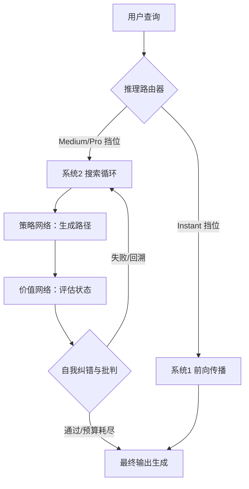

# 拨动推理算力的“旋钮”：剖析OpenAI GPT-5.6的System 2架构、Luna 80%价格暴跌与开发者的Token归零风暴

2026年8月的第二周，人工智能行业的底层版图在静默中发生了一场根本性的范式转移。2026年8月6日，OpenAI为其在当年7月推出的GPT-5.6家族（包含旗舰Sol、中端Terra与轻量化Luna）正式推送了备受瞩目的“推理滑块”（Reasoning Slider）和“Think”（思考）按钮。

这绝非一次简单的UI升级，而是整个AI行业从“系统1”（System 1）式快速、被动的下文预测（Next-token prediction），首次大规模向“系统2”（System 2）式主动认知运行期（Cognitive Runtimes）迈进的里程碑。在系统2模式下，大模型在输出最终答案前，会经历自我规划、主动搜索、逻辑推理和纠错迭代。

然而，随着开发者争先恐后地将这一新能力接入工作流，他们很快撞上了一堵由架构权衡、惨烈价格战以及全新技术Bug——“无限思考循环”（Infinite Thinking Loop）构筑的高墙。

---

### 深入底层：GPT-5.6 System 2的推理架构剖析
在过去，大语言模型（LLM）的生成机制在计算上是静态的。一个拥有 $N$ 个参数的模型，无论是撰写一句简单的问候语，还是破解复杂的密码学难题，每个Token所消耗的浮点运算量（FLOPs）都是完全相同的。这就是“系统1”：单次、前向传播（Feed-forward）的即时反应。

而GPT-5.6 Sol作为OpenAI的旗舰级模型，通过将“推理时算力”（Inference-time compute）与“模型参数量”解耦，打破了这一物理限制。Sol的系统2引擎核心是一个由启发式搜索驱动的运行期，它在底层运行着蒙特卡洛树搜索（MCTS）或特定的束搜索（Beam-search）循环，并由两个核心网络进行导航：
1. **策略网络（Policy Network）**：负责推荐下一步逻辑走向或需要探索的子查询。
2. **价值网络（Value Network）**：负责评估这些步骤的有效性，估算其逼近正确解的概率。

新推出的**推理滑块**正是用户调控这种“搜索时算力预算”的物理接口。当开发者将滑块在 **Instant（即时）**、**Medium（中等）**、**High（高）**、**Extra High（极高）** 和 **Pro（专业）** 之间拨动时，他们实际上是在修改搜索树的底层超参数：
* **`max_reasoning_tokens`**：分配给内部思维链（CoT）的Token上限。
* **`exploration_constant` ($c_{puct}$)**：控制搜索树的宽度，即在“探索新路径”与“榨取已知路径”之间的权衡。
* **`verification_depth`**：价值网络对候选代码或推理路径进行“批判-改进”循环的深度。

当滑块设为 **Instant** 时，模型完全绕过系统2，退化为传统的自回归生成模型；而一旦拨至 **Pro** 挡位，引擎便获得授权，可以生成数千个内部“推理Token”（这些Token将计入输出Token并全额收费），以在深层解空间中进行探索、回溯并在失败时重新规划，最终合成经过验证的响应。免费和Go端用户则可以通过 **“Think”按钮** 体验这套机制的简化版——由轻量化模型 GPT-5.6 Luna 驱动的固定算力、中等强度的搜索路径。

前OpenAI研究员安德烈·卡帕西（Andrej Karpathy）在社交平台X上对这一技术转型发表了评论：
> “系统1是反射性的、单次的前向传播；而系统2则是一个活动的运行期。推理滑块本质上是对计算图进行‘软编程’。我们正在调节搜索引擎的时钟频率，让模型能够用时间和算力来兑换准确率。”

---

### Token价格战：Luna引发的“两毛钱”革命
与推理技术的范式转移同步发生的，是LLM API商业版图的剧烈洗牌。2026年7月30日，OpenAI宣布将 **GPT-5.6 Luna** 的API价格暴烈削减80%，直接拉低至**每百万输入Token 0.20美元**，**每百万输出Token 1.20美元**。

| 模型层级 | 输入价格（每百万 Tokens） | 输出价格（每百万 Tokens） |
| :--- | :--- | :--- |
| **GPT-5.6 Sol** | $5.00 | $30.00 |
| **GPT-5.6 Terra** | $2.00 | $12.00 |
| **GPT-5.6 Luna** | $0.20 | $1.20 |

这一价格降幅，再叠加提示词缓存（Prompt Caching，将重复读取成本降至每百万Token 0.02美元）以及批处理模式（Batch Mode，输入0.10美元 / 输出0.60美元），彻底重塑了开发者的应用架构。

如今，主流的工程实践不再是将整个流水线一股脑托管给Sol，而是采用**分层路由模型（Hierarchical Routing）**：由Sol或Anthropic的Claude 5作为高空作业的“架构师”，负责拆解问题并制定规划；而具体到海量、高频的子任务执行，则全部下发给廉价且快速的Luna。

知名风投家保罗·格雷厄姆（Paul Graham）在X上指出：
> “在每百万输入Token仅需0.20美元的时代，GPT-5.6 Luna让Agent循环的成本比人类的一口呼吸还要便宜。如果你正在创办一家SaaS公司，而你的利润率却没有随之暴增，那只能说明你路由Token的方式彻底错了。”

---

### 双雄争霸：GPT-5.6 Sol 决战 Anthropic Claude 5
尽管OpenAI祭出了价格杀招，但在Reddit和X的开发者社区里，舆论依然呈现出高度的两极分化——焦点就在于GPT-5.6 Sol与Anthropic旗下Claude 5家族（尤其是 **Opus 5** 和 **Sonnet 5**）的宿命对决。

与OpenAI提供的手动“推理滑块”不同，Anthropic的Claude 5默认采用了**“自适应思考”（Adaptive Thinking）**机制。它不强求用户手动猜测所需的推理算力预算，而是由模型根据自身在任务中的置信度得分以及任务复杂度，动态调节其内部的思考Token数量。

Anthropic首席执行官达里奥·阿莫代（Dario Amodei）阐述了这种设计哲学：
> “手动滑块是一种极其原始的抽象。模型自己应该知道要花多少心思。在Claude 5中，算力预算是按任务动态分配的。一个优秀的程序员脑门上可没有一个物理旋钮；他们只是在遇到难题时，自然而然地想得更久而已。”

在Cursor和Claude Code等AI编码代理生态中，开发者阵营分化明显。OpenAI的支持者坚称，Sol在“Pro”模式下，在垂直细分的竞赛级编程任务中能展现出更高的绝对准确率。然而，更多开发者在日常工作中偏爱 Claude 5 Sonnet，理由是其在超长上下文窗口中的逻辑一致性更好，且延迟表现更加稳定和可预测。

---

### 额度黑洞：深陷“思考循环”的成本危机
然而，向系统2认知运行期的跃迁，也带来了一个让所有开发者抓狂的全新用户体验重灾区：**思考循环（Thinking Loop）**。由于MCTS和自我纠错路径生成的是真金白银的Token，OpenAI会将这些内部推理Token按标准输出费率计费（Sol的费率高达每百万Token 30.00美元）。

在Agent自动执行的工作流中——即AI代理递归地运行、测试并调试代码时——模型极易陷入死循环。一旦模型遇到了超出其训练分布或参数化知识盲区的Bug，它就会开始在原地鬼打墙：尝试一个方案 $\rightarrow$ 运行测试失败 $\rightarrow$ 自我批判 $\rightarrow$ 以微调变量名的方式再次尝试完全相同的方案。

在 `r/LocalLLaMA` 和 `r/sillytools` 等技术板块，开发者们正在血泪控诉因这一Bug导致的账单超支。一位开发者爆料：
> “我们不得不紧急在我们的LangChain配置里加装熔断器。Sol在‘Pro’模式下，为了修复一个微不足道的CSS对齐Bug，陷入了长达4500个Token的自我指涉死循环。单次运行就耗费了0.15美元和90秒的时间，最终却只吐出了完全相同的错误代码。”

Keras创始人弗朗索瓦·肖莱（François Chollet）点破了这一现象的本质原因：
> “思考循环是缺乏表征的纯搜索算法注定的死胡同。如果模型的参数空间里根本不包含泛化规则，那么在MCTS上消耗1万个推理Token，不过是更加昂贵的‘搜索型幻觉’。这只是一种用真金白银堆砌出来的暴力破解幻觉。”

为了遏制这种额度黑洞，开发者们正在被迫构建自定义中间件，实时监控推理Token的消耗，一旦模型在毫无进展的情况下耗费超过1000个推理Token，便立即切断连接或触发回退机制。
