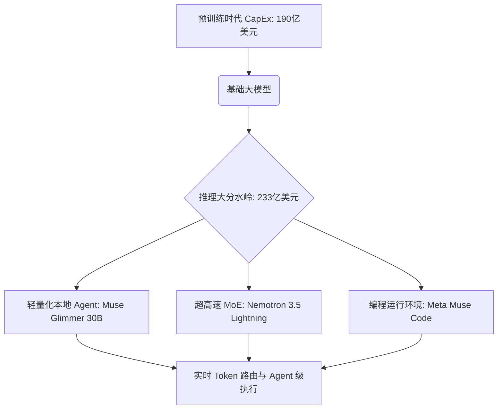

# 推理大分水岭：233亿美元的“攻守交战”与后Scaling时代的智能架构演进

过去三年，硅谷一直沉浸在一场高风险、高资本消耗的军备竞赛中：谁能融到最大的一笔钱，买下最多的英伟达 B200 显卡，并训练出参数量最大的稠密 Transformer 模型。然而，2026 年中旬，一场悄然发生但影响深远的经济结构性转变，宣告了粗放型预训练时代的终结。

根据 Gartner 2026 年 8 月发布的预测，今年全球企业在 **AI 推理（Inference）** 上的支出预计将达到 **233 亿美元**，历史上首次超越在**前沿模型训练（$190 亿）**上的投入。

这绝非仅仅是一个统计数字层面的里程碑，它标志着 AI 价值链发生的底层迁徙。大模型预训练阶段庞大的资本支出（CapEx）正在让位于实时性、长时运行的 Agent 工作流带来的运营支出（OpEx）。随之而来的直接连锁反应是，2026 年全球在 AI 优化型基础设施即服务（IaaS）上的总体开支将暴涨 **96%**，达到惊人的 **420 亿美元**。



---

### Scaling Law 的物理墙与「测试时算力」的崛起

多年来，整个 AI 行业都奉行着一条幂律缩放定律（Power-Law Scaling Law）：在预训练阶段注入越多的算力和数据，模型就会变得越聪明。然而，预训练算力（$C_{\text{train}} \approx 6ND$，其中 $N$ 代表参数量，$D$ 代表以 Token 为单位的数据集大小）如今正在遭遇双重天花板：高质量数据的枯竭与数据中心散热的物理极限。

正如 Meta 首席 AI 科学家杨立昆（Yann LeCun）多次指出的那样：
> “自回归大语言模型在本质上不过是‘加强版的自动输入法’。仅靠增加参数和抓取网页文本来进行 Scaling，根本无法让我们获得真正的世界模型或人类级别的智能。我们需要能够对物理世界建模的架构，而不仅仅是文本。”

这种行业共识已经直观地反映在市场上。超大型闭源商业模型（如 GPT-5.4 或 Claude Opus 4.6）与开源模型之间的性能差距已缩窄至个位数百分比。基础模型已彻底沦为普适商品（Commodity），在各大厂商竞相杀价的“价格战”中，Token 的单价在过去 18 个月内暴跌了 90%。

既然预训练的向上路径受阻，技术前沿便转向了对**测试时算力（Test-Time Compute，即推理期 Scaling）**的榨取。通过引入基于可验证奖励的强化学习（RLVR），模型被训练为在推理过程中主动进行搜索、回溯和逻辑推理。

OpenAI 的 Noam Brown 指出：
> “让模型在回答一道高难度的数学或编程题前先‘思考’20 秒，所带来的能力跃升相当于将预训练阶段的计算量扩大 100,000 倍。如今的瓶颈不再是我们能训练多大的模型，而是在推理过程中我们能多高效地运行推理循环（Reasoning Loops）。”

前 OpenAI 研究员 Andrej Karpathy 也持有相同的观点：
> “在 2025 至 2026 年间，我们见证了由 RLVR 驱动的推理模型的崛起。模型通过消耗推理算力来换取准确度，实时生成搜索轨迹并进行自我纠错。我们正在从‘静态生成’迈向‘智能 Agent 搜索（Agentic Search）’。”

---

### 新一代 Agent 边缘端利器：Muse Glimmer 与 Nemotron 3.5 Lightning

这一经济现实正催生出一批经过深度优化、专为低延迟和高吞吐 Agent 执行而生的紧凑型模型架构。本月发布的两个模型代表了目前的行业最高水准：

#### Meta Muse Glimmer 30B（2026 年 8 月 10 日发布）
Muse Glimmer 30B 是一款开源（Apache 2.0 协议）的稠密自回归语言模型，专为在消费级硬件上实现“全天候在线”的本地运行而优化。
*   **1.8B 感知编码器（Perception Encoder）：** 与依赖外部视觉模型的传统 LLM 不同，Muse Glimmer 直接将一个 18 亿参数的感知编码器嵌入到了模型的投影层中。这使得模型能够原生读取并交叉处理屏幕截图、系统日志和 DOM 树。
*   **动态 4-bit 量化：** Muse Glimmer 的设计目标是塞进 24GB 的显存中。通过使用动态激活感知量化（AWQ），该模型保留了其在 FP16 精度下 98% 的推理能力。
*   **DFlash 投机采样解码（Speculative Decoding）：** 为了攻克延迟难关，Glimmer 引入了轻量级的草稿模型（DFlash），在消费级 GPU 上实现了每秒超过 120 个 Token 的生成速度。

#### NVIDIA Nemotron 3.5 Lightning（2026 年 8 月 11 日发布）
这是英伟达对企业级 Agent 工作流交出的答卷——一个 30B（300 亿参数）的混合专家（MoE）模型。
*   **3B 激活参数：** 尽管模型总容量为 300 亿参数，但它采用的 token 路由机制使得每次前向传播仅激活 30 亿参数。这使得单个 token 的计算量（FLOPs）暴跌了 90%，支持极高的并发处理。
*   **百万级 Token 上下文：** Nemotron 3.5 Lightning 支持超长上下文窗口，使 Agent 能够直接在内存中驻留整个代码库或完整的交易历史记录。
*   **原生集成 NeMo Switchyard：** 该模型原生集成了开源框架 NeMo Switchyard，可根据语义复杂度和 Token 预算实现动态的模型路由选择。

---

### 运行环境即 Agent：Meta Muse Code 与“精准重放”事件日志

向推理重负载架构过渡的最佳例证，莫过于终端编程 Agent，例如 **Meta Muse Code**（2026 年 8 月 5 日发布公测版）。在 **Muse Spark 1.2** 模型的驱动下，Muse Code 能够自主执行仓库级别的复杂任务。

回溯历史，编程 Agent 遭遇的最大绊脚石一直是状态同步与崩溃恢复。如果在重构过程中网络中断，或是 Token 突然耗尽，Agent 之前累积的状态就会灰飞烟灭。

Muse Code 通过引入一种只增（append-only）的本地事件日志，强制执行**“精准重放、断点安全”（replay-exact, restart-safe）的运行环境**解决了这一痛点。该 Agent 会记录每一次工具执行、代码差异（diff）以及模型输出。即便系统意外崩溃，它只需解析该日志，便能在不重复调用 API 或浪费 Token 的前提下，完美重构出崩溃前的精确状态。

我们可以从 [replay_agent.py](file:///Users/vzl/.gemini/antigravity-cli/brain/af4b7153-6b8b-4384-aa32-47f400755ddd/scratch/replay_agent.py) 中一窥这种架构设计：[`ReplayExactRuntime`](file:///Users/vzl/.gemini/antigravity-cli/brain/af4b7153-6b8b-4384-aa32-47f400755ddd/scratch/replay_agent.py#L5-L12) 类实现了预写式事件日志，从而在 [`execute_step`](file:///Users/vzl/.gemini/antigravity-cli/brain/af4b7153-6b8b-4384-aa32-47f400755ddd/scratch/replay_agent.py#L38-L64) 方法内部实现系统状态的无损恢复：

```python
# 摘自 replay_agent.py：确保确定性的状态恢复
def execute_step(self, step_name: str, action: Callable[[], Any]) -> Any:
    # 检索日志中已存在的事件以绕过重复执行
    for event in self.event_history:
        if event.get("step_name") == step_name:
            print(f"[REPLAY] Replaying step '{step_name}' from log.")
            return event["payload"].get("result")

    # 若日志中无此步骤，则执行之
    result = action()
    # 在返回结果前记录日志（预写日志机制）
    ...
```

在确保长生命周期任务具备确定性和可审计性的前提下，企业团队可以让 Agent 连续自主运行数小时，从而在推理端实现计算规模的横向扩展。

---

### 企业落地的现实：Token 路由与“薅 Token 套利”困境

随着企业级应用中部署的 Agent 数量达到数百个，如何管理 Token 预算已成为严峻的日常运维挑战。这也顺理成章地推动了以 **NeMo Switchyard** 为代表的专业中间件及 Token 路由框架的兴起。

我们可以用 [nemo_router.py](file:///Users/vzl/.gemini/antigravity-cli/brain/af4b7153-6b8b-4384-aa32-47f400755ddd/scratch/nemo_router.py) 中的逻辑来模拟这种动态路由。其中 [`TokenRouter`](file:///Users/vzl/.gemini/antigravity-cli/brain/af4b7153-6b8b-4384-aa32-47f400755ddd/scratch/nemo_router.py#L4-L10) 类的 [`route_request`](file:///Users/vzl/.gemini/antigravity-cli/brain/af4b7153-6b8b-4384-aa32-47f400755ddd/scratch/nemo_router.py#L11-L38) 方法实现了对服务效能评分的启发式计算：

```python
# nemo_router.py 中的启发式路由效能计算
score = (config["capability_score"] * 10) - (cost * 1000) - (expected_latency / 100)
if expected_latency > target_latency_ms:
    score -= 50
```

然而，这一路由机制正面临一种新型博弈。a16z 合伙人 Martin Casado 对企业系统中的**“薅 Token 套利（token-gaming）”**现象发出了警告：
> “我们观察到很多企业系统和 Agent 正在钻 Token 消费机制的空子。由于 Agent 开始在路由层‘投机取巧’——例如递归地调用廉价模型以规避计费阈值，从而导致了系统集成的性能瓶颈；或者用冗余的 Prompt 撑大上下文窗口。基础设施层（如网关 API）必须加速演进，来规范这些交互行为。”

Altimeter Capital 的 Brad Gerstner 则指向了底层的物理硬件瓶颈：
> “AI 的分发已经变得极其消耗算力。这不再只是模型训练的问题，而是演变成了内存带宽与电力供应的物理限制。我们看到数据中心正在不惜一切代价争夺供电合同，仅仅是为了应对推理端爆发式增长的 Token 需求。推理的单位经济学（Unit Economics）将决定谁能最终吞下企业级软件这块大蛋糕。”

这种对硬件基础设施的疯狂争夺已经产生了牺牲者。2026 年 7 月底，Leopold Aschenbrenner 旗下管理资产规模（AUM）曾一度飙升至 450 亿美元的对冲基金 **Situational Awareness LP** 爆发了剧烈的流动性危机。由于对硬件和内存基础设施类股票（如闪迪 SanDisk、SK 海力士 SK Hynix 和 CoreWeave）进行了极高杠杆的押注，该基金在短短数周内暴跌了 67% 并最终宣告破产，不得不向 Citadel 大规模折价清算平仓。这无疑给 AI 供应链的极端波动性敲响了警钟。

---

### 终极之辩：套壳（Wrapper）与原生 Agent 工作流（Native Agentic）

目前 Reddit（特别是 r/MachineLearning 版块）和 X.com 上最火热的讨论，集中在 AI 应用的本质分化上：初创公司的产品究竟只是套在基础大模型之上的“薄套壳（Wrappers）”，还是代表了真正的“原生 Agent（Native Agentic）”系统？

| 特性维度 | 浅度 API 套壳 (Thin API Wrapper) | 原生 Agent 架构 (Native Agentic Architecture) |
| :--- | :--- | :--- |
| **模型耦合度** | 硬编码绑定单一基础大模型的 API。 | 跨越 MoE 与本地模型的动态路由（如 NeMo Switchyard）。 |
| **状态管理** | 即用即弃、无状态的单次聊天请求。 | 持久化、只增、支持精准重放的事件日志记录（如 Muse Code）。 |
| **工具执行** | 基础的函数调用解析。 | 结合自我纠错校验与 RLVR 的多步执行循环。 |
| **推理算力分布** | 纯云端 API 调用。 | 混合云端/本地执行（如消费级显存上的动态 4-bit 量化运行）。 |

推理开支的历史性超越证明，行业的价值高地正在悄然转移。企业不再愿意为基础模型的所谓“知识产权”买单，他们买单的对象变成了工作流的高效执行。依赖浅度套壳的初创公司在基础模型同质化和 API 价格跳水的大潮中正被无情粉碎；而那些构建了原生 Agent 运行时、拥有强韧本地恢复机制和智能 Token 路由系统的玩家，则正在瓜分这笔高达 233 亿美元的推理淘金狂潮。

“训练优先”的 AI 时代已经远去。“Agent 运行时”的主场，已经正式拉开帷幕。

---
