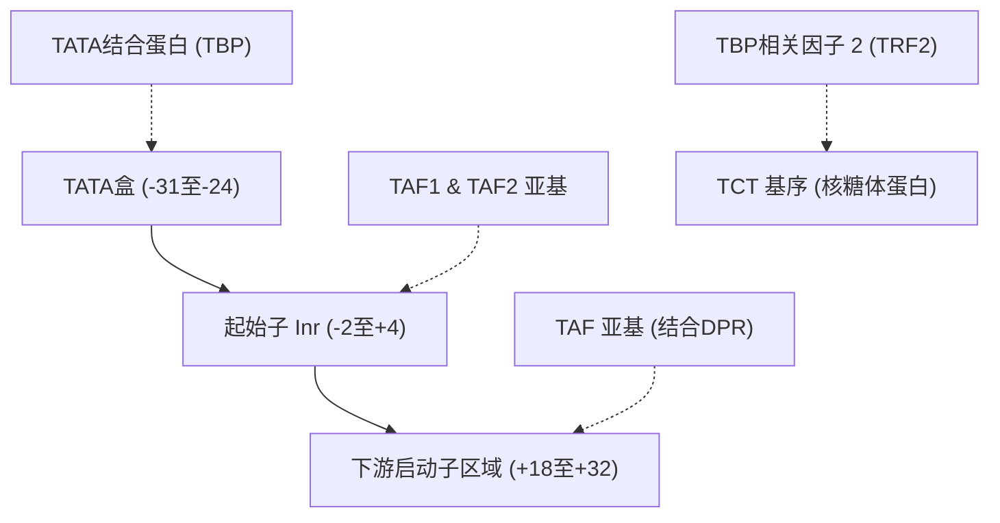

# 攻克核心启动子：SVR模型揭示人类起始子与非编码DNA的调控语法

在人类基因组中，高达98%的非编码DNA长期以来被称为生物学的“暗物质”。在临床基因组学中，如何准确解释这些区域的突变如何改变基因表达，一直是一个巨大的瓶颈。发表在《基因与发育》（*Genes & Development*，2026年7月）上的一项里程碑式研究中，加州大学圣地亚哥分校（UC San Diego）的研究人员 Torrey E. Rhyne-Carrigg、Long Vo Ngoc、Claudia Medrano、Kassidy E. Gillespie 以及 James T. Kadonaga 成功打破了这一僵局。他们通过将高通量实验检测与机器学习相结合，成功解码了人类**起始子（Initiator, Inr）**——这一控制着约60%人类基因转录的“启动开关”的核心启动子元件。

### 基因转录的分子生物学底座
要理解这项研究的颠覆性意义，必须深入到前起始复合物（Pre-Initiation Complex, PIC）的分子运作机制中。在人类中，RNA聚合酶II（Pol II）负责转录所有蛋白质编码基因。然而，Pol II本身无法直接与DNA结合，也无法自主启动转录。它必须依赖通用转录因子（GTFs）在核心启动子（即相对于转录起始位点 TSS/+1，大约在-40到+40个碱基对之间的区域）进行组装。

在这个组装过程中，多亚基大分子复合物**TFIID**起到了核心协调作用。TFIID通过识别并结合核心启动子中的关键DNA序列基序（Motifs）来发挥作用：
1. **TATA盒**（通常位于-31至-24位点），由TFIID的TATA结合蛋白（`TBP`）亚基识别并结合。
2. **起始子（Inr）**（跨越-2至+4位点），由TFIID的`TAF1`和`TAF2`亚基识别并结合。
3. **下游启动子区域（DPR）**（跨越+18至+32位点），由其他TBP相关因子（TAFs）结合。

### 计算瓶颈：为什么“共识序列”失效了？
几十年来，生物学家主要使用简并的“共识序列”（Consensus Sequences）来定义起始子，例如高度简并的 `YYANWYY`（其中Y代表嘧啶，N代表任意核苷酸，W代表A或T，而在+1位置的A则是TSS）。后来，Kadonaga实验室针对人类特定启动子将其精简为 `BBCA+1BW`（其中B代表C、G或T，W代表A或T）。

然而，这些所谓的“共识序列”仅仅是极其粗糙的近似。功能性起始子的序列空间表现出极强的异质性（Sequence Heterogeneity）。许多具有转录活性的起始子在序列上与这些共识模型相去甚远；相反，许多完全符合共识序列的DNA片段却根本无法启动转录。这种异质性使得传统的静态序列匹配工具无法准确预测启动子突变对基因转录的具体影响。

### 机器学习的破局之道：HARPE-SVR
为了彻底解决这一难题，UCSD团队将他们开发的**HARPE**（随机启动子元件高通量分析）框架与机器学习结合：
1. **数据集生成**：他们合成了一个包含约50万个启动子变体的文库，其中起始子区域（相对于TSS的-3至+5位点）被完全随机化。
2. **定量活性测定**：他们使用HeLa细胞核提取物对这一庞大的合成文库进行体外转录，随后进行高通量测序（RNA-seq）。这一步骤直接将50万个序列变体映射到了转录起始强度的定量指标上。
3. **模型训练**：利用这一“序列-活性”对应的数据集，团队训练了一个**支持向量回归（SVR）**模型（命名为 `HARPE-SVR`）。通过引入k-mer特征表示，SVR模型成功捕捉并构建了特定位置核苷酸之间的非线性相互作用与转录输出之间的映射关系。

为什么选择SVR，而不是目前大热的深度卷积网络或基于Transformer的模型（例如DeepMind的Enformer或Calico的Borzoi）？尽管深度模型在预测跨越数百万碱基对的远端增强子-启动子环化（Enhancer-Promoter Loops）方面表现优异，但它们是著名的“黑盒”，由于容易在参考基因组上产生过拟合，它们在预测个人基因组中的局部单核苷酸变异（SNV）效应时往往力不从心。

正如斯坦福大学副教授 **Anshul Kundaje** 所指出：
> “虽然像 Enformer 或 Borzoi 这样的深度‘序列-表达’模型在预测宏观染色质环境方面非常出色，但它们往往无法捕捉微观层面的个人变异效应。而精细的、高通量的合成文库可以让我们剥离出特定的生物物理参数。在这种数据上运行支持向量回归（SVR）能让我们获得每个位置高度可解释的系数权重，从而帮助我们绘制启动子的真实物理调控语法，而不是单纯依赖经验性的基因组上下文。”

### AI解密的核心基因组洞察
SVR模型的预测结果为人类基因组学带来了数个突破性发现：
*   **60%的超高普及率**：全基因组分析表明，约60%的天然人类启动子中都包含功能性起始子的特征信号，这修正了此前较低的估算值。
*   **TATA特异性起始子（Inr）**：模型发现，含有TATA盒的启动子所拥有的起始子基序，比不含TATA盒的启动子更加灵活且多样化。
*   **TCT基序的独立地位**：研究人员对调控核糖体蛋白（RP）基因的TCT基序进行了精细表征。虽然TCT基序在结构上与起始子重叠，但它在功能上截然不同——它不依赖TFIID，而是招募**TBP相关因子2（TRF2）**来替代TBP。有趣的是，模型揭示了人类的TCT基序相比于黑腹果蝇，具有独特的调控特征。
*   **核心启动子元件的复杂交互**：
    *   *起始子（Inr）与下游启动子区域（DPR）的协同效应*：Inr与DPR之间存在严格的协同增效作用。
    *   *TATA与DPR的二元对立*：模型证实了TATA盒与DPR之间存在反向关系。TATA驱动的启动子极少使用DPR；相反，不含TATA盒的启动子则高度依赖Inr与DPR之间严格的协同作用。

### 临床应用：筛查非编码区突变的“智能探针”
人类基因组中有超过98%的区域是非编码区，这导致临床测序数据库中充斥着大量位于启动子区域的“意义未明的变异”（VUS）。在肿瘤学中，启动子突变会通过改变转录因子的结合亲和力来直接驱动癌症的发生（例如著名的TERT启动子中的C228T和C250T突变）。

借助 `HARPE-SVR` 模型，临床基因组学家现在可以通过硅谷计算模拟（*in silico*）对患者的启动子变异进行高置信度评分。一旦发现某项突变会破坏 Inr 与 TAF1/TAF2 的结合亲和力，或者打断了 Inr-DPR 的协同交互，即可直接将其标记为致病性突变，从而省去了长达数月的湿实验验证过程。

### 合成生物学与高精度基因疗法的新范式
从工程角度来看，这项工作代表了基因治疗领域的范式转移。传统的基因疗法经常受到“启动子泄漏”（Promoter Leakage）的困扰——即治疗性基因在非靶向组织中表达，导致严重的脱靶毒性。

正如硅谷知名风投 A16z 合伙人 **Vijay Pande** 经常指出的那样：
> “生物学正在从经验性的发现阶段转型为一门真正的工程学科。一旦我们能够理解这些调控开关背后精确的‘序列-活性’语法，我们就可以像给计算机编程一样去给细胞编程。”

利用 `HARPE-SVR` 解码的调控规则，合成生物学家可以自主设计定制化的人工核心启动子。例如，通过将TATA特异性起始子与优化后的DPR及组织特异性增强子结合，临床医生能够设计出具有极高细胞类型特异性、且转录速率精准可调的腺相关病毒（AAV）载体，在最大化疗效的同时彻底消除脱靶表达。

***
