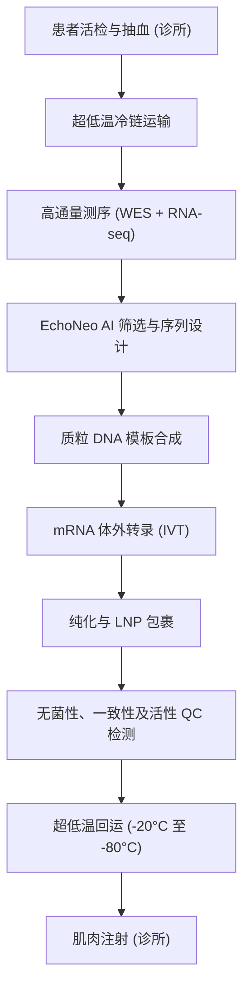

# 数字代码编织免疫防线：解构莫德纳与默沙东个性化mRNA癌症疫苗的AI算法、物流重构与监管跃迁

2026年8月19日，全球生物制药领域迎来了一个历史性的分水岭。莫德纳（Moderna）与默沙东（Merck）联合宣布，其全球3期临床试验**INTerpath-001**取得突破性阳性结果：对于完全切除的IIB-IV期黑色素瘤患者，个性化新抗原疗法**intismeran autogene**（代号V940/mRNA-4157）联合免疫检查点抑制剂**Keytruda**（K药，帕博利珠单抗），相比单用K药，在无复发生存期（RFS）和无远处转移生存期（DMFS）上均实现了具有统计学意义与临床显著性的改善。

数十年来，肿瘤治疗一直被禁锢在“千人一方”的工业流水线模式中。而mRNA-4157的出现，彻底打破了这一传统范式：它是一种完全量身定制的、患者特异性的生物制品。这意味着，每一剂药物都是针对特定患者的体细胞突变谱，从零开始设计并合成的。然而，在闪耀的临床数据与庆祝新闻稿背后，是一套极其复杂的算法计算、敏捷生产物流与前沿监管架构。要将这一突破从百人规模的临床试验，推广至全球数以万计的肿瘤患者，这套底层系统的规模化落地能力正面临前所未有的考验。

要理解这场医学变革的边界，我们需要深入拆解其背后的多模态生物信息算法引擎、数字化制造调度系统、创新的监管框架以及真实的临床应用与支付困境。

---

### 算法引擎：EchoNeo与多模态深度学习的“分子编译”
每一剂个性化疫苗的研发起点，都源自患者的肿瘤组织。首先，医疗机构需要从患者的肿瘤活检样本和配对的健康血液样本中提取DNA和RNA，随后进行高通量的全外显子组测序（WES）和转录组测序（RNA-seq）。

这些海量的测序原始文件（FASTQ/BAM格式）会被输入到专有的生物信息学分析管道中，用于精准识别体细胞突变——包括单核苷酸变异（SNVs）、短插入/缺失（indels）、移码突变（frameshifts）以及基因融合（gene fusions）。其中，移码突变和短插入/缺失是算法重点筛选的对象，因为它们改变了基因的开放阅读框，能够产生对患者免疫系统（尤其是T细胞）极具免疫原性的全新“非自身”肽段（non-self peptides）。

然而，人类免疫系统无法直接识别裸露的基因突变。突变肽段必须在细胞内部经过一系列复杂的生物学加工，最终被高度多态性的**人类白细胞抗原（HLA）**分子（主要组织相容性复合体MHC的核心组成部分）装载并呈递到细胞表面，才能被T细胞识别。

在传统算法设计中（例如NetMHCpan），新抗原预测模型几乎完全依赖于预测**MHC结合亲和力（IC50）**。但仅仅具备结合力并不等同于能够激活免疫反应——在算法预测的“强结合肽”中，高达95%的肽段在实际临床中无法引起任何T细胞反应。这导致传统疫苗设计面临巨大的假阳性率挑战。

为了解决这一痛点，莫德纳开发了名为**EchoNeo**的多模态深度学习管道。EchoNeo不再孤立地评估结合力，而是对整个抗原加工和呈递通路进行了全流程的数字化建模：
1. **蛋白酶体切割预测（Proteasomal Cleavage）：** 预测细胞内的分子剪刀在何处剪切突变蛋白。
2. **TAP转运模拟（TAP Transport）：** 模拟突变肽段与抗原处置相关转运体的亲和力。
3. **MHC-肽复合物稳定性（MHC-Peptide Stability）：** 预测呈递复合物在细胞表面的半衰期。
4. **TCR结合模拟（TCR Engagement）：** 评估T细胞受体（TCR）识别该呈递复合物的概率。

EchoNeo的算法训练融合了公开数据库（如IEDB和TESLA）、基于液相色谱-串联质谱（LC-MS/MS）的免疫肽段组学数据，以及莫德纳自有的临床试验数据集。通过这套多维评估体系，管道能从数以千计的变异中，筛选出至多**34个**最适合该患者的特异性新抗原。随后，这些抗原序列会被编织进一段人工合成的mRNA中，每个抗原序列之间由专有的富含甘氨酸的接头区域（glycine-rich linkers）隔开，以优化体内的翻译效率。

正如斯克里普斯研究所转化研究所所长埃里克·托波尔（Eric Topol）所指出的：
> “我们正在见证生成式 AI 与基因翻译的深度融合。能否在特定的 HLA 基因型背景下，精准预测哪些新抗原会触发真正的免疫反应，直接决定了这剂疫苗究竟是成为无效的‘哑弹’，还是成为高保护力的‘神药’。从本质上讲，EchoNeo 就是一个分子编译器。”

不过，该算法同样面临着学术界与业界的审视。Reddit上的生物技术社区以及部分独立研究员指出，目前现有的MHC结合模型训练数据集严重偏向于高加索人种中常见的HLA单倍型（如HLA-A\*02:01）。这引发了人们的担忧：在面对具有罕见HLA等位基因的多元化种族患者群体时，EchoNeo新抗原筛选算法的预测精度是否会打折扣？这是莫德纳实现全球公平医疗必须跨越的算法藩篱。

---

### 制造瓶颈：“专属单批次”与 Maestro 系统的极限重构
一旦EchoNeo完成了mRNA序列的“代码编写”，紧接着便是极具挑战的制造环节。在传统生物制药中，一个反应釜产出的单批次制剂即可提供数百万支相同的剂量。但在mRNA-4157的产线上，每一次生产都是一次彻底的“专属单批次（batch of one）”。

这是一套时间敏感度极高、不容半点差错的闭环流程：

为了统筹管理这套极其琐碎的柔性产线，莫德纳开发了名为**Maestro**的数字化制造协同系统。Maestro扮演着运营“神经中枢”的角色，负责调度原料供应、进行端到端的冷链物流追踪，并精确计算测序与合成的每一个时间节点。一旦流程中某个环节出现延误，系统会自动重构后续的所有排产计划。

目前，从患者完成活检采样到最终在诊所接受注射，端到端的交付周期（Turnaround Time）通常需要**6到8周**。在进展迅速、高风险的黑色素瘤中，这段漫长的等待期成为了整条生命线的关键软肋。在等待疫苗生产的两个月里，部分患者的病情可能会急剧恶化，甚至失去接受免疫治疗的机会。

在Reddit的r/biotech社区中，一位资深工艺工程师评价道：
> “生产瓶颈从来不是体外转录（IVT）或脂质纳米颗粒（LNP）的包裹，这些化学反应在几个小时内就能完成。真正的瓶颈在于 DNA 质粒模板的合成（制作模板）、极其繁琐的 QC 无菌检测，以及在七个不同阶段精准追踪单一患者的定制批次且绝对避免交叉污染的复杂物流系统。在这种模式下，一旦有一支药瓶摔碎，你根本没有任何备用库存。”

莫德纳首席执行官斯特凡纳·班塞尔（Stéphane Bancel）也强调了这一运营挑战：
> “我们的目标是不断压缩这一周期。通过引入高自动化设备、利用 Maestro 实现物流全链路数字化，以及推广分布式测序，我们希望将交付时间缩短至 4 周以内。但毫无疑问，规模化制造定制化的生物制品，是这一代生物制药行业所面临的最大运营泥潭。”

---

### 监管前沿：SaMD与预设变更控制计划（PCCP）的范式飞跃
从监管科学的角度来看，个性化癌症疫苗完全颠覆了传统的生物制品许可申请（BLA）框架。FDA传统的监管逻辑是针对具有明确且单一化学结构的“静态药物成分”。对于抗体或小分子药物，即使只改变其中一个核苷酸或原子，也会被视为一种全新药物。但在mRNA-4157上，每个患者接种的核苷酸序列都是完全不同的。

为此，FDA不得不做出妥协，将监管重点从“具体序列”转向“生产工艺与验证流程”。2026年8月，FDA生物制品评估与研究中心（CBER）发布了关于活体免疫疗法产品活性评估的行业指南草案，为这种可变成分生物制品的安全与合规性验证确立了基本框架。

然而，更具开创性的监管创新发生在对AI算法本身的监管上。如果莫德纳利用新的临床训练数据升级了EchoNeo算法，从而提高了新抗原的预测精度，这是否意味着莫德纳每一次算法迭代都需要重新提交一份BLA申请？

为了避免陷入无尽的行政审批泥潭，FDA引入了依据《联邦食品、药品和化妆品法案》（FDCA）第515C条授权的**预设变更控制计划（PCCP）**框架。PCCP允许莫德纳在初始申请中就提交一套预先批准的方案，详细说明算法将如何学习、优化以及调整其底层参数。只要算法的迭代范围控制在预设的边界内，且符合验证协议，莫德纳即可直接部署升级后的模型，无需重新进行上市前申报。这实际上将EchoNeo确立为一种直接嵌入在生物制品CMC（化学、制造和控制）申报文件中的**医疗器械软件（SaMD）**。

---

### 临床现实：不良反应、冷链考验与支付机制的史诗博弈
虽然临床疗效达到了统计学上的显著性，但我们仍需客观看待这些数据。在3期INTerpath-001试验的中期分析中，该联合疗法虽达到了无复发生存期（RFS）和无远处转移生存期（DMFS）的终点，但其具体的风险比（Hazard Ratio, HR）并未在首批顶线数据中披露。此前的2期KEYNOTE-942试验数据显示，在5年随访中，联合疗法将黑色素瘤患者的复发或死亡风险降低了49%（HR = 0.51），远处转移或死亡风险降低了41%（HR = 0.41）。

然而，部分业界人士对2期试验的“基线偏差（Baseline Bias）”提出过质疑。在r/ModernaStock等股票与技术论坛上，有分析指出，KEYNOTE-942中对照组（单用K药）的表现明显低于其他辅助治疗临床试验（如KEYNOTE-054）的历史基准。这可能会在一定程度上人为放大联合疗法的相对获益。因此，包含了1,137名患者、采用随机双盲对照设计的3期INTerpath-001试验，其核心使命正是为了终结这一学术争论。

在现实的临床肿瘤学工作流中落地该疗法，还必须迈过三道高门槛：

#### 1. 不良反应与安全性叠加
尽管联合疗法的整体安全谱在可控范围内，但患者普遍经历了与疫苗接种相关的常见不良反应，如注射部位疼痛、疲劳、寒战和肌痛，大多为1级或2级。但当它与K药联用时，可能面临免疫相关不良反应（irAEs，如甲状腺炎或结肠炎）叠加的潜在风险。虽然KEYNOTE-942的长期安全性数据未显示出协同毒性的危险信号，但对双重疗法患者的长期监测仍需要极其严谨的临床管理。

#### 2. 超低温冷链的配送盲区
与常规肿瘤药物不同，mRNA-4157对温度有着严苛的物理限制。包裹在脂质纳米颗粒（LNP）中的mRNA必须在超低温（-20°C至-80°C）下储存和运输。在美国，大多数癌症患者是在基层的社区肿瘤诊所接受治疗的，而这些诊所普遍缺乏应对患者特异性超低温冷链存储、复杂配制复溶步骤以及严格注射时间窗口的软硬件能力。一次意外的停电或冰箱故障，就意味着这剂高昂的定制药剂将直接报废。

#### 3. 医保支付与定价的史诗博弈
我们该如何为一剂因人而异、无法量产的药物定价？尽管默沙东与莫德纳在本项目上以50:50的比例平摊成本与利润，但多位行业分析师预测，mRNA-4157上市后的商业化定价可能高达**每名患者15万至25万美元**。如果再算上K药每年约15万美元的常规费用，患者一年的联合治疗成本将直逼40万美元。

著名医药投资人布拉德·隆卡（Brad Loncar）在X（原推特）上对此评价道：
> “V940 的临床疗效毋庸置疑，但接下来围绕医保支付的博弈将是史诗级的。保险公司虽然习惯了为同样是个性化疗法的 CAR-T 埋单，但 CAR-T 毕竟是一次性疗法。而 V940 需要在一年的时间里，配合 K 药进行多达 9 次的注射。医保支付方势必会要求引入极度严苛的‘基于价值的支付模型（Value-based Reimbursement）’，甚至可能将付款额度直接与无复发生存期的里程碑挂钩。”

---

### 挺进深水区：如何攻克“冷肿瘤”？
在黑色素瘤上的成功无疑是一次漂亮的“概念验证（Proof of Concept）”。然而，黑色素瘤本身就是一种免疫原性极强的“热肿瘤”，拥有极高的肿瘤突变负荷（TMB）和天然存在的T细胞浸润。而肿瘤免疫治疗真正的星辰大海，是攻克诸如胰腺导管腺癌（PDAC）和微卫星稳定型（MSS）结直肠癌在内的免疫“冷肿瘤”。

这些冷肿瘤由于肿瘤突变负荷极低（AI算法极难从中筛选出高质量的突变序列），且其微环境中充斥着大量的髓系来源抑制性细胞（MDSCs）和调节性T细胞（Tregs），形成了一道物理和化学双重屏蔽的免疫抑制防火墙，导致T细胞根本无法浸润。

目前，莫德纳正在开展针对胰腺癌的mRNA-4157 1期临床试验。（需要澄清的是，2023年发表于《自然》杂志的里程碑式胰腺癌mRNA疫苗试验，使用的是BioNTech与罗氏旗下基因泰克联合开发的竞争平台**autogene cevumeran/BNT122**）。莫德纳的破局策略是：利用EchoNeo算法在冷肿瘤匮乏的突变谱中掘金，找出极少数高质量的新抗原，同时通过联合疗法打破冷肿瘤微环境的免疫抑制，将肿瘤“由冷转热”，从而强制引导T细胞发起精准的定向围剿。

AI与mRNA技术能否最终撕裂冷性实体瘤的重重防线，依然是未来十年临床肿瘤学最核心的悬念之一。
