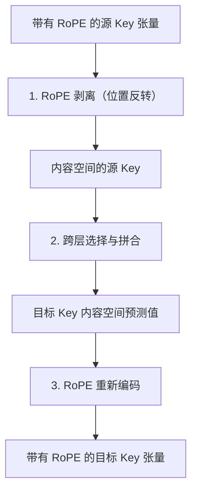

# 无标题

首字延迟税终结：拆解英伟达跨模型 KV Cache 转换技术与 Agent 规模化之战

### 2026年8月22日
**文 / Antigravity Tech Blog**

在长上下文智能体（Long-horizon AI Agents）的世界里，上下文就是一切。但获取上下文必须付出代价：业界称之为“预填充税”（Prefill Tax）。

直到最近，多模型 Agent 工作流（在较小、较快的模型与较大、具备高推理能力的模型之间动态路由查询）仍受制于巨大的延迟和算力瓶颈。每当任务从 Llama 3.1 8B 移交给 Llama 3.1 70B 时，接收端模型都必须从头重新处理整个对话历史，以重建其键值缓存（KV Cache）。对于 32K 的上下文窗口，这个“预填充”（Prefill）阶段可能需要长达 7 秒以上，这不仅彻底毁掉了交互式 Agent 的即时响应体验，也在疯狂吞噬着 GPU 集群的算力。

英伟达研究团队的一篇新论文——《大语言模型家族中的跨模型 KV 缓存传输：用于预填充重用的闭式线性映射》（*Cross-Model KV Cache Transfer in LLM Families: A Closed-Form Linear Mapping for Prefill Reuse*，arXiv:2608.03893）提供了一条优雅的破解之道。该研究团队（包括 Taekyung Heo, Rasoul Shafipour, Ritchie Zhao, M. Golub, M. M. Kamani, Ritika Borkar, Bita Rouhani）证实，同一模型家族内部的 KV 缓存具有高度的线性相关结构。通过使用闭式岭回归映射器（closed-form ridge regression mapper），他们可以在毫秒级内将源模型的 KV 缓存张量直接转换为目标模型的格式。

其实测结果令人震惊：该方法实现了高达 **25 倍的加速**（将 Llama 3.1 70B 上 32K token 的预填充时间从 7 秒缩短至仅 **278 毫秒**），同时保留了目标模型独立运行性能的 **98%**。

在本文中，我们将深度拆解这种跨模型映射的数学机制，探讨其与英伟达新兴推理基础设施（Dynamo、NIXL 和 CMX）的整合，并剖析行业内围绕“硬件-软件生态锁死”与“开源 Agent 规模化扩展”所展开的激烈博弈。

---

## 内容空间映射的数学原理

英伟达这篇论文的核心洞察在于：在相同数据上训练且使用相同分词器（Tokenizer）的模型（即属于同一个模型家族，如 Llama、Qwen 或 Gemma），其内部构建的表征（Representations）高度相关。尽管这些表征存在于不同的维度空间中，但它们之间存在着一种近乎线性的变换关系。

然而，你无法直接对原始的 KV 缓存张量进行线性回归。在现代 Transformer 架构中，旋转位置嵌入（RoPE）会以与位置相关的方式旋转 Key 张量（$K$），这破坏了线性映射所必需的空间平稳性（Spatial Stationarity）。

为了克服这一障碍，研究人员引入了三步走的**内容空间映射**（Content-Space Mapping）管线：



### 第一步：RoPE 剥离（位置反转）
在进行线性变换之前，必须从源 Key 中移除位置旋转。对于位置 $i$ 处的 Key 向量 $k_i \in \mathbb{R}^d$，RoPE 应用了一个块对角正交旋转矩阵 $R_i \in \mathbb{R}^{d \times d}$：

$$K_{\text{rope}, i} = R_i K_{\text{content}, i}$$

由于 $R_i$ 是正交矩阵，其转置矩阵即为其逆矩阵（$R_i^\top = R_i^{-1}$）。系统通过应用转置旋转来剥离位置旋转：

$$K_{\text{content}, i} = R_i^\top K_{\text{rope}, i}$$

由此便得到了一个与位置无关的“内容空间”Key 张量。（注：由于在标准 Transformer 中，Value 值 $V$ 不需要应用位置嵌入，因此它们直接绕过这一步。）

### 第二步：跨层选择
为了预测目标层的 KV 缓存，映射器并不只参考单一的源层。相反，对于每个目标层 $l_t$，系统会识别预测能力最强的 top-$k$ 个源层（在校准阶段通常通过判定系数 $R^2$ 进行选择）。

对于给定位置 $i$ 的 token，将所选源层 $l_1, \dots, l_k$ 的内容空间 Key 向量拼接为一个单一的输入特征向量：

$$x_i = \left[ K_{\text{content}, i}^{(l_1)} \parallel K_{\text{content}, i}^{(l_2)} \parallel \dots \parallel K_{\text{content}, i}^{(l_k)} \right] \in \mathbb{R}^{k \cdot d}$$

### 第三步：闭式岭回归
利用包含 $N$ 个 token 的校准数据集（例如，从 FineWeb-Edu 数据集中抽取 500 个长度为 1024 token 的序列），将输入特征堆叠为矩阵 $X \in \mathbb{R}^{N \times (k \cdot d)}$，并将对应的目标模型内容空间状态堆叠为 $Y \in \mathbb{R}^{N \times d}$。

因为变换是线性的且校准集规模较小，所以映射矩阵 $W^* \in \mathbb{R}^{(k \cdot d) \times d}$ 可以在每个注意力头（Attention Head）级别通过闭式岭回归直接求解：

$$W^* = (X^\top X + \lambda I)^{-1} X^\top Y$$

其中，$\lambda = 0.01$ 是为了数值稳定性而引入的 L2 正则化参数。得益于闭式解的特性，整个校准过程的开销极低——在单张 GPU 上不到一小时即可完成，且完全不需要进行基于梯度的反向传播。

### 第四步：RoPE 重新编码
一旦通过映射得到了目标模型的内容空间 Key 预测值 $\hat{Y}$，系统就会应用目标模型特有的 RoPE 旋转矩阵 $R_i^{\text{target}}$：

$$\hat{K}_{\text{rope}, i}^{\text{target}} = R_i^{\text{target}} \hat{Y}_i$$

### 崩溃恢复：非线性退路机制
尽管线性映射在大多数网络层中表现极佳，但在某些模型配对中，由于表征漂移（Representation Drift）的存在，会导致“模型崩溃”，使得输出质量严重退化。针对这些特定层，研究人员引入了轻量级的非线性多层感知机（MLP）映射。在 HellaSwag 等基准测试中，切换到非线性 MLP 映射使原本面临传输失败的模型准确率恢复了高达 **37 个百分点**。

---

## 基础设施：英伟达的推理技术栈

要在超大规模场景下实现跨模型的 KV 缓存流转，仅凭快速的数学计算是远远不够的，这需要一套能够支持高吞吐量张量路由的物理与虚拟内存架构。英伟达正试图通过其软硬协同设计的栈来实现这一流程的标准化：

```
+-------------------------------------------------------------+
|                      NVIDIA Dynamo                          |
|         （分布式服务，Prefill/Decode 计算与解码分离）          |
+-------------------------------------------------------------+
                              |
                              v
+-------------------------------------------------------------+
|                       NIXL APIs                             |
|          （点对点 RDMA / NVMe-oF 数据传输通道）               |
+-------------------------------------------------------------+
                              |
       +----------------------+----------------------+
       |                                             |
       v                                             v
+-----------------------------+               +--------------+
|     GPU HBM (G1 显存层)      |               |  NVIDIA CMX  |
|   （运行中的 KV 缓存池）      |               | (G3.5 存储层)|
+-----------------------------+               +--------------+
```

### 1. NVIDIA Dynamo（分布式服务与编排）
Dynamo 是英伟达开源的、与引擎无关的分布式服务框架。通过将预填充（Prefill，计算密集型）和解码（Decode，显存带宽密集型）节点进行解耦，Dynamo 可以基于 KV 缓存的局部性（Locality）来路由请求。当路由策略决定将任务从 Llama 8B 升级到 Llama 70B 时，Dynamo 会接管交接过程，在缓存进入解码节点前触发线性映射器进行转换。

### 2. NIXL（英伟达推理传输库）
作为 Dynamo 的数据传输层，NIXL 提供了低延迟的点对点数据移动能力。NIXL 摒弃了通过慢速 CPU 系统内存中转的传统做法，直接使用 GPUDirect RDMA（远程直接内存访问）在不同 GPU 的 HBM 显存池之间复制 KV 缓存张量，将节点间的传输延迟压低至微秒级。

### 3. NVIDIA CMX（上下文内存存储平台）
CMX 在 KV 缓存内存层级中引入了一个全新的**“G3.5”层**，它介于本地节点的 NVMe 固态硬盘与冷态共享存储之间。在 BlueField-4 DPU（数据处理器）和 Spectrum-X 以太网的驱动下，CMX 构建了一个 Pod 级别的共享闪存层。Dynamo 会将处于非活跃状态的 Agent 上下文从昂贵的 GPU HBM（G1）卸载到 CMX 中。当 Agent 被重新唤醒时，NIXL 会从 CMX 提取缓存，在传输过程中实时运行跨模型线性变换，然后直接加载到目标 GPU 中。

---

## 行业博弈：开放可扩展性 vs. 硬件捆绑

英伟达在 KV 缓存基础设施上的激进布局，在系统工程社区引发了一场针锋相对的辩论。

尽管软件组件（Dynamo、NIXL）宣称开源，但关键的硬件层（CMX）却与英伟达的专属生态（BlueField-4、Spectrum-X）深度绑定。批评者指出，英伟达实际上是在利用 KV 缓存管理作为新筹码，将客户锁死在其高端网络和 DPU 硬件上。

“这无非是在经典的硬件生态锁死套路之上，套了个优雅的数学戏法。”一位知名风险投资人直言，“通过将传输层标准化在 BlueField DPU 和 Spectrum 以太网之上，英伟达事实上堵死了云厂商换装 AMD 或自研 ASIC 的后路。如果你的 Agent 性能严重依赖亚毫秒级的 CMX 缓存传输，你其实就已经被困在了那片‘绿色铁皮’里。”

然而，支持者则认为这是 Agent 迈向规模化扩展的必经之路。Reddit 上一位资深基础设施工程师指出：“如果你整天要交首字延迟税，或者动不动就面临 HBM 爆显存，你根本不可能构建出能处理数百万 token 的长上下文智能体。不管底层硬件是不是私有的，解耦 KV 缓存并实现跨模型转换，是让 Agent 算得过商业账的唯一出路。”

AI 领域领军人物 Andrej Karpathy 评论了该论文在数学上的极简美感：
> “太疯狂了，仅仅通过简单的岭回归（Ridge Regression）就能绕过预填充阶段数以亿计的浮点运算。线性投影再次战胜了简单粗暴的计算。这正是我们让多智能体循环（Multi-agent loops）走向实用的系统级优化手段。”

相反，Mistral AI 的 CEO Arthur Mensch 则对私有技术造成的瓶颈提出了警告：
> “我们需要在跨模型接力与 KV 缓存序列化上建立开放标准。如果听任这些映射算法被锁死在 CMX 这样私有的硬件技术栈中，无异于将我们自己的一生直接编译进英伟达的硅片里。模型层必须保持硬件中立。”

---

## 重塑 Agent AI 的商业经济学

跨模型 KV 缓存转换对实际业务运行的影响是极其深远的。此前，开发者一直面临着一个残酷的二选一难题：
*   **在 GPU 显存中保持 Agent 处于热启动状态（Keep Hot）**：响应时间极快，但由于 HBM 的高昂占用，成本高得令人发指。
*   **卸载显存并在激活时重新计算（Offload and Recompute）**：存储成本极低，但由于必须重新计算预填充，导致首次响应出现极高的延迟。

当分层存储（CMX）与跨模型转换结合后，这种商业经济学模型被彻底重塑。一个低成本、高速度的小模型（如 Llama 8B）可以用于初始的前端筛选、路由分发和简单的对话交互；一旦对话进展到需要高阶逻辑推理的关键节点，Agent 的上下文状态将被打包传输，通过岭回归在 278 毫秒内完成 KV 缓存转换，直接交由 Llama 70B 承接运行。

对于每天需要处理数百万次多轮 Agent 会话的企业级应用而言，这种混合路由方案可在保持单秒级以内延迟的前提下，将活跃的 GPU 计算成本降低达 **80%**。困扰行业已久的预填充税，如今已正式宣告废除。

---

# 3. 社媒推广摘要（Highlight）

## 3.1 核心问题
1. 旋转位置编码（RoPE）如何干扰跨模型 KV Cache 的线性映射？研究团队是如何攻克这一数学难题的？
2. 跨模型 KV Cache 转换在超长上下文场景下能带来怎样的吞吐与延迟红利？
3. 英伟达 Dynamo、NIXL 与 CMX 构筑的软硬一体化技术栈，究竟是 Agent 规模化落地的福音，还是生态锁死的新陷阱？

## 3.2 摘要正文
英伟达研究团队在最新论文中提出了一种基于闭式岭回归的跨模型KV Cache转换技术，正式宣告多模型Agent工作流中的预填充税走向终结。该技术通过在无位置信息的“内容空间”进行线性映射，将Llama 3.1 70B上32K token的预填充延迟从7秒暴降至278毫秒，实现高达25倍的加速，同时保留了目标模型98%的独立运行性能。然而，当该算法与英伟达Dynamo、NIXL以及绑定BlueField-4 DPU的CMX平台深度集成时，业界爆发了激烈争议。支持者盛赞其为用线性投影干掉粗暴计算的系统级神作；反对者则警惕其为英伟达构建的专属硬件锁死陷阱，呼吁亟需建立硬件中立的跨模型KV缓存序列化开放标准。

## 3.3 关键词标签
#KVCache #Agent #英伟达
