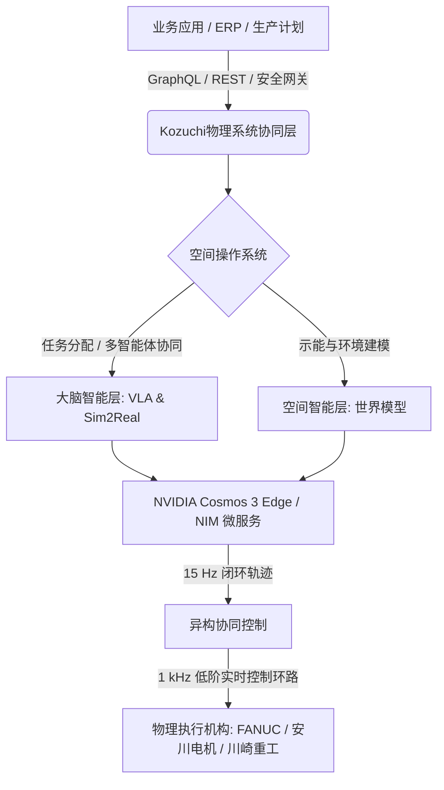

# **日本机器人“大逆袭”：拆解富士通Kozuchi OS与英伟达Cosmos的“主权具身智能”野心**

2026年7月下旬的东京，全球机器人产业的版图悄然发生巨变。由富士通领衔，联合日本微电子与机电一体化三大巨头——发那科（FANUC）、安川电机（Yaskawa Electric）以及川崎重工（Kawasaki Heavy Industries），正式宣布成立联盟，共同开发面向“物理AI”（Physical AI，即具身智能）的协同控制平台。这一战略的目标直白且迫切：通过将高级认知智能直接注入重型工业硬件，来缓解日本本土极度严峻的劳动力短缺和人口老龄化危机。

在这项雄心勃勃的计划中，软件核心当属**富士通Kozuchi Physical OS（小槌物理操作系统）**。这是一个旨在连接数字世界模型与真实工业物理环境的自主性、开放式控制平台。在英伟达（NVIDIA）最新发布的 **Cosmos 3 Edge** 模型以及 **Omniverse** 仿真技术栈的支持下，该项目正试图打破各大机器人制造商长期以来的闭源软件壁垒，并有望为下一代工业自动化定义全球性的技术标准。

---

### 架构拆解：大脑、空间与安全网关
从底层架构来看，Kozuchi Physical OS 本质上是一个空间操作系统（Spatial Operating System）。与传统依靠硬编码执行刚性程序的机器人控制方案不同，Kozuchi 将高层级的任务规划与底层的具体执行进行了剥离，采用了双层智能结构：



1. **大脑智能层（Brain Intelligence Layer）：** 负责解决机器人的认知适应性。该层运行在异构数据集（如 Open X-Embodiment 开放数据集）上联合训练的“视觉-语言-动作”（VLA）模型。通过模仿学习和强化学习，机器人能够直接解析原始视频和语义文本，从而执行那些从未经过显式编程的新任务。
2. **空间智能层（Spatial Intelligence Layer）：** 构建动态的实时“空间世界模型”。它不再单纯依赖简单的三维空间坐标，而是映射物理“示能”（Affordances）——即理解对某一物体在物理上可实施哪些操作（例如，判断一个箱子是可以抓取、滑动还是旋转）——并结合社交物理（socio-physics）仿真，确保在人类操作员周围安全导航。

为了适应企业级生产环境，Kozuchi Physical OS 能够直接与 ERP 和物流网络无缝对接。来自高层级的业务指令（例如，“由于物流延误，将 3 号线的产出重新分配至 B 区料箱”）通过**智能体间安全网关（Secure Inter-Agent Gateway）**进行传输。该网关利用容器化的 **NVIDIA NIM 微服务**在本地完成安全编排，彻底杜绝了敏感的制造端 IP 泄露至公有云模型的风险。

---

### 终极工程瓶颈：15 Hz AI 与 1 kHz 硬件循环的冲突
尽管“物理AI”前景令人兴奋，但工业界的工程师们指出了一项致命的技术错配：**控制环路频率的断层**。

传统的可编程逻辑控制器（PLC）和机电一体化系统必须在 **1 kHz（1毫秒延迟）** 的频率下运行，以确保高精度的实时安全、避障和确定性。然而，“视觉-语言-动作”（VLA）模型和世界模型的计算极其重载。即使直接部署在英伟达最新的边缘计算芯片上，像 **Cosmos 3 Edge** 这类基础模型的闭环推理速度极限也仅为 **15 Hz（约67毫秒延迟）**。

在 Reddit 的 r/robotics 板块和 X.com 上，这一延迟差距引发了激烈讨论。一位资深机器人研究员指出：
> “你不可能仅仅依靠 15 Hz 的推理去驱动一个安全的、高动态的机械臂。如果一个人类突然闯入工业机器人手臂的运动路径，67毫秒的决策延迟，往往就是‘轻微停顿’与‘灾难性撞击’之间的区别。”

Kozuchi 通过引入混合控制技术栈解决了这一冲突。15 Hz 的 Cosmos 3 Edge 模型作为“高层轨迹规划器”，持续预测环境状态并生成目标路径包络线（Path Corridors）。这些包络线随后被下发至本地的 1 kHz 机电控制器。该 1 kHz 环路在 VLA模型设定的安全边界内，负责处理实时的电机转矩控制、力反馈以及瞬时的安全超驰控制（Override）。

---

### Sim2Real 管道：NVIDIA Omniverse 与物理赋能 AI
在真实世界中训练机器人不仅进度缓慢，而且成本高昂、充满危险。Kozuchi 操作系统高度依赖基于 **NVIDIA Omniverse** 和 **Isaac** 平台构建的高保真 **Sim2Real（仿真到真实世界）**数据管道。

```
[真实世界：物理特性与纹理] ---> [NVIDIA Omniverse 数字孪生]
                                      |
                                (领域随机化)
                                      |
                              [Isaac Gym 并行强化学习]
                                      |
[真实世界部署] <--- [Sim2Real 策略迁移 (零样本)]
```

通过在虚拟仿真环境中生成海量的合成数据，机器人在触碰工厂地板前就已经学会了复杂的操控技能。为了跨越“Sim2Real 鸿沟”（即由于物理参数偏差导致虚拟策略在现实中失效），Kozuchi 采用了**领域随机化（Domain Randomization）**技术（在仿真中不断扰动摩擦力、质量、光照和传感器噪声），并结合了**物理通知神经网络（PINNs，Physics-Informed Neural Networks）**。

PINNs 将物理方程（如欧拉-伯努利梁理论和纳维-斯托克斯方程）直接嵌入到 AI 的损失函数中。在预测性维护应用中，操作系统可以将发那科或安川电机关节的真实振动数据与物理赋能模型进行实时比对，从而在传感器检测到任何可见偏差之前，精准识别微观结构疲劳并预测失效点。

---

### 边缘算力：Cosmos 3 Edge 引擎
在工业边缘部署如此庞大的工作负载，需要极强的本地计算能力。云计算推理带来的网络延迟和数据安全问题在工业现场是不可接受的。Kozuchi 操作系统在本地运行英伟达的 **Cosmos 3 Edge** 模型。这是英伟达在 SIGGRAPH 2026 上推出的一个拥有 40 亿参数的“全能模型”（Omni-model）。

Cosmos 3 Edge 采用了专门的 **Mixture-of-Transformers（MoT，混合 Transformer）** 架构。该架构将处理任务分流至两个截样不同的神经网络通道：
*   **自回归塔（Autoregressive Tower）：** 负责逻辑推理与序列化决策。
*   **基于扩散的生成塔（Diffusion-based Generative Tower）：** 用于预测即将发生的视频帧并构建空间世界状态。

通过在 NVIDIA Jetson Thor 或 T2000/T3000 模块上进行本地部署，MoT 架构使机器人能够实时“想象”其动作的物理后果，在零云端依赖的情况下，执行闭环的“视觉-动作”控制策略。

---

### 突围寡头壁垒：主权操作系统的战略野心
从战略层面看，富士通 Kozuchi Physical OS 代表了日本工业界联合重夺自动化软件控制权的深思熟虑。历史上，安川、发那科和川崎等机器人巨头各自筑起高墙，建立起封闭的生态系统，用专有的编程语言和控制器硬件牢牢绑定客户。

如今，在以软银集团（SoftBank Corp）、Preferred Networks、Turing 等组成的“Cosmos 联盟”（Cosmos Coalition）支持下，这些机电一体化巨头们正在主动拥抱一个开源、统一的软件平台。英伟达首席执行官黄仁勋在访日期间高度评价了这一转变：
> “日本无可匹敌的机电一体化底蕴，结合本土化、主权化的 AI 基础模型，将使这个国家在下一次工业革命中占据主导地位。物理 AI 必须具备本土化的理解能力与自主控制权。”

如果 Kozuchi Physical OS 在即将于 2026 年 9 月在富士通自建工厂进行的概念验证（PoC）测试中取得成功，它将彻底改写全球即插即用工业自动化的标准。届时，各家机器人专有的编程语言或将沦为历史，而整个行业的价值链核心，也将从单纯的硬件制造转移到智能的空间协同编排之上。

---
