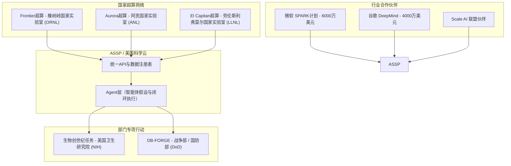

# 曼哈顿计划2.0：拆解50亿美元“创世纪任务”，以及国家与巨头间计算未来的科学暗战

**华盛顿特区报道** —— 昨日在白宫召开的2026年“创世纪任务”（Genesis Mission）峰会，比起一场常规的政府新闻发布会，更像是一场科技界的高规格战时总动员。在白宫科技政策办公室（OSTP）的主导下，美国政府宣布了高达50亿美元的联邦资金承诺，以全面扩张这一宏大计划——该国家战略项目最初于2025年11月由第14363号行政命令正式确立。

在局外人看来，“创世纪任务”或许只是一个旨在“让美国科学生产力翻倍”的高大上政策口号。但对于挤满现场的工程师、风险投资家和国家实验室主任来说，它代表着某种极具颠覆性的变革：在人工智能时代，科学研究的资金注入、执行逻辑以及安全边界，正在迎来一场底层的范式洗牌。

这一变革的核心，是一个横跨多个政府部门的庞大基础设施项目，其终极目标是打造一套“面向科学的国家级操作系统”。

#### 技术栈解构：揭秘美国科学与安全平台（ASSP）
要读懂“创世纪任务”，首先必须拆解由美国能源部（DOE）主导构建并运营的**美国科学与安全平台（ASSP）**。该平台以**美国科学云（AmSC）**为骨干网络，旨在彻底解决数十年来一直掣肘联邦科研的顽疾：数据孤岛。

长期以来，美国政府的科学计算系统处于极度碎片化状态。橡树岭国家实验室（ORNL）的研究员如果想把数据传输给阿贡国家实验室（ANL），或者想调用劳伦斯利弗莫尔国家实验室（LLNL）的算力，必须先穿过由不同安全网关、API模式和队列调度器交织而成的“迷宫”。

而ASSP通过构建一个安全的多租户科学云，直接对接美国高性能计算（HPC）版图上的三颗明珠，打破了这些壁垒：
*   **Frontier（橡树岭国家实验室）：** 搭载AMD EPYC（霄龙）处理器和Instinct MI250X GPU的百亿亿次级（Exascale）巨兽。
*   **Aurora（阿贡国家实验室）：** 搭载英特尔至强CPU Max系列及英特尔数据中心GPU Max系列。
*   **El Capitan（劳伦斯利弗莫尔国家实验室）：** 最新部署、基于AMD Instinct MI300A APU的顶尖系统。

然而，ASSP并不仅仅是一个超级计算机的统一调度器，它的核心技术能力还整合了以下三大板块：
1.  **物理感知基础模型（Physics-Aware Foundation Models）：** 这类神经网络架构在训练时不单单学习预测下一个Token，还必须在物理模拟中严格遵守质量守恒、动量守恒和能量守恒等物理定律。
2.  **闭环自主实验室（Closed-Loop Autonomous Laboratories）：** 基于AI Agent的框架，能够自动提出假设、编写模拟脚本、在百亿亿次级硬件上运行、分析结果，并遥控机器人实验设备去完成物理层面的化学或生物实验。
3.  **数据清洗与标注流水线（Data Curation Pipelines）：** 由**Scale AI**等私营巨头支持的标准化数据注册表，其任务是将国家实验室设施中产生的海量、无结构的原始遥测数据，转化为高保真的AI训练数据集。

> [!NOTE]
> **异构架构的编译挑战：**
> ASSP面临的最大技术瓶颈之一，是如何在三种截然不同的GPU架构（AMD MI250X、Intel Max以及AMD MI300A）之上，对AI工作负载进行统一的编译与优化。为了避免被单一硬件厂商“套牢”，研究人员正高度依赖Triton等开源跨编译器，以及SYCL和ROCm等统一编程模型。

#### 核心专项：NIH的“生物创世纪”与战争部的“DB-FORGE”
7月22日的战略扩张将“创世纪任务”辐射到了15个以上的联邦机构，其中有两大旗舰项目最为瞩目：

*   **美国卫生研究院（NIH）的“生物创世纪”（Bio Genesis）任务：** NIH院长杰伊·巴塔查里亚（Jay Bhattacharya）宣布，该机构已调拨并规划了2026财年及2027财年共计超12亿美元的资金，用于这场生物医学领域的AI攻坚战。其目标是在未来十年内，将从“药物发现”到“临床应用”的时间线缩短一半。该项目将聚焦六大国家科技挑战，首要任务是攻坚儿童癌症以及“让美国重新健康”（MAHA）的慢性病防治行动。
*   **战争部的“DB-FORGE”（数字生物安全熔炉）：** 该项目与劳伦斯利弗莫尔国家实验室（LLNL）联手开发，是一个高度安全的高性能计算环境。项目在2026财年的启动资金为3000万美元，并计划在2027财年飙升至1.5亿美元（作为国防部13亿美元大算力布局的一部分）。它是该项目法定框架中所采用的历史性名称“战争部”下属的数字实验室（对应现代的国防部），旨在利用AI Agent对生物威胁进行建模、模拟反制措施，并以此捍卫美国本土生物制造的供应链安全。

#### 硅谷巨头的利益分食与风投界的分歧
面对这一诱人的国家级蛋糕，硅谷资本与科技巨头迅速跟进。微软通过最新推出的**SPARK**（科学伙伴关系推进研究与知识）计划，向“创世纪任务”承诺了6000万美元的资助，其中包括4000万美元的Azure云积分和2000万美元的专属工程技术支持。谷歌DeepMind也紧随其后，承诺提供价值4000万美元的云积分和AI Token，使能源部（DOE）的研究人员可以直接调用AlphaFold 3以及政府版Gemini。

然而，科技领袖们对于这些系统的治理机制却持有截然不同的观点：

*   **微软CEO 萨提亚·纳德拉（Satya Nadella）：** *“通过SPARK计划将AI基础模型与能源部的超算网络相融合，这绝不仅仅是科研工具的一次简单升级，而是科研范式的根本性转变——我们正在从‘被动观察’走向‘自动化的闭环假设生成’。”*
*   **OpenAI CEO 山姆·奥特曼（Sam Altman，同时也是核能初创公司Oklo的幕后推手）：** *“未来十年的真实瓶颈是算力与能源。像‘美国科学云’这样由先进核能系统驱动的平台，正是我们让科学发现速度翻倍所急需的催化剂。”*
*   **安德森·霍罗维茨（a16z）联合创始人 马克·安德森（Marc Andreessen）：** *“‘创世纪任务’是必要的一步，但政府绝不能成为效率的瓶颈。如果我们把它做成一个官僚集权机构，而不是一个面向开发者的去中心化平台，我们在‘AI+科学’的竞速中就会输给中国。这场科技冷战的胜负取决于执行力，而不是委员会的会议。”*

#### 科学的集权危机：同行评审VS使命导向型资金
“创世纪任务”的宏大宏图在科学界内部引爆了一场激烈的舆论内战。几十年来，美国科学界一直秉持自下而上的去中心化模式：科学家个人向NIH申请R01研究项目资助或向NSF申请拨款，再由同行评审委员会评判哪些创意值得立项。

批评者指出，“创世纪任务”代表了一种危险的转向——即由国家意志主导的集权式科研。在r/Professors等学术社区中，许多研究人员表达了深深的担忧：
> *“‘生物创世纪’任务实际上是在变相蚕食传统的R01资助系统。NIH不再去资助十个从不同角度研究儿童癌症的独立实验室，而是把12亿美元巨资集中砸向少数几个由科技巨头和国家实验室把持的联合中心。这是科学的‘工业化垄断’，它会彻底扼杀那些高风险但极具原创性的个人研究。”*

与此同时，在开发者社区（如r/LocalLLaMA），怀疑的目光则锁定了开源妥协与安全限制：
> *“ASSP听起来就像是画大饼（concepts of a plan）。他们满嘴都是‘安全数据共享’和‘开放API’，但如果你不处于核心圈子里，你想申请Frontier的算力试试？这无非是在‘科学互联网’幌子下筑起的高墙花园。”*

Meta首席AI科学家杨立昆（Yann LeCun）直言不讳地表达了这种担忧：
> *“你不可能通过简单的‘预测下一个Token’的自回归大语言模型来构建化学和物理世界的‘世界模型’。将科研资金高度向大模型倾斜，同时以牺牲多元化、自下而上的物理与生物研究为代价，这在方法论上是根本性的‘范畴错误’。我们迫切需要的是开源且受物理规律约束的模型，而不是政府层面的科研垄断。”*

这种结构性转向同样在国会内部引发了激烈的交锋。特朗普政府在2027财年的预算草案中，并未直接为“创世纪任务”设立独立的预算明细。相反，白宫申请了12亿美元资金筹建能源部旗下的**人工智能与量子办公室（AIQ）**，以此作为集中调配的枢纽。目前，国会议员们正就这些长期的跨年度运营预算运作争论不休。批评人士警告称，绕过传统的部门审批机制可能会给科研团队埋下隐患——一旦政坛风向转变，这些项目恐将面临“断饷”危机。

#### 地缘政治筹码：中美AI科研的长跑
归根结底，“创世纪任务”是地缘政治焦虑的直接产物。白宫在官方陈述中毫不掩饰地将其定性为对抗中国国家补贴“AI for Science”（AI科学发现）战略的战略法宝。

然而，这也带来了知识产权（IP）归属与安全风控的尖锐摩擦。提供算力积分的科技巨头希望将该平台孕育出的专利和模型据为己有并进行商业化开发，而国家安全官员则对潜在的数据泄露风声鹤唳。由于ASSP要处理极其敏感的生物实验数据（通过DB-FORGE）和前沿材料模拟，平台必须执行前所未有的多级安全准入机制。如何在拉起这道“防火墙”的同时，不至于窒息学术界本应拥有的自由协作，将是接下来最严峻的考验。
