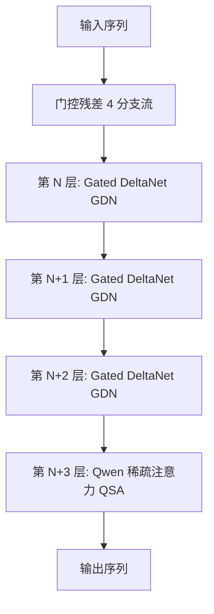
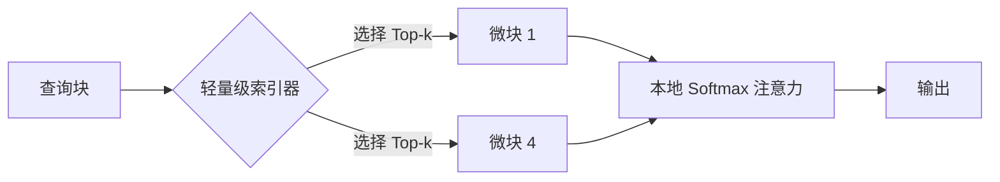
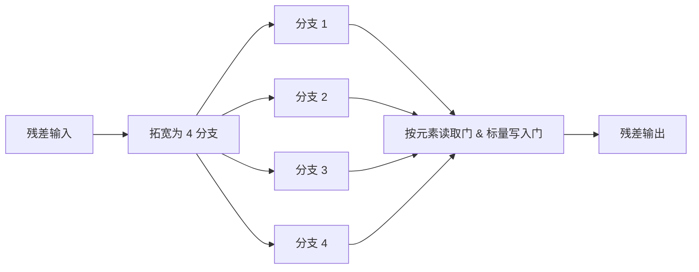

# 架构大洗牌：Qwen3.8-Flash 携手 Gated DeltaNet-2，如何彻底颠覆百万 Token 上下文的算力经济学？

2026 年 8 月 26 日，阿里云在 AI 生态中投下了一枚重磅炸弹，正式发布 Qwen3.8-Flash 系列。该系列包含两大核心主力：作为未来 Qwen4 家族开源架构预览版的 **Qwen3.8-Flash-Next**，以及直接面向商业落地的 **Qwen3.8-Flash** 生产级 API。

其中，Qwen3.8-Flash-Next 是一个拥有 1250 亿参数的混合专家（MoE）模型，每个 Token 仅激活轻量级的 **60 亿参数**。但在底层设计上，它彻底告别了传统 Transformer 的固有范式。通过融合 **Gated DeltaNet (GDN)** 与 **Qwen 稀疏注意力 (Qwen Sparse Attention, QSA)**，该模型能够原生支持 262,144 个 Token 的超长上下文（通过 YaRN 技术可进一步外推至 100 万 Token），而其计算与显存开销仅为传统稠密 Transformer 的极小一部分。

### 架构解密：当 Gated DeltaNet-2 撞上 Qwen 稀疏注意力

长上下文大语言模型面临的核心工程瓶颈，是键值（KV）缓存的二次方缩放效应。在传统 Transformer 中，存储和检索键（Key）与值（Value）的计算成本随序列长度 $L$ 呈 $O(L^2)$ 级数增长。为了打破这一“魔咒”，通义千问团队采用了混血（Hybrid）架构思路。

#### 1. Gated DeltaNet-2 (GDN-2)
GDN-2 用于 3/4 的网络层中，负责将历史上下文压缩到固定大小的循环状态（Recurrent State）中，从而避免 KV 缓存的无限膨胀。GDN-2 代表了线性注意力机制（Linear Attention）的最新演进，它利用“增量规则”（Delta Rule）进行精准的内存更新：

$$S_t = S_{t-1} + (v_t - S_{t-1} k_t) \otimes k_t$$

其中 $S_t \in \mathbb{R}^{d \times d}$ 是循环状态，$k_t, v_t$ 分别是当前时刻的键向量和值向量。在 GDN-2 中，该更新受到去耦的、通道级“擦除”和“写入”门控机制的精细调制：

$$S_t = (1 - g_{\text{erase}, t}) \odot S_{t-1} + g_{\text{write}, t} \odot \left( (v_t - S_{t-1} k_t) \otimes k_t \right)$$

这使得模型能够以极高的精度“遗忘”过期信息并“写入”新上下文，成功避免了传统线性注意力或状态空间模型（SSM）在长序列中因噪声累积而导致的性能退化。

#### 2. Qwen 稀疏注意力 (QSA)
尽管 GDN-2 极大地压缩了内存，但纯循环架构往往会遭遇“状态容量瓶颈”——它们无法从浩瀚的历史中精准检索到极其特定的 Token。为此，在剩下的 1/4 层中，模型交织引入了 QSA。

与传统 Token 级稀疏注意力机制在 GPU 上极低的硬件利用率不同，QSA 运行在“微块粒度”（Micro-block Granularity）上。它将序列划分为大小为 $B$（如 64 个 Token）的微块。通过轻量级索引器（Indexer）计算当前查询块与历史键块之间的路由得分，仅将相关度最高的 Top-$k$ 个微块拉取到本地 GPU 显存中，进行完整的 Softmax 注意力计算：

这种混血布局不仅让模型在百万 Token 级别下依然能保持近乎完美的检索保真度（通过“大海捞针”测试），还将显存（VRAM）占用骤降了 80% 以上。

Mamba 的联合创造者 **Albert Gu** 在 X 上评价道：
> “纯 SSM 或线性注意力模型在处理超长上下文的精准检索时，终究会撞上容量之墙。将 Gated DeltaNet-2 这样的线性注意力与稀疏自注意力层结合的混血路线，是务实主义者的最优解：在保住完整注意力检索精度的同时，砍掉 90% 的 KV 缓存开销。”

FlashAttention 的创造者 **Tri Dao** 同样对 QSA 的硬件友好性赞不绝口：
> “QSA 的微块路由极具智慧，它将 Token 分组为稠密子矩阵。这使得稀疏操作对硬件极度友好，能够直接在 Tensor Core 上跑出极高效率，避开了非结构化稀疏带来的内存带宽瓶颈。”

### 门控残差与 510 亿 N-gram 嵌入表的“逃生通道”

为稳定深层异构注意力网络并扩展模型容量，Qwen3.8-Flash-Next 引入了两项全新机制：

#### 门控残差 (Gated Residuals, GR)
不同于标准的残差连接，GR 将残差流拓宽为四个并行分支：

每个分支都配备了基于数据的逐元素（Element-wise）读取门和分支级标量写入门，从而实现并行的、高度专业化的特征提取，显著提升了异构网络在训练时的稳定性。

#### 51B N-gram 嵌入表
模型外挂了一个庞大的 510 亿参数查找表（Lookup Table），包含 2000 万个双字组（Bigrams）和三字组（Trigrams）条目。该表将高频局部上下文直接映射为稠密表示，使局部序列在推理时可以完全绕过 MoE 路由。

为了在消费级硬件上运行，该 N-gram 表被卸载（Offload）到主机系统内存（或 SSD）中，并在推理过程中实施异步分页。一个后台线程会预测未来可能出现的 N-gram，并提前将其嵌入向量预取（Prefetch）到 GPU 显存中，从而将 I/O 传输延迟完美隐蔽在 GPU 的 MoE 计算时间之内。

在 r/LocalLLaMA 论坛上，开发者们已经展示了在统一内存设备上的本地部署方案：
> “51B N-gram 内存卸载才是真正的黑科技。我们正尝试在 Mac Studio (M5 Ultra) 和 AMD Strix Halo 设备上将其分页到 NVMe。由于采用了异步分页，Token 生成完全不会发生阻塞。这就是我们在消费级硬件上跑通 176B 参数模型的秘诀。” —— **u/LocalModelDev**

### 仅需 1/9 训练成本的秘密：Muon 优化器粉墨登场

阿里公布的最令人震惊的数据是：Qwen3.8-Flash-Next 仅用了前代 Qwen3.7-Plus 约 **1/9 的训练成本**，就实现了更优的编程与 Agent 能力。这背后的头号功臣非 **Muon 优化器** 莫属。

Muon (Momentum Orthogonalized by Newton-Schulz) 优化器摒弃了将参数视为独立标量的传统做法，而是通过将更新限制在 Stiefel 流形上，对隐藏的二维权重矩阵进行矩阵正交化优化：

$$W_{t+1} = W_t - \eta \cdot \text{Orthogonalize}(M_t)$$

其中，正交化过程通过 Newton-Schulz 迭代法高效求解：

$$X_{k+1} = \frac{1}{2} X_k (3I - X_k^T X_k)$$

在实际应用中，Muon 专门负责优化隐藏层，而 AdamW 则继续处理嵌入层和最终的分类器投影。

AI 巨擘 **Andrej Karpathy** 对此评价道：
> “AdamW 统治默认优化器太久了。虽然它很鲁棒，但本质上只是一个标量优化器。Muon 将权重视为矩阵，这更契合神经网络处理信息的本质。它在 llm.c 上的速度突破仅仅是个开始。”

Muon 的创造者 **Keller Jordan** 补充道：
> “Muon 通过 Newton-Schulz 迭代对梯度进行正交化，成功规避了 AdamW 的谱偏差（Spectral Bias）。看到它从 124M 的 NanoGPT 玩具模型成功扩展到 125B 的生产级 MoE，这无疑是对 Stiefel 流形优化理论的强力证明。”

### 地缘与商业版图的剧烈洗牌

阿里以极低的价格提供原生支持 1M 上下文的 Qwen3.8-Flash，正向 OpenAI、Anthropic、Google 等美国 API 供应商施加恐怖的商业压力。

Abacus AI 首席执行官 **Bindu Reddy** 总结了这一市场冲击：
> “阿里云对 Qwen3.8-Flash 的定价将引发美国 API 厂商的新一轮利润滑坡。面对一个单 Token 仅激活 6B 参数、却能在 1M Token 窗口下输出 125B 级别性能的 MoE 模型，你根本无法在价格上与其竞争。”

Hugging Face 首席执行官 **Clement Delangue** 则将其视为开源社区的史诗级胜利：
> “Qwen3.8-Flash-Next 证明了开源权重不仅是在亦步亦趋地追赶闭源模型，更是在混血架构的前沿探索上扮演了开路先锋。”

随着开源前沿的加速推进，行业正在从背负庞大 KV 缓存包袱的纯稠密 Transformer，加速转向高度优化的混血线性注意力 MoE 时代。Qwen3.8-Flash 的问世，正式宣告了这一全新范式的降临。

3. 社盟推广摘要（Highlight）
3.1 核心问题
1. 面对百万 Token 的超长上下文，Qwen3.8-Flash 的混血架构如何在不重蹈 Transformer KV 缓存开销覆辙的同时，维持极高的检索精度？
2. Muon 矩阵优化器究竟凭借何种机制，帮助该模型在训练成本上实现相比传统 AdamW 的 9 倍削减？
3. 拥有 125B 主体 MoE 和 51B 嵌入表的巨无霸模型，如何借助异步分页技术在消费级硬件或统一内存设备上跑通本地推理？

3.2 摘要正文
阿里云发布的Qwen3.8-Flash-Next彻底颠覆了长上下文模型的游戏规则。这款125B MoE模型通过3:1的Gated DeltaNet-2与Qwen稀疏注意力（QSA）混血布局，在极低显存开销下实现了百万Token原生支持。其引入的51B N-gram嵌入表支持向SSD异步分页，直接拉低了本地消费级设备的运行门槛。更颠覆的是，得益于将权重作为矩阵进行正交化优化的Muon优化器，其训练成本仅为前代的九分之一。业内热议这不仅是技术突破，更是对美国API大厂的终极价格战。

3.3 关键词标签
#Qwen3.8 #Muon优化器 #混合架构
