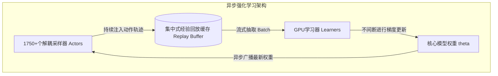

# 法律的“权重主权”之战：Harvey首发垂直大模型Tenet，宣告企业级AI“套壳时代”的终结

> [!NOTE]
> 本文英文原版已归档在系统文件系统中，路径为 [/Users/vzl/.gemini/antigravity-cli/brain/c25e963a-1049-472f-9bb9-87c2f95dc28f/blog_deep_dive.md](file:///Users/vzl/.gemini/antigravity-cli/brain/c25e963a-1049-472f-9bb9-87c2f95dc28f/blog_deep_dive.md) 以供长期查阅。

企业级生成式 AI 市场正在经历一场无声却极其惨烈的重构。曾被戏称为“API包装器（API wrappers）”的第一波垂直领域 AI 初创公司，如今正撞上残酷的现实：在长程智能体（Long-horizon Agentic）工作流中，向 OpenAI、Anthropic 或 Google “租用”智能，已经被证明是一种不可持续的商业策略。

2026年8月20日，法律科技巨头 Harvey 正式对外宣布推出其首个专有、垂直行业定制的法律大模型——**Tenet**，在行业内划下了一条清晰的分水岭。Tenet 是 Harvey 与 **Fireworks AI** 深度工程合作的结晶，基于月之暗面（Moonshot AI）拥有 2.8 万亿参数的超大规模开源权重基座模型 **Kimi K3** 进行后期对齐强化训练。Tenet 的问世，宣告了企业级 AI “权重主权（Weight Sovereignty）”时代的正式到来。

为了评估这一新一代自主法律智能体系统，Harvey 还同步开源了**法律智能体基准测试（Legal Agent Benchmark，简称 LAB）**（GitHub 开源地址：`harveyai/harvey-labs`）。该评估框架包含超过 1200 个多步骤的实际业务任务，彻底告别了传统简陋的单轮问答测试，转向极其严苛的“一票否决制（All-pass）”细则审计。

本文将深度解构 Tenet、Kimi K3 以及 LAB 背后的工程实现、商业战略与经济学逻辑。

---

### 一、 战略必然性：初创公司为何必须逃离“API套壳陷阱”

对于一家法律科技初创公司而言，将核心业务完全托付给顶尖闭源 API（如 GPT-4o 或 Claude 3.5 Sonnet）无异于饮鸩止渴，这会引入三个致命的结构性风险：

#### A. 长程 Agent 工作流带来的毛利挤压
法律垂直领域的实际业务场景——如并购（M&A）中的尽职调查、合规审计或合同草拟——具有极高的数据密度。一个 Agent 如果需要解析数十份合同 PDF 文件、检索外部案例法数据库，并反复撰写和修改条款，单次任务运行时消耗的 Token 数量将极其恐怖。按传统的 API 按量付费模式计算，一次彻底的文档分析和处理任务可能会消耗高达 20 至 50 美元的调用成本。而在 Fireworks AI 等平台上，通过私有的、固定成本的 GPU 算力托管定制的开源权重模型，初创公司能将这种难以预测的变动成本转化为稳定且可分摊的折旧性运营开销（OPEX）。

#### B. 被上游“旁路化”（Disintermediation）的边缘化风险
大模型底座厂商正以极具侵略性的姿态向垂直企业级应用延伸。OpenAI 在持续扩大其企业版版图，Anthropic 也在不断向上层应用渗透。如果一家垂直初创公司的核心价值仅仅停留在一套精巧的 Prompt 工程上，那么一旦底座厂商升级模型或直接推出竞争性垂直工具，初创公司顷刻间就会面临被旁路化抛弃的灭顶之灾。

#### C. “模型权重主权”与安全信任边界
在受严格监管的行业中，模型参数（即权重）的实际物理位置和控制权，是一道不可逾越的安全门槛。律所必须恪守极其严苛的“律师-客户保密特权”（Attorney-Client Privilege）。
* **模型漂移（Model Drift）：** 闭源 API 供应商会在后台无声地更新模型。这种静默升级在一夜之间就能摧毁 Agent 精细编排的 Prompt 结构和路由逻辑。拥有权重意味着能将模型 Checkpoint 锁死在特定状态。
* **可审计性（Auditability）：** 律所必须有能力对模型的安全性进行彻底审计。当拥有模型权重后，律所可以将模型私有化部署在 VPC（虚拟私有云）或本地数据中心（On-premise）中，从而确保敏感的诉讼材料或交易数据绝对不会跨越防火墙。

Hugging Face 联合创始人兼 CEO **Clement Delangue** 在社交平台 X 上对此指出：
> “在受高度监管的行业中，‘权重主权’是企业 CIO 们最核心的考量。开源权重模型是走向真正合规的唯一道路。”

Harvey 联合创始人兼 CEO **Winston Weinberg** 亦表达了相同的观点：
> “对于企业级垂直 AI 而言，依赖第三方 API 就像把大楼建在沙滩上。如果你不拥有权重，你就不算真正拥有这个产品。”

---

### 二、 技术底座：月之暗面 Kimi K3 架构解析

在打造 Tenet 的过程中，Harvey 并没有选择 Meta 的 Llama 系列，而是将目光投向了月之暗面（Moonshot AI）于 2026 年 7 月发布的开源大模型旗舰——**Kimi K3**。

Kimi K3 是一个基于自回归混合专家架构（Mixture-of-Experts，MoE）的 Transformer 模型，拥有 **2.8 万亿总参数量**。在单次前向传播中，模型会在 896 个专家中激活其中的 16 个，即**单次激活参数量约为 500 亿（50B）**。Kimi K3 原生支持 **1,000,000 个 Token 的上下文窗口**，这对于吞噬数百页的复杂合同集而言至关重要。

为了使 Kimi K3 成为垂直领域微调与对齐的理想基座，月之暗面在架构上引入了三大核心创新：

#### A. Kimi Delta 注意力机制（Kimi Delta Attention, KDA）
传统的自注意力机制（Self-Attention）计算复杂度随着序列长度呈二次方 scaling（$O(N^2)$），这使得在 1M Token 超长上下文下的计算成本变得难以承受。KDA 在部分层中引入了混合线性注意力机制，不仅保留了全局序列的表征能力，还将极长序列下的内存占用和计算开销降到了线性 scaling（$O(N)$）水平。

#### B. 注意力残差结构（Attention Residuals, AttnRes）
在深度模型（Kimi K3 包含 93 层）中，信号在传统的残差网络中传递时容易发生衰减或扭曲。AttnRes 引入了跨层路由设计，允许较早层产生的注意力特征图（Attention Maps）直接绕过中间的表征直接送达更深层，从而在长上下文环境中保留高保真的语义表征。

#### C. 基于分位数平衡的稳定隐空间 MoE 架构（Stable LatentMoE with Quantile Balancing）
将 Token 分发至 896 个专家的路由过程极易导致负载失衡和部分专家“饿死”。Kimi K3 采用 Stable LatentMoE 方案，基于低维隐空间表征（而不是高维 Token 特征）进行路由。同时，模型引入了分位数损失函数（Quantile Loss）进行激活平衡，确保在法律垂直领域的对齐训练中，所有的专家表征容量都能得到充分的利用。

此外，Kimi K3 在精度优化方面表现激进，其权重采用了 **MXFP4**（4位微缩放格式）进行高精压缩，激活值采用了 **MXFP8**。与传统的 FP16 相比，其内存占用骤降了 75%，使得这一 2.8 万亿参数的庞然大物在主流的 H100 集群上无需面临 VRAM 爆显存的尴尬。

---

### 三、 训练工程：与 Fireworks AI 联手打造的异步强化学习

Harvey 与计算平台 **Fireworks AI** 紧密合作，将 Kimi K3 基座深度训练为法律垂直专用的 Tenet 模型。在此过程中，他们抛弃了传统的监督微调（SFT）——因为 SFT 无法培养大模型面对错误时的自我规划与纠错能力——而是采用了**异步强化学习（Asynchronous RL）**技术。

#### 同步 vs. 异步强化学习流水线
在传统强化学习架构（如标准的 PPO）中，数据流是同步的：采样器（Actors）生成动作轨迹（Rollouts），写入缓冲区，然后挂起等待学习器（Learner）完成梯度更新并同步新权重后，才能开始下一轮采样。

在执行诸如检索 SEC 申报文件、解析 PDF 合同条款、生成法律条款等超长程法律任务时，智能体的运行轨迹极长且伴随着高延迟的工具调用。如果使用同步强化学习，学习器必须空转等待采样器运行完这些长轨迹，将导致极其严重的 GPU 算力“饥饿”。



为了打破这一瓶颈，Harvey 和 Fireworks AI 将训练流水线彻底解耦：
1. **解耦采样器（Decoupled Actors）：** 约 1750 个采样器使用旧版本的模型 Checkpoint 持续运行仿真环境，每轮迭代生成超过 10,000 条轨迹数据。
2. **集中式经验回放缓存（Centralized Replay Buffer）：** 所有的轨迹数据被源源不断地汇入一个集中式缓冲区。
3. **学习器持续更新（Continuous Learner Updates）：** 负责学习的 GPU 节点以流式方式从缓冲区中抽取数据，对激活参数进行不间断的梯度更新。在这个过程中，他们采用离线策略修正（如 V-trace）来纠正采样器 Checkpoint 与当前学习器权重之间的策略偏差（Policy Divergence）。

#### 奖励函数设计与数据合规
为了绝对保障客户的隐私安全，整个后期对齐训练**没有使用任何客户隐私数据**。Harvey 将公开的诉讼卷宗、合成法律业务数据，以及由 Snorkel 和 Mercor 等平台协助标注的专家级法律判定细则进行了混合。

在奖励模型的定义上，重点惩罚了以下三类行为：
* **事实性幻觉（Factual Hallucinations）：** 无法在给定的材料中精准定位并引用具体的页码或条款。
* **非法执业风险（Unauthorized Practice of Law, UPL）：** 在没有提示律师介入的前提下，直接生成了确定性、具有法律约束力的法律建议。
* **逻辑不一致（Logical Inconsistencies）：** 在同一份协议文件中起草了前后矛盾的对立条款。

---

### 四、 评估长程智能体：法律智能体基准测试 (LAB)

传统的基准测试（如 MMLU-Law 或 LegalBench）往往只关注单轮选择题或法条背诵，根本无法反映大模型在真实场景下作为自主 Agent 的实战水平。

开源的 **Legal Agent Benchmark (LAB)**（GitHub 地址：`harveyai/harvey-labs`）彻底改变了这一现状。它包含 24 个法律实务领域中的 1200 多个复杂智能体任务，并由超过 75,000 个原子判定准则组成的评估矩阵提供支撑。

#### “一票否决制（All-pass）”的行业标准
LAB 的核心创新在于极其苛刻的“全通过”评分细则。如果一个智能体在修改一份 NDA（保密协议）时，即便把 99% 的条款都改得天衣无缝，但漏掉了一个隐秘的责任转移条款，那么该任务的得分将直接归**零（FAIL）**。

在 LAB 框架中，评判主要基于“LLM-as-a-judge”机制。我们可以深入剖析基准测试源码中的核心评估类 [`RubricEvaluator`](file:///Users/vzl/.gemini/antigravity-cli/brain/c25e963a-1049-472f-9bb9-87c2f95dc28f/scratch/harvey_deep_dive/harvey-labs/eval/evaluator.py#L8-L67)。

其核心入口方法位于 [`RubricEvaluator.evaluate_task`](file:///Users/vzl/.gemini/antigravity-cli/brain/c25e963a-1049-472f-9bb9-87c2f95dc28f/scratch/harvey_deep_dive/harvey-labs/eval/evaluator.py#L48-L67)，该方法会遍历在 [`rubrics.json`](file:///Users/vzl/.gemini/antigravity-cli/brain/c25e963a-1049-472f-9bb9-87c2f95dc28f/scratch/harvey_deep_dive/harvey-labs/eval/rubrics.json) 中预设的各项细则：

```python
    def evaluate_task(self, agent_output: str, rubric_filepath: str) -> Dict[str, Any]:
        rubrics = self.parse_rubrics(rubric_filepath)
        results = []
        all_passed = True
        
        for rubric in rubrics:
            passed = self.evaluate_criterion(agent_output, rubric)
            results.append({
                "rubric_id": rubric["id"],
                "passed": passed
            })
            if not passed:
                all_passed = False

        return {
            "task_passed": all_passed,
            "detailed_results": results,
            "pass_rate": sum(1 for r in results if r["passed"]) / len(results) if rubrics else 0.0
        }
```

根据 Harvey 公布的测试报告，在 LAB 合同模块的子测试中，相比于 Kimi K3 原生基座模型，Tenet 在“全通过率”这一核心指标上暴涨了 **82%**，这有力地佐证了针对长程业务场景进行异步强化学习的显著成效。

---

### 五、 混合专家架构（MoE）的成本与收益权衡

部署像 Kimi K3 这样拥有 2.8 万亿参数的超庞大 MoE 模型，是一场极其微妙的成本与性能博弈：

| 评估指标 | 混合专家架构 (MoE) | 稠密架构 (Dense) |
| :--- | :--- | :--- |
| **总参数量上限** | 2.8 万亿 (高语义表征上限) | ~700 亿 (中低表征上限) |
| **单 Token 激活参数** | ~500 亿 (更低的单 Token FLOPs 计算) | 700 亿 (更高的单 Token FLOPs 计算) |
| **显存占用 (VRAM)** | 极高 (必须容纳 2.8T 的总权重文件) | 较低 (单 GPU 节点即可轻松吞下) |
| **实际推理算力成本** | 较低 (单 Token 仅消耗 50B 规模的计算量) | 较高 (计算开销随模型容量呈线性暴涨) |
| **路由开销** | 较高 (Token 需要在 896 个专家间进行分流) | 无 |

为了让 Tenet 在实际商业化落地中具备经济可行性，Fireworks AI 部署了定制化的张量并行算子（Tensor-Parallel Kernels）以及低精度量化方案（**MXFP4/MXFP8**）。这有效降低了在 896 个专家中分发 16 个激活 Token 时产生的跨节点通信延迟，使 Tenet 在推理延迟上足以与主流稠密 70B 大模型抗衡的前提下，获得了数万亿参数基座特有的高阶推理能力。

---

### 六、 终局启示：垂直大模型“工坊模式”的崛起

Harvey 推出的 Tenet 大模型，为我们揭示了企业级 AI 下一阶段演进的方向。初创公司不可能在别人的 API 之上，搭建出长期且坚固的商业壁垒。

正如 Harvey 联合创始人兼总裁 **Gabe Pereyra** 所言：
> “仅仅具备通用的指令遵循能力是远远不够的。在真实的法律实务中，Agent 需要面对横跨数小时的超长路径、处理跨越多个文档的深度推理。在这样的复杂度面前，通用模型会彻底崩溃。我们必须打造出一款真正懂得如何处理长程法律事务的垂直底座。”

通过吸纳 Kimi K3 的优秀基座能力，配合 Fireworks AI 的底层工程设施，并最终确立自己的“权重主权”，Harvey 已经完成了从一个简单的应用集成商（套壳方）向一家真正的“垂直模型工坊（Vertical Model Foundry）”的蜕变。对于所有立志在企业级 AI 领域深耕的公司而言，这是一条迟早都要踏上的必经之路。

***
