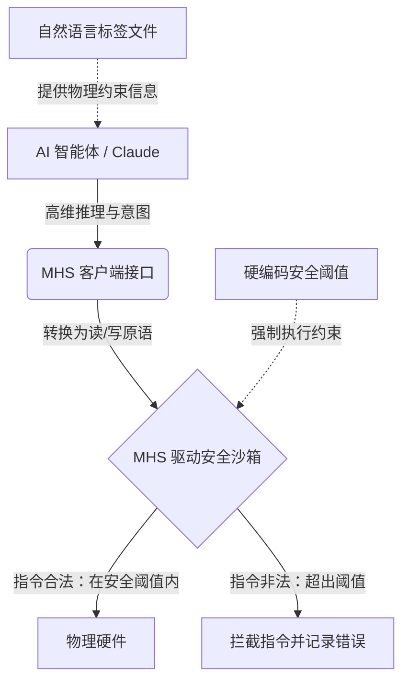

# 物理AI的“最后一公里”：拆解 Anthropic MHS 协议与具身智能底座之争

生成式 AI 爆发数年来，技术的狂欢一直被安全地禁锢在发光的屏幕背后。AI 智能体（Agent）可以写代码、分析表格、撰写邮件，但它们走向物理世界的能力，却被一个出名混乱、碎片化且脆弱的层级所卡脖子：硬件集成。在科研实验室和先进制造工厂中，将一个新的科研仪器或机械臂接入控制网络，通常意味着支付高昂的“集成税”——耗费数周时间去编写设备专属的驱动程序、调试私有的 API，并祈祷微小的固件更新不会破坏整条流水线。

2026年8月27日，Anthropic 迈出了解决这一“最后一公里”难题的重要一步。该公司正式宣布推出**模型硬件标准（Model Hardware Standard，简称 MHS）**。这是一种全新的、独立于具体模型的通用软件接口，旨在让自主 AI 智能体能够安全地发现、操作物理设备并进行故障排除。

目前，MHS 处于受限的研究预览阶段，但已吸引了基因泰克（Genentech）、AWS、卡内基梅隆大学（CMU）、华盛顿大学（UW）、量子计算公司 QuEra Computing，以及 Automata 和优傲机器人（Universal Robots）等机器人制造商的参与测试。MHS 继承了模型上下文协议（MCP，Anthropic 于 2024 年底开源，用于标准化 AI 与数字工具的连接）的设计哲学，并将其延伸至物理空间，旨在将硬件部署时间从数周压缩至数小时。

然而，这一标准的发布也在 Hacker News、Reddit 和 X.com 上引发了激烈辩论：一个由大语言模型驱动的高维协议，真的能在不造成灾难性硬件损坏的情况下，安全地管理物理系统吗？MHS 究竟是对 Robot Operating System（ROS）等成熟机器人框架的进化，还是颠覆？

### 架构解析：读/写原语与 MCP 集成

从架构上看，MHS 是介于操作系统和设备驱动程序之间的抽象层。它摒弃了暴露数百个私有、嵌套函数的传统做法，将所有硬件交互标准化为两个最基础的通用原语：
*   **`read`**：获取传感器状态、当前参数或诊断遥测数据（例如，查询温度计的摄氏度读数，或获取机器人关节的编码器位置）。
*   **`write`**：执行控制动作或调整设备设置（例如，设定目标温度，或命令电机旋转到特定角度）。

在 MHS 框架下，物理设备扮演着 MCP 服务器的角色。当接入网络时，设备会使用**自然语言标签文件**（通常为 YAML 或 JSON 格式）动态暴露其元数据。

这些标签文件描述了设备的各项功能、可调节的变量、可测量的参数，以及最核心的物理限制。当像 Claude 这样的 AI 智能体被引入网络时，它会读取这些标签文件，瞬间“发现”设备是什么以及如何与其通信。

一位资深自动化工程师在 Hacker News 上评价道：
> “MHS 的精妙之处在于它颠覆了集成的逻辑。历史上，像 SiLA 2（实验室自动化标准）或 OPC UA 这样的标准构建了极其死板、依赖重度 Schema 的 XML 定义，需要人类在编译时编写集成代码。而 MHS 接受了现实世界的混乱，利用自然语言元数据，让大模型能够动态推理新光谱仪的功能，并实时调用其读/写接口。”

### 安全防线：驱动级沙箱

在物理 AI 的执行过程中，最严峻的挑战莫过于安全红线。在数字世界中，大模型的幻觉顶多导致语法错误或 API 调用中断；但在物理世界中，一个产生幻觉的 AI 智能体如果向机械关节发送超出机械极限的指令，或者让泵干转，可能会造成数万美元的硬件损失、毁掉数月的科研成果，甚至威胁人身安全。

为了解决这一痛点，MHS 将**推理**与**执行**进行了彻底解耦。

1.  **语义引导（标签文件）**：自然语言标签文件会预先告知 AI 智能体设备的物理局限（例如，“激光器工作温度切勿超过 45°C”或“机械臂负载上限为 5kg”）。大模型在决策前会阅读这些元数据以进行逻辑推理。
2.  **确定性拦截（驱动层）**：即使智能体出现幻觉并试图绕过语义引导，MHS 驱动程序自身也包含硬编码的安全限制。如果智能体发出了违反这些限制的 `write` 指令，驱动程序将在边缘端直接拦截该载荷并予以拒绝，同时向大模型返回标准化的错误代码。

Anthropic 首席执行官达里奥·阿莫代伊（Dario Amodei）长期以来一直倡导构建系统性的 AI 安全方案。在谈到该标准的设计时，阿莫代伊指出：
> “如果我们希望 AI 加速科学发现，就必须让它从在沙箱中分析数据，走向在实体实验室中实际执行实验。但如果一个产生幻觉的模型可能会烧毁激光器，你就无法运行物理实验。通过在智能体下方的驱动层直接嵌入硬性安全边界，我们确保了无论模型如何表现，硬件始终受到保护。”

### 实战检验：QuEra 的量子稳定系统

MHS 实用性的核心论证来自其早期试点，特别是在高精度科学环境中。在开发期间，Anthropic 与**霍华德·休斯医学研究所 Janelia 研究校区**以及量子计算公司 **QuEra Computing** 展开了深度合作。

在量子物理实验室中，最枯燥的手动任务之一是**激光重锁（laser relocking）**——即恢复偏离目标频率的激光器的稳定性。这一过程需要监控复杂的诊断数据、调整电压并应对环境噪声。

通过将激光硬件封装在 MHS 驱动程序中，Anthropic 和 QuEra 进行了一项测试，由 AI 智能体自主负责激光器的重锁。在超过 700 次的测试中，结果令人瞩目：激光自动重锁的成功率从基准的 **58% 飙升至 99.3%**。

一位 AWS 机器人研究员在 X.com 上对该结果发表了看法：
> “QuEra 的数据首次证明了，只要接口足够干净，大模型智能体完全可以处理高精度的物理编排。MHS 并没有取代激光器上运行的底层 PID 控制器，它抽象了状态估计和诊断逻辑，使得智能体在传统控制回路失效时，能够像高级操作员一样介入干预。”

### 机器人学大分裂：MHS 与 ROS 的路线之争

尽管业界反响热烈，但机器人和工业自动化社区依然持怀疑态度，一场关于 MHS 是否在“重复造轮子”的争论正愈演愈烈。

主要的比较对象是**机器人操作系统（ROS）**。作为开源中间件，ROS 统治了机器人学术界和工业界近二十年。它依赖于发布-订阅（Pub-Sub）架构，专为高频、低延迟、确定性的节点通信而设计。

知名 AI 学者、Meta 首席 AI 科学家杨立昆（Yann LeCun）在 X.com 上公开表达了质疑：
> “自回归大模型并没有真实世界的物理模型。一个带有自然语言标签的简化读/写协议，确实是实验室自动化的便利软件外壳，但它并没有解决机器人学的根本挑战：连续控制、具身感知运动关联以及低延迟反馈。你无法在一个基于文本的事件循环中，通过推理去解决夹爪打滑或动态障碍物的问题。”

Reddit 上 r/robotics 板块的机器人开发者也表达了类似看法，他们认为通过云端 API 运行的大模型会引入数百毫秒的延迟，这使得它们完全无法胜任实时机器人控制。

然而，MHS 的支持者反驳称，该协议并非旨在取代 ROS，而是建立在其之上。MHS 扮演的是“声明式编排器（declarative orchestrator）”，而 ROS 则负责“命令式执行（imperative execution）”。

例如，机器人制造商优傲机器人（Universal Robots）正在通过将其现有的基于 ROS 的控制节点封装在 MHS 服务器中来试点该标准。AI 智能体向 MHS 驱动程序发送高维 `write` 指令（如“移动至坐标 X”），MHS 驱动程序再将该指令转化为 ROS 动作客户端（Action Client），利用传统的逆运动学和实时路径规划来执行具体动作。

Hugging Face 首席执行官克莱门特·德兰格（Clément Delangue）强调了这种桥梁在开源社区中的形成过程：
> “标准化 AI 与硬件的交互至关重要。我们正积极推动 MHS 与 LeRobot 的集成。通过将 MHS 驱动与 SO-ARM101 机械臂和树莓派等消费级硬件结合，我们可以让开发者编写简单的 Python 智能体来编排复杂的物理任务，向成千上万没有 ROS 或控制理论背景的软件工程师打开机器人世界的大门。”

随着 MHS 从受限的研究预览迈向更大规模的释放，定义 AI 走向现实世界的“物理 API”之战已正式打响。如果 Anthropic 能够证明 MHS 可以在数百家硬件厂商中安全扩展，它不仅将解决硬件集成的最后一公里难题，还将为未来的“物理互联网”铺设底层的管网。
