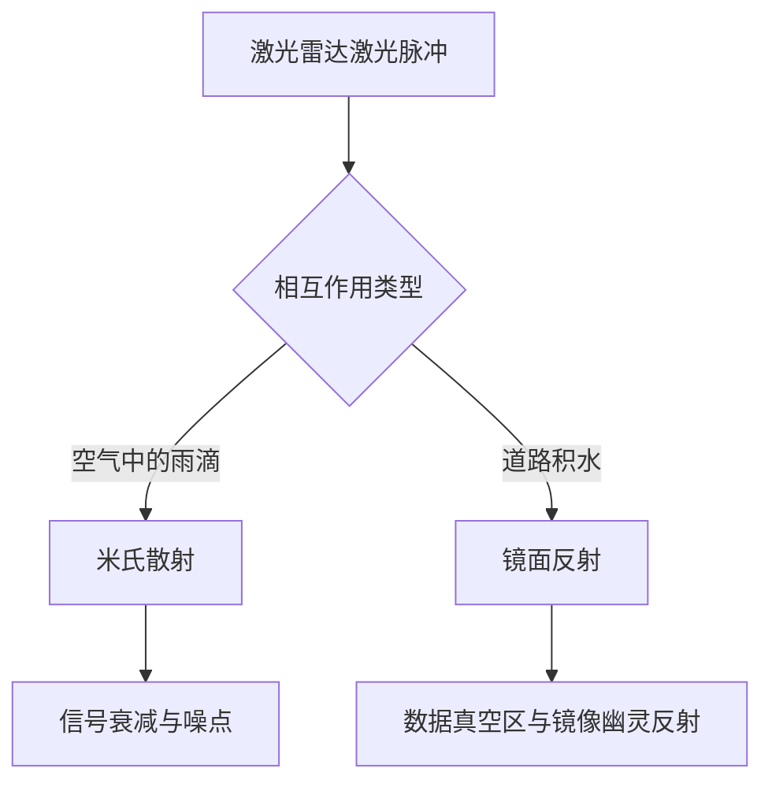

# 特斯拉的佛罗里达险局：地理围栏悖论、逃离加州监管与纯视觉的“热带雨天大考”

2026年7月3日，特斯拉正式跨过了它的“卢比孔河”。在其打车App一次低调的更新中，特斯拉在佛罗里达州迈阿密-戴德县西部启动了首个完全无监督、无安全员的自动驾驶Robotaxi服务。该服务由Model Y车队运营，目前被严格限制在多拉尔（Doral）、西迈阿密（West Miami）和科勒尔盖布尔斯（Coral Gables）之间一块仅10至14平方英里的区域内。

这一落地标志着一次关键的战术转向。特斯拉首次在没有人类安全员跟车的情况下向公众提供出行服务。然而，这次部署也暴露出了深层的战略张力：该服务高度依赖埃隆·马斯克多年来一直嗤之以鼻的技术——地理围栏（Geofencing）。

##### 地理围栏悖论：通用自动驾驶与本地现实的博弈
多年来，马斯克对基于激光雷达（LiDAR）和地理围栏的自动驾驶方案冷嘲热讽，直指谷歌母公司旗下的Waymo。他曾留下名言，戏谑Waymo名字的意思就是“花更多钱”（Way-mo money），因为其硬件昂贵、难以量产，且每次部署都需要高精地图和“本地化参数集”。马斯克的承诺言犹在耳：特斯拉的完全自动驾驶（FSD）将是一个普适性的、基于纯视觉的AI解决方案，无需地图和地理边界，就能在地球上的任何角落行驶。

但多拉尔至科勒尔盖布尔斯路线的实际落地却戳破了这一神话。该服务北起SR-826（帕尔梅托高速公路），南至US-41（塔米亚米小径），范围被死死锁住，并刻意避开了迈阿密市中心和迈阿密海滩等高密度核心区域。即便是临近迈阿密国际机场（MIA），车辆也被禁止进入航站楼区域接送客。

正如自动驾驶先驱布拉德·坦普尔顿（Brad Templeton）所指出的，衡量自动驾驶成功的真正基准并非公关噱头，而是“取消人类监管”与“具备可行性的本地单车经济模型”的结合。特斯拉将无监督服务限制在特定走廊内，实际上是在默许：“通用自动驾驶”必须以受控、分步地图化的方式渐进式落地。其神经网络必须受到限制和约束，才能在L4级自动驾驶下安全运行。

##### 监管套利：逃离加州，奔向佛罗里达的开阔公路
特斯拉选择迈阿密作为其无监督路测的首发试验田绝非偶然，这是一场教科书级的“监管套利”（Regulatory Arbitrage）。

根据《佛罗里达州法典》第316.85条和第319.145条，自动驾驶车辆被允许在没有人类驾驶员的情况下在公共道路上行驶。至关重要的一点是，佛罗里达州并不要求制造商获取复杂的州级测试或运营许可。相反，该州依赖其传统的“危险工具原则”（Dangerous Instrumentality Doctrine），即由车主（在此案中为特斯拉或车队运营商）对任何车祸或交通违章承担全部责任，仅要求自动驾驶网约车网络购买保额不低于100万美元的标准高限额责任险。

对比之下，特斯拉的“老家”加州则要严苛得多。就在特斯拉迈阿密上线前仅仅两天——2026年7月1日，加州第1777号议会法案（AB 1777）正式生效。AB 1777为执法部门确立了一套正式流程：对于自动驾驶车辆的动态交通违章，警方可以直接向自动驾驶汽车制造商开具“自动驾驶违规通知书”。如果在旧金山一辆无人驾驶汽车闯红灯或堵塞交通，警方会记录下这一违章，而制造商在法律上被强制要求在72小时内（对于安全关键性事件则为24小时内）向加州车管局（DMV）申报。DMV将根据这些违规记录来限制、暂停或吊销测试和运营许可证。

特斯拉选择将无安全员首秀的重心从加州转移到佛罗里达，直接绕开了加州日益紧缩的执法铁钳。

##### 极端天气的物理局限：热带暴雨中的“激光散射”与“视觉遮挡”之争
迈阿密闷热多雨的夏季气候是自动驾驶感知系统的终极考场。午后的倾盆大雨、高湿度以及局部的道路积水是这里的常态。在这场热带洪流中，两种截然不同的传感器路线将如何展开对决？

###### 激光雷达（LiDAR）的困境：米氏散射与镜面反射
基于激光雷达的系统（如Waymo）通过发射激光脉冲（通常为905nm或1550nm波长）来构建环境的三维点云。在暴雨中，这种方案面临两个致命的物理瓶颈：
1. **米氏散射（Mie Scattering）**：空气中雨滴的尺寸与激光波长相近，当激光脉冲撞击悬浮的水滴时，光线会发生散射和衰减。这不仅缩短了传感器的有效探测距离，还会产生高频的“噪点”，使系统将雨水误判为实体障碍物（虚警）。
2. **镜面反射（Specular Reflection）**：沥青路面上的积水形同镜面，激光打在水面上不会像往常那样漫反射回传感器，而是沿着入射角向远处反弹。这导致点云中出现“数据真空区”（空洞），甚至产生“幽灵反射”——传感器会误认为地表之下存在一个物体的镜像投影。

Waymo通过多传感器融合（结合激光雷达、能轻易穿透水滴的毫米波雷达以及高分辨率摄像头），并辅以主动雨刷和疏水涂层，来缓解这一问题。

###### 纯视觉（Vision-Only）的挑战：视线遮挡与水漂效应
特斯拉搭载500万像素摄像头的HW4纯视觉方案，则面临着另一套物理学难题：
1. **折射与遮挡**：直接附着在B柱或翼子板摄像头玻璃罩上的雨滴会折射光线，导致视野扭曲；而迈阿密极高湿度引起的摄像头外壳内部冷凝结雾，甚至可能让传感器彻底“失明”。
2. **道路水雾（Road Spray）**：前车抛起的细密水雾会形成一道低对比度的视觉屏障，摄像头极难看透。

特斯拉的神经网络依靠时空变压器（Spatial-Temporal Transformers，即占用网络）来重建三维环境。如果某个摄像头被雨滴短暂遮挡，时序网络会利用前序帧的记忆来“脑补”画面。此外，特斯拉的软件还会运行能见度诊断，将镜头画面划分为网格并打出能见度评分（0至3分），一旦识别出“下雨”或“冷凝结雾”场景，就会自动触发内部加热除雾和雨刷。

然而，纯视觉系统存在一个致命的底层缺陷：它无法准确测量积水深度，也无法在水漂（Hydroplaning）发生前做出预判。在缺乏主动声呐或激光雷达深度测算的情况下，特斯拉Model Y只能依赖惯性测量单元（IMU），在轮胎已经失去抓地力*之后*，再进行被动救车。

##### 运营与车队管理：通往 Cybercab 的过渡桥梁
由于特斯拉专门设计的无方向盘Robotaxi“Cybercab”尚未实现量产，Model Y成为了现阶段运营的过渡桥梁。

为了支撑此次无安全员的落地，特斯拉在多拉尔走廊内建立了专门的维护和充电网点。同时，特斯拉更新了其打车App，加入了“自动驾驶”状态指示器，让乘客能明确确认车辆当前正处于完全自动驾驶模式。此外，特斯拉还主动与当地市政部门对接，联合科勒尔盖布尔斯消防局开展了应急救援培训，指导消防员如何在无驾驶员的Model Y上切断高压电路，并联络特斯拉的远程协助团队（该团队被法律要求必须在规定时限内对紧急呼叫做出响应）。

##### 战略启示
特斯拉在迈阿密的无安全员首秀是向前迈出的关键一步，但也是一次妥协。通过采用地理围栏，特斯拉向所有L4级自动驾驶开发者都必须面对的物理与运营现实低了头。在失去激光雷达这层“安全网”的情况下，纯视觉FSD神经网络能否顺利通过迈阿密夏季暴雨的洗礼？这依然是一个价值千亿美元的终极悬问。但可以确定的是，无人驾驶的战火已正式烧到了美国的东海岸。
