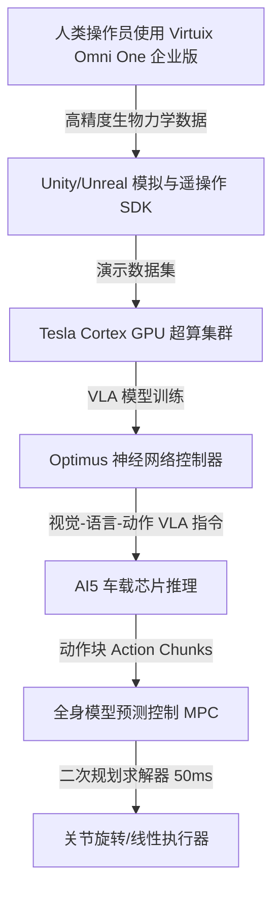

# 特斯拉的豪赌：直击弗里蒙特工厂转型、Optimus Gen 3 架构与 2 万美元人形机器人的“生死战”

**加利福尼亚州弗里蒙特** —— 焊枪的刺耳尖叫与汽车装配线的机械轰鸣已然消退，取而代之的是一种全新、更为精准的工业律动。特斯拉弗里蒙特工厂正式完成了其有史以来最激进的一次制造转型。在 2026 年 5 月初彻底停产并拆除 Model S 和 Model X 生产线——历经一场为期 46 天的极限改造闪电战——该工厂已正式转向 **Optimus Gen 3** 人形机器人的限量组装。

随着限量生产于 2026 年 8 月正式启动，特斯拉正试图将弗里蒙特工厂的产能逐步推高至每年 100 万台的运行率，随后再将大部分产能转移至德克萨斯超级工厂（Giga Texas）的专属生产基地。特斯拉的终极愿景是：从 2027 年夏天开始，在德州实现每年 1000 万台的雄心产出。

这一转型标志着整个机器人行业的关键拐点：一台通用型人形机器人，能否在保持工业级耐用性的同时，将生产成本压缩至对消费者极具亲和力的 2.0 万至 3.0 万美元？为了回答这个问题，我们必须拆解定义这一转型的机械、电气及 AI 工程架构，同时直面可能使整个项目脱轨的全球供应链地缘政治障碍。

#### 机械与电气战场：关节设计与电池能效
在 Optimus Gen 3 的核心，是一场极限的机械工程挑战。该机器人机身拥有 **28个以上的自由度（DoF）**，更引人注目的是其双手的史诗级升级：**每只手拥有 22 个自由度**（整机共由 50 个执行器驱动，即每个前臂/手部配备 25 个执行器）。这些手部采用肌腱驱动系统，以实现接近人类的灵巧度，相比前代版本的 11 自由度手部实现了质的飞跃。

为这一复杂运动学系统提供动力的是集成于躯干的 **2.3 kWh 锂离子电池包**，工作电压约为 52V。特斯拉工程师对功耗进行了深度优化，使机器人在执行轻度任务时能达到约 8 小时的续航表现，并支持自主导航至感应充电桩进行补能。

为了更直观地理解这些技术指标，我们可以看看 Optimus 与其在工业级人形机器人领域主要竞争对手的横向对比：

| 人形机器人 | 全身自由度（DoF） | 手部自由度（单手） | 电池容量 / 续航 | 移动方式 | 额定负载 |
| :--- | :---: | :---: | :---: | :---: | :---: |
| [Tesla Optimus Gen 3](file:///Users/vzl/.gemini/antigravity-cli/scratch/optimus_analysis.md) | 28+ (不含手部) | 22 DoF | 2.3 kWh (~8小时) | 双足 | ~20 kg |
| **Figure 02** | 35 | 16 DoF | 2.25 kWh (~5小时) | 双足 | 20 kg |
| **Boston Dynamics Atlas (纯电版)** | 56 | 定制夹爪 | 4小时 (重载搬运约2小时) | 双足 (360°旋转关节) | 30–50 kg |
| **Sanctuary AI Phoenix (Gen 8)** | 44–75 | 20–21 DoF | 专利保密 | 轮式底座 | 25 kg |
| **Agility Robotics Digit (v4/v5)** | 30 | 简易夹爪 | ~4小时 | 双足 | 16 kg |

波士顿动力（Boston Dynamics）的纯电版 Atlas 拥有令人惊叹的 56 个自由度，在臀部、腰部和颈部均配备了可 360 度旋转的关节，其设计优先考虑极致的灵活性和工业吞吐量（可搬运高达 50 kg 的重物），而非人类般的手部灵巧度。与此同时，Figure 02 采用 16 自由度的手部和 2.25 kWh 的躯干电池，可提供 5 小时的续航。Sanctuary AI 的 Phoenix 在其最新的 Gen 8 配置中则转向了轮式底座，以优化电池利用率和机械稳定性，这表明其在设计上更偏向于精细操作，而非复杂的双足行走。

#### 供应链瓶颈：稀土危机的阴影
尽管埃隆·马斯克（Elon Musk）持续在市场上鼓吹低于 2 万美元的长期成本愿景，但特斯拉的垂直整合战略正撞上一堵地缘政治之墙。Optimus 的执行器设计高度依赖中国制造合作伙伴，例如三花智控（提供线性执行器）和拓普集团（提供旋转执行器）。

更关键的是，为了驱动其高扭矩电机，每台 Optimus 单元需要消耗大约 **3.5 kg 的钕铁硼（NdFeB）稀土永磁体**。

自 2025 年 4 月 4 日中国对稀土磁体、镝和铽实施严格的出口管制以来，特斯拉不得不应对极其繁琐的出口许可证审批流程。在社交平台 X.com 上，多位行业评论员指出，这种供应链依赖是特斯拉机器人项目的阿喀琉斯之踵。虽然特斯拉通过自主设计 AI5 芯片减少了对外部半导体的依赖，但它很难仅凭工程技术就轻易摆脱稀土垄断的泥潭。特斯拉目前正在积极研发并验证减少稀土用量的电机设计，但在不牺牲扭矩密度的前提下实现这一目标，依然是一个艰巨的工程挑战。

#### 桥接“仿真到现实”的鸿沟：Virtuix Omni One 的关键整合
在 Optimus 的训练链路中，最出人意料的动作之一是引入了 **Virtuix Omni One Enterprise** 系统。特斯拉机器人部门近期采购了多台这款面向 B2B 的万向跑步机，用作“人机协同”（human-in-the-loop）的遥操作接口。

传统上，人形机器人的训练主要依赖两种路径：
1. **仿真环境下的强化学习（RL）：** 速度快、成本低，但深受“仿真与现实鸿沟”（sim-to-real gap）的困扰——在虚拟物理引擎中表现完美的控制策略，一旦放到混乱的真实物理世界中往往瞬间失效。
2. **真实世界中的强化学习：** 准确度极高，但训练速度极其缓慢，且物理硬件要承受极大的机械磨损，导致关节频繁故障。

通过利用 Omni One Enterprise 的开放 SDK（已与 Unity 和 Unreal Engine 深度整合）和足部追踪器，人类操作员可以在虚拟空间中自由行走、奔跑、下蹲和 360 度转向，同时在物理世界中保持原地不动。这使得操作员能够在数字孪生环境中遥操作 Optimus，将人类复杂的运动和操作动作直接映射到机器人的关节控制器上。

这种“人机协同”的高保真数据随后被输入特斯拉由数万张 GPU 组成的 **Cortex** 超算集群，用于训练其“视觉输入、电机指令输出”的 **视觉-语言-动作（VLA）** 神经网络。VLA 模型输出“动作块”（action chunks）——即一连串的电机指令——并由 Optimus 搭载的自研 AI5 芯片在本地进行边缘推理。同时，底层的全身模型预测控制器（Whole-Body MPC）作为安全防护层，以每 50 毫秒一次的频率求解二次规划（Quadratic Program），确保神经网络输出的动作不会破坏机器人的身体平衡，亦不会超出关节的物理极限。

#### 业界大论战：真正的世界模型 vs. 营销噱头
人形机器人硬件的突飞猛进，在硅谷精英层引发了一场针锋相对的思辨。在 X.com 上，Meta 首席 AI 科学家 **Yann LeCun**（杨立昆）多次对具身智能的端到端神经网络控制路线表达了强烈的质疑：

> “我们距离真正的智能还差得很远。当前的 AI 模型缺乏让机器人进行推理、规划并在物理世界中安全穿行的‘世界模型’。仅仅通过扩大视频数据的训练规模，根本无法解决接触动力学中硬核的物理学难题。”

这一观点立即遭到了 Figure AI 首席执行官 **Brett Adcock** 的尖锐反驳：

> “在神经网络的驱动下，人形机器人正处于重大突破的临界点。端到端模型能够比人工编写的控制理论更好地解决复杂运动与精细操作。我们正以超出批评者想象的速度，从研发阶段迈向真实的商业化部署。”

方舟投资（ARK Invest）的 **Cathie Wood**（木头姐）则坚定地站在了乐观主义者一边。她认为，人形机器人与制造业的结合，将释放数万亿美元的巨大产值，彻底重塑人类的生产力格局。

随着特斯拉于今年 8 月在弗里蒙特工厂开启艰难的产能爬坡，真正的试金石将是：Optimus Gen 3 能否在不需要频繁维护的前提下，扛住真实工厂车间的严苛负荷？硬件架构已基本就绪，但这场围绕 2 万美元人形机器人的生死战，最终将在供应链的拉锯和神经网络的训练循环中决出胜负。
